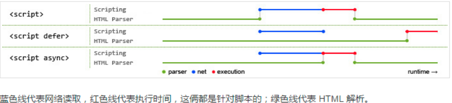

# 关于浏览器加载渲染的原理都记录在这里

1. 浏览器加载页面时，首先会生成一棵dom树;
2. 之后解析样式根据dom树生成一个render 树;

> 注意：display:none的元素只m会出现在dom tree上

3. 然后开始计算各个节点的布局信息，大小尺寸之类;
4. 之后进行渲染展现";

### 浏览器的重绘(repaint)与回流(reflow)
重绘是指不影响其他元素的操作，回流则是重新布局(layout)

>[https://csstriggers.com/]这个网站展示了css属性是否需要计算

一般来说，在加载到js脚本时，浏览器不会更新dom，而回在脚本执行完后，进行一次layout.
但是，如果js代码中立刻获取了dom节点信息，浏览器就会提前layout，也会影响性能，如下操作会提前layout:

- 通过js获取需要计算的DOM属性（即有操作影响使得元素需要重新计算）
- 添加或删除DOM元素
- resize浏览器窗口大小
- 改变字体
- css伪类的激活，比如:hover
- 通过js修改DOM元素样式且该样式涉及到尺寸的改变

为了防止这种情况出现一般采用批量修改，预先读取所有需要改变的属性，然后一次修改。
此外，对dom元素进行一系列的修改时，可以先对一个不再render树上的节点进行一系列操作，最后将节点更新到render树上，只使用一次layout。

    var fragment = document.createDocumentFragment();  
    for (var i=0; i < items.length; i++){  
      var item = document.createElement("li");
      item.appendChild(document.createTextNode("Option " + i);
      fragment.appendChild(item);
    }
    list.appendChild(fragment);  

同时，如果具有动画的元素会引起reflow时，最好将元素绝对定位，不然每一帧都会引起layout，十分影响性能。

使用requestAnimationFrame，在实际项目中没有办法批量修改的办法，应该将所有引起layout的操作放在requestAnimationFrame函数的回调中，统一执行。

    // Read
    var h1 = element1.clientHeight;
    // Write
    requestAnimationFrame(function() {  
      element1.style.height = (h1 * 2) + 'px';
    });
    // Read
    var h2 = element2.clientHeight;
    // Write
    requestAnimationFrame(function() {  
      element2.style.height = (h2 * 2) + 'px';
    });

还有将影响渲染的js脚本执行在最后也会降低页面渲染的开销。
### defer和async
浏览器解析html顺序：

1. 浏览器一边下载HTML网页，一边开始解析；
2. 解析过程中，发现script标签；
3. 暂停解析，网页渲染的控制权转交给JavaScript引擎；
4. 如果script标签引用了外部脚本，就下载该脚本，否则就直接执行；
5. 执行完毕，控制权交还渲染引擎，恢复往下解析HTML网页；

>如果外部脚本加载时间很长（比如一直无法完成下载），就会造成网页长时间失去响应，浏览器就会呈现“假死”状态，这被称为“阻塞效应”。这也是为何将js放置于页面底部的原因。

如果浏览器遇到了defer的script标签，则会并行进行下载并继续渲染html，在DOMContentLoaded后执行script脚本。

如果遇到了async的script标签，则会并行进行下载并继续渲染html，在脚本下载完成后，停止html解析，执行脚本。

>这也导致了async无法控制脚本的执行顺序，因为后下载的可能先下载完。因此最适合那些不依赖任何脚本也不被任何脚本依赖的脚本。

浏览器的在遇到defer和async属性的script的浏览器执行过程如下:

1. WEB浏览器创建Document对象，并且开始解析WEB页面，解析HTML元素和它们的文本内容后添加Element对象和Text节点到文档中。这个过程的readystate的属性值是“loading”
2. 当HTML解析器遇到没有async和defer属性的script时，它把这些元素添加到文档中，然后执行行内或外部脚本。这些脚本会同步执行，并且在脚本下载（如果需要）和执行解析器会暂停。这样脚本就可以用document.write()来把文本插入到输入流中。解析器恢复时这些文本会成为文档的一部分。同步脚本经常单定义函数和注册后面使用的注册事件处理程序，但它们可以遍历和操作文档树，因为在它们执行时已经存在了。这样同步脚本可以看到他自己的script元素和它们之前的文档内容
3. 当解析器遇到了设置async属性的script元素时，它开始下载脚本，并继续解析文档。脚本会在它下载完成后尽快执行，但是解析器没有停下来等他下载。异步脚本禁止document.write()方法。它们可以看到自己的script元素和它之前的所有文档元素，并且可能或干脆不可能访问其他的文档内容。
4. 当文档完成解析，document.readyState属性变成“interactive”。
5. 所有有defer属性的脚本，会被它们在文档的里的出现顺序执行。异步脚本可能也会在这个时间执行。延迟脚本能访问完整的文档树，禁止使用document.write()方法。
6. 浏览器在Document对象上触发DOMContentLoaded事件。这标志着程序执行从同步脚本执行阶段转到异步事件驱动阶段。但要注意，这时可能还有异步脚本没有执行完成。
7. 这时，文档已经完全解析完成，但是浏览器可能还在等待其他内容载入，如图片。当所有这些内容完成载入时，并且所有异步脚本完成载入和执行，document.readyState属性变为“complete”，WEB浏览器触发Window对象上的load事件。
8. 从此刻起，会调用异步事件，以异步响应用户输入事件，网络事件，计算器过期等。
以上内容来自某圣经

