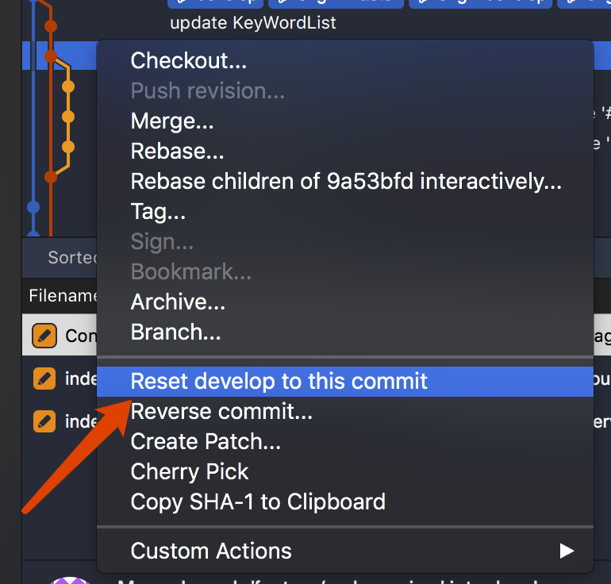
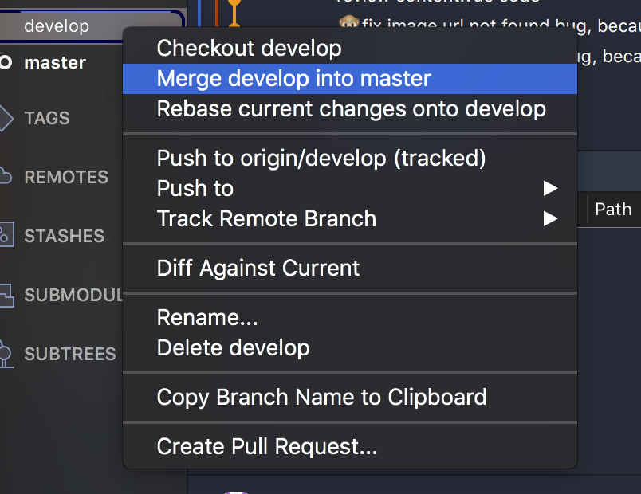

# git and sourcetree

## git

git 的基本信息就不赘述了，只说些重要命令。

git 分为本地和远端，本地有工作区，暂存区，以及库(库包括各种分支），远端只有库。

#### git add （filename）

提交 更改的文件到暂存区,filename可以使用通配符* 来提交所有改动。

#### git rm (filename)

删除 某文件 并提交到暂存区。

#### git commit -m "（information）"

提交暂存区内的文件到当前分支。

#### git push [origin master]||[origin local-branchname:remote-branchname]

推送本地某分支到远端某分支(如果origin未有此分支则会创建),如果local-branchname为空，则删除remote-branchname,缺省`origin master` 默认提交至此。

#### git status

查看工作区的状态，如落后远端几个版本，几个更改没有提交到远端。

#### git diff 

查看工作区的修改。

#### git pull 

拉去远端该分支的更新，同样缺省 `origin master`

#### git checkout -- （filename）

将`工作区内的`文件的更改恢复到上一次commit或者add的状态。

#### git reset HEAD （filename）

这个方法可以将你已经commit到暂存区的文件撤回,配合`checkout --`可以恢复到上个版本。

#### git branch [branchname]

查看所有分支，当前分支前有*号,有branchname，代表新建分支。

#### git checkout [-b]（branchname）

切换到某分支,-b可以创建并切换到某分支。

#### git merge (branchnme)

合并某分支到当前分支。

#### git branch -d (branchname)

删除某分支。

## sourcetree

sourcetree 是git的图形管理界面，某种意义上的更易操作，内置了gitflow工作流。

#### 撤回某次提交



分为 `hard` `mixed` `soft` 三种何必方式，`hard`删去以后所有改动。

```git push -f```

#### 合并develop到master

切换到`master`



然后对`master` 执行 `git push` 即可。

#### git rebase 和 git merge的区别

例如将`dev`合并到`master`上

`git merge` 合并分支时，将`dev`分支的改动集合，创建一个新节点，合并改动。

`git rebase` 合并分支时，将`dev`分支的每个改动复制一次，在`master`上一一变更。


