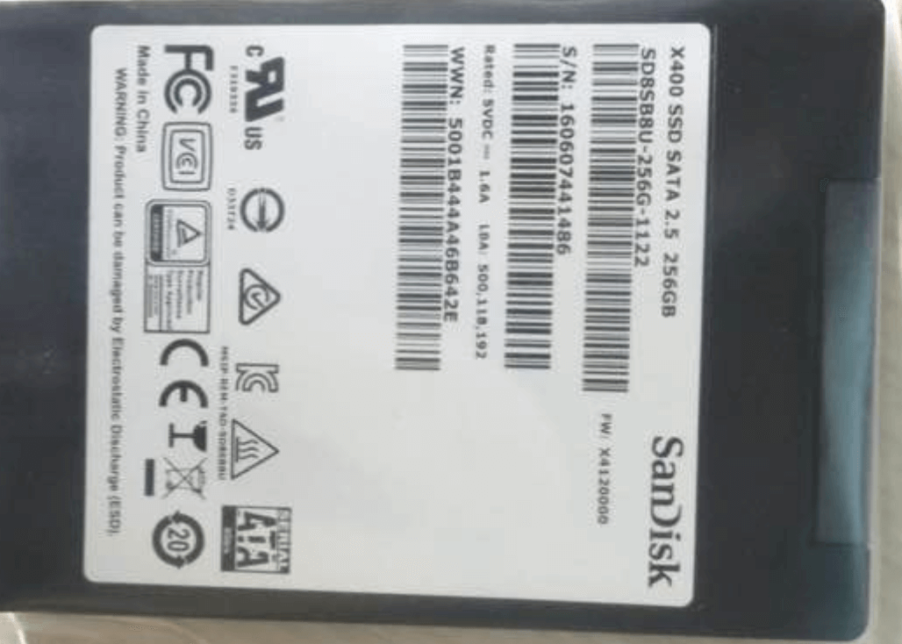

# 笔记本硬件

因为笔记本的自由性较差，可更换的硬件有限（内存，硬盘），所以相对好入门。

### 笔记本cpu

cpu阵营里，分为AMD与Intel，目前AMD移动市场赢弱，并不推荐。

笔记本CPU主要关注型号（i3），次代（7500），后缀（U）

只做简介，更详细的请自行查找[笔记本CPU天梯图](https://www.baidu.com/s?ie=utf-8&f=8&rsv_bp=0&rsv_idx=1&tn=baidu&wd=%E7%AC%94%E8%AE%B0%E6%9C%ACcpu%E5%A4%A9%E6%A2%AF%E5%9B%BE&rsv_pq=d7bb926f00009de1&rsv_t=5e07XyAGEyXqPDt%2BaipJOVo5%2BmoHdLhbITyx3X%2FmYI3iwKLPBjR5sHAN%2BZM&rqlang=cn&rsv_enter=1&rsv_sug3=12&rsv_sug1=11&rsv_sug7=100)

> 更新于 2018.01

> intel的cpu每代日常提升5%，人称牙膏厂，但是八代cpu性能大幅提升，约达30%，性价比十足。

##### 型号

如 core i3， i5 ，i7， Pentium等

没啥好说的，一般core 7 > 5 > 3 > Pentium

型号主要区别在规格上，i7是4核8线程，i5是双核4线程（5代以后变成了4核），i3是双核双线程

核是物理核心，线程是虚拟核心，都是越多越好，但是越多带来的收益会有边界效应。

此外，专业的图像处理，视频渲染，3D建模之类，需要巨大的算力，此类工作无需考虑直接i7。

##### 次代

cpu的第二位数字一般代表次代。

如 i7-7500U i5-3210m

上面第一个是7代，第二个是3代，一般代数越高越好，但intel号称牙膏厂，就是因为每次代提升太小，所以也不用太追求
如i7-7700HQ和i6-6700HQ仅6%的提升而已。

> 更新于2018.01

> 八代cpu性能大幅提升，约达30%，而且兼容老平台主板，强烈推荐。

##### 后缀

如 M，U，HQ

M／MQ 标准移动CPU，性能尚可（目前市面上已经少见了，不用考虑）。

U 就是常见的轻薄本，超极本的标配cpu，低压移动CPU，为了降低功耗，性能较弱。

HQ 目前比较流行的在游戏本上常见，性能不错。

还有些后缀，多是标记功率，工程之用，参考意义不大。

后缀，还有一个作用就是看出cpu的封装方式，目前只有m后缀是可以更换的PGA封装，其他都是无法更换的BGA。

### 显卡

有独立显卡与核心显卡（也叫集成显卡）之分。

核心显卡，是在集成在CPU上的，amd的CPU无核显，看视频，小游戏都可以，功耗还低。

独立显卡是单独一块组件，又自己的散热模块。

差别在用途，不玩游戏，不做渲染，独显无用，

显卡的区别主要在位宽和显存，同型号显存越大越好，当然同样边际效用。

显存并不是唯一制约条件，还有位宽，流处理器数目这些参数，玩大型单机游戏，应去度娘询问某游戏需要什么级别的显卡显存，按需购买。

性能上，980 约等于1060这样，970约等于1050。

更详细请自行查找[显卡天梯图](https://www.baidu.com/s?ie=utf-8&f=8&rsv_bp=0&rsv_idx=1&tn=baidu&wd=%E6%98%BE%E5%8D%A1%E5%A4%A9%E6%A2%AF%E5%9B%BE&rsv_pq=bf33c61e0000d0eb&rsv_t=a595ALtk%2BzXClRtxRIiojp8gT7EvjHbruKrU5K2E4s7jxRIakPsImqLGO6g&rqlang=cn&rsv_enter=1&rsv_sug3=9&rsv_sug1=16&rsv_sug7=100)

### 内存

部分笔记本是板载内存，无法添加更换内存条，购买前请查阅资料。

有DDR3 ，DDR3L ，DDR4

各类型之间不兼容，DDR3与DDR4插口不同，DDR3L（1.35V）与DDR3（1.6V）电压不同，不推荐一起用。

每种类型还有不同的频率，如1333，1600，频率越高越好，代表着性能越强，同时使用多根内存条，频率会以最低的为准。

>插多根内存条会形成双通道，对核心显卡有较大提升。

### 固态

从好到坏，分为slc，mlc，tlc

slc：企业级，最好，无论寿命还是速度，不过多数人用不起。

mlc：商用，中等，寿命较长，速度也稳定

tlc：民用，低等，寿命较短，品牌差速度非常不稳定，有几率损失文件。

固态接口也各有不同，如SATA3，m.sata.，nvme接口，依次如下

不考虑升级固态的朋友无需关注，而且部分笔记本无法更换。

推荐使用mlc和nvme接口，更多推荐可以去度娘或者[固态硬盘](http://tieba.baidu.com/f?kw=%E5%9B%BA%E6%80%81%E7%A1%AC%E7%9B%98)贴吧看看。

### 屏幕

屏幕的重要是很多人忽略的，一块垃圾屏幕到底有多扎，只有看过好的屏幕才知道差距。

分辨率： 720P（1366 * 768），1080P（1920*1080），2K（2560*1600），4K（3860*2160）

尺寸： 14，15.6，17

材质：ips ，tn

色域： 45%NTSC 72%NTSC 100%sRGB 94%NTSC

刷新率：120Mhz，75Mhz，60Mhz

分辨率，看的舒服就好，

尺寸同上，

材质tn垃圾，推荐ips，

色域 72%NTSC 约等于100%sRGB，比45%NTSC好很多，推荐72%NTSC，例如水果笔记本。

刷新率影响不大，120Mhz是为游戏选手制作的，正常人感觉不出来。

目前笔记本720P或者TN屏幕都是垃圾，推荐1080P以上，色域72%NTNTSC以上。

### 网卡键盘音响

如果好，厂商一定大作宣传，其他区别不大。

## 推荐环节

说句实话，我是不想推荐的，毕竟每个人对电脑的折腾能力不同，适合的就不一样，如果你根本不想解决任何关于电脑的问题，例如蓝屏或者升级内存之类，请参考小白，如果想折腾，看看入门，如果是大神，你也不用看这篇文章了。

小白：

1. macbookpro 永恒的经典款式，推荐15款15寸顶配，i7/16g/256g，众多配件均是顶配级别，性价比在macbook中相对较高。

2. 惠普 暗影精灵2Pro PCIE飞翔版  45色域，i5-7300HQ性能够用，固态性能好。

3. 小米 笔记本Pro    全金属外壳、屏幕素质好，发热量、价格更低

4. 惠普 暗影精灵3 电竞版   屏幕素质很高72色域+144Mhz刷新率

5. 技嘉 Aero15 好就一个字，各方面都不错，外形也炫酷

入门：

1. 神舟 战神K670D-G4D1 性价比极高，游戏本性能，扩展性强，但是就是做工售后不行。

2. 神舟 战神K680E-G6D1  性价比极高，屏幕72色域，游戏本性能，扩展性强，但是就是做工售后不行

3. 炫龙KP2   8代cpu，性价比极高，屏幕72色域，游戏本性能，扩展性强，但是就是做工售后不行

4. 神舟 战神ZX8-CP5S1  8代cpu，性价比极高，屏幕72色域+144Mhz刷新率，游戏本性能，扩展性强，但是就是做工售后不行