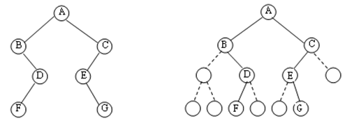

# 二叉树

### Perfect Binary Tree

**A Perfect Binary Tree(PBT) is a tree with all leaf nodes at the same depth. 
All internal nodes have degree 2.**

> degree : 即拥有的子树的个数

### Complete Binary Tree

**A Complete Binary Tree （CBT) is a binary tree in which every level, 
except possibly the last, is completely filled, and all nodes 
are as far left as possible.**

> 子节点需要左侧对齐，且除去最后一层即为PBT

Perfect Binary Tree 是 Complete Binary Tree 的子集。即`The tree is  a Perfect Binary Tree` 是 `The tree is a Computed Binary Tree`  充分不必要条件。

### Common Binary Tree

1. 若二叉树的层次从0开始，则在二叉树的第i层至多有2^i个结点(i>=0)。

2. 高度为k的二叉树最多有2^(k+1) - 1个结点(k>=-1)。 (空树的高度为-1)

3. 对任何一棵二叉树，如果其叶子结点(degree为0)数为m, 度为2的结点数为n, 则m = n + 1。

### Binary Tree struct

##### Array

将任意一颗二叉树填充成CBT(没有的节点用0或者undefined代替)。

存储为数组[A,B,C,0,D,E,0,0,0,F,0,0,0,G]

每层的节点数为[1,2,4,8,2^n] (n从0开始)

每层的节点下标为[ 2^n , 2^(n+1) - 1 ]（下标从1开始）

下标为i的节点，其左子节点为 2 * i ,右子节点为 2 * i + 1

以先序遍历举例

    const arr = [...String.fromCharCode(...Array.from({ length: 26 }, (e, i) => i + 97))]
    // ["a","b","c","d", ... , "z"]
    const result = []

    function traverse(index) {
        if (index > arr.length + 1) return undefined;
        
        const i = index + 1
        
        result.push(arr[i-1])

        traverse(2 * i - 1)
        
        traverse(2 * i )
    }
    
    traverse(0)
    console.log(result) 
    //  ["a", "b", "d", "h", "p", "q", "i", "r", "s", "e", "j", "t", "u", "k", "v", "w", "c", "f", "l", "x", "y", "m", "z", undefined, "g", "n", undefined, "o"]

##### Linked List

    class Node {
        constructor (l,t,r) {
            this.leftNode = l || null;
            this.rightNode = r || null;
            this.t = t || null;
        }
    }

    const node0 = new Node(...[,'a',])
    const node1 = new Node(...[,'b',])
    const node2 = new Node(...[,'c',])
    const node3 = new Node(...[,'d',])
    const node4 = new Node(node0,'e',node1)
    const node5 = new Node(node2,'f',node3)
    const node6 = new Node(node4,'g',node5)

    const result = [];

    function traverse (r) {

        if (!(r instanceof Node)) return undefined 
        
        result.push(r.t)
        traverse(r.leftNode)
        traverse(r.rightNode)

    }
    traverse(node6)
    console.log(result)
    //  ["g", "e", "a", "b", "f", "c", "d"]