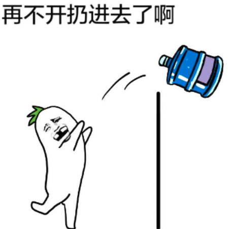

# 关于settimeout有些话说

首先, js是单线程的, 通过设置settimeoout这种方式, 让代码运行在其他操作完成之后。 

还有, 在操作系统中, 有一种中断操作, 可以让计算机停止某一操作, 转而执行另一个操作。 

这两个有比较本质的区别。 如果是前者, 那么settimeout有可能会在设置的时间之后执行, 如果是后者, 应该会在准确的一个时间点执行。 

```html
    <style type="text/css">
    .dd{
     width: 200px; 
     height: 200px; 
     background: #ccc; 
    }
    </style>
    <body>
    <div class="table-wrap">
        <div class="dd"></div>
    </div>

    <script type="text/javascript">
        $('.dd').animate({'height':'400px'}, 2000); 
        console.log('dd初始高度为'+$('.dd').height()); 
        setTimeout(function(){
            console.log($('.dd').height())
        }, 1000)
    </script>
    </body>
```

如果我在页面里执行这样一段代码, 在dd元素变高的时刻的中间点获取元素高度, 是否就可以知道结论了呢？ 

多次运行结果均为

> dd初始高度为200

> 1s后高度为301

这么说来看起来是更像中断的操作方式, 但是考虑到animate的实现方式, 决定还是用更简单的代码来检测。 

    window.onload = function() {
        console.log(new Date().getTime()); 
        setTimeout(function() {
            console.log('输出'); 
            console.log(new Date().getTime()); 
        }, 100); 
        console.log('sleep'); 
        sleep(2000); 
        console.log(new Date().getTime()); 
        console.log('end'); 
    }
    //休眠时间函数
    function sleep(i) {
        var now = new Date(); 
        var _sleepEnd = now.getTime() + i; 
        while (1) {
            now = new Date(); 
            if (now.getTime() > _sleepEnd) {
                return; 
            }
        }
    }

结果如下: 

> start:1489043518386

> sleep

> end:1489043520389

> 输出

> setend:1489043520393

可以看到settimeout是在整个外部代码执行完毕之后才进行运作, 而且当因为外部代码执行而导致错过了延迟时间的时候, 就会立刻执行内部的代码。 这也说明了js的运行机制, 单线程。 

**在window.onload执行到settimeout时, 将function(输出)记录并且在延迟时间后放置到队列中。 (注意, 此时window.onload已经在队列中了, 所以必须要等到onload执行完, function(输出)放置到队列后会立刻执行)**

因此, animate的实现方式似乎导致了我们开始得到的结论错误。 
animate的变化方法大致为在规定时间内让变动的要素变化。 

    (function($) {
        $.fn.extend({
            myAnimate: function(obj, t) {
                var tempstyle; 
                for (let i in obj) {
                    tempstyle = i
                }
                //初始大小
                var startStyle = parseInt(this.css(tempstyle)); 
                //步长
                var stepLong = (parseInt(obj[tempstyle]) - startStyle) / t * (1000 / 24); 
                var n = 0; 
                var timer = setInterval(function() {
                    $('.dd').css(tempstyle, startStyle + n * stepLong); 
                    if (startStyle + n * stepLong >= parseInt(obj[tempstyle])) {
                        console.log(startStyle + n * stepLong); //400
                        clearInterval(timer); 
                        return false; 
                    } else {
                        n++; 
                    }
                }, 1000 / 24); 
            }
        })
    })(jQuery); 
    //这个目前只能传入一组属性的对象
    $('.dd').myAnimate({
        'height': 400
    }, 2000); 
    setTimeout(function() {
        console.log('1s后高度为' + ($('.dd').height()))
    }, 1000)

多次运行结果均为: 

> 1s后高度为296

因为animate的实现依赖于setInterval, 因此导致了第一次运行的结果。 

同样的在css3中有一种animation属性可以改变元素的属性, 那么它的实现方式是否类似呢？ 

```html
    <style type = "text/css"> 
    .dd {
        width: 200 px; 
        height: 200 px; 
        background: #ccc; 
        animation: higher 2 s; 
        animation - timing - function: linear; 
    }
    @keyframes higher {
        100 % {
            height: 400 px; 
        }
    } 
    </style> 
    <script> 
        setTimeout(function() {
            console.log('1s后高度为' + ($('.dd').height()))
        }, 1000) 
    </script>
```

结果为: 

> 1s后高度为300

**这个是目前最最准确的数据, 无论运行几次都会准确地停在300, 关于原因, 可能是因为js编译需要时间, 而我写的js代码简单于jquery, 所以编译速度更快, 略小于300(为什么会略小于按道理应该是300以上才对, 这边有些不能理解), jquery略大于300, animation是css属性, 执行最快且准确。 **

最后, 科普一个settimeout中参数的小问题: 

    (function() {
        var x = function() {
            console.log(2); 
        }
        setTimeout('x()', 100); //1
        setTimeout(x, 100); //2
    })()
    var x = function() {
        console.log(1)
    }

运行结果: 

> 1

> 2

**这段代码反映了settimeout中将'x()'作为一个语句执行。 类似eval('x()'), 而且是在window的context中执行, 而x, 则是标准上下文, 在最近的函数作用域之中生效。 **

## settimeout与闭包closure

    for (var i = 0; i < 10; i++) {
        setTimeout(function() {
            console.log(i); 
        }, 100 * i); 
    }

这是段很有名的函数, 几乎可以说, 经验告诉我们, 它输出的是10个10, 而不是0~9, 究竟为什么呢?

众所周知, settimeout会在eventloop中执行, 且在stack的最后, 那么它会在stack中推入10个 `function(console.log(i))` , 在它推入完成后, for循环也结束了, 开始执行这10个函数, 不出意外, 它开始输出10了.

解决方法么

    for (var i = 0; i < 10; i++) {
        // capture the current state of 'i'
        // by invoking a function with its current value
        (function(i) {
            setTimeout(function() {
                console.log(i); 
            }, 100 * i); 
        })(i); 
    }

这也是众所周知的方法了, 通过 `IIFE(Immediately Invoked Function Expression)` 即立即执行函数来解决, 或者使用let声明. 都是在for 里创建一个独立的i变量的临时区域.

## settimeout中关于this

"超时调用的代码都是在全局作用域中执行的, 因此函数中this的值在非严格模式下指向window对象, 在严格模式下是undefined" ----JavaScript高级程序设计

settimeout中this一般指向window, 所以里面获取this都会错误。 

    function obj() {
        this.a = 1; 
        this.fn = function() {
            console.log(this); //window
            setTimeout(this.fn, 1000); 
            //直接使用this引用当前对象 
        }
    }
    var o = new obj(); 
    o.fn(); 

结果为: 

> Window

    function obj() {
        this.a = 1; 
        this.fn = function() {
            console.log(this.a); //1
            setTimeout(this.fn.bind(this), 1000); 
            //直接使用this引用当前对象 
        }
    }
    var o = new obj(); 
    o.fn(); 

结果为: 

> 1

使用bind绑定内部的this, 或者使用call实现bind功能

    function obj() {
        this.fn = function() {
            alert("ok"); 
            setTimeout((function(a, b) {
                return function() {
                    b.call(a); 
                }
            })(this, this.fn), 1000); //模拟Function.prototype.bind 
        }
    }
    var o = new obj(); 
    o.fn(); 

还有用that, self保存this指向的方法。 

    function obj() {
        this.fn = function() {
            var that = this; //保存当前对象this 
            alert("ok"); 
            setTimeout(function() {
                that.fn(); 
            }, 1000); //通过闭包得到当前作用域, 好访问保存好的对象that 
        }
    }
    var o = new obj(); 
    o.fn(); 

## setTimeout和setInterval区别

setInterval和setTimeout略有不同, settimeout总是会执行的(尽管有可能延后), 而setInterval如果间隔时间小于了执行时间, 第一次循环的代码执行之前, 所有后续插入的都会被忽视掉, 因为队列中只会有一份未执行的定时器代码。 

因此使用以下方式, 可以避免这种情况出现。 

    setTimeout(function() {
        //processing 
        setTimeout(arguments.callee, interval); 
    }, interval); 

    function work() {
        console.log('hello'); 
        setTimeout(work, 1000); 
    }
    work(); 

某一天回头看的时候, 觉得这块讲的好抽象, 我也没懂...

还是举个栗子吧。 

首先是settimeout, 群管理订了水, 让20分钟以后送过来, 然后群管理和群主做一些不可描述的事情, 然后送水的来了, "开门! ", 里面说: "没完事呢! "


settimeout会坐在门口等, 等他们完事, 送水进去。 

也就是说settimeout不管怎样, 都会等待进程完成(完事)之后再执行, 执行的准确时间可能会明显大于延迟时间。 



然后是setInterval, 群管理又订了水, 不过是每20分钟送一次, 然后开始不可描述, 20分钟以后, 送水来了, 里面说: "没完事呢!", 送水的扭头就走, 20分钟以后再来, 如果二十分钟以后再来。 

又比如, 送水的来装水装了30分钟, 第二个送水的来了, 一看有人在送水, 就不送了, 等20分钟再过来看一看。 


也就是说setInterval存在代码执行时间过长, 导致一些代码被略过的情况。 
