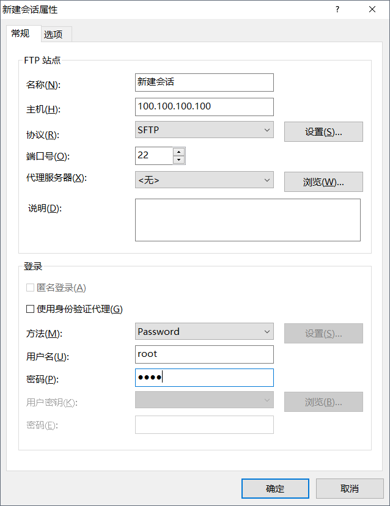

# FileBlog

一个小型的文件博客，版本v0.1。

## 目录

- [目录](#目录)
- [特点](#特点)
- [结构](#结构)
- [技术](#技术)
  + [vue](#vue)
  + [node](#node)
- [部署](#部署)
  + [部署条件](#部署条件)
  + [部署步骤](#部署步骤)
- [更新](#更新)  
  + [更新](#更新)
  + [待更新](#待更新)

## 特点

文件博客(fileblog)不同于传统博客(traditional blog)，

不同点(difference) |传统(traditional) | 文件(file)
---|---|---
存储(storage) | 数据库(DataBase) | 文件(File)
管理(manage) | 后端系统(backend) | 文件系统(file)
特点(Characteristic) | 定制性更强，有评论，登陆等功能，管理依赖后台，迁移复杂 | 评论登陆功能实现过于麻烦，管理方便，对文件操作即可实现管理，内容依赖文件，迁移直接拷贝，无技术门槛

## 结构

blog目录如下

    ---- blog //主目录
      |---- markdown //
         |---- img // markdown引用图片
         |---- down // md文件目录
      |---- static // 博客的样式文件
      |---- route // blog的路由导航  
      |---- index.html // blog首页
      |---- index.js // 入口文件

## 技术

### vue

基于vue2.0的前端，只用到了vue-router,略去了less,vuex,axios等工具。

### node

后端使用的node，主要使用readfilesync方法，读取文件并返回给页面。

## 部署

#### 部署条件

1. 具备node环境服务器

2. 服务器文件传输工具以及终端工具，如(Xftp+Xshell,只有5M，且免安装，本例均已该工具为例)

#### 部署步骤

##### 步骤一
首先使用Xftp，新建一个链接，如下

输入信息，然后连接成功。

##### 步骤二
使用ctrl+alt+T打开新终端，即Xshell,输入

    node -v

查看node环境是否安装，然后选择blog文件的放置位置，如/etc/home

    cd /home

然后运行 

    wget ../

将文件拷贝到目录下，解压

    tar 

之后使用xftp工具将自己的markdown文件夹拷贝到目录下覆盖。

之后使用shell工具

    cd /home/blog
    node index.js

就部署成功了，打开

    ip:8088/code
    
即可查看博客。

## 注意

1. 博客每篇的md名不推荐中文以及“&”等奇怪文字(包括一些计算机本身不支持的外语)，虽然本身支持，但是多数服务器使用linux系统，版本和类别众多，对于中文字符的支持也不尽相同，所以使用英文可以避免许多意料之外的错误。

2. 每篇md的文章命名规则为

    YYYY-MM-DD_filename.md

3. md中的图片路径即为
    
    ../imgname

在本地也可以浏览，在服务端会被解析为绝对地址。

4. 文件本身更新不需要停止服务，直接将文件拷贝到服务器目录下即可，但要刷新页面才能看到效果。

## 更新

#### 更新

- 修复路径问题

- 更新于2017-09-21

- 代码高亮，目前支持的有linux，javascript,html关键字高亮

- 更新于2017-10-9

#### 待更新

- 评论功能需要数据库的辅助

- 草稿功能

- 页面的过渡效果

