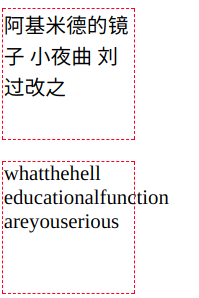
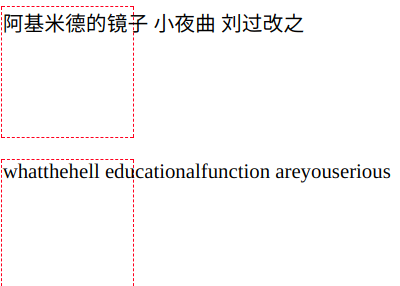
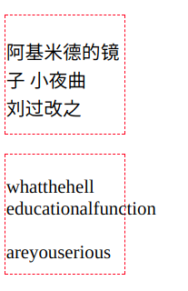
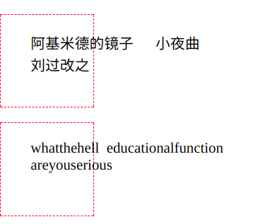
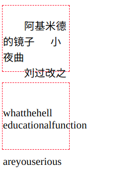

# word

### 超出长度变为省略号

css 方式:

```css
    overflow: hidden; 
    text-overflow:ellipsis; 
    white-space: nowrap; 
```

js方式: 

    const overLengthEillpsis = (l, obj, ...props) => {
        let str
        if (typeof obj === 'string') {
            return obj.length > l ? obj.slice(0, l) + '...' : obj
        }
        if (obj instanceof Object && props.length > 0) {
            props.forEach(e => obj[e] = obj[e].slice(0, l) + '...')
        } else {
            throw new Error('parameter missed')
        }
    }

### white-space

可选值: 

 `normal` 自动换行

 `nowrap` 不自动换行

 `pre-line` 合并空白符, 自动换行

 `pre` 不合并空白符, 不自动换行

 `pre-wrap` 不合并空白符, 自动换行

用一个p来举例子

```css
    p{
        width: 100px; 
        height: 100px; 
        border: 1px dashed red; 
    }

    <p>
        阿基米德的镜子      小夜曲
        刘过改之
    </p>

    <p>
        whatthehell educationalfunction
        areyouserious
    </p>
```

normal



nowrap



pre-line



pre



pre-wrap



### word-wrap

这是单词换行的问题, 

在遇到英文时, 会在半角空格和连字符处换行, 而不会在单词中间换

中文, 会在任意字符处换行

可选值:

 `normal` 

 `break-word` 让英文在任意处换行

### word-break

可选值:

 `normal` 英文长单词整个换行

 `break-all` 英文长单词截断, 换行

 `keep-all` 英文长单词不换行

> keep-all 移动端支持不好

> 表格中长单词的换行需要配合 `table-layout:fixed` 

