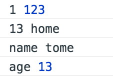

# for in 循环的无序

众所周知 for in 循环是 无法保证输出的顺序的。

    let andy = {
        // str: str
        name: 'tome',
        // int : int
        24: 123,
        // str: int
        age: 13,
        // int: str
        13: 'home'
    }

    for (let prop in andy) {
        console.log(prop, andy[prop])
    }

图中的结果key为数字型的被按序排到了前面，大胆猜测一下，`for in` 会将对象的key`sort` 后，输出

['name','24','age','13'].sort()
// ["13", "24", "age", "name"]

需要注意的是， 对象的key都是字符串。

在[The application/json Media Type for JavaScript Object Notation (JSON)](https://tools.ietf.org/html/rfc4627)中有这样的描述。

>An object is an unordered collection of zero or more name/value pairs, where a name is a string and a value is a string, number, boolean, null, object, or array.

所有的Key无论 `wrapped in double quotes` ,都会被转换成字符串。

实际返回的只有数字型的按照了预期的排序，其他的按照默认的顺序返回了。

