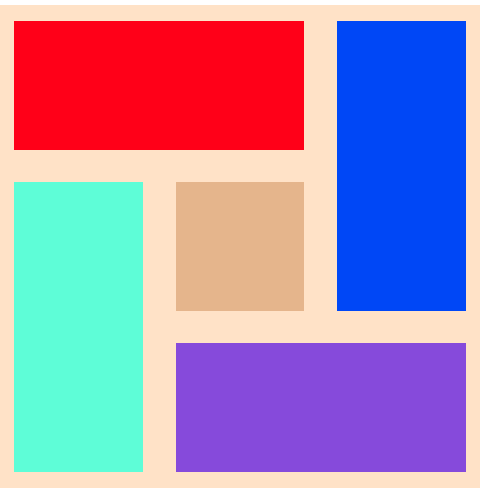

# Grid

新型布局欢迎来到Grid的世界。

先说说flex布局，在一维表现十分优秀的工具，但是，在二维的平面上显得略有力不从心（例如，我需要一个3*3的弹性布局，一般3个flexBox叠罗汉）。

再说说table布局，3*3布局什么的就舒服多了，但姑且不说表格里`margin`的不便，如果需要创建有Z轴堆叠关系的元素，就无能为力了。

下面说说挺好用的grid;

### grid-container

首先 `display: grid`， 然后定义grid的大布局方式。

`grid-template-rows` `grid-template-columns`  两个定义了行列的占宽。

例如这样,可以取px auto % 还有fr

    grid-template-columns: 40px 50px auto 50px 40px;
    grid-template-rows: 25% 100px auto;

`grid-template`是以上两个属性的缩写,值为 `grid-template-rows`/`grid-template-columns`。

`grid-gap` 是行列的缝隙的宽度，值为 `grid-column-gap` `grid-column-gap`（也可以一个值，代表均匀宽度）。

`align-items`和 `jusity-items` 的可选值都是  `start` `end` `center` `stretch`(充满)

`justify-content`: 这个等同flex的`justify-content`也有`space-between/around`可选。

> fr是一个新增的自适应单位，用于在一系列长度值中分配剩余空间，如果已指定了多个部分，则剩下的空间根据各自的数字按比例分配。

### grid-item

`grid-area` 的作用之一如下

grid-area: `row-start` / `column-start` / `row-end` / `column-end` 

用来声明每个`item`占的格子大小。

`align-self`和 `jusity-self` 的可选值都是  `start` `end` `center` `stretch`(充满) 影响单个元素

让我们来做一个最简单的栗子。

    <html>
    

        

        

        

        

        

    

    <style>
        .parent {
            display: grid;
            width: 300px;
            height: 300px;
            grid-template: repeat(3, 1fr) /1fr 1fr 1fr;
        }

        .parent div {
            border: 10px solid bisque;
        }

        .children1 {
            grid-area: 1/1/2/3;
            background: red;
        }

        .children2 {
            grid-area: 1/3/3/4;
            background: blue;
        }

        .children3 {
            grid-row: 3/span 1;
            grid-column: 2/span 2;
            background: blueviolet;
        }

        .children4 {
            grid-row: 2/4;
            grid-column: 1/2;
            background: aquamarine;
        }

        .children5 {
            grid-area: 2/2;
            background: burlywood;
        }

除了这个，你还可以这样

    <style>
        .parent {
            display: grid;
            width: 300px;
            height: 300px;
            grid-template: repeat(3, 1fr) /1fr 1fr 1fr;
            grid-template-areas: 'c1 c1 c2'
                                 'c4 c5 c2'
                                 'c4 c3 c3';
        }

        .parent div {
            border: 10px solid bisque;
        }

        .children1 {
            grid-area: c1;
            background: red;
        }

        .children2 {
            grid-area: c2;
            background: blue;
        }

        .children3 {
            grid-area: c3; 
            background: blueviolet;
        }

        .children4 {
            grid-area: c4;
            background: aquamarine;
        }

        .children5 {
            grid-area: c5;
            background: burlywood;
        }

这个就是`grid-area`声明名称的作用

配合上媒体查询，这是一个适应性布局极为便利的属性。

    <style>
        @media screen and (max-width: 1080px) {
            .parent {
                grid-template-areas: 'c1 c1 c1' 'c2 c2 c2' 'c3 c4 c5';
            }
        }