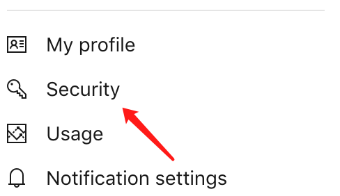

# vscode 的插件编写

### 开发准备


#### 开发工具

1. VS Code
2. nodejs

#### 依赖安装

```
npm install - g yo generator - code
```

这是一个包括cli命令在内的官方开发工具

```
//cli
yo code
```

需要你填写一些信息, 例如项目名字之类.~~随便填~~

其实也就是一些 `package.json` 里的信息

> 注意: 会让你选择使用 `typescript` 或者 `javascript` , 会依据你的选择创建~~极其相似的~~模版.

以 `typescript` 为例, 

    file: {
    	out: {
    		dir: '输出文件目录',
    		cd: {
    			src: {
    				dir: '输出转换后的代码'
    			},
    			test: {
    				dir: '输出测试代码'
    			}
    		}
    	},
    	src: {
    		dir: '代码目录',
    		cd: {
    			extension.ts: {
    				file: '代码入口'
    			}
    		}
    	}

    }

#### 开发

在生成的项目目录下, 打开vscode, `command+shift+D` 打开调试模式, 


点击 `Starting Debug` 会打开一个新的VS code窗口, 那个页面就是生效的代码, 每次修改代码后, 需要重新 `Run` .

### 插件上传

注册->创建团队->创建token->登录账号->发布包->更新包

#### 注册账号

去 [marketPlace](https://marketplace.visualstudio.com/) 注册一个账号用来发布包

“是, 确定......”常规的邮箱注册流程...

#### 创建组织以及PAT(Personal Access Token)

完成注册后, 直接在个人项目[页面](https://dev.azure.com), 直接创建组织(organizations).

然后选择 `Security` 



接着 `add token` , 会自动生成一串token, `organization` 选择 `all accessible organization` , `scope` 选择 `full access` .

> 注意: 生成的token是无法再次打开查看的, 请保存到一个安全的地方, 这是将来你登录自己账户的 `PAT` 


~~为什么我会知道呢?肯定不可能是我后来发现没法登录, 又重新生成了一个~~

#### 登录账号

    vsce create - publisher < publisher name >

    
需要输入邮箱, 和 `PAT` , 接着登录刚才的账号

    Vsce login < publisher name >

至此, 你已经可以开始 `publish` 插件了

    vsce publish

