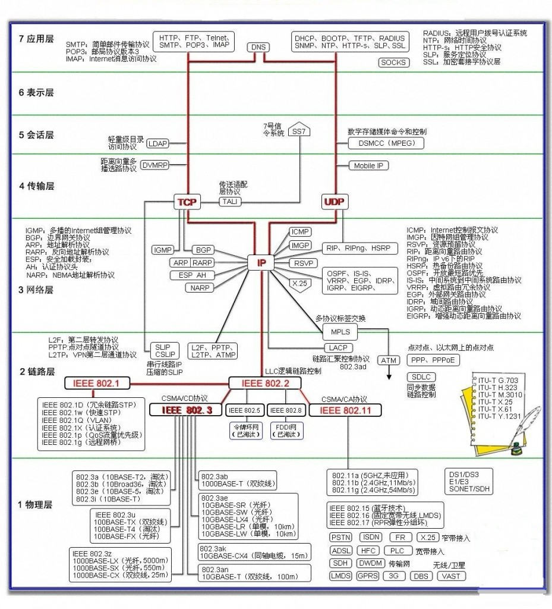
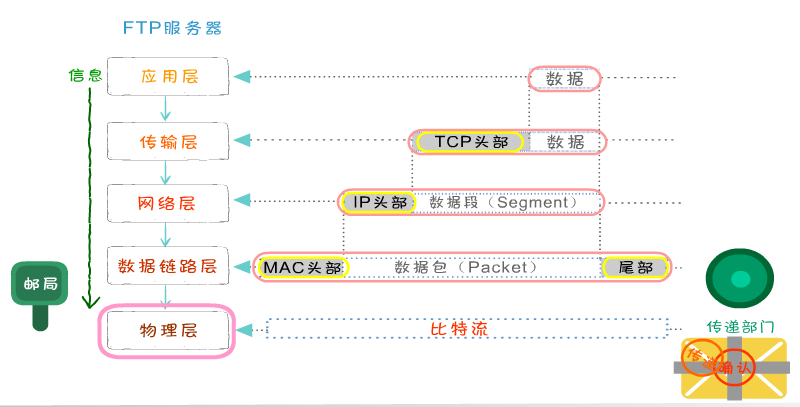
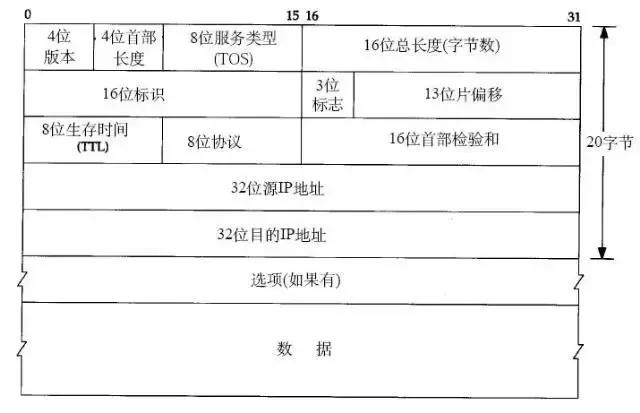

# 计算机各层网络协议 

### OSI七层模型

应用层(Application) 提供网络与用户应用软件之间的接口服务

会话层(Session) 提供包括访问验证和会话管理在内的建立和维护应用之间通信的机制

表示层(Presentation) 提供格式化的表示和转换数据服务, 如加密和压缩

传输层(Transimission) 提供建立、 维护和取消传输连接功能, 负责可靠地传输数据(PC)

网络层(Network) 处理网络间路由, 确保数据及时传送(路由器)

数据链路层(DataLink) 负责无错传输数据, 确认帧、 发错重传等(交换机)

物理层(Physics) 提供机械、 电气、 功能和过程特性(网卡、 网线、 双绞线、 同轴电缆、 中继器)

应用层: (典型设备:应用程序, 如FTP, SMTP , HTTP) 

DHCP(Dynamic Host Configuration Protocol)动态主机分配协议, 使用 UDP 协议工作, 主要有两个用途: 给内部网络或网络服务供应商自动分配 IP 地址, 给用户或者内部网络管理员作为对所有计算机作中央管理的手段。 实 现即插即用连网。 

BOOTP (BOOTstrapProtocol) 引导程序协议/ 自举协议, 使用UDP 来使 一个无盘工作站自动获取配置信息。 静态的配置协议  DNS    (Domain Name System )域名解析<端口号53> 

FTP   (File Transfer Protocol )文件传输协议<端口号21>减少或消除不同操作系统下处理文件的不兼容性。 

Gopher   (The Internet Gopher Protocol )网际Gopher 协议 

HTTP    (Hypertext Transfer Protocol )超文本传输协议 <端口号 80>, 面向事务的应用层协议。 

IMAP4 (Internet Message Access Protocol 4) Internet 信息访问协议的第 4 版本 

IRC   (Internet Relay Chat )网络聊天协议 

NNTP    (Network News Transport Protocol )网络新闻传输协议 

XMPP 可扩展消息处理现场协议 

POP3 (Post Office Protocol 3) 即邮局协议的第3 个版本, 用于接受邮件。 

SIP()信令控制协议 

SMTP (Simple Mail Transfer Protocol )简单邮件传输协议 <端口号25> 用于发送邮件。 

SNMP (Simple Network Management Protocol), 简单网络管理协议 

SSH   (Secure Shell )安全外壳协议 

TELNET     远程登录协议 <端口号23> 

RPC   (Remote Procedure Call Protocol )(RFC- 1831)远程过程调用协 议 

RTCP    (RTP Control Protocol )RTP   控制协议 

RTSP   (Real Time Streaming Protocol )实时流传输协议 

TLS   (Transport Layer Security Protocol )安全传输层协议 

SDP( Session Description Protocol )会话描述协议 

SOAP   (Simple Object Access Protocol )简单对象访问协议 

GTP 通用数据传输平台 

STUN   (Simple Traversal of UDP over NATs , NAT      的UDP 简单穿越) 是一种网络协议 

NTP   (Network Time Protocol )网络校时协议。 

传输层:  (典型设备:  进程和端口)       数据单元: 数据段 (Segment) 

TCP  (Transmission Control Protocol )传输控制协议提供可靠的面向连接的服务, 传输数据前须先建立连接, 结束后释放。 可靠的全双工信道。 可靠、 有序、 无丢失、 不重复。 

UDP (User Datagram Protocol )用户数据报协议发送数据前无需建立连接, 不使用拥塞控制, 不保证可靠交付, 最大努力交付。 

DCCP    (Datagram Congestion Control Protocol )数据报拥塞控制协议 

SCTP  (STREAM CONTROL TRANSMISSION PROTOCOL )流控制传 输协议 

RTP(Real-time Transport Protocol )实时传送协议 

RSVP   (Resource ReSer Vation Protocol )资源预留协议 

PPTP ( Point to Point Tunneling Protocol )点对点隧道协议 

网络层: (典型设备:路由器, 防火墙、 多层交换机) 数据单元: 数据包(Packet ) 

IP (IPv4 · IPv6) (Internet Protocol) 网络之间互连的协议 

ARP (Address Resolution Protocol) 即地址解析协议, 实现通过IP 地址得 知其物理地址。 

RARP (Reverse Address Resolution Protocol)反向地址转换协议允许局域 网的物理机器从网关服务器的 ARP 表或者缓存上请求其 IP地址。 

ICMP (Internet Control Message Protocol )Internet 控制报文协议。 它是TCP/IP 协议族的一个子协议, 用于在IP 主机、 路由器之间传递控制消息。 

> ping 就是ICMP的典型使用

ICMPv6 : 

IGMP (Internet Group Management Protocol) Internet 组管理协议, 是因特 网协议家族中的一个组播协议, 用于 IP  主机向任一个直接相邻的路由器报 告他们的组成员情况。 

RIP (Router information protocol) 路由信息协议是一种在网关与主机之间交换路由选择信息的标准。 

OSPF (Open Shortest Path Firs)开放式最短路径优先, 分布式链路状态协议。 

BGP(Border Gateway Protocol )边界网关协议, 用来连接Internet 上独立系统的路由选择协议.采用路径向量路由选择协议。 

IS-IS (Intermediate System to Intermediate System Routing Protocol )中间系统到中间系统的路由选择协议. 

IPsec (IP Secure) "Internet  协议安全性"是一种开放标准的框架结构, 通过使用加密的安全服务以确保在 Internet  协议 (IP)  网络上进行保密而安全的通讯。 

数据链路层: (典型设备:  网卡, 网桥, 交换机)            数据单元: 帧 (Frame) 

ARQ(Automatic Repeat-reQuest )自动重传请求协议, 错误纠正协议之一, 包括停止等待ARQ 协议和连续ARQ 协议, 错误侦测、 正面确认、 逾时重传与负面确认继以重传等机制。 

停止等待协议: 

CSMA/CD(Carrrier Sense Multiple Access with Collision Detection)载波监听多点接入/碰撞检测协议。 总线型网络, 协议的实质是载波监听和碰撞检测。 载波监听即发数据前先检测总线上是否有其他计算机在发送数据, 如暂时不发数据, 避免碰撞。 碰撞检测为计算机边发送数据边检测信道上的信号电压大小。 

PPP(Point-to-Ponit Protocol)点对点协议面向字节, 由三部分组成: 一个将IP 数据报封装到串行链路的方法; 一个用于建立、 配置和测试数据链路连接的链路控制协议

LCP(Link Control Protocol) : 一套网络控制协议NCP 。 

HDLC  (High-Level Data Link Control )高级数据链路控制同步网上传输数据、 面向比特的数据链路层协议。 

ATM  (Asynchronous Transfer Mode )异步传递方式, 建立在电路交换和分组交换的基础上的一种面向连接的快速分组交换技术。 "异步"是指将ATM 信元"异步插入"到同步的 SDH 比特流中。 如同步插入则用户在每帧中所占的时隙相对位置固定不变。 "同步"是指网络中各链路上的比特流都是受同一非常精确的主时钟的控制。 Wi-Fi 、 WiMAX 、 DTM 、 令牌环、 以太网、 FDDI 、 帧中继、 GPRS 、 EVDO 、 HSPA 、 L2TP 、 ISDN 

物理层:(典型设备: 中继器, 集线器、 网线、 HUB)                           数据单元: 比特 (Bit) 

以太网物理层、 调制解调器、 PLC 、 SONET/SDH 、 G.709 、 光导纤维、 同轴电缆、 双绞线 

ip协议头:

这里只介绍:八位的TTL字段。这个字段规定该数据包在穿过多少个路由之后才会被抛弃。某个IP数据包每穿过一个路由器，该数据包的TTL数值就会减少1，当该数据包的TTL成为零，它就会被自动抛弃。

这个字段的最大值也就是255，也就是说一个协议包也就在路由器里面穿行255次就会被抛弃了，根据系统的不同，这个数字也不一样，一般是32或者是64。

