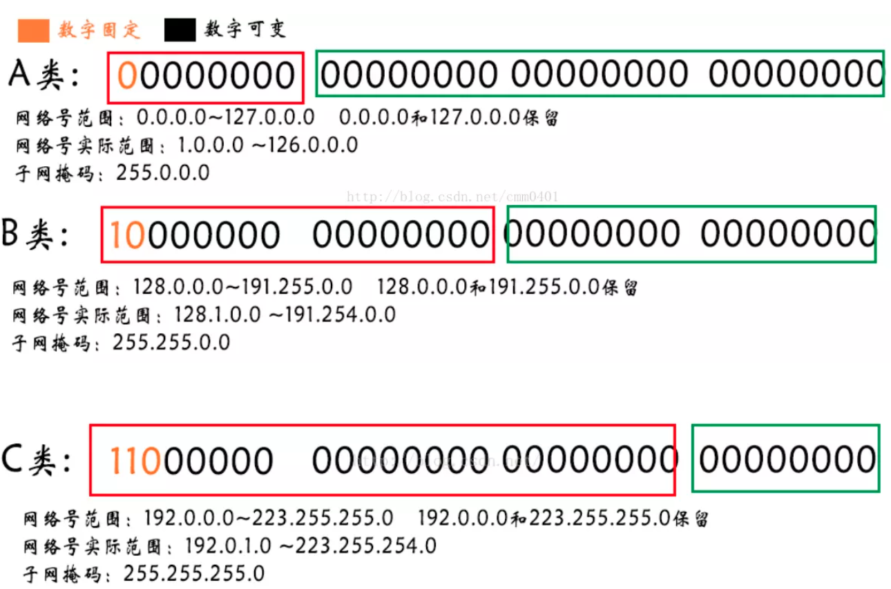

# ip 地址分类

A类网络的IP地址范围为1.0.0.1－127.255.255.254； 
B类网络的IP地址范围为：128.1.0.1－191.255.255.254； 
C类网络的IP地址范围为：192.0.1.1－223.255.255.254。

> 回送地址（127.x.x.x）是本机回送地址（Loopback Address）

### A类

一个A类IP地址是指，在IP地址的四段号码中，第一段号码为网络号码，剩下的三段号码为本地计算机的号码。如果用二进制表示IP地址的话，A类IP地址就由1字节的网络地址和3字节主机地址组成，网络地址的最高位必须是“0”。

10.0.0.0到10.255.255.255是私有地址（所谓的私有地址就是在互联网上不使用，而被用在局域网络中的地址）。 
127.0.0.0到127.255.255.255是保留地址，用做循环测试用的。    

### B类

一个B类IP地址是指，在IP地址的四段号码中，前两段号码为网络号码，剩下的两段号码为本地计算机的号码。

### C类

一个C类IP地址是指，在IP地址的四段号码中，前三段号码为网络号码，剩下的一段号码为本地计算机的号码。

