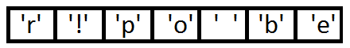
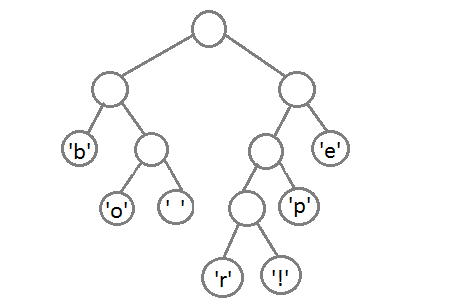
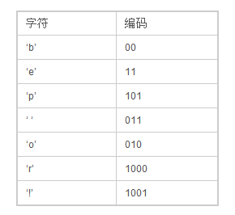

# huffman编码

huffman编码是一种基于二叉树的常用压缩算法，常用于压缩文本内容等。

例如压缩

 “beep boop beer!” 

最终压缩结果为：

0011 1110 1011 0001 0010 1010 1100 1111 1000 1001

原字符串为：

0110 0010 0110 0101 0110 0101 0111 0000 0010 0000 0110 0010 0110 1111 0110 1111 0111 0000 0010 0000 0110 0010 0110 0101 0110 0101 0111 0010 0010 0001

最终只需要一个对应的字符表，以及这段代码就可以了。

