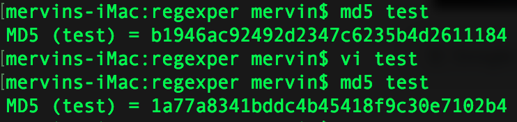

# hash

hash（散列、 杂凑）函数， 是将任意长度的数据映射到有限长度的域上。 直观解释起来， 就是对一串数据m进行杂糅， 输出另一段固定长度的数据h， 作为这段数据的特征（指纹）。 

不过hash在数据结构领域和密码学中利用的特性并不一样

## 密码学

### 原理

密码学中, 由于hash的抗篡改能力, hash广泛用于信息安全领域中加密算法， 它把一些不同长度的信息转化成杂乱的固定位的编码, 这些编码值叫做HASH值. 也可以说， hash就是找到一种数据内容和数据存放地址之间的映射关系.

hash 是一个单向函数, 即无法根据结果判断出唯一的解, 如 x**2 = 1, 因为在加密过程中, 会丢弃相当一部分信息

### hash 校验

例如常用的 MD5 和 SHA1 加密 , 还有 CRC校验

##### Message Digest 5

MD5散列长度通常是128位， 主要用于密码加密和文件校验

##### Secure Hash Standard

又称安全哈希标准, SHA可将一个最大2^64位（2305843009213693952字节）信息， 转换成一串160位（20字节）的散列值（摘要信息）

##### Cyclic Redundancy Check(循环冗余校验)

微软发布Windows操作系统或其它软件， 现在都采用CRC32结合SHA1的方式

###### test

test文件中是 hello 字符, 以及 hello_(space), 仅仅一个空格, 让hash变化很大.

那么, 既然同一个文件才能得到同样的hash值， 错一个字节得到不一样的哈希值， 那为什么会存在两个不同文件却能得到同一个哈希值的情况呢。 

一般来说, 是存在不同文件a, b都对应同一个hash值x的, 但是a, b的差异非常大, 由a改动到b非常困难, 因为无法由hash来反向推算内容, 所以用这种方法校验文件是很安全的.当然了, 为了以防万一, 可以结合多种加密算法来进行校验.

## 数据结构

数据结构中, 更看重hash的抗碰撞能力, 即对于任意两个不同的数据块， 其hash值相同的可能性极小； 对于一个给定的数据块， 找到和它hash值相同的数据块极为困难。 

<!-- 数组的特点是： 寻址容易， 插入和删除困难； 而链表的特点是： 寻址困难， 插入和删除容易。 那么我们能不能综合两者的特性， 做出一种寻址容易， 插入删除也容易的数据结构？ 答案是肯定的， 这就是我们要提起的哈希表， 哈希表有多种不同的实现方法， 我接下来解释的是最常用的一种方法——拉链法， 我们可以理解为“链表的数组”， 如图： -->

### hash Map

哈希表（Hash table， 也叫散列表）， 是根据关键码值(Key value)而直接进行访问的数据结构。 也就是说， 它通过把关键码值映射到表中一个位置来访问记录， 以加快查找的速度。 这个映射函数叫做散列函数， 存放记录的数组叫做散列表。 

哈希表hashtable(key， value) 的做法其实很简单， 就是把Key通过一个固定的算法函数既所谓的哈希函数转换成一个整型数字， 然后就将该数字对数组长度进行取余， 取余结果就当作数组的下标， 将value存储在以该数字为下标的数组空间里。 

而当使用哈希表进行查询的时候， 就是再次使用哈希函数将key转换为对应的数组下标， 并定位到该空间获取value， 如此一来， 就可以充分利用到数组的定位性能进行数据定位.

### hash function

hash函数的构造在hashMap中显得十分重要, 说几种常见的

##### 取模法

散列函数为： h(x) ＝ x mod M

##### 平方取中法

先通过求关键码的平方值， 从而扩大相近数的差别， 然后根据表长度取中间的几位数（往往取二进制的比特位）作为散列函数值。 因为一个乘积的中间几位数与乘数的每一数位都相关.

### 解决冲突

#### 开放定址法

用开放定址法解决冲突的做法是： 当冲突发生时， 使用某种探查(亦称探测)技术在散列表中形成一个探查(测)序列。 沿此序列逐个单元地查找， 直到找到给定 的关键字， 或者碰到一个开放的地址(即该地址单元为空)为止（若要插入， 在探查到开放的地址， 则可将待插入的新结点存人该地址单元）。 查找时探查到开放的 地址则表明表中无待查的关键字， 即查找失败。 

按照形成探查序列的方法不同， 可将开放定址法区分为线性探查法、 线性补偿探测法、 随机探测等。 

开放地址法公式: ： Hi=(H(key)+di) MOD m i=1, 2, ..., k(k<=m-1）

Hi=（H（key）+di）% m   i=1， 2， …， n

其中H（key）为哈希函数， m 为表长， di称为增量序列。 增量序列的取值方式不同， 相应的再散列方式也不同。 

如果di值可能为1, 2, 3, ...m-1， 称线性探测再散列。 

如果di取1， 则每次冲突之后， 向后移动1个位置.如果di取值可能为1, -1, 4, -4, 9, -9, 16, -16, ...k*k, -k*k(k<=m/2）, 称二次探测再散列。 

如果di取值可能为伪随机数列。 称伪随机探测再散列。 

#### 拉链法

拉链法解决冲突的做法是： 将所有关键字为同义词的结点链接在同一个单链表中。 若选定的散列表长度为m， 则可将散列表定义为一个由m个头指针组成的指针数 组T[0..m-1]。 凡是散列地址为i的结点， 均插入到以T[i]为头指针的单链表中。 T中各分量的初值均应为空指针。 在拉链法中， 装填因子α可以大于 1， 但一般均取α≤1。 