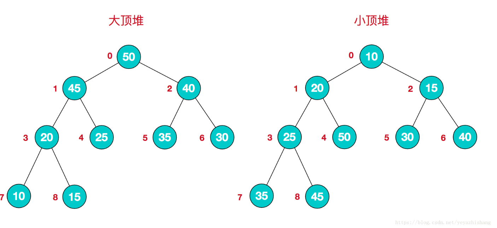
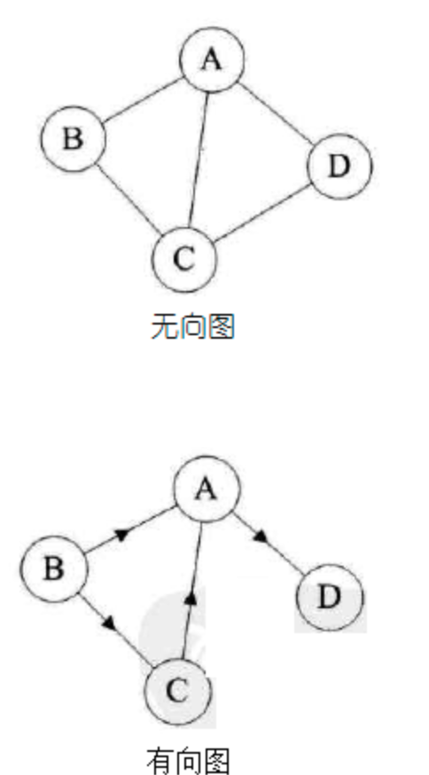

# Structures

Let's get acquainted with some of the most common data structures.

//链表

Linked_List: The formal definition is "a data structure consisting of a group of nodes which together represent a sequence." Like arrays, linked lists have indexes, but are accessed by iterators. In the linked list below, the head is "12", which is where the iterator always begins. Suppose we have a linked list object called "list", then list.head = 12 and list.head.next = 99. The last node is called the tail and is always "null" (nothing there).

//栈

stack:First come, first served

//队列

Queue:The Queue data structure provides first come, first served

//树

Tree:If you've ever looked at a genealogy table, or at the chain of command in a corporation, you've seen data arranged in a tree. A tree is composed of a collection of nodes, where each node has some associated data and a set of children. A node's children are those nodes that appear immediately beneath the node itself. A node's parent is the node immediately above it. A tree's root is the single node that contains no parent.

//二叉树

Binary tree:A binary tree is a special kind of tree, one that limits each node to no more than two children. A binary search tree, or BST, is a binary tree whose nodes are arranged such that for every node n, all of the nodes in n's left subtree have a value less than n, and all nodes in n's right subtree have a value greater than n. As we discussed, in the average case BSTs offer log2 n asymptotic time for inserts, deletes, and searches.

//图

Graphs:Graphs are composed of a set of nodes and edges, just like trees, but with graphs there are no rules for the connections between nodes. With graphs there is no concept of a root node, nor is there a concept of parents and children. Rather, a graph is just a collection of interconnected nodes.

## Tree

树是一种数据结构, 它是由n(n>=1)个有限节点组成一个具有层次关系的集合。 把它叫做 "树" 是因为它看起来像一棵倒挂的树, 也就是说它是根朝上, 而叶朝下的。 它具有以下的特点:

每个节点有零个或多个子节点; 
没有父节点的节点称为根节点; 
每一个非根节点有且只有一个父节点; 
除了根节点外, 每个子节点可以分为多个不相交的子树; 
在日常的应用中, 我们讨论和用的更多的是树的其中一种结构, 就是二叉树。 

参见2018-07-16_binary tree[Algorithm].md

二叉树是树的特殊一种, 具有如下特点:

1、 每个结点最多有两颗子树, 结点的度最大为2。 
2、 左子树和右子树是有顺序的, 次序不能颠倒。 
3、 即使某结点只有一个子树, 也要区分左右子树。 

二叉树是一种比较有用的折中方案, 它添加, 删除元素都很快, 并且在查找方面也有很多的算法优化, 所以, 二叉树既有链表的好处, 也有数组的好处, 是两者的优化方案, 在处理大批量的动态数据方面非常有用。 

扩展: 
二叉树有很多扩展的数据结构, 包括平衡二叉树、 红黑树、 B+树等, 这些数据结构二叉树的基础上衍生了很多的功能, 在实际应用中广泛用到, 例如mysql的数据库索引结构用的就是B+树, 还有HashMap的底层源码中用到了红黑树。 这些二叉树的功能强大, 但算法上比较复杂, 想学习的话还是需要花时间去深入的。 

# hash table

散列表, 也叫哈希表, 是根据关键码和值 (key和value) 直接进行访问的数据结构, 通过key和value来映射到集合中的一个位置, 这样就可以很快找到集合中的对应元素。 

记录的存储位置=f(key)

这里的对应关系 f 成为散列函数, 又称为哈希 (hash函数), 而散列表就是把Key通过一个固定的算法函数既所谓的哈希函数转换成一个整型数字, 然后就将该数字对数组长度进行取余, 取余结果就当作数组的下标, 将value存储在以该数字为下标的数组空间里, 这种存储空间可以充分利用数组的查找优势来查找元素, 所以查找的速度很快。 

哈希表在应用中也是比较常见的, 就如Java中有些集合类就是借鉴了哈希原理构造的, 例如HashMap, HashTable等, 利用hash表的优势, 对于集合的查找元素时非常方便的, 然而, 因为哈希表是基于数组衍生的数据结构, 在添加删除元素方面是比较慢的, 所以很多时候需要用到一种数组链表来做, 也就是拉链法。 拉链法是数组结合链表的一种结构, 较早前的hashMap底层的存储就是采用这种结构, 直到jdk1.8之后才换成了数组加红黑树的结构.

## heap

是一种比较特殊的数据结构, 可以被看做一棵树的数组对象, 具有以下的性质:

堆中某个节点的值总是不大于或不小于其父节点的值; 

堆总是一棵完全二叉树。 

将根节点最大的堆叫做最大堆或大根堆, 根节点最小的堆叫做最小堆或小根堆。 常见的堆有二叉堆、 斐波那契堆等。 

堆的定义如下:n个元素的序列{k1, k2, ki, …, kn}当且仅当满足下关系时, 称之为堆。 
(ki <= k2i, ki <= k2i+1)或者(ki >= k2i, ki >= k2i+1), (i = 1, 2, 3, 4…n/2), 满足前者的表达式的成为小顶堆, 满足后者表达式的为大顶堆, 这两者的结构图可以用完全二叉树排列出来, 示例图如下: 

因为堆有序的特点, 一般用来做数组中的排序, 称为堆排序。 

# Graphs

图是由结点的有穷集合V和边的集合E组成。 其中, 为了与树形结构加以区别, 在图结构中常常将结点称为顶点, 边是顶点的有序偶对, 若两个顶点之间存在一条边, 就表示这两个顶点具有相邻关系。 

按照顶点指向的方向可分为无向图和有向图: 

图是一种比较复杂的数据结构，在存储数据上有着比较复杂和高效的算法，分别有邻接矩阵 、邻接表、十字链表、邻接多重表、边集数组等存储结构，