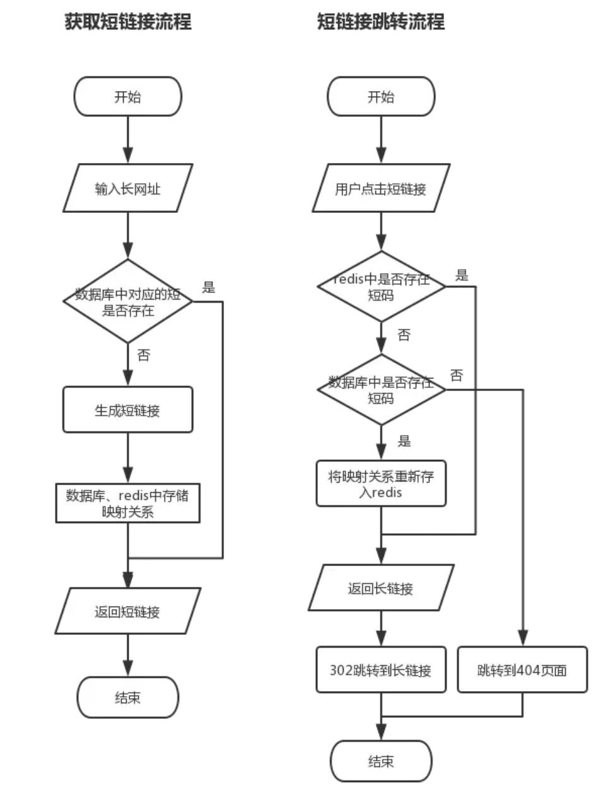

# 短链接

短链接就是, 形态如 `https://tb.am/xxx` , 打开以后会是其他的网址, 这个主要是后面的xxx是怎么得到的, 其实在服务器会有个保存短链接和长链接的对应关系. 

## 短链接生成的方式

1. 用户输入长网址, 服务端接收后进行处理, 并根据长网址的内容, 生成一个短码, 并将映射关系进行存储. 然后根据短码拼接出短链接, 返回给用户; 
2. 用户点击短链接, 服务器端根据短链接中的短码, 查找到对应的长网址, 并302跳转到对应的页面.

根据数据库保存的唯一字段 `id` , 对id进行进制转换, 例如转换为36进制, 那么即使达到

$$ e^{x} $$

这个数量级, 也只需要6个字符就可以区分. 

> 知识点: 为什么要使用302跳转, 而不是301跳转呢?

> 301是永久重定向, 302是临时重定向. 短地址一经生成就不会变化, 所以用301是符合http语义的. 但是如果用了301, Google, 百度等搜索引擎, 搜索的时候会直接展示真实地址, 那我们就无法统计到短地址被点击的次数了, 也无法收集用户的Cookie, User Agent 等信息, 这些信息可以用来做很多有意思的大数据分析, 也是短网址服务商的主要盈利来源.

## 流程

> 匹配长链接在数据库检索可能需要极长的时间, 推荐使用hash来检索, 提高效率. 

