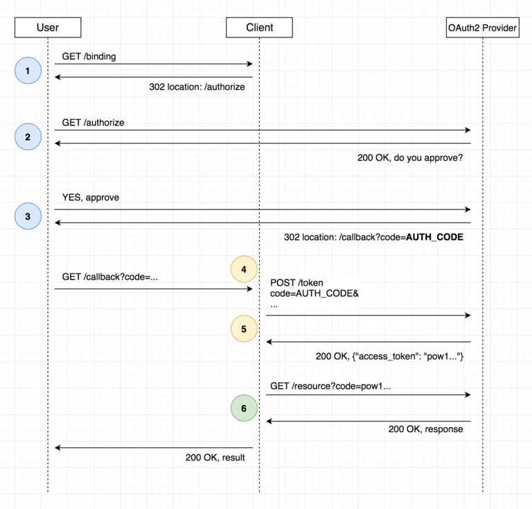

# OAuth

### 基本流程

OAuth 中最典型的Authorization Code 授权模式基本是这样的流程:

在1, 2, 3步是询问用户是否允许授权, 第4步使用Provider提供的 `OAuth_code` 去换取 `access_token` , 中间还需要 `secret` 或者 `signature` 等等(为了确定持有code的用户的身份), 然后, 验证无误就给予 `access_token` .

### 针对OAuth2的CSRF攻击

Step 1. 攻击者李四登录Tonr网站, 并且选择绑定自己的Sparklr账号. 

Step 2. Tonr网站将李四重定向到Sparklr, 由于他之前已经登录过Sparklr, 所以Sparklr直接向他显示"是否授权Tonr访问"的页面. 

Step 3. 李四在点击"同意授权"之后, 截获Sparklr服务器返回的含有Authorization Code参数的HTTP响应. 

Step 4. 李四精心构造一个Web页面, 它会触发Tonr网站向Sparklr发起令牌申请的请求, 而这个请求中的Authorization Code参数正是上一步截获到的code. 

Step 5. 李四将这个Web页面放到互联网上, 等待或者诱骗受害者张三来访问. 

Step 6. 张三之前登录了Tonr网站, 只是没有把自己的账号和其他社交账号绑定起来. 在张三访问了李四准备的这个Web页面后, 令牌申请流程在张三的浏览器里被顺利触发, Tonr网站从Sparklr那里获取到access_token, 但是这个token以及通过它进一步获取到的用户信息却都是攻击者李四的. 

Step 7. Tonr网站将李四的Sparklr账号同张三的Tonr账号关联绑定起来, 从此以后, 李四就可以用自己的Sparklr账号通过OAuth登录到张三在Tonr网站中的账号, 堂而皇之的冒充张三的身份执行各种操作. 

最主要的就是, 攻击者将自己的code放在页面里, 覆盖由Sparklr服务器返回的张三的code, 这样对于Tonr服务器, 它就使用了攻击者的Sparklr账号和Tonr账号绑定了.

尽管这个攻击既巧妙又隐蔽, 但是要成功进行这样的CSRF攻击也是需要满足一定前提条件的. 

首先, 在攻击过程中, 受害者张三在Tonr网站上的用户会话(User Session)必须是有效的, 也就是说, 张三在受到攻击前已经登录了Tonr网站. 其次, 整个攻击必须在短时间内完成, 因为OAuth2提供者颁发的 `Authorization Code` 有效期很短, OAuth2官方推荐的时间是不大于10分钟, 而一旦 `Authorization Code` 过期那么后续的攻击也就不能进行下去了. 最后, 一个 `Authorization Code` 只能被使用一次, 如果OAuth2提供者收到重复的 `Authorization Code` , 它会拒绝当前的令牌申请请求. 不止如此, 根据OAuth2官方推荐, 它还可以把和这个已经使用过的 `Authorization Code` 相关联的access_token全部撤销掉, 进一步降低安全风险. 

### 对策

要防止这样的攻击其实很容易, 作为第三方应用的开发者, 只需在OAuth认证过程中加入state参数, 并验证它的参数值即可. 

具体细节如下: 在将用户重定向到OAuth2的Authorization Endpoint去的时候, 为用户生成一个随机的字符串, 并作为state参数加入到URL中. 在收到OAuth2服务提供者返回的Authorization Code请求的时候, 验证接收到的state参数值. 如果是正确合法的请求, 那么此时接受到的参数值应该和上一步提到的为该用户生成的state参数值完全一致, 否则就是异常请求. state参数值需要具备下面几个特性: 不可预测性: 足够的随机, 使得攻击者难以猜到正确的参数值关联性: state参数值和当前用户会话(user session)是相互关联的唯一性: 每个用户, 甚至每次请求生成的state参数值都是唯一的时效性: state参数一旦被使用则立即失效.
