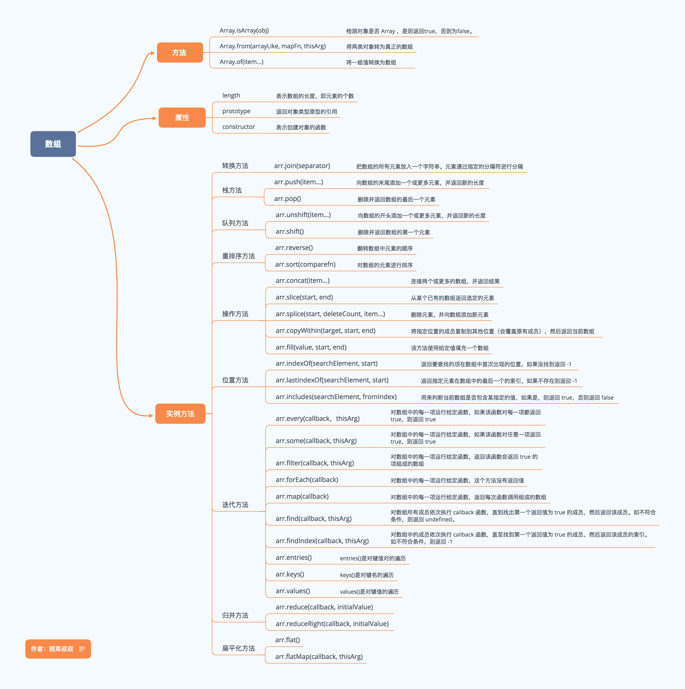

# Array

一图流:

## Array的属性:

### Array.length

## Array的方法: 

### Array.of

arrary新建数组

    //of新建
    Array.of(7); // [7] 
    Array.of(1, 2, 3); // [1, 2, 3]
    //传统新建
    Array(7); // [ , , , , , , ]
    Array(1, 2, 3); // [1, 2, 3]

### Array.isArray

检验是否数组

    Array.isArray([1, 2, 3]); 

### Array.from

从一个类似数组(如NodeList, arguments)或可迭代对象(如map, set, `string既是数组又是可迭代对象` )创建一个新的数组实例。 

    //字符串转换
    Array.from('foo'); 
    // ["f", "o", "o"]
    //map转换
    var m = new Map([
        [1, 2], 
        [2, 4], 
        [4, 8]
    ]); 
    Array.from(m); //[[1, 2], [2, 4], [4, 8]]
    // 使用 map 函数转换数组元素
    Array.from([1, 2, 3], x => x + x); // [2, 4, 6]
    // 生成一个数字序列
    Array.from({
        length: 5
    }, (v, k) => k); // [0, 1, 2, 3, 4]
    //数组去重
    var arr = [1, 2, 1, 2, 2, 1]; 
    //new Set 数组去重
    function unique(arr) {
        return Array.from(new Set(arr)); //去重复
    }; 
    console.log(unique(arr)); 
    //es6
    (function(first, ...rest) {
        log('first', first); //1
        log('rest', rest); //['Second, 3']
    })(1, 'Second', 3); 

    

    //es5
    (function() {
        var first = arguments[0]; 
        var rest = Array.from(arguments).slice(1); 
        log('first', first); 
        log('rest', rest); 
    })(1, 'Second', 3)

### Array.prototype.concat() 

用于合并两个或多个数组。 此方法不会更改现有数组, 而是返回一个新数组。 

    let arr1 = ["a", "b", "c"]; 
    let arr2 = ["d", "e", "f"]; 
    let arr3 = arr1.concat(arr2); 
    console.log(arr3); 
    // results in a new array 
    // [ "a", "b", "c", "d", "e", "f" ]
    console.log(arr1); 
    // ["a", "b", "c"]
    console.log(arr2); 
    // ["d", "e", "f"]

### Array.prototype.entries

返回一个新的Array Iterator对象, 该对象包含数组中每个索引的键/值对。 

    var arr = ["a", "b", "c"]; 
    var iterator = arr.entries(); 
    // undefined
    console.log(iterator); 
    // Array Iterator {}
    console.log(iterator.next().value); 
    // [0, "a"]
    console.log(iterator.next().value); 
    // [1, "b"]
    console.log(iterator.next().value); 
    // [2, "c"]
    var arr = ["a", "b", "c"]; 
    var iterator = arr.entries(); 
    // undefined
    for (let e of iterator) {
        console.log(e); 
    }
    // [0, "a"] 
    // [1, "b"] 
    // [2, "c"]
    使用解构, 会更加清晰
    for (const [index, elem] of arr.entries()) {
        console.log(index + '. ' + elem); 
    }

### Array.prototype.every()

every() 方法测试数组的所有元素是否 `都` 通过了指定函数的测试。 都通过就返回true, 否则返回false

    function isBigEnough(element, index, array) {
        return (element >= 10); 
    }
    var passed = [12, 5, 8, 130, 44].every(isBigEnough); 
    // passed is false
    passed = [12, 54, 18, 130, 44].every(isBigEnough); 
    // passed is true

让不支持every的浏览器支持: 

    if (!Array.prototype.every) {
        Array.prototype.every = function(fun /*, thisArg */ ) {
            'use strict'; 
            if (this === void 0 || this === null) throw new TypeError(); 
            var t = Object(this); 
            var len = t.length >>> 0; 
            if (typeof fun !== 'function') throw new TypeError(); 
            var thisArg = arguments.length >= 2 ? arguments[1] : void 0; 
            for (var i = 0; i < len; i++) {
                if (i in t && !fun.call(thisArg, t[i], i, t)) return false; 
            }
            return true; 
        }; 
    }

### Array.prototype.some()

some()方法测试数组中的某些元素是否通过由提供的函数实现的测试。 

 `与every的区别就是或||和与&&的区别` 

    function isBiggerThan10(element, index, array) {
        return element > 10; 
    }
    [2, 5, 8, 1, 4].some(isBiggerThan10); // false
    [12, 5, 8, 1, 4].some(isBiggerThan10); // true

### Array.prototype.fill()

数组填充

arr .fill(value(填充的值), start(开始索引, 可选) , end(结束索引))

    [1, 2, 3].fill(4); // [4, 4, 4]
    [1, 2, 3].fill(4, 1); // [1, 4, 4]
    [1, 2, 3].fill(4, 1, 2); // [1, 4, 3]
    [1, 2, 3].fill(4, 1, 1); // [1, 2, 3]
    [1, 2, 3].fill(4, -3, -2); // [4, 2, 3]
    [1, 2, 3].fill(4, NaN, NaN); // [1, 2, 3]
    Array(3).fill(4); // [4, 4, 4]
    [].fill.call({
        length: 3
    }, 4); // {0: 4, 1: 4, 2: 4, length: 3}

### Array.prototype.map()

    Array.prototype.map(item, index)
    //数组每个平方
    function pow(x) {
        return x * x; 
    }
    var arr = [1, 2, 3, 4, 5, 6, 7, 8, 9]; 
    arr.map(pow); // [1, 4, 9, 16, 25, 36, 49, 64, 81]

### Array.prototype.reduce() Array.prototype.reduceRight()

按照某种规则减少数组的数量

    //求和
    var arr = [1, 3, 5, 7, 9]; 
    arr.reduce(function(x, y) {
        return x + y; 
    }); // 25
    //传统数组求和
    Array.prototype.sum = function() {
        var result = 0; 
        for (var i = 0; i < this.length; i++) {
            result += this[i]; 
        }
        return result; 
    }; 
    [1, 4, 7, 2, 10].sum(); // 24
    //不传统求和, 在数组极长的时候效率会指数提高
    eval([1, 4, 7, 2, 10].join('+')) //24

### Array .prototype .filter()

过滤不符合要求的元素, filter是不会改变远数组的, 有点类似every(), 但every返回的是boolean

    function isBigEnough(value) {
        return value >= 10; 
    }
    var filtered = [12, 5, 8, 130, 44].filter(isBigEnough); 
    // filtered is [12, 130, 44]

### Array.prototype.find()

find()方法返回数组中满足提供的测试功能的第一个元素的值。 否则返回undefined。 

    //一个求素数函数
    function isPrime(element, index, array) {
        var start = 2; 
        while (start <= Math.sqrt(element)) {
            if (element % start++ < 1) {
                return false; 
            }
        }
        return element > 1; 
    }
    console.log([4, 6, 8, 12].find(isPrime)); // undefined, not found
    console.log([4, 5, 8, 12].find(isPrime)); // 5

### Array.prototype.findIndex()

findIndex()方法返回数组中满足提供的测试功能的第一个元素的索引。 否则返回-1。 与find方法十分的相似。 

### Array.prototype.findIndex()

### Array.prototype.forEach()

    function logArrayElements(element, index, array) {
        console.log('a[' + index + '] = ' + element); 
    }
    // undefined的项会被略过。 
    [2, 5, , 9].forEach(logArrayElements); 
    // a[0] = 2
    // a[1] = 5
    // a[3] = 9
    function Counter() {
        this.sum = 0; 
        this.count = 0; 
    }
    Counter.prototype.add = function(array) {
        array.forEach(function(entry) {
            this.sum += entry; 
            ++this.count; 
        }, this); 
        // ^---- Note
    }; 
    var obj = new Counter(); 
    obj.add([2, 5, 9]); 
    obj.count
    // 3 
    obj.sum
    // 16

### Array.prototype.includes()

includes()方法确定数组是否包含某个元素, 返回true或false。 

    [1, 2, 3].includes(2); // true
    [1, 2, 3].includes(4); // false
    [1, 2, 3].includes(3, 3); // false
    [1, 2, 3].includes(3, -1); // true
    [1, 2, NaN].includes(NaN); // true

### Array.prototype.indexOf()

indexOf()方法返回在数组中可以找到给定元素的第一个索引, 如果不存在则返回-1。 

    var array = [2, 9, 9]; 
    array.indexOf(2); // 0
    array.indexOf(7); // -1
    array.indexOf(9, 2); // 2
    array.indexOf(2, -1); // -1
    array.indexOf(2, -3); // 0

### Array.prototype.join()

把数组(或数组类对象)的所有元素连接到字符串中。 

    var a = ['Wind', 'Rain', 'Fire']; 
    a.join(); // 'Wind, Rain, Fire'
    a.join(', '); // 'Wind, Rain, Fire'
    a.join(' + '); // 'Wind + Rain + Fire'
    a.join(''); // 'WindRainFire'

### Array.prototype.lastIndexOf()

### Array.prototype.pop()

该pop()方法从数组中删除最后一个元素, 并返回该元素。 此方法更改数组的长度。 

### Array.prototype.push()

该push()方法将一个或多个元素添加到数组的末尾并返回数组的新长度。 

### Array.prototype.shift()

该shift()方法从数组中删除第一个元素并返回该元素。 此方法更改数组的长度。 

### Array.prototype.unshift()

unshift()方法将一个或多个元素添加到数组的开头, 并返回新数组的新长度。 

### Array.prototype.reserve()

该reverse()方法将阵列反转到位。 第一个数组元素成为最后一个数组元素, 最后一个数组元素成为第一个。 

### Array.prototype.splice()

    array.splice( start, deleteCount, item1, item2, ...)
    //从下标start开始, 删除deleteCount个元素, 然后插入item1, item2...

通过删除现有元素和/或添加新元素来更改数组的内容。 

### Array.prototype.slice()

    arr.slice(begin, end)
    //begin, end可省略, 默认为开始和结尾

把数组从begin到end(并不包括end)的部分浅拷贝到新的数组对象。 原始数组不会被修改。 

silce省略参数, 可以把类数组的形式(具有length)转换到数组

    function list() {
        return Array.prototype.slice.call(arguments); 
    }
    var list1 = list(...[1, 2, 3, 4]); // [1, 2, 3, 4]

### Array.prototype.sort()

sort()方法排序的数组的元素代替, 并返回该数组。 
参数为定义排序顺序的函数。 如果省略, 则根据每个字符的Unicode代码点值, 根据每个元素的字符串转换对数组进行排序。 

    var numbers = [4, 2, 5, 1, 3]; 
    numbers.sort(function(a, b) {
        return a - b; 
    }); 
    console.log(numbers); 
    // [1, 2, 3, 4, 5]
    var items = [{
        name: 'Edward', 
        value: 21
    }, {
        name: 'Sharpe', 
        value: 37
    }, {
        name: 'And', 
        value: 45
    }, {
        name: 'The', 
        value: -12
    }, {
        name: 'Magnetic', 
        value: 13
    }, {
        name: 'Zeros', 
        value: 37
    }]; 
    // sort by value
    items.sort(function(a, b) {
        return a.value - b.value; 
    }); 
    // sort by name
    items.sort(function(a, b) {
        var nameA = a.name.toUpperCase(); // ignore upper and lowercase
        var nameB = b.name.toUpperCase(); // ignore upper and lowercase
        if (nameA < nameB) {
            return -1; 
        }
        if (nameA > nameB) {
            return 1; 
        }
        // names must be equal
        return 0; 
    }); 

