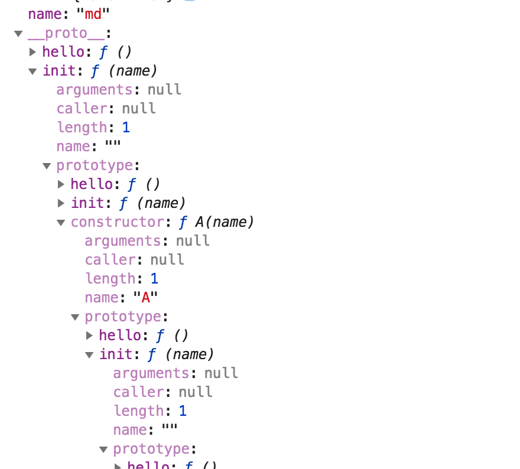

# jquery 的无 new 构造

一般的 `class` 在声明之后, 需要 `new className` 来创建对象, 然后调用方法, 然而在 `Jquery` 中使用 `$(selector)` 就可以直接调用方法, 因此应该是直接返回了一个 `Jquery` 实例.

``` js
var JQuery = function(selector, context) {
    return new JQuery(selector, context)
}
```

这样是不可以的. 我们都知道构造函数, 返回的是创建的那个实例, 即 `className.prototype` 的拷贝. 那么换个思路, 在 `JQuery` 上额外挂在一个方法 `init` , 让这个方法返回 `this` , 即 `jQuery` 对象, 那么 `new jQuery.prototype.init()` 就会返回一个对象(这个对象没有 `jQuery.prototype` 上挂载的方法)

``` js
var jQuery = function(selector, context) {
    return new jQuery.prototype.init(selector, context);
}
jQuery.prototype = {
    constructor: jQuery,
    init: function(selector, context) {
        // return 不是必须的, 因为作为一个构造函数, 默认会返回 this, 即 new 后生成的实例对象.
        return this;
    },
    hello: function() {
        console.log('hello')
    }
}
```

然后将 `jQuery.prototype.init.prototype` 指向 `jQuery.prototype` 

``` js
jQuery.prototype.init.prototype = jQuery.prototype;
```



会发现 `init.prototype` 是一个循环的指向.

