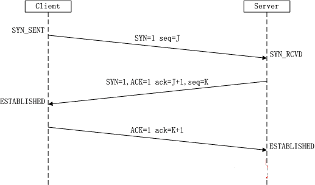
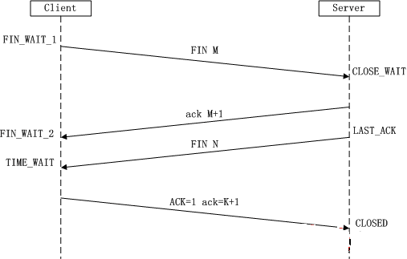
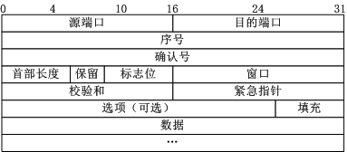

<!--
Created: Mon Aug 26 2019 15:17:24 GMT+0800 (China Standard Time)
Modified: Fri Dec 27 2019 15:30:48 GMT+0800 (China Standard Time)
-->

# 了解http

都是很浅显的基础知识, 开发中常常会遇到
[link](https://juejin.im/post/5df7aef2e51d45582f583bbf)

每个 HTTP 传输都要依次经过应用层, 传输层, 网络层, 链路层, (传输目标的)链路层, (传输目标的)网络层, (传输目标的)传输层和(传输目标的)的应用层.

TCP(Transmission Control Protocol)　传输控制协议. 是一种面向连接的, 可靠的, 基于字节流的传输层通信协议.

TCP协议依赖3次握手, 完成链接, 采用三次握手是为了保证数据的可靠和完整性.

TCP同样有4次挥手用于断开链接, 客户端和服务器都可以主动执行.

## 三次握手

SYN(synchronous建立联机) 

ACK(acknowledgement 确认)

PSH(push传送) 

FIN(finish结束)

RST(reset重置)

URG(urgent紧急)

Sequence number(顺序号码)

Acknowledge number(确认号码) 

establish  建立, 创建

1. 第一次握手: Client将标志位SYN置为1, 随机产生一个值seq=J, 并将该数据包发送给Server, Client进入SYN_SENT状态, 等待Server确认.

2. 第二次握手: Server收到数据包后由标志位SYN=1知道Client请求建立连接, Server将标志位SYN和ACK都置为1, ack (number )=J+1, 随机产生一个值seq=K, 并将该数据包发送给Client以确认连接请求, Server进入SYN_RCVD状态.

3. 第三次握手: Client收到确认后, 检查ack是否为J+1, ACK是否为1, 如果正确则将标志位ACK置为1, ack=K+1, 并将该数据包发送给Server, Server检查ack是否为K+1, ACK是否为1, 如果正确则连接建立成功, Client和Server进入ESTABLISHED状态, 完成三次握手, 随后Client与Server之间可以开始传输数据了.

### 为什么需要三次握手? 而不是两次.

两次握手就可以完成, 为撒需要三次了?
因为这是为了防止出现失效的连接请求报文段被服务端接收的情况, 从而产生错误.
可以想象如下场景. 客户端发送了一个连接请求 A, 但是因为网络原因造成了超时, 这时 TCP 会启动超时重传的机制再次发送一个连接请求 B. 此时请求顺利到达服务端, 服务端应答完就建立了请求, 然后接收数据后释放了连接.
假设这时候连接请求 A 在两端关闭后终于抵达了服务端, 那么此时服务端会认为客户端又需要建立 TCP 连接, 从而应答了该请求并进入 ESTABLISHED 状态. 但是客户端其实是 CLOSED 的状态, 那么就会导致服务端一直等待, 造成资源的浪费.

## 四次挥手

由于TCP连接是全双工的, 因此, 每个方向都必须要单独进行关闭, 这一原则是当一方完成数据发送任务后, 发送一个FIN来终止这一方向的连接, 收到一个FIN只是意味着这一方向上没有数据流动了, 即不会再收到数据了, 但是在这个TCP连接上仍然能够发送数据, 直到这一方向也发送了FIN. 首先进行关闭的一方将执行主动关闭, 而另一方则执行被动关闭.

(1)第一次挥手: Client发送一个FIN, 用来关闭Client到Server的数据传送, Client进入FIN_WAIT_1状态.

(2)第二次挥手: Server收到FIN后, 发送一个ACK给Client, 确认序号为收到序号+1(与SYN相同, 一个FIN占用一个序号), Server进入CLOSE_WAIT状态.

(3)第三次挥手: Server发送一个FIN, 用来关闭Server到Client的数据传送, Server进入LAST_ACK状态.

(4)第四次挥手: Client收到FIN后, Client进入TIME_WAIT状态, 接着发送一个ACK给Server, 确认序号为收到序号+1, Server进入CLOSED状态, 完成四次挥手.

### 为什么要四次挥手? 

TCP协议是一种面向连接的, 可靠的, 基于字节流的运输层通信协议. TCP是全双工模式, 这就意味着, 当主机1发出FIN报文段时, 只是表示主机1已经没有数据要发送了, 主机1告诉主机2, 它的数据已经全部发送完毕了; 但是, 这个时候主机1还是可以接受来自主机2的数据; 当主机2返回ACK报文段时, 表示它已经知道主机1没有数据发送了, 但是主机2还是可以发送数据到主机1的; 当主机2也发送了FIN报文段时, 这个时候就表示主机2也没有数据要发送了, 就会告诉主机1, 我也没有数据要发送了, 之后彼此就会愉快的中断这次TCP连接.

1. 第一次握手

如客户端认为数据发送完成, 需要向服务端发送释放连接的请求. 客户端进入FIN_WAIT_1状态.

2. 第二次握手

服务端接收到客户端的连接释放请求, 会告诉应用层要释放TCP连接. 然后发送ACK到客户端, 然后进入CLOSE_WAIT状态. 此时表明客户端到服务端的连接已经释放, 不会接受来自客户端的数据了, 但是由于TCP是全双工. 所以此时服务端还可以向客户端发送数据.

3. 第三次握手

服务端如果在此时数据还没有发送完成, 会继续发送, 在数据发送完毕之后. 服务端会向客户端发送连接释放的请求. 然后服务端进入LAST_ACK状态.

4. 第四次握手

客户端在接受到服务端的释放请求. 会向服务端在发送一个确认请求. 此时客户端进入TIME_WAIT状态
该状态会持续 2MSL(最大段生存期, 指报文段在网络中生存的时间, 超时会被抛弃) 时间, 若该时间段内没有 服务端的重发请求的话, 就进入 CLOSED 状态. 当 客户端收到确认应答后, 也便进入 CLOSED 状态.

### tcp报文

(1)序号: Seq序号, 占32位, 用来标识从TCP源端向目的端发送的字节流, 发起方发送数据时对此进行标记.

(2)确认序号: Ack序号, 占32位, 只有ACK标志位为1时, 确认序号字段才有效, Ack=Seq+1.

(3)标志位: 共6个, 即URG, ACK, PSH, RST, SYN, FIN等, 具体含义如下: 

(A)URG: 紧急指针(urgent pointer)有效.

(B)ACK: 确认序号有效.

(C)PSH: 接收方应该尽快将这个报文交给应用层.

(D)RST: 重置连接.

(E)SYN: 发起一个新连接.

(F)FIN: 释放一个连接.

### 为什么建立连接是三次握手, 而关闭连接却是四次挥手呢? 

这是因为服务端在LISTEN状态下, 收到建立连接请求的SYN报文后, 把ACK和SYN放在一个报文里发送给客户端. 而关闭连接时, 当收到对方的FIN报文时, 仅仅表示对方不再发送数据了但是还能接收数据, 己方也未必全部数据都发送给对方了, 所以己方可以立即close, 也可以发送一些数据给对方后, 再发送FIN报文给对方来表示同意现在关闭连接, 因此, 己方ACK和FIN一般都会分开发送.

## http 信息

http 即 超文本传输协议, 主要有request和response

其中, requset消息内容如下: 

1. 报文首部, 起始行为请求行, 包括方法和协议类型(如GET/HTTP/1.1) 然后是各种非必需的首部字段(如Host、 userAgent)
2. 请求实体, 并非必需
3. CR + LF

response 如下: 

1. 报文首部, 起始行为状态行包括http协议版本号, 响应状态码, 和响应状态消息
2. CR + LF
3. 报文主体

* 200 ok: 最常见的就是成功响应状态码200了, 这表明该请求被成功地完成, 所请求的资源发送回客户端. 上面打开项目主页的实例中就是200
* 304 not modified: 假如我们打开主页后在浏览器中刷新, 就会看到响应的状态码变成了304, 这代表之前响应的html文档已经被缓存了, 服务器端相同的文档没有变化, 可以继续使用缓存的文档, 因此304响应没有response body部分
* 302 found: 重定向, 新的URL会在response header中的Location中返回, 浏览器将会自动使用新的URL发出新的Request, 假如我们在登录页提交登录表单发送一个POST请求进行登录, 就会得到一个302响应并且重定向到/index路径下
* 404 not found: 请求资源不存在(输错了URL, 或者服务器端现在没有这个页面了)
* 500 Internal Server Error: 服务器发生了不可预期的错误, 这个一般在会在服务器的程序码出错时发生.

## https 和 http

在HTTP(应用层) 和TCP(传输层)之间插入一个SSL协议, 就变成https了.

https 是安全超文本传输协议, 比http多了个secure, 通过TLS(SSL)加密, 这个的基本原理使使用RSA密钥的公钥, 私钥加密.

http默认使80端口, https默认443端口.

## HTTP/2.0 和 HTTP/1.x

HTTP/1.1协议下, 浏览器客户端在同一时间, 针对同一域名下的请求有一定数量限制. 超过限制数目的请求会被阻塞.

但是HTTP/2.0有 `多路复用` , 允许同时通过单一的 HTTP/2 连接发起多重的请求-响应消息, 同一个域的服务器只建立一次TCP连接, 加载多个资源, 使用二进制帧传输, 同时会对http头部进行压缩. 这也是很多大公司拥有多个静态cdn的原因, 在资源加载的时候会提高很多效率.

## QUIC

这是google开发的一种实验性的传输层网络传输协议. QUIC使用UDP协议, 它在两个端点间创建连接, 且支持多路复用连接

