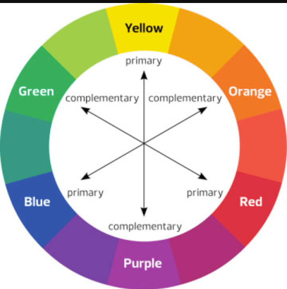
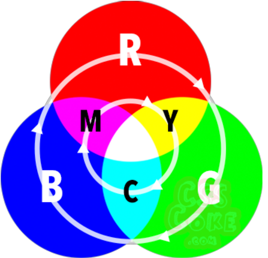
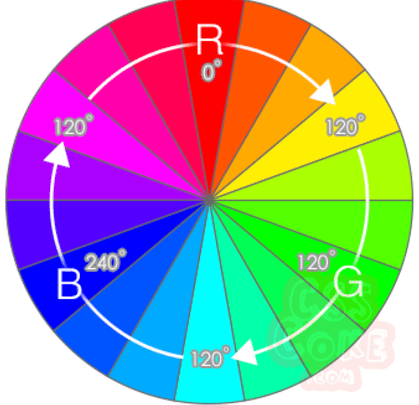

# 色彩玄学

> 作为一个前端开发者, 对美还是得有些了解, 先不说各种设计风格, 色彩搭配之类还是稍微知道点, 这样自己做出来的网站也不至于太丑. 

颜色一般有三种表现方式: 十六位进制六位编码(#abcdef), rgb色值(rgb(255, 0, 0)), 以及hsl色标(hsl(120, 100%, 50%)). 

---

## 色彩互补



## rgb

先说最简单的, rgb即是色光的三原色(red, green, blue), 由0到255这256个数值表示强弱, 0代表最小, 255代表最大, 所以0, 0, 0表示黑色. 



> ps: 色彩的三原色是red, yellow, blue, 色光的三原色叠加可以得到白色, 而色彩三原色得到黑色

## 十六位进制六位编码

这个起始就是上面rgb的变种, 为啥用255代表颜色最大值呢? 因为16进制两位数表示的最大值就是255(16×16-1), 所以

``` js
#
(R) 00(G) 00(B) 00
```

因此, 知道rgb值, 可以通过toString(16)来转换为16进制的值如: 

``` js
const rgb = [255, 127, 1];
const hex = 'ff7f01';
//转换rgb到hex
function rgbToHex(rgb) {
    let col = '';
    //应当验证输入的合法性。 
    rgb.forEach((e) => {
        col += e.toString(16).padStart(2, '0')
    })
    return col;
}
//转换hex到rgb
function hexToRgb(hex) {
    const arr = [];
    //应当验证输入的合法性
    const l = [...hex];
    for (let i = 0; i < 3; i++) {
        arr.push(l[2 * i] + l[2 * i + 1])
    }
    return arr.map((e) => parseInt(e, 16))
}
```

## hsl

说实在的, rgb方式不是很直观, 可能许多人不知道红色和绿色叠加使黄色, 因此出现了hsl色标. 



### h(色相)

色相的0度为R(红)色, 120度为G(绿)色, 240度为B(蓝)色

### s (饱和度)

饱和度越高越鲜艳, 越低就越偏向灰色, 正常值是100% . 

### l (亮度)

亮度越高越偏向白色, 越低越偏向黑色, 正常值是50% . 

这个从某种意义上来说是更加符合人的直观感受的, 也是可以使用在网页中的. 

``` js
//随机色获取
function rdmColor() {
    return `#${Math.round(Math.random()*16777215).toString(16)}` ;
}

function _rdmColor() {
    let colorStr = '0123456789abcdef';
    const arr = ['#'];
    for (let i = 0; i < 6; i++) {
        arr.push(colorStr[Math.floor(Math.random() * 16)])
    }
    return arr.join
}
```

