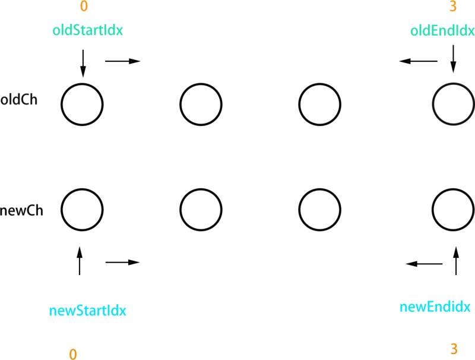

# virtual dom and diff

## virtual dom

### define

首先, `virtual dom` 的出现比vue, react之类都要早, 是为了提高开发的效率, 统一复杂的浏览器环境提出的方案, 正如jq是为了统一不通浏览器复杂的dom操作而实现一样, 便利, 以及一些意义上地提高浏览器 `repaint` 或者 `reflow` 的开销.

在复杂又频繁的一些dom操作中, 虽然可以通过一些手段来降低开销, 但始终不如使用虚拟节点来的节约, 将dom操作改变为js操作, 大大提高了浏览器的效率. 

> 很多时候手工优化dom确实会比 `virtual dom` 效率高, 对于比较简单的dom结构用手工优化没有问题, 但当页面结构很庞大, 结构很复杂时, 手工优化会花去大量时间, 而且可维护性也不高, 不能保证每个人都有手工优化的能力. 至此, `virtual dom` 的解决方案应运而生, `virtual dom` 很多时候都不是最优的操作, 但它具有普适性, 在效率、可维护性之间达平衡. `virtual dom` 另一个重大意义就是提供一个中间层, js去写ui, ios安卓之类的负责渲染, 就像reactNative一样.

1. DOM 引擎、JS 引擎 相互独立, 但又工作在同一线程(主线程)
2. JS 代码调用 DOM API 必须 挂起 JS 引擎、转换传入参数数据、激活 DOM 引擎, DOM 重绘后再转换可能有的返回值, 最后激活 JS 引擎并继续执行
3. 若有频繁的 DOM API 调用, 且浏览器厂商不做"批量处理"优化, 引擎间切换的单位代价将迅速积累
4. 若其中有强制重绘的 DOM API 调用, 不但厂商费尽心机做的"批量处理"优化被中断, 重新计算布局、重新绘制图像会引起更大的性能消耗

所以, 降低引擎切换频率、减小 DOM 变更规模才是评判各种 DOM 性能优化方案的关键! React 首创的 Virtual DOM 是 JS 对象树, 也有 DOM diff 算法, 符合上述关键条件, 优化了 DOM 渲染时间; 但正因为要一定程度上模拟 DOM 树, 内存占用自然更高. 但 Facebook 在不止一种优化方案中采用 vDOM, 其目标更多在于让它作为一个兼容层, 开发 React Native 这样的跨平台 UI 库, 方便各种非 Web 系统对接.

### design

首先需要定义一个数据结构来表示dom节点

``` js
class Vnode {
  constructor(obj) {
    this.el = obj.el;
    this.tag = obj.tag;
    this.sel = obj.sel;
    this.data = obj.data;
    this.children = obj.children;
    this.text = obj.text;
  }
}
```

那么这样的结构生成的dom树应该是这样的:

``` js
new Vnode('div', {
    attrs: {
      'class': 'banner'
    }
  },
  [
    new Vnode('p', {
        attrs: {
          'class': 'bannername',
        }
      },
      new Vnode(undefined, undefined, undefined, 'hello')
    ),
    new Vnode('img', {
      attrs: {
        'src': 'http://example.com/image.jpg'
      }
    })
  ]
)
```

根据这样一个虚拟的dom树就可以使用 `createElement` 方法来遍历, 实现真实的节点. 

``` js
function _createElement(vnode, p) {
  const le = document.createElement(vnode.tag)
  le.appendChild(document.createTextNode(vnode.text))
  if (vnode.el) {
    document.querySelector(p).appendChild(le)
  } else if (p) {
    document.querySelector(p).appendChild(le)
  }
  if (vnode.data) {
    for (key in vnode.data) {
      le.setAttribute(key, vnode.data[key])
    }
  }
  if (vnode.children.length > 0) {
    vnode.children.map(e => _createElement(e, vnode.sel))
  }
}
```

而对于真正的 `virtual dom` 的实现会多了很多的标记

``` js
{
  el: div //对真实的节点的引用，本例中就是document.querySelector('#id.classA')
  tagName: 'DIV', //节点的标签
  sel: 'div#v.classA' //节点的选择器
  data: null, // 一个存储节点属性的对象，对应节点的el[prop]属性，例如onclick , style
  children: [], //存储子节点的数组，每个子节点也是vnode结构
  text: null, //如果是文本节点，对应文本节点的textContent，否则为null
}
```

## diff

vue的diff算法, 基本和react大同小异, 只会在同层级比较不会跨层比较.


### 代码分析

文中的代码位于[aoy-diff](https://github.com/aooy/aoy/blob/master/src/vdom/diff.js)中, 已经精简了很多代码, 留下最核心的部分.

diff的过程就是调用patch函数, 就像打补丁一样修改真实dom.

``` js
function patch(oldVnode, vnode) {
  if (sameVnode(oldVnode, vnode)) {
    patchVnode(oldVnode, vnode)
  } else {
    const oEl = oldVnode.el
    let parentEle = api.parentNode(oEl)
    createEle(vnode)
    if (parentEle !== null) {
      api.insertBefore(parentEle, vnode.el, api.nextSibling(oEl))
      api.removeChild(parentEle, oldVnode.el)
      oldVnode = null
    }
  }
  return vnode
}
```

patch函数有两个参数, vnode和oldVnode, 也就是新旧两个虚拟节点. 在这之前, 我们先了解完整的vnode都有什么属性, 举个一个简单的例子:

``` js
// body下的 <div id="v" class="classA"><div> 对应的 oldVnode 就是
{
  el: div //对真实的节点的引用，本例中就是document.querySelector('#id.classA')
  tagName: 'DIV', //节点的标签
  sel: 'div#v.classA' //节点的选择器
  data: null, // 一个存储节点属性的对象，对应节点的el[prop]属性，例如onclick , style
  children: [], //存储子节点的数组，每个子节点也是vnode结构
  text: null, //如果是文本节点，对应文本节点的textContent，否则为null
}
```

需要注意的是, el属性引用的是此 virtual dom对应的真实dom, patch的vnode参数的el最初是null, 因为patch之前它还没有对应的真实dom.

来到patch的第一部分, 

``` js
if (sameVnode(oldVnode, vnode)) {
  patchVnode(oldVnode, vnode)
}
```

sameVnode函数就是看这两个节点是否值得比较, 代码相当简单:

``` js
function sameVnode(oldVnode, vnode) {
  return vnode.key === oldVnode.key && vnode.sel === oldVnode.sel
}
```

两个vnode的key和sel相同才去比较它们, 比如p和span, div.classA和div.classB都被认为是不同结构而不去比较它们.

如果值得比较会执行patchVnode(oldVnode, vnode), 稍后会详细讲patchVnode函数.

当节点不值得比较, 进入else中

``` js
else {
  const oEl = oldVnode.el
  let parentEle = api.parentNode(oEl)
  createEle(vnode)
  if (parentEle !== null) {
    api.insertBefore(parentEle, vnode.el, api.nextSibling(oEl))
    api.removeChild(parentEle, oldVnode.el)
    oldVnode = null
  }
}
```

过程如下:

取得oldvnode.el的父节点, parentEle是真实dom

createEle(vnode)会为vnode创建它的真实dom, 令vnode.el =真实dom

parentEle将新的dom插入, 移除旧的dom
当不值得比较时, 新节点直接把老节点整个替换了

最后

``` js
return vnode
```

patch最后会返回vnode, vnode和进入patch之前的不同在哪?
没错, 就是vnode.el, 唯一的改变就是之前vnode.el = null, 而现在它引用的是对应的真实dom.

``` js
var oldVnode = patch(oldVnode, vnode)
```

至此完成一个patch过程.

#### patchVnode

两个节点值得比较时, 会调用patchVnode函数

``` js
patchVnode(oldVnode, vnode) {
  const el = vnode.el = oldVnode.el
  let i, oldCh = oldVnode.children,
    ch = vnode.children
  if (oldVnode === vnode) return
  if (oldVnode.text !== null && vnode.text !== null && oldVnode.text !== vnode.text) {
    api.setTextContent(el, vnode.text)
  } else {
    updateEle(el, vnode, oldVnode)
    if (oldCh && ch && oldCh !== ch) {
      updateChildren(el, oldCh, ch)
    } else if (ch) {
      createEle(vnode) //create el's children dom
    } else if (oldCh) {
      api.removeChildren(el)
    }
  }
}
```

const el = vnode.el = oldVnode.el 这是很重要的一步, 让vnode.el引用到现在的真实dom, 当el修改时, vnode.el会同步变化.

节点的比较有5种情况

* if (oldVnode === vnode), 他们的引用一致, 可以认为没有变化.
* if(oldVnode.text !== null && vnode.text !== null && oldVnode.text !== vnode.text), 文本节点的比较, 需要修改, 则会调用Node.textContent = vnode.text.
* if( oldCh && ch && oldCh !== ch ), 两个节点都有子节点, 而且它们不一样, 这样我们会调用updateChildren函数比较子节点, 这是diff的核心, 后边会讲到.
* else if (ch), 只有新的节点有子节点, 调用createEle(vnode), vnode.el已经引用了老的dom节点, createEle函数会在老dom节点上添加子节点.
* else if (oldCh), 新节点没有子节点, 老节点有子节点, 直接删除老节点.

#### updateChildren

``` js
updateChildren(parentElm, oldCh, newCh) {
  let oldStartIdx = 0,
    newStartIdx = 0
  let oldEndIdx = oldCh.length - 1
  let oldStartVnode = oldCh[0]
  let oldEndVnode = oldCh[oldEndIdx]
  let newEndIdx = newCh.length - 1
  let newStartVnode = newCh[0]
  let newEndVnode = newCh[newEndIdx]
  let oldKeyToIdx
  let idxInOld
  let elmToMove
  let before
  while (oldStartIdx <= oldEndIdx && newStartIdx <= newEndIdx) {
    if (oldStartVnode == null) { //对于vnode.key的比较，会把oldVnode = null
      oldStartVnode = oldCh[++oldStartIdx]
    } else if (oldEndVnode == null) {
      oldEndVnode = oldCh[--oldEndIdx]
    } else if (newStartVnode == null) {
      newStartVnode = newCh[++newStartIdx]
    } else if (newEndVnode == null) {
      newEndVnode = newCh[--newEndIdx]
    } else if (sameVnode(oldStartVnode, newStartVnode)) {
      patchVnode(oldStartVnode, newStartVnode)
      oldStartVnode = oldCh[++oldStartIdx]
      newStartVnode = newCh[++newStartIdx]
    } else if (sameVnode(oldEndVnode, newEndVnode)) {
      patchVnode(oldEndVnode, newEndVnode)
      oldEndVnode = oldCh[--oldEndIdx]
      newEndVnode = newCh[--newEndIdx]
    } else if (sameVnode(oldStartVnode, newEndVnode)) {
      patchVnode(oldStartVnode, newEndVnode)
      api.insertBefore(parentElm, oldStartVnode.el, api.nextSibling(oldEndVnode.el))
      oldStartVnode = oldCh[++oldStartIdx]
      newEndVnode = newCh[--newEndIdx]
    } else if (sameVnode(oldEndVnode, newStartVnode)) {
      patchVnode(oldEndVnode, newStartVnode)
      api.insertBefore(parentElm, oldEndVnode.el, oldStartVnode.el)
      oldEndVnode = oldCh[--oldEndIdx]
      newStartVnode = newCh[++newStartIdx]
    } else {
      // 使用key时的比较
      if (oldKeyToIdx === undefined) {
        oldKeyToIdx = createKeyToOldIdx(oldCh, oldStartIdx, oldEndIdx) // 有key生成index表
      }
      idxInOld = oldKeyToIdx[newStartVnode.key]
      if (!idxInOld) {
        api.insertBefore(parentElm, createEle(newStartVnode).el, oldStartVnode.el)
        newStartVnode = newCh[++newStartIdx]
      } else {
        elmToMove = oldCh[idxInOld]
        if (elmToMove.sel !== newStartVnode.sel) {
          api.insertBefore(parentElm, createEle(newStartVnode).el, oldStartVnode.el)
        } else {
          patchVnode(elmToMove, newStartVnode)
          oldCh[idxInOld] = null
          api.insertBefore(parentElm, elmToMove.el, oldStartVnode.el)
        }
        newStartVnode = newCh[++newStartIdx]
      }
    }
  }
  if (oldStartIdx > oldEndIdx) {
    before = newCh[newEndIdx + 1] == null ? null : newCh[newEndIdx + 1].el
    addVnodes(parentElm, before, newCh, newStartIdx, newEndIdx)
  } else if (newStartIdx > newEndIdx) {
    removeVnodes(parentElm, oldCh, oldStartIdx, oldEndIdx)
  }
}
```

代码很密集, 为了形象的描述这个过程, 可以看看这张图.



过程可以概括为:oldCh和newCh各有两个头尾的变量StartIdx和EndIdx, 它们的2个变量相互比较, 一共有4种比较方式. 如果4种比较都没匹配, 如果设置了key, 就会用key进行比较, 在比较的过程中, 变量会往中间靠, 一旦StartIdx>EndIdx表明oldCh和newCh至少有一个已经遍历完了, 就会结束比较.

1. 将oldStartIdx, oldEndIdx, newStartIdx, newEndIdx分别指向同层新旧vnode的首尾, 然后随着比较而逐渐往中间移动, 对4个节点进行比较, 会有4种比较结果, (oldStartIdx和newStartIdx或newEndIdx指向同一节点, oldEndIdx和newStartIdx或newEndIdx指向同一节点这四种), 根据4个节点的的4种比较结果做相应的操作, 比如当出现oldStartIdx和newStartIdx指向同一节点这个结果时, 表示这个节点不需要进行移位操作, 直接调用patchVnode进行进一步比较, 又比如出现oldStartIdx和newEndIdx指向同一节点这一结果, 那么表示oldStartIdx指向的节点需要移动到oldEndIdx后面去, 然后再对他们调用patchVnode进行进一步比较.
2. 如果4种结果都不是, 调用createKeyToOldIndex 方法, 创建一个key与oldIndex之间的映射的map, 查看newStartVnode.key是否有对应的oldVnode, 如果有, 说明oldvnode移动到了oldStartVnode前面, 然后将对应的oldVnode插入到oldStartVnode前面, 如果没有, 说明在当前newStartVnode是新创建得节点, 在oldStartVnode前面插入该节点.
3. 判断是否一方已遍历完, 对真实dom进行相应的删减或添加.

#### 具体的diff分析

设置key和不设置key的区别:

不设key, newCh和oldCh只会进行头尾两端的相互比较, 设key后, 除了头尾两端的比较外, 还会从用key生成的对象oldKeyToIdx中查找匹配的节点, 所以为节点设置key可以更高效的利用dom.

diff的遍历过程中, 只要是对dom进行的操作都调用api.insertBefore, api.insertBefore只是原生insertBefore的简单封装.
比较分为两种, 一种是有vnode.key的, 一种是没有的. 但这两种比较对真实dom的操作是一致的.

对于与sameVnode(oldStartVnode, newStartVnode)和sameVnode(oldEndVnode, newEndVnode)为true的情况, 不需要对dom进行移动.

