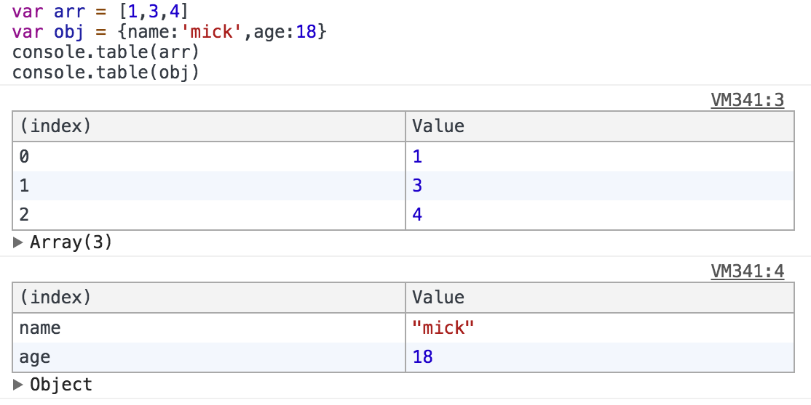

<!--
Created: Mon Aug 26 2019 15:19:38 GMT+0800 (China Standard Time)
Modified: Mon Aug 26 2019 15:19:38 GMT+0800 (China Standard Time)
-->
# console

##### normal

console.log 用于输出普通信息

console.info 用于输出提示性信息

console.error 用于输出错误信息

console.warn 用于输出警示信息 


##### group

console.group 输出一组信息的开头

console.groupEnd 结束一组输出信息 


##### assert

console.assert 对输入的表达式进行断言, 只有表达式为false时, 才输出相应的信息到控制台 


##### count

console.count (这个方法非常实用哦)当你想统计代码被执行的次数 


##### dir

console.dir (这个方法是我经常使用的 可不知道比for in方便了多少) 直接将该DOM结点以DOM树的结构进行输出, 可以详细查对象的方法发展等等 

##### time

console.time 计时开始

console.timeEnd 计时结束(看了下面的图你瞬间就感受到它的厉害了) 


##### profile

console.profile 和 console.profileEnd 配合一起使用来查看CPU使用相关信息 


##### table

console.table 可以表格形式输出Array and Object , 但无法输出Set等. 



###### $_

$_ 命令返回最近一次表达式执行的结果, 功能跟按向上的方向键再回车是一样的 


console.trace

##### Chrome 的 占位文档

| Format Specifier | Description                                                                |
|------------------|----------------------------------------------------------------------------|
| %s               | Formats the value as a string.                                             |
| %d or %i         | Formats the value as an integer.                                           |
| %f               | Formats the value as a floating point value.                               |
| %o               | Formats the value as an expandable DOM element (as in the Elements panel). |
| %O               | Formats the value as an expandable JavaScript object.                      |
| %c               | Formats the output string according to CSS styles you provide.             |

``` js
// 文字
console.log("%c3D Text", " text-shadow: 0 1px 0 #ccc, 0 2px 0 #c9c9c9, 0 3px 0 #bbb, 0 4px 0 #b9b9b9, 0 5px 0 #aaa, 0 6px 1px rgba(0, 0, 0, .1), 0 0 5px rgba(0, 0, 0, .1), 0 1px 3px rgba(0, 0, 0, .3), 0 3px 5px rgba(0, 0, 0, .2), 0 5px 10px rgba(0, 0, 0, .25), 0 10px 10px rgba(0, 0, 0, .2), 0 20px 20px rgba(0, 0, 0, .15); font-size:5em")
// 图片背景
console.log("%c", "display:block; padding:30px 90px; line-height:60px; background-image:url('https://files.cnblogs.com/files/mydia/7ABFD901E6DB857A3C282B95ED1F8674.gif'); ");
```

