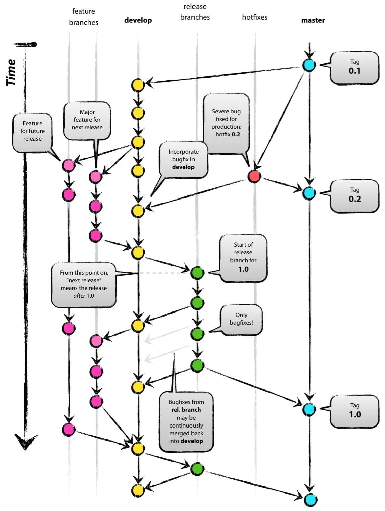

<!--
Created: Mon Aug 26 2019 15:19:49 GMT+0800 (China Standard Time)
Modified: Mon Aug 26 2019 15:19:49 GMT+0800 (China Standard Time)
-->
# git flow

### master

`master` 是主要分支. 

### develop

`develop` 是开发分支. 

### feature

`feature` 是功能分支, 针对不同功能建立不同 `feature` , fininsh 后会和合并到 `develop` 上

### release

`release` 是预发布版本, 会有版本号, 应该从 `develop` 分支上拉出 , 提交以后的bug修复以后, `finish` 后会合并到 `develop` 和 `master` 上, 然后打上 `tag` , 从 `master` 上发布版本

### hotfix

`hotfix` 在 `master` 已经发布版本以后, 从 `master` 上拉出, 修复bug以后, 打上版本号, 如 `v1.0.1f` , 然后 `finish` 后 会合并到 `master` 和 `develop` 上. 

### 图

