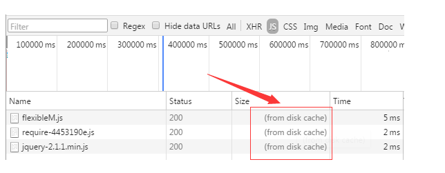

# http 缓存

HTTP报文就是浏览器和服务器间通信时发送及响应的数据块。 
浏览器向服务器请求数据, 发送请求(request)报文; 服务器向浏览器返回数据, 返回响应(response)报文。 
报文信息主要分为两部分

1.包含属性的首部(header)

附加信息(cookie, 缓存信息等)与缓存相关的规则信息, 均包含在header中

2.包含数据的主体部分(body)

HTTP请求真正想要传输的部分

浏览器有一个缓存数据库, 保存缓存信息。 

分为两种缓存规则

### 强制缓存

客户端访问缓存数据库, 有缓存数据且没有失效, 直接返回缓存数据。 

如果没有缓存数据或者失效了, 客户端就会访问服务器, 获取数据和缓存规则, 并将数据和缓存规则放入缓存服务器。 

### 对比缓存

客户端从缓存服务器获取缓存数据的标志, 再向服务器请求, 验证缓存标志的数据是否失效, 如果没有失效, 客户端就会从缓存服务器获取缓存数据。 

如果失效了, 客户端就从服务器获取最新的数据和缓存规则, 再将缓存规则和数据放入缓存服务器。 

两类缓存规则可以同时存在, 强制缓存优先级高于对比缓存, 也就是说, 当执行强制缓存的规则时, 如果缓存生效, 直接使用缓存, 不再执行对比缓存规则。 

### 判断强制缓存是否失效

第一次从服务器获得数据的时候, 缓存信息就在响应头Header中。 Header里有两个字段表明(Expires/Cache-Control)。 

#### Expires

为到期时间, 但因为服务器与客户端的时间可能不一致, 所以被渐渐弃用了。 

#### Cache-Control

值为 `max-age = xxx` 缓存的内容在xxx秒之后失效。 

    response.setHeader("Cache-Control", "max-age=6000"); 

### 判断对比缓存是否失效

第一次访问: 

下一次访问: 

对比缓存生效之后, 请求内容大大减少, 只会返回header的大小。 

#### Last-Modified  /  If-Modified-Since

Last-Modified: 服务器在响应请求时, 告诉浏览器资源的最后修改时间。 

If-Modified-Since: 再次请求服务器时, 通过此字段通知服务器上次请求时, 服务器返回的资源最后修改时间。 

#### Etag  /  If-None-Match

Etag: 服务器响应请求时, 告诉浏览器当前资源在服务器的唯一标识(生成规则由服务器决定)。 

If-None-Match: 再次请求服务器时, 通过此字段通知服务器客户段缓存数据的唯一标识。 

