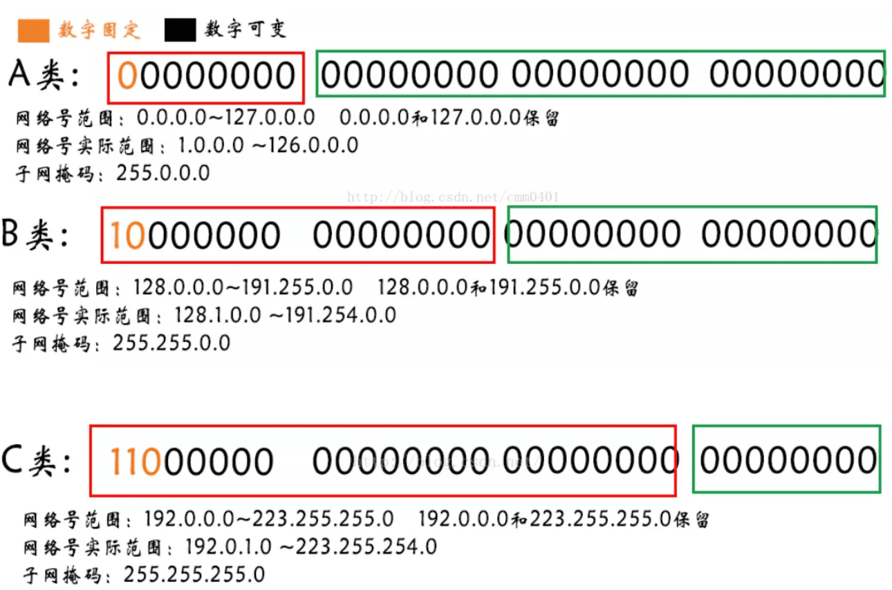
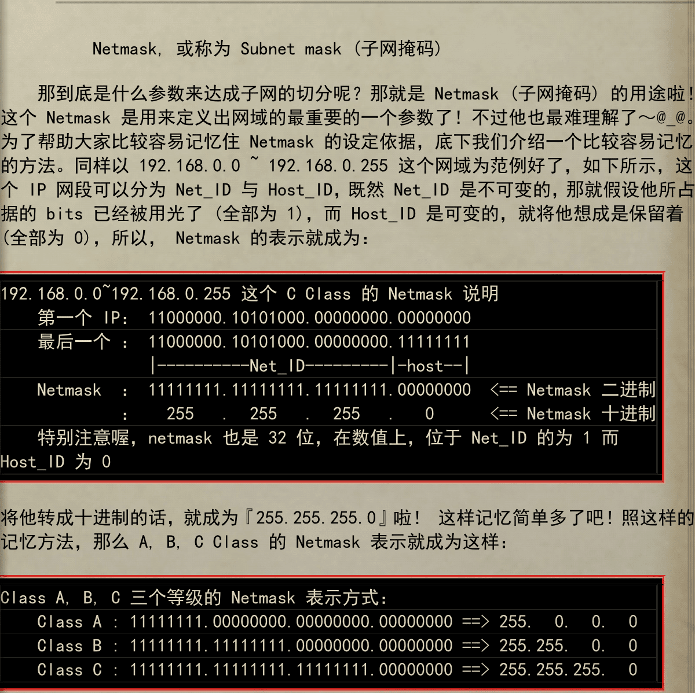
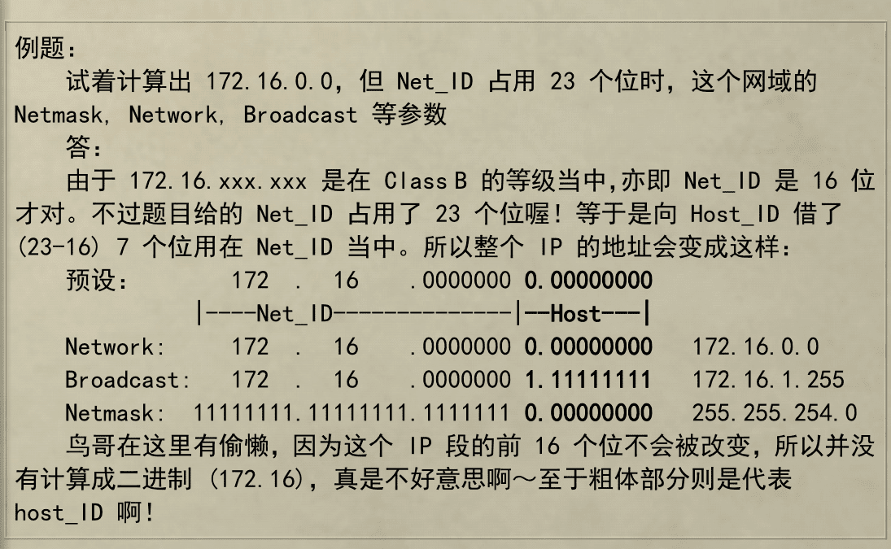

<!--
Created: Mon Aug 26 2019 15:19:59 GMT+0800 (China Standard Time)
Modified: Mon Aug 26 2019 15:19:59 GMT+0800 (China Standard Time)
-->
# About IP Address

ip地址是32bits的数值 

00000000.00000000.00000000.0000000

就是

0.0.0.0

第四个值为0的时候代表整个网段地址(Netword IP), 而为255则代表广播地址(Broadcast IP)

> 可以理解为地址全为0的时候代表, 某个街道, Host_ID代表门牌号, 而255就是街道最后一个, 可以广播消息给街道上的Host.

而拥有同一个Net_ID就是一个局域网内的电脑, 就可以非常快速的通信, 不然就得通过互联网通信.

> 就像同一个街上的Host可以直接送给其它用户, 但是不同街, 就得拜托邮局了.

## 地址分类

A类网络的IP地址范围为1.0.0.1－127.255.255.254; 

B类网络的IP地址范围为: 128.1.0.1－191.255.255.254; 

C类网络的IP地址范围为: 192.0.1.1－223.255.255.254. 

> 回送地址(127.x.x.x)是本机回送地址(Loopback Address)

### A类

一个A类IP地址是指, 在IP地址的四段号码中, 第一段号码为网络号码(Net_ID), 剩下的三段号码为本地计算机的号码(Host_ID). 如果用二进制表示IP地址的话, A类IP地址就由1字节的网络地址和3字节主机地址组成, 网络地址的最高位必须是"0". 

10.0.0.0到10.255.255.255是私有地址(所谓的私有地址就是在互联网上不使用, 而被用在局域网络中的地址). 

127.0.0.0到127.255.255.255是保留地址, 用做循环测试用的. 

### B类

一个B类IP地址是指, 在IP地址的四段号码中, 前两段号码为网络号码, 剩下的两段号码为本地计算机的号码. 

### C类

一个C类IP地址是指, 在IP地址的四段号码中, 前三段号码为网络号码, 剩下的一段号码为本地计算机的号码. 

## 子网(subnet)划分

事实上, A类地址里有 `256*256*256-2 = 16777214` 个Host_ID, 如果作为一个局域网会非常卡顿, 难于管理. 因此往往会再做划分. 通过从Host_ID里借位来划分更多.

以C类地址为例, 

192.168.1.00000000

那么借一位地址, 则

192.168.1.0代表区块1

192.168.1.1代表区块2

那么区块1的范围就是 192.168.1.1~192.168.1.127

区块2的范围就是192.168.1.128~192.168.1.254

## net mask

## example

