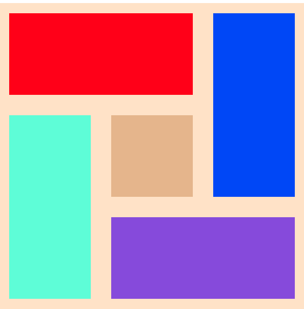

<!--
Created: Mon Aug 26 2019 15:20:17 GMT+0800 (China Standard Time)
Modified: Mon Aug 26 2019 15:20:17 GMT+0800 (China Standard Time)
-->
# Grid

新型布局欢迎来到Grid的世界. 

先说说flex布局, 在一维表现十分优秀的工具, 但是, 在二维的平面上显得略有力不从心(例如, 我需要一个3*3的弹性布局, 一般3个flexBox叠罗汉). 

再说说table布局, 3*3布局什么的就舒服多了, 但姑且不说表格里 `margin` 的不便, 如果需要创建有Z轴堆叠关系的元素, 就无能为力了. 

下面说说挺好用的grid; 

### grid-container

首先 `display: grid` , 然后定义grid的大布局方式. 

`grid-template-rows`  `grid-template-columns` 两个定义了行列的占宽. 

例如这样, 可以取px auto % 还有fr

``` js
grid - template - columns: 40 px 50 px auto 50 px 40 px;
grid - template - rows: 25 % 100 px auto;
```

`grid-template` 是以上两个属性的缩写, 值为 `grid-template-rows` / `grid-template-columns` . 

`grid-gap` 是行列的缝隙的宽度, 值为 `grid-column-gap`  `grid-column-gap` (也可以一个值, 代表均匀宽度). 

`align-items` 和 `jusity-items` 的可选值都是 `start`  `end`  `center`  `stretch` (充满)

`justify-content` : 这个等同flex的 `justify-content` 也有 `space-between/around` 可选. 

> fr是一个新增的自适应单位, 用于在一系列长度值中分配剩余空间, 如果已指定了多个部分, 则剩下的空间根据各自的数字按比例分配. 

### grid-item

`grid-area` 的作用之一如下

grid-area: `row-start` / `column-start` / `row-end` / `column-end` 

用来声明每个 `item` 占的格子大小. 

`align-self` 和 `jusity-self` 的可选值都是 `start`  `end`  `center`  `stretch` (充满) 影响单个元素

让我们来做一个最简单的栗子. 



``` html
<div class="parent">
    <div class="children1">
    </div>
    <div class="children2">
    </div>
    <div class="children3">
    </div>
    <div class="children4">
    </div>
    <div class="children5">
    </div>
</div>
```

``` css
    .parent {
        display: grid;
        width: 300 px;
        height: 300 px;
        grid-template: repeat(3, 1 fr) / 1 fr 1 fr 1 fr;
    }

    .parent div {
        border: 10 px solid bisque;
    }

    .children1 {
        grid-area: 1 / 1 / 2 / 3;
        background: red;
    }

    .children2 {
        grid-area: 1 / 3 / 3 / 4;
        background: blue;
    }

    .children3 {
        grid-row: 3 / span 1;
        grid-column: 2 / span 2;
        background: blueviolet;
    }

    .children4 {
        grid-row: 2 / 4;
        grid-column: 1 / 2;
        background: aquamarine;
    }

    .children5 {
        grid-area: 2 / 2;
        background: burlywood;
    }
```

除了这个, 你还可以这样

``` css
    .parent {
        display: grid;
        width: 300 px;
        height: 300 px;
        grid-template: repeat(3, 1 fr) / 1 fr 1 fr 1 fr;
        grid-template-areas: 'c1 c1 c2'
            'c4 c5 c2'
            'c4 c3 c3';
    }

    .parent div {
        border: 10 px solid bisque;
    }

    .children1 {
        grid-area: c1;
        background: red;
    }

    .children2 {
        grid-area: c2;
        background: blue;
    }

    .children3 {
        grid-area: c3;
        background: blueviolet;
    }

    .children4 {
        grid-area: c4;
        background: aquamarine;
    }

    .children5 {
        grid-area: c5;
        background: burlywood;
    }
```

这个就是 `grid-area` 声明名称的作用

配合上媒体查询, 这是一个适应性布局极为便利的属性. 

``` css
    @media screen and(max-width: 1080 px) {
        .parent {
            grid-template-areas: 'c1 c1 c1'
                'c2 c2 c2'
                'c3 c4 c5';
        }
    }
```

