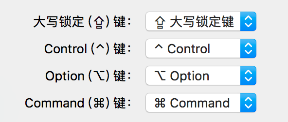

# OSX shortcut

### 键盘

### 最小化

Command+M

### 隐藏

Command+H

### 强制退出

Command-Option-Esc

Command-Q

Command-power 关机

### 截图

Command-Shift-4 截取所选屏幕区域到一个文件　　

Command-Shift-3 截取全部屏幕到文件　　

Command-Shift-Control-3 截取全部屏幕到剪贴板

### 文件

Command-Option-V 剪切文件　　

Command-Shift-N 新建文件夹(New)

Command-Shift-G 调出窗口, 可输入绝对路径直达文件夹(Go)

Command-O 打开所选项. 在Mac里打开文件不像Windows里直接按Enter　　

命令行 `open` 文件 
