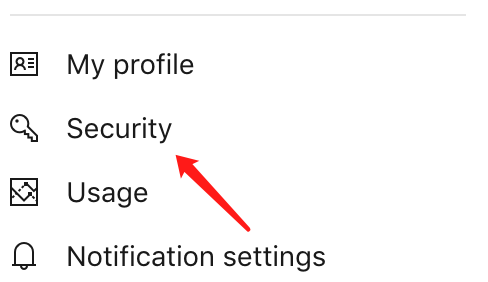

<!--
Created: Mon Aug 26 2019 15:20:43 GMT+0800 (China Standard Time)
Modified: Mon Aug 26 2019 15:20:43 GMT+0800 (China Standard Time)
-->
# vscode markdown格式化的插件编写

这一篇是介绍开发vscode插件的准备过程以及发布过程, ~~总之就是和代码无关啦~~

具体开发流程可以戳[这里]()

### 开发准备

#### 开发工具

1. VS Code
2. nodejs

#### 依赖安装

``` bash
npm install - g yo generator - code
```

这是一个包括cli命令在内的官方开发工具

``` bash
//cli
yo code
```

需要你填写一些信息, 例如项目名字之类.~~随便填~~

其实也就是一些 `package.json` 里的信息, 也可以先对付着, 后面再改.

> 注意: 会让你选择使用 `typescript` 或者 `javascript` , 会依据你的选择创建~~极其相似的~~模版.

以 `typescript` 为例, 生成的目录如下

``` js
file: {
    out: {
        dir: '输出文件目录',
        cd: {
            src: {
                dir: '输出转换后的代码'
            },
            test: {
                dir: '输出测试代码'
            }
        }
    },
    src: {
        dir: '代码目录',
        cd: {
            extension.ts: {
                file: '代码入口'
            }
        }
    }
}
```

#### 开发

在生成的项目目录下, 打开vscode, `command+shift+D` 打开调试模式, 

点击 `Starting Debug` 会打开一个新的VS code窗口, 那个页面就是生效的代码, 每次修改代码后, 需要重新 `Run` .

具体开发流程可以戳[这里]()

### 插件上传

注册->创建团队->创建token->登录账号->发布包->更新包

#### 注册账号

去 [marketPlace](https://marketplace.visualstudio.com/) 注册一个账号用来发布包

"是, 确定......"常规的邮箱注册流程...

#### 创建组织以及PAT(Personal Access Token)

完成注册后, 直接在个人项目[页面](https://dev.azure.com), 直接创建组织(organizations).

然后选择 `Security` 



接着 `add token` , 会自动生成一串token, `organization` 选择 `all accessible organization` , `scope` 选择 `full access` .

> 注意: 生成的token是无法再次打开查看的, 请保存到一个安全的地方, 这是将来你登录自己账户的 `PAT` 

~~为什么我会知道呢? 肯定不可能是我后来发现没法登录, 又重新生成了一个~~

#### 登录账号

``` BASH
vsce create-publisher <publisher name>
```

需要输入邮箱, 和 `PAT` , 接着登录刚才的账号

``` BASH
vsce login <publisher name>
```

至此, 你已经可以开始 `publish` 插件了

``` BASH
vsce publish
```

### token过期

过期只需要重新到[这里](https://aex.dev.azure.com/me?mkt=zh-CN) 生成新的token, 然后执行

``` BASH
vsce login <publisher name>

```

然后将token粘贴即可

