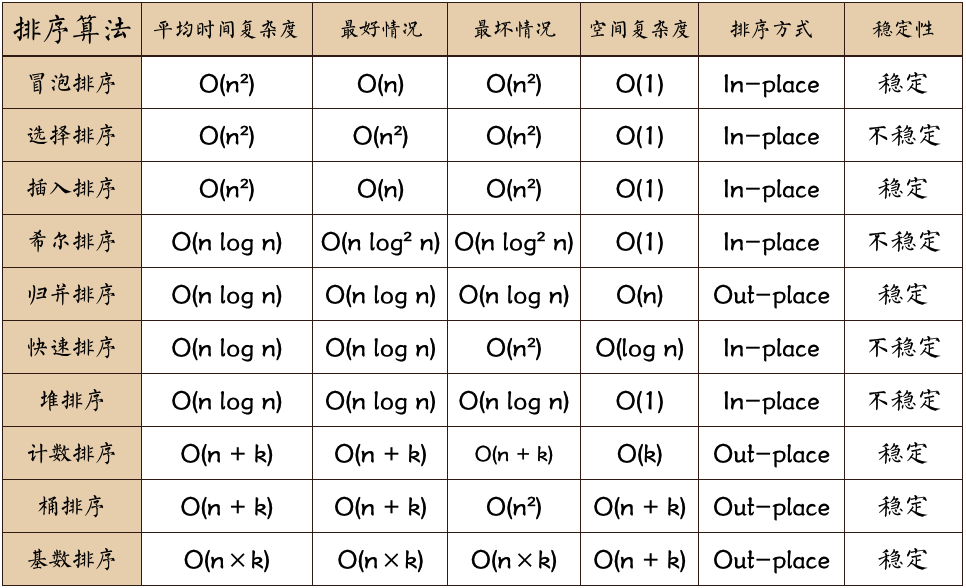

<!--
Created: Mon Aug 26 2019 15:21:22 GMT+0800 (China Standard Time)
Modified: Mon Aug 26 2019 15:21:22 GMT+0800 (China Standard Time)
-->
# 排序

n: 数据规模
k:"桶"的个数
In-place: 占用常数内存, 不占用额外内存
Out-place: 占用额外内存
稳定性: 排序后2个相等键值的顺序和排序之前它们的顺序相同

可视化排序过程[网站](https://visualgo.net/en)

