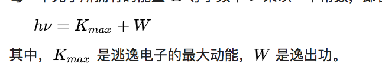

<!--
Created: Mon Aug 26 2019 15:21:29 GMT+0800 (China Standard Time)
Modified: Mon Aug 26 2019 15:21:29 GMT+0800 (China Standard Time)
-->
# 波粒二象性

## 光的波粒二象性

最先被发现具有二象性的是光

光具有波的性质, 由衍射, 干涉等可以证明.

### 光的粒子性 

光电效应指的是, 照射光束于金属表面会使其发射出电子的效应, 发射出的电子称为光电子. 为了产生光电效应, 光频率必须超过金属物质的特征频率, 称为其"底限频率". [8]:1060-1063[9]:1240-1246举例而言, 照射辐照度很微弱的蓝光束于钾金属表面, 只要频率大于其底限频率, 就能使其发射出光电子, 但是无论辐照度多么强烈的红光束, 一旦频率小于钾金属的极限频率, 就无法促使其发射出光电子. 根据光的波动说, 光波的辐照度或波幅对应于所携带的能量, 因而辐照度很强烈的光束一定能提供更多能量将电子逐出. 然而事实与经典理论预期恰巧相反. 

1905年, 爱因斯坦对于光电效应给出解释. 他将光束描述为一群离散的量子, 现称为光子, 而不是连续性波动. 从普朗克黑体辐射定律, 爱因斯坦推论, 组成光束的每一个光子所拥有的能量 E 等于频率 v 乘以一个常数, 即普朗克常数, 他提出了"爱因斯坦光电方程":

假若光子的频率大于物质的极限频率, 则这光子拥有足够能量来克服逸出功, 使得一个电子逃逸, 造成光电效应. 爱因斯坦的论述解释了为什么光电子的能量只与频率有关, 而与辐照度无关. 虽然蓝光的辐照度很微弱, 只要频率足够高, 则会产生一些高能量光子来促使束缚电子逃逸. 尽管红光的辐照度很强烈, 由于频率太低, 无法给出任何高能量光子来促使束缚电子逃逸. 

> 后来德布罗意发现一切微观粒子都具有波粒二象性

## 双缝干涉实验

最早发现电子束通过双缝会产生干涉现象, 证明了波的干涉现象.

有人提出一个想法, 如果每次只发射一个电子, 那么应该就只会有两条线, 然而结果依然是干涉线, 结果令人十分震惊, 因为每个电子不可能知道其他电子是分布到哪里的.

接着, 人们决定一个一个电子观测发射的过程, 这次, 却形成了两条线, 似乎人的观测影响了实验的结果. 当人们不观测的时候, 每个电子以概率波的形式同时穿过了两条缝.

> 其实针对这个问题, 我的观点是或许因为人类的局限导致的, 例如, 在三位空间的直线, 在二维空间看起来是不可捉摸的行为, 也好像引力波在时空里是按照直线走, 但在人类看来, 就是一个椭圆, 有兴趣可以看[这里](https://t.cj.sina.com.cn/articles/view/6871571486/19993dc1e00100gbk6)

在这个实验里, 还出现了一种呼声, 就是唯心论, 仿佛正是因为我观测, 所以月亮才在这里, 因果律也没有了作用, 但其实粒子这个概念不存在, 我们的测量并没有导致波函数严格意义上的坍缩, 只是概率的波峰坍缩到一个范围内, 让我们产生了"粒子"的幻觉. 粒子的所有行为, 都可以用特定的波函数取值来描述. 信息超光速传播或者回到过去, 这个假象只不过是两个波函数的"纠缠态". 

## 纠缠与超距

爱因斯坦认为不会有任何超越光速移动或传递的物质与信息.

然而, 却出现了由一个晶体激发出来的两个光子具有纠缠的特性(自旋, 偏振), 即相关性, 当我得知其中一个偏振为+时, 就可以断定另一个偏振为-, 如果距离够远, 似乎就可以超越光速完成信息传递. 爱因斯坦认为这好比一双手套放在很远的两个盒子里, 无论我们观不观测, 都是一对的, 因此我们打开一个盒子以后就知道另一个盒子里的手套是怎样的, 在这个特性里, 还有我们不知道的隐藏变量w, 导致实验结果如此.

> 爱因斯坦认为上帝不掷骰子, 而波尔持相反的观点.

然而, 贝尔确给出了一个物理证明, 这个实验里没有隐藏变量w, 即有名的贝尔不等式, 也被称作贝尔定理, |Pxz-Pzy|≤1+Pxy. 可以查看[这里](https://www.zhihu.com/question/27037773)里了解贝尔不等式的详细情况.

---

## 后记

量子力学真的十分有趣, 我还会更新的=  =

