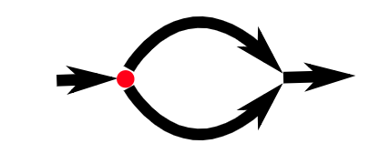
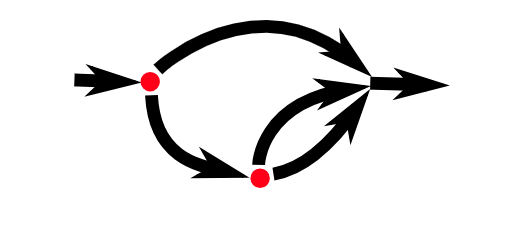

# Program Structure

# 程序结构
And my heart glows bright red under my filmy, translucent skin and they have to administer 10cc of JavaScript to get me to come back. (I respond well to toxins in the blood.) Man, that stuff will kick the peaches right out your gills!

-why, Why's (Poignant) Guide to Ruby

*In this chapter, we will start to do things that can actually be called programming. We will expand our command of the JavaScript language beyond the nouns and sentence fragments we've seen so far, to the point where we can express meaningful prose.*

在这个章节, 我们开始做一些叫做编程的事情. 我们会扩展js语言的命令到我们迄今为止看到的名词和句子片段之外, 直到我们可以表达有意义的.

### Expressions and statements

### 表达式和声明

In Chapter 1, we made values and applied operators to them to get new values. Creating values like this is the main substance of any JavaScript program. But that substance has to be framed in a larger structure to be useful. So that's what we'll cover next.

在第一章节, 我们用一些值和对它们调用操作符产生了新值. 这样创建值是任何js程序的主要内容. 但这样的内容在更大结构里被规范是非常有用的. 这就是我们下面说到的.

A fragment of code that produces a value is called an expression. Every value that is written literally (such as 22 or "psychoanalysis") is an expression. An expression between parentheses is also an expression, as is a binary operator applied to two expressions or a unary operator applied to one.

可以产生值的代码片段叫做表达式. 每个值被字面意思写下来(例如 22 或者 '精神分析') 是一个表达式. 括号内的一个表达式也是表达式, 一个二元操作符调用两个表达式, 或者一个一元操作符调用一个也是如此.

This shows part of the beauty of a language-based interface. *Expressions can contain other expressions in a way similar to how subsentences in human languages are nested—a subsentence can contain its own subsentences, and so on.* This allows us to build expressions that describe arbitrarily complex computations.

这展示了语言基础接口的部分优美. 表达式可以包括其他表达式 就像嵌套人类语言里子句-子句可以包含自己的子句, 等. 这个允许我们建立描述复杂指令的表达式.

If an expression corresponds to a sentence fragment, a JavaScript statement corresponds to a full sentence. A program is a list of statements.

如果一个表达式 对应 一个句子片段, 一个js声明 对应完整的句子. 一个程序是声明的列表.

The simplest kind of statement is an expression with a semicolon after it. This is a program:

最简单的声明类型就是一个句后有个分号表达式. 这是程序:

``` js
1;
!false;
```

It is a useless program, though. An expression can be content to just produce a value, which can then be used by the enclosing code. A statement stands on its own, so it amounts to something only if it affects the world.*It could display something on the screen—that counts as changing the world—or it could change the internal state of the machine in a way that will affect the statements that come after it.* These changes are called side effects. The statements in the previous example just produce the values 1 and true and then immediately throw them away. This leaves no impression on the world at all. When you run this program, nothing observable happens.

尽管这是一个无用的程序. 一个表达式可以仅仅表达得到只可以被闭包代码使用的一个值. 一个声明只是一个声明, 只有在它影响世界的时候才相当于某物. 它可以在屏幕上展示某物--它视为改变世界--或者它改变了机器的内部状态, 从而影响后面的语句. 这些改变被叫做副作用. 前面给出的例子里的声明仅仅得出值1和真, 然后立刻抛开它们. 它们完全没在世界上留下任何影响. 当你运行这个程序, 没有什么明显的事情发生.

In some cases, JavaScript allows you to omit the semicolon at the end of a statement. In other cases, it has to be there, or the next line will be treated as part of the same statement. The rules for when it can be safely omitted are somewhat complex and error-prone. So in this book, every statement that needs a semicolon will always get one. I recommend you do the same, at least until you've learned more about the subtleties of missing semicolons.

在某些情况下, js允许你省略语句结尾的分号. 在其他情况里, 它必须要存在, 否则下一行会被视作同样语句的一部分. 什么时候可以省略它的规则是复杂且容易出错的. 因此, 在这本书里, 每个语句都有一个分号. 我推荐你也这么做, 除非你已经学到足够多关于省略分号的微妙之处.

### Bindings

### 绑定

How does a program keep an internal state? How does it remember things? We have seen how to produce new values from old values, but this does not change the old values, and the new value has to be immediately used or it will dissipate again. To catch and hold values, JavaScript provides a thing called a binding, or variable:

一个程序如何持有一个内部的声明? 它如何记住事物的? 我们已经看到如何从旧值里得到新的值, 但没有改变旧值, 并且新值也要立刻使用, 否则就会消散. 为了抓住并持有值, js提供了一个东西叫做绑定, 或者赋值:

``` js
let caught = 5 * 5;
```

That's a second kind of statement. The special word (keyword) let indicates that this sentence is going to define a binding. It is followed by the name of the binding and, if we want to immediately give it a value, by an = operator and an expression.

这是第二种语句. 特殊词(关键词) let 表示 这个句子会定义一个绑定. 后面跟着绑定的名字, 如果我们想要立刻给它值, 通过一个=操作符和一个表达式.

The previous statement creates a binding called caught and uses it to *grab hold of* the number that is produced by multiplying 5 by 5.

先前的语句创造了一个绑定教 `caught` 并且使用它控制一个5乘5得到的数字.

After a binding has been defined, its name can be used as an expression. The value of such an expression is the value the binding currently holds. Here's an example:

在绑定定义后, 他的名字可以像一个表达式一样使用. 这样一个表达式的值就是绑定当前持有的值. 这里有一个例子:

``` js
let ten = 10;
console.log(ten * ten);
// → 100
```

When a binding points at a value, that does not mean it is tied to that value forever. The = operator can be used at any time on existing bindings to disconnect them from their current value and have them point to a new one.

当一个绑定命中一个值, 不意味着它永远和那个值在一起. = 操作符可以在任何时候使用存在绑定来断开和他们当前值的连接, 并让他们命中一个新值.

``` js
let mood = "light";
console.log(mood);
// → light
mood = "dark";
console.log(mood);
// → dark
```

You should imagine bindings as tentacles, rather than boxes. They do not contain values; they grasp them—two bindings can refer to the same value. A program can access only the values that it still has a reference to. When you need to remember something, you grow a tentacle to hold on to it or you reattach one of your existing tentacles to it.

你应该想象绑定像出售, 而不是盒子. 他们没有任何值; 他们抓住两个绑定可以引用到相同的值上. 一个程序值可以接受它有一个引用的值. 当你需要记住某物, 你生出一条触须来持有它, 否则你就用你已经存在的触须重新接受这个值.

Let's look at another example. To remember the number of dollars that Luigi still owes you, you create a binding. And then when he pays back $35, you give this binding a new value.

让我们看另一个例子. 为了记住卢齐欠你的金额数目, 你创建一个绑定. 然后当他还了35元时, 你给这个绑定一个新值.

``` js
let luigisDebt = 140;
luigisDebt = luigisDebt - 35;
console.log(luigisDebt);
// → 105
```

When you define a binding without giving it a value, the tentacle has nothing to grasp, so it ends in thin air. If you ask for the value of an empty binding, you'll get the value undefined.

当你没有给值就定义一个绑定, 触手没有东西来抓住, 因此它就结束在空气里了. 如果你查询一个空绑定的值, 你会得到一个undefined.

A single let statement may define multiple bindings. The definitions must be separated by commas.

一个 let 表达式 也许定义了多种绑定值. 这个定义必须被逗号分割.

``` js
let one = 1,
    two = 2;
console.log(one + two);
// → 3
```

The words var and const can also be used to create bindings, in a way similar to let.

关键字 `var` 和 `const` 也可以用类似 `let` 的方式创建绑定, 

``` js
var name = "Ayda";
const greeting = "Hello ";
console.log(greeting + name);
// → Hello Ayda
```

The first, var (short for "variable"), is the way bindings were declared in pre-2015 JavaScript. I'll get back to the precise way it differs from let in the next chapter. For now, remember that it mostly does the same thing, but we'll rarely use it in this book because it has some confusing properties.

首先, var('variable'的缩写), 是2015前js用来声明绑定的一种方式. 我会在下一章节再回来说他和let的精确的不同之处. 现在, 可以当它们是一样的东西, 但我们在这本书里会很少使用它, 因为它有一些令人费解的特性.

The word const stands for constant. It defines a constant binding, which points at the same value for as long as it lives. This is useful for bindings that give a name to a value so that you can easily refer to it later.

关键词 `const` 代表常数. 他定义了一个不变的绑定, 只要存在就指向同一个值. 这对于给一个值一个名字, 让你可以晚些再引用它 是非常有用的.

### Binding names

### 绑定名字

Binding names can be any word. Digits can be part of binding names—catch22 is a valid name, for example—but the name must not start with a digit. A binding name may include dollar signs ($) or underscores (_) but no other punctuation or special characters.

绑定名字可以是任何词语. 数字也可以是绑定名称的一部分-- catch22 就是一个有效的名字, 例如 -- 但名字必须不以数字为开头. 一个绑定名称可以包括美元标志($)或者下划线(_)但不可以是 其他标点符号或者特殊符号.

Words with a special meaning, such as let, are keywords, and they may not be used as binding names. There are also a number of words that are "reserved for use" in future versions of JavaScript, which also can't be used as binding names. The full list of keywords and reserved words is rather long.

有特殊含义的词, 例如 let , 是关键字, 他们也不可以用来绑定名称. 还有很多词语在js未来的版本里是保留使用的, 也不可以用来绑定名称. 完整的关键词和保留子列表相当长.

> break case catch class const continue debugger default delete do else enum export extends false finally for function if implements import interface in instanceof let new package private protected public return static super switch this throw true try typeof var void while with yield

Don't worry about memorizing this list. When creating a binding produces an unexpected syntax error, see whether you're trying to define a reserved word.

不要担心记忆这个列表, 当创建一个绑定得到一个意料之外的文法错误, 看看你是不是尝试定义了一个保留词.

### The environment

### 环境

The collection of bindings and their values that exist at a given time is called the environment. When a program starts up, this environment is not empty. It always contains bindings that are part of the language standard, and most of the time, it also has bindings that provide ways to interact with the surrounding system. For example, in a browser, there are functions to interact with the currently loaded website and to read mouse and keyboard input.

在给定时间里绑定和他们的值存在的集合叫做环境. 当一个程序启动, 环境就不是空的了. 它总是包含语言标准一部分的绑定, 并且大部分时间, 它还具有提供与周围系统交互的方式的绑定. 例如, 在浏览器里, 有许多函数和当前家在的网站和读取鼠标和键盘输入进行交互.

### Functions

### 函数

A lot of the values provided in the default environment have the type function. A function is a piece of program wrapped in a value. Such values can be applied in order to run the wrapped program. For example, in a browser environment, the binding prompt holds a function that shows a little dialog box asking for user input. It is used like this:

在默认环境中提供的许多值有type函数. 一个函数是被一段程序包裹进的一个值. 这些值可以被调用用来运行包装程序. 举个例子, 在一个浏览器环境中, 绑定提示符包含一个函数, 该函数显示一个要求用户输入的小型对话框. 像这样使用:

``` js
prompt("Enter passcode");
```


Executing a function is called invoking, calling, or applying it. You can call a function by putting parentheses after an expression that produces a function value. Usually you'll directly use the name of the binding that holds the function. The values between the parentheses are given to the program inside the function. In the example, the prompt function uses the string that we give it as the text to show in the dialog box. Values given to functions are called arguments. Different functions might need a different number or different types of arguments.

执行一个函数被叫做调用. 你可以调用一个函数通过在一个得到一个函数值的表达式后面放上括号. 通常你可以准确地使用持有函数的绑定名. 括号里的值被赋予函数里的程序. 在例子里, 提示函数用那个我们给他作为文本显示在对话框里的字符串. 值被赋予给函数的叫做参数. 不同的函数可能需要不同数量或者不同类型的参数.

The prompt function isn't used much in modern web programming, *mostly because you have no control over the way the resulting dialog looks*, but can be helpful in toy programs and experiments.

提示函数在现在网页编程中不常使用, 主要是因为您无法控制生成的对话框的外观, 但在玩具代码和实践中是很有帮助的.

### The console.log function

### console.log 函数

In the examples, I used console.log to output values. Most JavaScript systems (including all modern web browsers and Node.js) provide a console.log function that writes out its arguments to some text output device. In browsers, the output lands in the JavaScript console. This part of the browser interface is hidden by default, but most browsers open it when you press F12 or, on a Mac, command-option-I. If that does not work, search through the menus for an item named Developer Tools or similar.

在例子里我使用console.log来输出值. 多数js系统(包括所有现在网页浏览器和node.js) 提供了console.log 函数来输出他们参数到一些文本输出设备上. 在浏览器里, 输出落在js的控制台里. 这部分浏览器的接口被默认隐藏. 但多数浏览器会在你按下F12或者在mac上, `command+option+I` 打开它. 如果没有工作, 彻底搜索菜单去找一项叫做开发者工具或者类似的. 

When running the examples (or your own code) on the pages of this book, console.log output will be shown after the example, instead of in the browser's JavaScript console.

当运行这本书上的示例(或者你自己的代码), `console.log` 会显示在例子的后面, 而不是浏览器的js控制台.

``` js
let x = 30;
console.log("the value of x is", x);
// → the value of x is 30
```

Though binding names cannot contain period characters, console.log does have one. This is because console.log isn't a simple binding. It is actually an expression that retrieves the log property from the value held by the console binding. We'll find out exactly what this means in Chapter 4.

尽管绑定名称不包含句点号, `console.log` 有一个. 这是因为 `console.log` 不是一个简单的名称. 事实上, 是一个表达式, 它从控制台绑定的持有值里检索log属性. 我们会在第四章准确地找出这是什么意思.

### Return values

### 返回值

Showing a dialog box or writing text to the screen is a side effect. A lot of functions are useful because of the side effects they produce. Functions may also produce values, in which case they don't need to have a side effect to be useful. For example, the function Math.max takes any amount of number arguments and gives back the greatest.

显示一个对话框或者写文本到屏幕上是一个副作用. 很多函数是有空的因为他们产生的副作用. 函数还可以得到一些值, 在某些情况下他们不产生副作用是很有用的. 例如, 函数 Math.max 接受一些数目的数字参数 并且给出最大的.

``` js
console.log(Math.max(2, 4));
// → 4
```

When a function produces a value, it is said to return that value. Anything that produces a value is an expression in JavaScript, which means function calls can be used within larger expressions. Here a call to Math.min, which is the opposite of Math.max, is used as part of a plus expression:

当函数得到一个值, 这被叫做返回值. 任何可以得到值的在js里是表达式, 它意味着函数可以调用在更大的表达式里. 这里一个调用 `Math.min` , 与 `Math.max` 相反 , 用作加号表达式的一部分.

``` js
console.log(Math.min(2, 4) + 100);
// → 102
```

The next chapter explains how to write your own functions.

下一章节会解释怎么写自己的代码.

### Control flow

### 控制流

When your program contains more than one statement, the statements are executed as if they are a story, from top to bottom. This example program has two statements. The first one asks the user for a number, and the second, which is executed after the first, shows the square of that number.

当你的程序里包含不知一个语句, 如果他们是一个故事, 语句会从头到脚被执行. 这个示例程序有两个语句. 第一个语句问用户要一个数字, 在第一个之后执行的第二个, 显示这个数字的平方.

``` js
let theNumber = Number(prompt("Pick a number"));
console.log("Your number is the square root of " +
    theNumber * theNumber);
```

The function Number converts a value to a number. We need that conversion because the result of prompt is a string value, and we want a number. There are similar functions called String and Boolean that convert values to those types.

函数 `Number` 转换一个值到数字. 我们需要这个转换因为提示的输出是一个字符串值, 并且我们希望是一个数字. 有一些类似的函数叫做 `String` 和 `Boolean` , 转换值为它们的类型.

*Here is the rather trivial schematic representation of straight-line control flow*:

这是直线控制流程的相当简单的示意图:

---------->

### Conditional execution

### 条件执行

Not all programs are straight roads. We may, for example, want to create a branching road, where the program takes the proper branch based on the situation at hand. This is called conditional execution.

不是所有程序都是单行道. 例如, 我们也许想创建一个分支路, 程序基于手头的情况选择适当的分支. 这叫做条件执行.



### Conditional control flow

### 条件控制流

Conditional execution is created with the if keyword in JavaScript. In the simple case, we want some code to be executed if, and only if, a certain condition holds. We might, for example, want to show the square of the input only if the input is actually a number.

条件执行在js里是用if关键词创造的. 在一个简单的例子里, 我们希望当且仅当某个条件成立时才执行某些代码. 例如, 我们希望只有在输入事实上确实是个数字, 才显示输入的平方.

``` js
let theNumber = Number(prompt("Pick a number"));
if (!Number.isNaN(theNumber)) {
    console.log("Your number is the square root of " +
        theNumber * theNumber);
}
```

With this modification, if you enter "parrot", no output is shown.

有了这个修改, 如果你输入"parrot"的时候, 不会有输出显示.

The if keyword executes or skips a statement depending on the value of a Boolean expression. The deciding expression is written after the keyword, between parentheses, followed by the statement to execute.

if 关键字 执行或者 跳过 一个语句基于一个布尔表达式的值. 决定表达式被写在关键字后面, 在括号里, 紧跟着执行语句.

The Number.isNaN function is a standard JavaScript function that returns true only if the argument it is given is NaN. The Number function happens to return NaN when you give it a string that doesn't represent a valid number. Thus, the condition translates to "unless theNumber is not-a-number, do this".

函数 `Number.isNaN` 是一个标准js函数, 它只有如果它赋予的参数是NaN, 返回真. `Number` 函数发生返回 NaN, 当你给他一个数字无法代表一个有效的数字时. 因此 条件翻译成"除非这个数字是不是数字, 执行这个".

The statement after the if is wrapped in braces ({ and }) in this example. The braces can be used to group any number of statements into a single statement, called a block. You could also have omitted them in this case, since they hold only a single statement, but to avoid having to think about whether they are needed, most JavaScript programmers use them in every wrapped statement like this. We'll mostly follow that convention in this book, except for the occasional one-liner.

在这个例子里, if后面的 语句 被包裹在花括号里 . 花括号可以用来组合很多声明为单个声明, 叫做块. 在这个例子里, 你还可以省略他们, 你为他们只有一个语句. 但为了避免考虑是否括号是必须的, 多数js程序员在每个包裹的语句外使用, 像这样. 我们在这本书里多数遵循这样的习惯, 除了特殊的一行之内.

``` js
if (1 + 1 == 2) console.log("It's true");
// → It's true
```

You often won't just have code that executes when a condition holds true, but also code that handles the other case. This alternate path is represented by the second arrow in the diagram. You can use the else keyword, together with if, to create two separate, alternative execution paths.

你通常不会只有条件为真时候执行的代码, 还有另一种情况下的代码. 这个备用路径由图中的第二个箭头表示. 你可以使用else 关键字, 和if 一起, 来创建两个分支, 备用执行路径.

``` js
let theNumber = Number(prompt("Pick a number"));
if (!Number.isNaN(theNumber)) {
    console.log("Your number is the square root of " +
        theNumber * theNumber);
} else {
    console.log("Hey. Why didn't you give me a number?");
}
```

If you have more than two paths to choose from, you can "chain" multiple if/else pairs together. Here's an example:

如果你有超过两条路径选择, 你可以 链住 多个 `if/else` 对一起. 这里有一个例子:

``` js
let num = Number(prompt("Pick a number"));

if (num < 10) {
    console.log("Small");
} else if (num < 100) {
    console.log("Medium");
} else {
    console.log("Large");
}
```

The program will first check whether num is less than 10. If it is, it chooses that branch, shows "Small", and is done. If it isn't, it takes the else branch, which itself contains a second if. If the second condition (< 100) holds, that means the number is between 10 and 100, and "Medium" is shown. If it doesn't, the second and last else branch is chosen.

这个程序首先会检查 `num` 是否小于10, 如果小于, 它选择当前路径, 显示"小", 并且结束. 如果不是, 它会走else分支, 它包含第二个if. 如果第二个条件(<100)满足, 意味着数字在10到100之间, 显示"中". 如果不是, 第二个即最后一个else分支会被选择. 

The schema for this program looks something like this:

这个程序的协议看起来像这样:



### while and do loops

### while和do循环

Consider a program that outputs all even numbers from 0 to 12. One way to write this is as follows:

考虑一个程序, 它输出所有从0到12的偶数. 一种方式是像下面这样写: 

``` js
console.log(0);
console.log(2);
console.log(4);
console.log(6);
console.log(8);
console.log(10);
console.log(12);
```

That works, but the idea of writing a program is to make something less work, not more. If we needed all even numbers less than 1, 000, this approach would be unworkable. What we need is a way to run a piece of code multiple times. This form of control flow is called a loop.

这个奏效, 但写程序的目的是使做某物更少工作, 不是更多. 如果我们需要每个小于1000的偶数, 这个方法就会不工作了. 我们需要的是一种运行一段代码多次. 这种控制流被叫做一个循环. 


Looping control flow allows us to go back to some point in the program where we were before and repeat it with our current program state. If we combine this with a binding that counts, we can do something like this:

循环控制 允许我们回到程序的某个点, 我们在之前并且重复它在当前程序状态下. 如果我们组合这个和一个绑定计数, 我们可以做到像这样的事情: 

``` js
let number = 0;
while (number <= 12) {
    console.log(number);
    number = number + 2;
}
// → 0
// → 2
//   … etcetera
```

A statement starting with the keyword while creates a loop. The word while is followed by an expression in parentheses and then a statement, much like if. The loop keeps entering that statement as long as the expression produces a value that gives true when converted to Boolean.

一个语句用关键字 `while` 开头 创建一个循环. 关键字 `while` 后跟着一个在括号里的表达式, 和一个语句, 像if一样. 循环保持进入这个语句的状态直到表达式转为布尔值得到一个真值.

*The number binding demonstrates the way a binding can track the progress of a program*. Every time the loop repeats, number gets a value that is 2 more than its previous value. At the beginning of every repetition, it is compared with the number 12 to decide whether the program's work is finished.

number 绑定演示了绑定可以跟踪程序进度的方式. 每次循环重复, number 得到比先前值大的值. 在每个重复的开头, 它和12比较来决定是否程序的工作结束了.

As an example that actually does something useful, we can now write a program that calculates and shows the value of 2^10 (2 to the 10th power). We use two bindings: one to keep track of our result and one to count how often we have multiplied this result by 2. The loop tests whether the second binding has reached 10 yet and, if not, updates both bindings.

作为实际做一些有用事情的例子, 现在, 我们可以写一个程序计算并显示2^10(2的10次方)的值. 我们使用两个绑定: 一个保持跟踪我们的结果并且一个来统计我们把结果乘以几个2了.

``` js
let result = 1;
let counter = 0;
while (counter < 10) {
    result = result * 2;
    counter = counter + 1;
}
console.log(result);
// → 1024
```

The counter could also have started at 1 and checked for <= 10, *but for reasons that will become apparent in Chapter 4, it is a good idea to get used to counting from 0*.

计数器总是从开始并且检查是否小于等于10, 但因为某些原因, 在第四章节会明白, 从0开始计数是一个好主意.

A do loop is a control structure similar to a while loop. It differs only on one point: a do loop always executes its body at least once, and it starts testing whether it should stop only after that first execution. To reflect this, the test appears after the body of the loop.

一个 `do` 循环是一个控制语句类似 `while` 循环. 它只在一点上不同: 一个 do 循环总是执行他的主体至少一次, 并且他会开始测试是否它在第一次执行后应该停止. 为了反映这个, 测试出现在循环体的后面.

``` js
let yourName;
do {
    yourName = prompt("Who are you?");
} while (!yourName);
console.log(yourName);
```

This program will force you to enter a name. It will ask again and again until it gets something that is not an empty string. Applying the ! operator will convert a value to Boolean type before negating it, and all strings except "" convert to true. This means the loop continues going round until you provide a non-empty name.

程序会强制你输入一个名字. 它会问你一遍又一遍直到它得到了一个非空的字符串. 调用 ! 操作符会在否定之前转换值为布尔类型, 并且 所有字符串出了 "" 都转化为真. 这意味着循环继续执行直到你提供了一个非空的名字.

### Indenting Code

In the examples, I've been adding spaces in front of statements that are part of some larger statement. These spaces are not required—-the computer will accept the program just fine without them. In fact, even the line breaks in programs are optional. You could write a program as a single long line if you felt like it.

在这个例子里, 我已经在那些是更大语句的一部分的语句之前添加空格. 这些空格不是必须的--计算机没有它们也可以很好地接受程序. 事实上, 甚至 换行在程序中都是可选的. 你可以写代码在很长的一行如果你喜欢的话.

The role of this indentation inside blocks is to make the structure of the code stand out. In code where new blocks are opened inside other blocks, it can become hard to see where one block ends and another begins. With proper indentation, the visual shape of a program corresponds to the shape of the blocks inside it. I like to use two spaces for every open block, but tastes differ—some people use four spaces, and some people use tab characters. The important thing is that each new block adds the same amount of space.

这些块里的缩进使代码的结构突出. 在代码里新块在其他的块里打开, 它变得非常难以看出哪里是一块的结束和另一个的开始. 用适当的缩进, 代码的视觉边缘和块里的边缘一致. 我喜欢为每个打开的块使用两个空格, 但口味不同--一些人喜欢用四个空格, 还有些人用tab符. 重要的是每个新块要添加相同数量的空格. 

``` js
if (false != true) {
    console.log("That makes sense.");
    if (1 < 2) {
        console.log("No surprise there.");
    }
}
```

Most code editor programs (including the one in this book) will help by automatically indenting new lines the proper amount.

大多数代码编辑器(包括这本书里的那个)会帮助自动缩进新一行合适的数量.

### for loops

### for循环

Many loops follow the pattern shown in the while examples. First a "counter" binding is created to track the progress of the loop. Then comes a while loop, usually with a test expression that checks whether the counter has reached its end value. At the end of the loop body, the counter is updated to track progress.

许多循环遵循while示例中显示的模式, 在while的例子里. 首先, 创建一个"计数器"绑定来跟踪循环的进程. 跟着一个while循环, 通常有一个测试表达式来检查是否计数器已经达到它的结束值. 在循环体结束的地方, 计数器被更新来跟踪进程. 

Because this pattern is so common, JavaScript and similar languages provide a slightly shorter and more comprehensive form, the for loop.

因为这个模式非常地常见, js和相似的语言提供了一种轻微简短并且更综合的形式, for 循环. 

``` js
for (let number = 0; number <= 12; number = number + 2) {
    console.log(number);
}
// → 0
// → 2
//   … etcetera
```

This program is exactly equivalent to the earlier even-number-printing example. The only change is that all the statements that are related to the "state" of the loop are grouped together after for.

这个程序同先前偶数输出的例子精确等同. 唯一的改变是所有关联循环状态的语句在for后面被组合在一起.

The parentheses after a for keyword must contain two semicolons. The part before the first semicolon initializes the loop, usually by defining a binding. The second part is the expression that checks whether the loop must continue. The final part updates the state of the loop after every iteration. In most cases, this is shorter and clearer than a while construct.

在for关键字的后面的括号必须包含两个分号. 第一个分号前的部分通常通过定义一个绑定初始化. 第二部分是一个表达式, 判断是否循环应该继续. 最后一部分更新循环的状态在每次迭代之后. 在多数情况下, 这个会比while构造更简短明了.

This is the code that computes 2^10 using for instead of while:

这是计算2^10用for而不是while的代码:

``` js
let result = 1;
for (let counter = 0; counter < 10; counter = counter + 1) {
    result = result * 2;
}
console.log(result);
// → 1024
```

### Breaking Out of a Loop

### 跳出循环

Having the looping condition produce false is not the only way a loop can finish. There is a special statement called break that has the effect of immediately jumping out of the enclosing loop.

循环条件得到假不是唯一循环可以结束的方法. 这个特殊的语句被叫做break, 有可以立刻跳出当前围绕循环里的影响.

This program illustrates the break statement. It finds the first number that is both greater than or equal to 20 and divisible by 7.

这个程序举例说明了break语句. 它找到第一个同事大于或者等于20且被7整除的数字.

``` js
for (let current = 20;; current = current + 1) {
    if (current % 7 == 0) {
        console.log(current);
        break;
    }
}
// → 21
```

Using the remainder (%) operator is an easy way to test whether a number is divisible by another number. If it is, the remainder of their division is zero.

使用 模符号 是测试是否数字可以被另一个数整除的简单方法. 如果它是, 它们的模应该是0.

The for construct in the example does not have a part that checks for the end of the loop. This means that the loop will never stop unless the break statement inside is executed.

这个在例子里的 for 结构 没有检测循环结束的部分. 这意味着循环永远不会结束, 除非里面的break语句执行.

If you were to remove that break statement or you accidentally write an end condition that always produces true, your program would get stuck in an infinite loop. A program stuck in an infinite loop will never finish running, which is usually a bad thing.

如果你移除了break语句, 或者你意外写入一个永远得到真的结束条件, 你的程序会被一个无限循环卡住. 一个程序被一个无限循环卡住永远不会结束运行, 通常使用了一个坏东西.

If you create an infinite loop in one of the examples on these pages, you'll usually be asked whether you want to stop the script after a few seconds. If that fails, you will have to close the tab that you're working in, or on some browsers close your whole browser, to recover.

如果你创建一个无限的循环在这些页里的一个例子中, 你通常被问, 是否你希望在几秒后停止脚本. 如果不是, 你会关闭你正在工作的面板, 或者一些浏览器关闭你整个浏览器, 来恢复. 

The continue keyword is similar to break, in that it influences the progress of a loop. When continue is encountered in a loop body, control jumps out of the body and continues with the loop's next iteration.

关键词 continue 和 break 相似, 他也影响了循环的进程. 当在循环体里遇到了 continue , 控制权会跳出循环体, 并且继续下一个迭代.

### Updating bindings succinctly

### 简洁地更新绑定

Especially when looping, a program often needs to "update" a binding to hold a value based on that binding's previous value.

特别当循环的时候, 一个程序通常需要"更新"一个绑定来持有以恶搞值基于绑定的先前的值.

``` js
counter = counter + 1;
```

JavaScript provides a shortcut for this.

js为此提供了一种简写.

``` js
counter += 1;
```

Similar shortcuts work for many other operators, such as result *= 2 to double result or counter -= 1 to count downward.

相似的简写有很多其他符号, 例如 `result *= 2` 双倍 result 或者 `counter -= 1` 使计数下降.

This allows us to shorten our counting example a little more.

这允许我们简短一点我们的计数例子.

``` js
for (let number = 0; number <= 12; number += 2) {
    console.log(number);
}
```

For counter += 1 and counter -= 1, there are even shorter equivalents: counter++ and counter--.

对于 `counter += 1` 和 `counter -= 1` , 它们甚至有更简单的等价写法: `counter++` 和 `counter--` 

### Dispatching on a value with switch

### 用switch调度值

It is not uncommon for code to look like this:

这样的代码是不常见的:

``` js
if (x == "value1") action1();
else if (x == "value2") action2();
else if (x == "value3") action3();
else defaultAction();
```

There is a construct called switch that is intended to express such a "dispatch" in a more direct way. Unfortunately, the syntax JavaScript uses for this (which it inherited from the C/Java line of programming languages) is somewhat awkward—-a chain of if statements may look better. Here is an example:

这种叫做switch的结构, 目的是以更明确的方式表达这种"调度". 不幸的是, js 使用的语法(从 C/Java系列编程语言继承的) 有些尴尬-- 系列if语句可能看起来更好. 这是一个例子:

``` js
switch (prompt("What is the weather like?")) {
    case "rainy":
        console.log("Remember to bring an umbrella.");
        break;
    case "sunny":
        console.log("Dress lightly.");
    case "cloudy":
        console.log("Go outside.");
        break;
    default:
        console.log("Unknown weather type!");
        break;
}
```

You may put any number of case labels inside the block opened by switch. The program will start executing at the label that corresponds to the value that switch was given, or at default if no matching value is found. It will continue executing, even across other labels, until it reaches a break statement. In some cases, such as the "sunny" case in the example, this can be used to share some code between cases (it recommends going outside for both sunny and cloudy weather). But be careful-—it is easy to forget such a break, which will cause the program to execute code you do not want executed.

你可以在打开的块里通过switch放很多 case 标签. 程序会从和switch给出的值一致的标签处开始执行, 或者如果没有找到匹配的值, 就用默认的. 它会继续执行, 甚至穿越其他的label, 直到它到达一个break语句. 在某些情况下, 例如例子里的"sunny", 他可以用于在case之间分享一些代码(它建议在晴天和多云时候出行). 但小心点-- 它很容易 忘记像 break, 会导致程序执行某些你没料到的代码.

### Capitalization

### 大写

Binding names may not contain spaces, yet it is often helpful to use multiple words to clearly describe what the binding represents. These are pretty much your choices for writing a binding name with several words in it:

绑定名称不包含空格, 但使用多样的单词来明确描述绑定代表的东西通常很有帮助. 这些几乎是您编写带有多个单词的绑定名称的选择:

``` js
fuzzylittleturtle
fuzzy_little_turtle
FuzzyLittleTurtle
fuzzyLittleTurtle
```

The first style can be hard to read. I rather like the look of the underscores, though that style is a little painful to type. The standard JavaScript functions, and most JavaScript programmers, follow the bottom style—they capitalize every word except the first. *It is not hard to get used to little things like that, and code with mixed naming styles can be jarring to read, so we follow this convention*.

第一个风格难以阅读. 我更喜欢看到下划线, 尽管这种风格对类型有点痛苦. 标准的js函数, 和多数js程序员, 遵循底下的风格--它们大写每一个单词除了第一个. 习惯这样的小事并不难, 具有混合命名风格的代码可能会让人难以理解, 所以我们遵循这个惯例. 

In a few cases, such as the Number function, the first letter of a binding is also capitalized. This was done to mark this function as a constructor. What a constructor is will become clear in Chapter 6. *For now, the important thing is not to be bothered by this apparent lack of consistency*.

在少数情况下, 像 `Number` 函数, 绑定名的第一个字母也大写. 这么做是为了标记这个函数是一个构造器. 什么是构造器在第六章会说的更清晰. 现在, 最重要的事情是不要被这种明显缺乏一致性所困扰.

### Comments

### 注释

Often, raw code does not convey all the information you want a program to convey to human readers, or it conveys it in such a cryptic way that people might not understand it. At other times, you might just want to include some related thoughts as part of your program. This is what comments are for.

通常, 原代码没有办法传递所有你想要传递给人类读者的全部信息, 或者它传递它以一种模糊的让人也许没法弄懂的方式. 在其他时间, 你也许会想要包括一些相关的想法作为你程序的一部分. 这就是注释的目的.

A comment is a piece of text that is part of a program but is completely ignored by the computer. JavaScript has two ways of writing comments. To write a single-line comment, you can use two slash characters (//) and then the comment text after it.

注释是程序的一部分的一段文本, 但完全被计算机忽略. js有两种方法写注释. 写单行注释, 你可以使用双 斜线符号(//) 然后注释紧随其后.

``` js
let accountBalance = calculateBalance(account);
// It's a green hollow where a river sings
accountBalance.adjust();
// Madly catching white tatters in the grass.
let report = new Report();
// Where the sun on the proud mountain rings:
addToReport(accountBalance, report);
// It's a little valley, foaming like light in a glass.
```

A // comment goes only to the end of the line. A section of text between /* and */ will be ignored in its entirety, regardless of whether it contains line breaks. This is useful for adding blocks of information about a file or a chunk of program.

一个//注释 只到一行结束. 一段文本在 /* 和 */ 之间会被完整忽略, 无论它是否包含换行. 这是非常有用的对于添加信息块有关一个文件或者一个代码块.

``` js
/*
I first found this number scrawled on the back of an old notebook.
Since then, it has often dropped by, showing up in phone numbers
and the serial numbers of products that I've bought. It obviously
likes me, so I've decided to keep it.

*/
```

``` js
const myNumber = 11213;
```

### Summary

### 总结

You now know that a program is built out of statements, which themselves sometimes contain more statements. Statements tend to contain expressions, which themselves can be built out of smaller expressions.

你现在知道程序是建立在语句之上的, 语句有时也包含更多语句. 语句趋向于包含表达式, 那些自己构造在更小表达式之上. 

Putting statements after one another gives you a program that is executed from top to bottom. You can introduce disturbances in the flow of control by using conditional (if, else, and switch) and looping (while, do, and for) statements.

语句放在另一个语句之后, 给你一个从头执行到底的程序. 你可以通过使用条件(if, else, and switch)和循环语句(while, do, and for)引进干扰在一个控制流里, 

Bindings can be used to file pieces of data under a name, and they are useful for tracking state in your program. The environment is the set of bindings that are defined. JavaScript systems always put a number of useful standard bindings into your environment.

绑定可用于在名称下存档数据, 它们对于跟踪程序中的状态非常有用. 环境是一系列被定义的绑定. js系统总是放很多有用的标准绑定到你的环境里.

Functions are special values that encapsulate a piece of program. You can invoke them by writing functionName(argument1, argument2). Such a function call is an expression and may produce a value.

### Exercises

### 练习

If you are unsure how to test your solutions to the exercises, refer to the Introduction.

如果您不确定如何测试练习的解决方案, 请参阅"简介".

Each exercise starts with a problem description. Read this description and try to solve the exercise. If you run into problems, consider reading the hints after the exercise. Full solutions to the exercises are not included in this book, but you can find them online at https://eloquentjavascript.net/code. If you want to learn something from the exercises, I recommend looking at the solutions only after you've solved the exercise, or at least after you've attacked it long and hard enough to have a slight headache.

每一个测试以一个问题介绍开头. 读这个描述, 然后尝试解决习题. 如果你被问题困住, 考虑阅读习题后的提示. 习题的完整的解决方案不包括在这本书里, 但你可以找到他们在[线上](https://eloquentjavascript.net/code). 如果你想要从习题学习一些, 我建议你在解决习题之后查看解决方案, 至少在你思考它很久并且有点轻微头疼之后.

### Looping a triangle

### 循环一个三角形

Write a loop that makes seven calls to console.log to output the following triangle:

写一个循环, 使得七次调用console.log输出下面的三角形:

``` bash
#
##
###
####
#####
######
#######
```

It may be useful to know that you can find the length of a string by writing .length after it.

这或许很有用, 你可以找到一个字符串的长度通过在它之后的 `.length` .

``` js
let abc = "abc";
console.log(abc.length);
// → 3
```

Most exercises contain a piece of code that you can modify to solve the exercise. Remember that you can click code blocks to edit them.

多数习题包含一段代码, 你可以修改来解决问题. 记住 你可以点击代码块来编辑他们.

``` js
// Your code here.
```

### FizzBuzz

### FizzBuzz

Write a program that uses console.log to print all the numbers from 1 to 100, with two exceptions. For numbers divisible by 3, print "Fizz" instead of the number, and for numbers divisible by 5 (and not 3), print "Buzz" instead.

写一个程序使用console.log来打印所有从1到100的数字, 有两个例外. 数字被3整除, 输出'Fizz' 而不是数字, 数字被5整除(并且不被3), 而是输出"Buzz".

When you have that working, modify your program to print "FizzBuzz" for numbers that are divisible by both 3 and 5 (and still print "Fizz" or "Buzz" for numbers divisible by only one of those).

如果你有这个工作, 修改你的程序打印"FizzBuzz"的数字可以被3和5整除(并且仍然打印"Fizz"或"Buzz"的数字只能被其中一个整除).

(This is actually an interview question that has been claimed to weed out a significant percentage of programmer candidates. So if you solved it, your labor market value just went up.)

(这实际上是一个面试问题, 据称已经淘汰了相当比例的程序员候选. 所以, 如果你解决了这个问题, 你的劳动力市场价值就会上升. )

``` js
// Your code here.
```

    
    

### Chessboard

### 棋盘

Write a program that creates a string that represents an 8×8 grid, using newline characters to separate lines. At each position of the grid there is either a space or a "#" character. The characters should form a chessboard.

编写一个程序, 创建一个代表8×8网格的字符串, 使用换行符分隔行. 在网格的每个位置处都有空格或"＃"字符. 角色应该形成一个棋盘. 

Passing this string to console.log should show something like this:

将此字符串传递给console.log应该显示如下内容:

``` bash
 # # # #
# # # # 
 # # # #
# # # # 
 # # # #
# # # # 
 # # # #
# # # #
```

When you have a program that generates this pattern, define a binding size = 8 and change the program so that it works for any size, outputting a grid of the given width and height.

如果您有一个生成此模式的程序, 请定义绑定大小= 8并更改程序, 使其适用于任何大小, 输出给定宽度和高度的网格.
