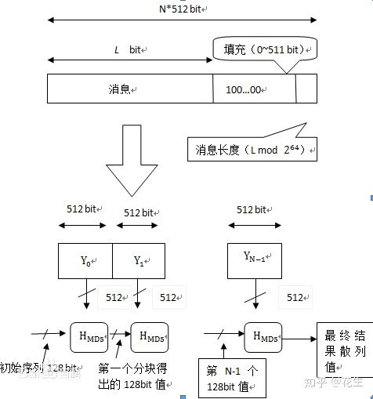
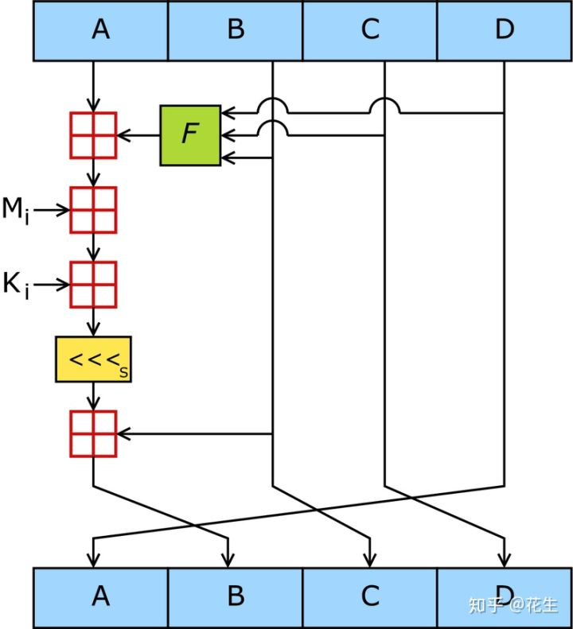
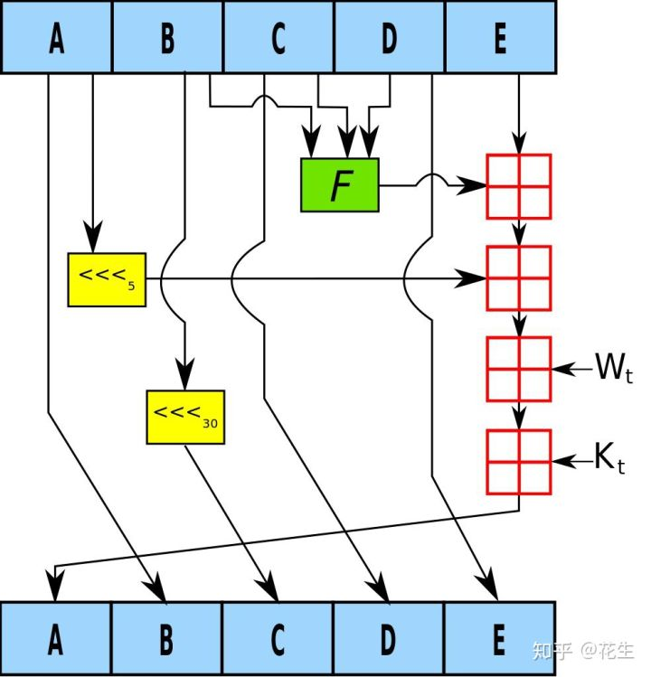

# 常见摘要算法

哈希算法(Hash Algorithm)又称散列算法、 散列函数、 哈希函数, 是一种从任何一种数据中创建小的数字"指纹"的方法. 哈希算法将数据重新打乱混合, 重新创建一个哈希值. 

哈希算法通常有以下几个特点: 

正像快速: 原始数据可以快速计算出哈希值

逆向困难: 通过哈希值基本不可能推导出原始数据

输入敏感: 原始数据只要有一点变动, 得到的哈希值差别很大

冲突避免: 很难找到不同的原始数据得到相同的哈希值

哈希算法主要用来保障数据真实性(即完整性), 即发信人将原始消息和哈希值一起发送, 收信人通过相同的哈希函数来校验原始数据是否真实. 

注: 

以上不能保证数据被恶意篡改, 原始数据和哈希值都可能被恶意篡改, 要保证不被篡改, 可以使用RSA公钥私钥方案, 再配合哈希值. 

哈希算法主要用来防止计算机传输过程中的错误, 早期计算机通过前7位数据第8位奇偶校验码来保障(12.5%的浪费效率低), 对于一段数据或文件, 通过

哈希算法生成128bit或者256bit的哈希值, 如果校验有问题要求重传. 

哈希算法主要有MD4、 MD5、 SHA. 

MD4 1990年 输出128位 (已经不安全)

MD5 1991年 输出128位 (已经不安全)

SHA-0 1993年 输出160位 (发布之后很快就被NSA撤回, 是SHA-1的前身)

SHA-1 1995年 输出160位 (已经不安全)

SHA-2包括SHA-224、 SHA-256、 SHA-384, 和 SHA-512, 分别输出224、 256、 384、 512位. (目前安全)

冲突避免: 

2的128次方为340282366920938463463374607431768211456, 也就是10的39次方级别

2的160次方为1.4615016373309029182036848327163e+48, 也就是10的48次方级别

2的256次方为1.1579208923731619542357098500869 × 10的77次方, 也就是10的77次方

宇宙中原子数大约在10的60次方到80次方之间, 所以2的256次方有足够的空间容纳所有的可能, 算法好的情况下冲突碰撞的概率很低. 

### MD5

1、 数据填充

对消息进行数据填充, 使消息的长度对512取模得448, 设消息长度为X, 即满足X mod 512=448. 根据此公式得出需要填充的数据长度. 

填充方法: 在消息后面进行填充, 填充第一位为1, 其余为0. 

2、 添加消息长度

在第一步结果之后再填充上原消息的长度, 可用来进行的存储长度为64位. 如果消息长度大于264, 则只使用其低64位的值, 即(消息长度 对 264取模). 

在此步骤进行完毕后, 最终消息长度就是512的整数倍. 

3、 数据处理

准备需要用到的数据: 

4个常数: A = 0x67452301, B = 0x0EFCDAB89, C = 0x98BADCFE, D = 0x10325476; 4个函数: F(X, Y, Z)=(X & Y) | ((~X) & Z); G(X, Y, Z)=(X & Z) | (Y & (~Z)); H(X, Y, Z)=X ^ Y ^ Z; I(X, Y, Z)=Y ^ (X | (~Z)); 把消息分以512位为一分组进行处理, 每一个分组进行4轮变换, 以上面所说4个常数为起始变量进行计算, 重新输出4个变量, 以这4个变量再进行下一分组的运算, 如果已经是最后一个分组, 则这4个变量为最后的结果, 即MD5值. 

代码实现: [MD5算法C代码实现](https://github.com/pod32g/MD5/blob/master/md5.c)

### SHA-1

2017年2月23日, CWI Amsterdam与Google宣布了一个成功的SHA-1碰撞攻击[12][13], 发布了两份内容不同但SHA-1散列值相同的PDF文件作为概念证明. 

将512位的明文分组划分为16个子明文分组, 每个子明文分组为32位. 

申请5个32位的链接变量, 记为A、 B、 C、 D、 E. 

16份子明文分组扩展为80份. 

80份子明文分组进行4轮运算. 

链接变量与初始链接变量进行求和运算. 

链接变量作为下一个明文分组的输入重复进行以上操作. 

最后, 5个链接变量里面的数据就是SHA1摘要. 

#### SHA1的分组过程

对于任意长度的明文, SHA1的明文分组过程与MD5相类似, 首先需要对明文添加位数, 使明文总长度为448(mod512)位. 在明文后添加位的方法是第一个添加位是l, 其余都是0. 然后将真正明文的长度(没有添加位以前的明文长度)以64位表示, 附加于前面已添加过位的明文后, 此时的明文长度正好是512位的倍数. 与MD5不同的是SHA1的原始报文长度不能超过2的64次方, 另外SHA1的明文长度从低位开始填充. 

经过添加位数处理的明文, 其长度正好为512位的整数倍, 然后按512位的长度进行分组(block), 可以划分成L份明文分组, 我们用Y0, Y1, ……YL-1表示这些明文分组. 对于每一个明文分组, 都要重复反复的处理, 这些与MD5是相同的. 

对于512位的明文分组, SHA1将其再分成16份子明文分组(sub-block), 每份子明文分组为32位, 我们使用M[k](k= 0, 1, ……15)来表示这16份子明文分组. 之后还要将这16份子明文分组扩充到80份子明文分组, 我们记为W[k](k= 0, 1, ……79), 扩充的方法如下. 

W t = M t , 当0≤t≤15

W t = ( W t-3 ⊕ W t-8⊕ W t-14⊕ W t-16 ) «< 1, 当16≤t≤79

SHA1有4轮运算, 每一轮包括20个步骤(一共80步), 最后产生160位摘要, 这160位摘要存放在5个32位的链接变量中, 分别标记为A、 B、 C、 D、 E. 这5个链接变量的初始值以16进制位表示如下. 

A=0x67452301

B=0xEFCDAB89

C=0x98BADCFE

D=0x10325476

E=0xC3D2E1F0

SHA1的4轮运算

SHA1有4轮运算, 每一轮包括20个步骤, 一共80步, 当第1轮运算中的第1步骤开始处理时, A、 B、 C、 D、 E五个链接变量中的值先赋值到另外5个记录单元A′, B′, C′, D′, E′中. 这5个值将保留, 用于在第4轮的最后一个步骤完成之后与链接变量A, B, C, D, E进行求和操作. 

SHA1的4轮运算, 共80个步骤使用同一个操作程序, 如下: 

A, B, C, D, E←[(A«<5)+ ft(B, C, D)+E+Wt+Kt], A, (B«<30), C, D

其中 ft(B, C, D)为逻辑函数, Wt为子明文分组W[t], Kt为固定常数. 这个操作程序的意义为: 

● 将[(A«<5)+ ft(B, C, D)+E+Wt+Kt]的结果赋值给链接变量A; 

● 将链接变量A初始值赋值给链接变量B; 

● 将链接变量B初始值循环左移30位赋值给链接变量C; 

● 将链接变量C初始值赋值给链接变量D; 

● 将链接变量D初始值赋值给链接变量E. 

代码实现: [SHA-1算法C代码实现](https://github.com/clibs/sha1/blob/master/sha1.c)

### SHA-256

SHA-256 算法输入报文的最大长度不超过2^64 bit, 输入按512-bit 分组进行处理, 产生的输出是一个256-bit 的报文摘要. 

附加填充比特. 对报文进行填充使报文长度与448 模512 同余(长度=448 mod 512), 填充的比特数范围是1 到512, 填充比特串的最高位为1, 其余位为0. 就是先在报文后面加一个 1, 再加很多个0, 直到长度 满足 mod 512=448. 为什么是448, 因为448+64=512. 第二步会加上一个 64bit的 原始报文的 长度信息. 
附加长度值. 将用64-bit 表示的初始报文(填充前)的位长度附加在步骤1 的结果后(低位字节优先). 
初始化缓存. 使用一个256-bit 的缓存来存放该散列函数的中间及最终结果. 该缓存表示为A=0x6A09E667 , B=0xBB67AE85 , C=0x3C6EF372 , D=0xA54FF53A, E=0x510E527F , F=0x9B05688C , G=0x1F83D9AB , H=0x5BE0CD19 . 
处理512-bit(16 个字)报文分组序列. 该算法使用了六种基本逻辑函数, 由64 步迭代运算组成. 每步都以256-bit 缓存值ABCDEFGH 为输入, 然后更新缓存内容. 每步使用一个32-bit 常数值Kt 和一个32-bit Wt. 

所有的512-bit分组处理完毕后, 对于SHA-256算法最后一个分组产生的输出便是256-bit的报文摘要. 

---

[from](https://zhuanlan.zhihu.com/p/37165658)

