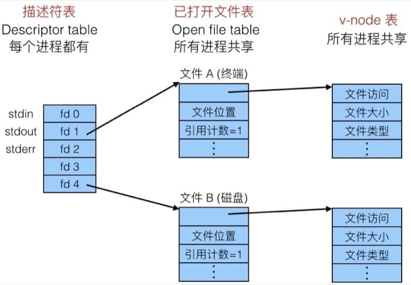
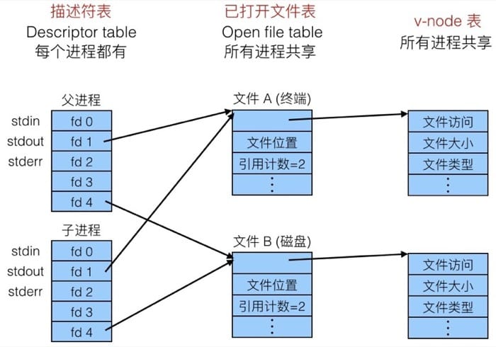
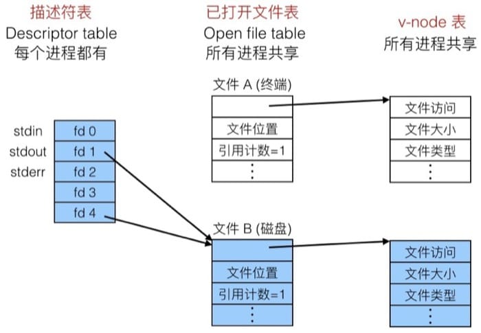

<!--
Created: Mon Aug 26 2019 15:22:39 GMT+0800 (China Standard Time)
Modified: Mon Sep 16 2019 18:17:23 GMT+0800 (China Standard Time)
-->
# 【读薄 CSAPP】陆 系统输入输出

[伍 异常控制流](./201906140Error-Control-flow[SYSTEM].md)

[柒 虚拟内存与动态内存分配](./201906140Error-Control-flow[SYSTEM].md)

---

## Unix I/O

在 Linux 中, 文件实际上可以看做是字节的序列. 更有意思的是, 所有的 I/O 设备也是用文件来表示的, 比如:

``` bash
# bash
./dev/sda2 (/usr 磁盘分区)
/dev/tty2 (终端)
```

甚至连内核也是用文件来表示的:

``` bash
# bash

/boot/vmlinuz-3.13.0-55-generic (内核镜像)
/proc (内核数据结构)
```

因为 I/O 设备也是文件, 所以内核可以利用称为 Unix I/O 的简单接口来处理输入输出, 比如使用 open() 和 close() 来打开和关闭文件, 使用 read() 和 write() 来读写文件, 或者利用 lseek() 来设定读取的偏移量等等.

为了区别不同文件的类型, 会有一个 type 来进行区别:

* 普通文件: 包含任意数据
* 目录: 相关一组文件的索引
* 套接字 Socket: 和另一台机器上的进程通信的类型

其实还有一些比较特别的类型, 但是这里提一下, 不深入了解:

* Named pipes(FIFOs)
* Symbolic links
* Character and block devices

### 普通文件

普通的文件包含任意数据, 应用一般来说需要区分出文本文件和二进制文件. 文本文件只包含 ASCII 或 Unicode 字符. 除此之外的都是二进制文件(对象文件, JPEG 图片, 等等). 对于内核来说其实并不能区分出个中的区别.

文本文件就是一系列的文本行, 每行以 \n 结尾, 新的一行是 0xa, 和 ASCII 码中的 line feed 字符(LF) 一样. 不同系统用用判断一行结束的符号不同(End of line, EOL), 如:

* Linux & Mac OS: \n(0xa)
  + line feed(LF)
* Windows & 网络协议: \r\n (0xd 0xa)
  + Carriage return(CR) followed by line feed(LF)

### 目录

目录包含一个链接(link)数组, 并且每个目录至少包含两条记录:

``` bash
# bash
.(dot) 当前目录
..(dot dot) 上一层目录
```

用来操作目录的命令主要有 mkdir, ls, rmdir. 目录是以树状结构组织的, 根目录是 /(slash).

内核会为每个进程保存当前工作目录(cwd, current working directory), 可以用 cd 命令来进行更改. 我们通过路径名来确定文件的位置, 一般分为绝对路径和相对路径.

接下来我们了解一下基本的文件操作.

### 打开文件

在使用文件之前需要通知内核打开该文件:

``` c
int fd; // 文件描述符 file descriptor

if ((fd = open("/etc/hosts", O_RDONLY)) < 0)
{
    perror("open");
    exit(1);
}
```

返回值是一个小的整型称为文件描述符(file descriptor), 如果这个值等于 -1 则说明发生了错误. 每个由 Linux shell(注: 感谢网友 yybear 的勘误) 创建的进程都会默认打开三个文件(注意这里的文件概念):

* 0: standard input(stdin)
* 1: standard output(stdout)
* 2: standar error(stderr)

### 关闭文件

使用完毕之后同样需要通知内核关闭文件:

``` c
int fd;     // 文件描述符
int retval; // 返回值

int ((retval = close(fd)) < 0)
{
    perror("close");
    exit(1);
}
```

如果在此关闭已经关闭了的文件, 会出大问题. 所以一定要检查返回值, 哪怕是 close() 函数(如上面的例子所示)

### 读取文件

在打开和关闭之间就是读取文件, 实际上就是把文件中对应的字节复制到内存中, 并更新文件指针:

``` c
char buf[512];
int fd;
int nbytes;

// 打开文件描述符，并从中读取 512 字节的数据
if ((nbytes = read(fd, buf, sizeof(buf))) < 0)
{
    perror("read");
    exit(1);
}
```

返回值是读取的字节数量, 是一个 ssize_t 类型(其实就是一个有符号整型), 如果 nbytes < 0 那么表示出错.nbytes < sizeof(buf) 这种情况(short counts) 是可能发生的, 而且并不是错误.

### 写入文件

写入文件是把内存中的数据复制到文件中, 并更新文件指针:

``` c
char buf[512];
int fd;
int nbytes;

// 打开文件描述符，并向其写入 512 字节的数据
if ((nbytes = write(fd, buf, sizeof(buf)) < 0)
{
    perror("write");
    exit(1);
}
```

返回值是写入的字节数量, 如果 nbytes < 0 那么表示出错.nbytes < sizeof(buf) 这种情况(short counts) 是可能发生的, 而且并不是错误.

综合上面的操作, 我们可以来看看 Unix I/O 的例子, 这里我们一个字节一个字节把标准输入复制到标准输出中:

``` c
#include "csapp.h"

int main(void)
{
    char c;
    while(Read(STDIN_FILENO, &c, 1) != 0)
        Write(STDOUT_FILENO, &c, 1);
    exit(0);
    
```

}
前面提到的 short count 会在下面的情形下发生:

* 在读取的时候遇到 EOF(end-of-file)
* 从终端中读取文本行
* 读取和写入网络 sockets

但是在下面的情况下不会发生

* 从磁盘文件中读取(除 EOF 外)
* 写入到磁盘文件中

最好总是允许 short count, 这样就可以避免处理这么多不同的情况.

## 元数据

元数据是用来描述数据的数据, 由内核维护, 可以通过 stat 和 fstat 函数来访问, 其结构是:

``` c
/* c */
struct stat
{
    dev_t           st_dev;     // Device
    ino_t           st_ino;     // inode
    mode_t          st_mode;    // Protection & file type
    nlink_t         st_nlink;   // Number of hard links
    uid_t           st_uid;     // User ID of owner
    gid_t           st_gid;     // Group ID of owner
    dev_t           st_rdev;    // Device type (if inode device)
    off_t           st_size;    // Total size, in bytes
    unsigned long   st_blksize; // Blocksize for filesystem I/O
    unsigned long   st_blocks;  // Number of blocks allocated
    time_t          st_atime;   // Time of last access
    time_t          st_mtime;   // Time of last modification
    time_t          st_ctime;   // Time of last change
}
```

对应的访问例子:

``` c
/* c */
int main (int argc, char **argv)
{
    struct stat stat;
    char *type, *readok;
    
    Stat(argv[1], &stat);
    if (S_ISREG(stat.st_mode)) // 确定文件类型
        type = "regular";
    else if (S_ISDIR(stat.st_mode))
        type = "directory";
    else
        type = "other";
    
    if ((stat.st_mode & S_IRUSR)) // 检查读权限
        readok = "yes";
    else
        readok = "no";
    
    printf("type: %s, read: %s\n", type, readok);
    exit(0);
}
```

### 重定向

了解了具体的结构之后, 我们来看看内核是如何表示已打开的文件的. 其实过程很简单, 每个进程都有自己的描述符表(Descriptor table), 然后 Descriptor 1 指向终端, Descriptor 4 指向磁盘文件, 如下图所示:



这里有一个需要说明的情况, 就是使用 fork. 子进程实际上是会继承父进程打开的文件的. 在 fork 之后, 子进程实际上和父进程的指向是一样的, 这里需要注意的是会把引用计数加 1, 如下图所示



了解了这个, 我们我们就可以知道所谓的重定向是怎么实现的了. 其实很简单, 只要调用 dup2(oldfd, newfd) 函数即可. 我们只要改变文件描述符指向的文件, 也就完成了重定向的过程, 下图中我们把原来指向终端的文件描述符指向了磁盘文件, 也就把终端上的输出保存在了文件中:



标准输入输出
C 标准库中包含一系列高层的标准 IO 函数, 比如

打开和关闭文件: fopen, fclose

读取和写入字节: fread, fwrite

读取和写入行: fgets, fputs

格式化读取和写入: fscanf, fprintf

标准 IO 会用流的形式打开文件, 所谓流(stream)实际上是文件描述符和缓冲区(buffer)在内存中的抽象. C 程序一般以三个流开始, 如下所示:

``` c
/* c */
#include <stdio.h>
extern FILE *stdin;     // 标准输入 descriptor 0
extern FILE *stdout;    // 标准输出 descriptor 1
extern FILE *stderr;    // 标准错误 descriptor 2

int main()
{
    fprintf(stdout, "Hello, Da Wang\n");
}
```

接下来我们详细了解一下为什么需要使用缓冲区, 程序经常会一次读入或者写入一个字符, 比如 getc, putc, ungetc, 同时也会一次读入或者写入一行, 比如 gets, fgets. 如果用 Unix I/O 的方式来进行调用, 是非常昂贵的, 比如说 read 和 write 因为需要内核调用, 需要大于 10000 个时钟周期.

解决的办法就是利用 read 函数一次读取一块数据, 然后再由高层的接口, 一次从缓冲区读取一个字符(当缓冲区用完的时候需要重新填充)

## 总结

前面介绍了两种 I/O 方法, Unix I/O 是最底层的, 通过系统调用来进行文件操作, 在这之上是 C 的标准 I/O 库, 对应的函数为:

Unix I/O: open, read, write, lseek, stat, close

Standard C I/O: fopen, fdopen, fread, fwrite, fscanf, fprintf, sscanf, sprintf, fgets, fputs, fflush, fseek, fclose

Unix I/O 是最通用最底层的 I/O 方法, 其他的 I/O 包都是在 Unix I/O 的基础上进行构建的, 值得注意的一点是, Unix I/O 中的方法都是异步信号安全(async-signal-safe)的, 也就是说, 可以在信号处理器中调用. 因为比较底层和基础的缘故, 需要处理的情况非常多, 很容易出错. 高效率的读写需要用到缓冲区, 同样容易出错, 这也就是标准 C 库着重要解决的问题.

标准 C I/O 提供了带缓存访问文件的方法, 使用的时候几乎不用考虑太多, 但是如果我们想要得到文件的元信息时, 就还是得使用 Unix I/O 中的 stat 函数. 另外标准 C I/O 中的函数都不是异步信号安全(async-signal-safe)的, 所以并不能在信号处理器中使用. 最后, 标准 C I/O 不适合用于处理网络套接字.

