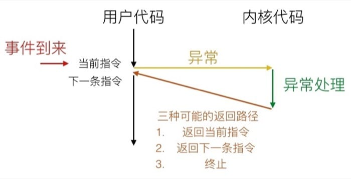

<!--
Created: Mon Aug 26 2019 15:22:37 GMT+0800 (China Standard Time)
Modified: Wed Sep 11 2019 14:42:38 GMT+0800 (China Standard Time)
-->
# 【读薄 CSAPP】伍 异常控制流

[肆 链接](./201906150Link-Control[SYSTEM].md)

[陆 系统输入输出](./201906130System-input-and-output[SYSTEM].md)

---

异常控制流可能是很多人知道却说不清楚具体发生了什么的『著名』概念, 什么是异常? 系统又是怎么处理这个看起来『不一样』的机制的呢? 信号在这里扮演了什么角色? 这一讲我们就来讲讲异常与信号到底是怎么回事儿.

## 学习目标

了解异步异常与同步异常, 以及异常控制流与平时的逻辑控制流的差异

理解进程的工作机制, 如何通过异常来进行进程切换

理解 Linux 的进程控制机制, 掌握 fork 的基本用法

了解信号的基本原理以及如何处理信号

掌握如何避免进程竞争的方法

了解非本地跳转的概念和意义

前面提到过, 进程可能是计算机系统中最伟大的抽象. 进程这个概念背后, 其实隐藏着一整套系统级机制, 从进程切换, 用户态与内核态的转换到系统实时响应各种事件, 都离不开一个相当熟悉又陌生的概念——异常. 在这个基础上, 我们会一起来看看, 操作系统到底是如何工作的, 为什么可以同时执行不同的程序, 具体又是通过什么机制来管理这一切的呢? 这一讲我们就来看看这之中的奥秘.

## 异常控制流

从开机到关机, 处理器做的工作其实很简单, 就是不断读取并执行指令, 每次执行一条, 整个指令执行的序列, 称为处理器的控制流. 到目前为止, 我们已经学过了两种改变控制流的方式: 

## 跳转和分支

## 调用和返回

这两个操作对应于程序的改变. 但是这实际上仅仅局限于程序本身的控制, 没有办法去应对更加复杂的情况. 系统状态发生变化的时候, 无论是跳转/分支还是调用/返回都是无能为力的, 比如: 

数据从磁盘或者网络适配器到达

指令除以了零

用户按下 ctrl+c

系统的计时器到时间

这时候就要轮到另一种更加复杂的机制登场了, 称之为异常控制流(exceptional control flow). 首先需要注意的是, 虽然名称里包含异常(实际上也用到了异常), 但是跟代码中 try catch 所涉及的异常是不一样的.

异常控制流存在于系统的每个层级, 最底层的机制称为异常(Exception), 用以改变控制流以响应系统事件, 通常是由硬件的操作系统共同实现的. 更高层次的异常控制流包括进程切换(Process Context Switch), 信号(Signal)和非本地跳转(Nonlocal Jumps), 也可以看做是一个从硬件过渡到操作系统, 再从操作系统过渡到语言库的过程. 进程切换是由硬件计时器和操作系统共同实现的, 而信号则只是操作系统层面的概念了, 到了非本地跳转就已经是在 C 运行时库中实现的了.

接下来我们就分别来看看这四个跨域计算机不同层级的异常控制流机制.

## 异常 Exception

这里的异常指的是把控制交给系统内核来响应某些事件(例如处理器状态的变化), 其中内核是操作系统常驻内存的一部分, 而这类事件包括除以零, 数学运算溢出, 页错误, I/O 请求完成或用户按下了 ctrl+c 等等系统级别的事件.

具体的过程可以用下图表示: 


系统会通过异常表(Exception Table)来确定跳转的位置, 每种事件都有对应的唯一的异常编号, 发生对应异常时就会调用对应的异常处理代码

## 异步异常(中断)

异步异常(Asynchronous Exception)称之为中断(Interrupt), 是由处理器外面发生的事情引起的. 对于执行程序来说, 这种"中断"的发生完全是异步的, 因为不知道什么时候会发生. CPU对其的响应也完全是被动的, 但是可以屏蔽掉[1]. 这种情况下: 

需要设置处理器的中断指针(interrupt pin)

处理完成后会返回之前控制流中的『下一条』指令

比较常见的中断有两种: 计时器中断和 I/O 中断. 计时器中断是由计时器芯片每隔几毫秒触发的, 内核用计时器终端来从用户程序手上拿回控制权. I/O 中断类型比较多样, 比方说键盘输入了 ctrl-c, 网络中一个包接收完毕, 都会触发这样的中断.

## 同步异常

同步异常(Synchronous Exception)是因为执行某条指令所导致的事件, 分为陷阱(Trap), 故障(Fault)和终止(Abort)三种情况.

| 类型 | 原因          | 行为          | 示例               |
|-----|---------------|---------------|--------------------|
| 陷阱 | 有意的异常     | 返回到下一条指令 | 系统调用, 断点       |
| 故障 | 潜在可恢复的错误 | 返回到当前指令  | 页故障(page faults) |
| 终止 | 不可恢复的错误  | 终止当前程序    | 非法指令            |

这里需要注意三种不同类型的处理方式, 比方说陷阱和中断一样, 会返回执行『下一条』指令; 而故障会重新执行之前触发事件的指令; 终止则是直接退出当前的程序.

## 系统调用示例

系统调用看起来像是函数调用, 但其实是走异常控制流的, 在 x86-64 系统中, 每个系统调用都有一个唯一的 ID, 如

编号	名称	描述
0	read	读取文件
1	write	写入文件
2	open	打开文件
3	close	关闭文件
4	stat	获取文件信息
57	fork	创建进程
59	execve	执行一个程序
60	_exit	关闭进程
62	kill	向进程发送信号

举个例子, 假设用户调用了 open(filename, options), 系统实际上会执行 __open 函数, 也就是进行系统调用 syscall, 如果返回值是负数, 则是出错, 汇编代码如下: 

``` bash
00000000000e5d70 <__open>:
    ...
    e5d79: b8 02 00 00 00     mov $0x2, %eax    # open 是编号 2 的系统调用
    e5d7e: 0f 05              syscall           # 调用的返回值会在 %rax 中
    e5d80: 48 3d 01 f0 ff ff  cmp $0xfffffffffffff001, %rax
    ...
    e5dfa: c3                 retq
```

对应的示意图是: 



## 故障示例

这里我们以 Page Fault 为例, 来说明 Fault 的机制. Page Fault 发生的条件是: 

用户写入内存位置

但该位置目前还不在内存中

比如: 

``` c
int a[1000];
main()
{
    a[500] = 13;
}
```

那么系统会通过 Page Fault 把对应的部分载入到内存中, 然后重新执行赋值语句: 


但是如果代码改为这样: 

``` c
int a[1000];
main()
{
    a[5000] = 13;
}
```

也就是引用非法地址的时候, 整个流程就会变成: 


具体来说会像用户进程发送 SIGSEGV 信号, 用户进程会以 segmentation fault 的标记退出.

从上面我们就可以看到异常的具体实现是依靠在用户代码和内核代码间切换而实现的, 是非常底层的机制.

## 进程

进程是计算机科学中最为重要的思想之一, 进程才是程序(指令和数据)的真正运行实例. 之所以重要, 是因为进程给每个应用提供了两个非常关键的抽象: 一是逻辑控制流, 二是私有地址空间. 逻辑控制流通过称为上下文切换(context switching)的内核机制让每个程序都感觉自己在独占处理器. 私有地址空间则是通过称为虚拟内存(virtual memory)的机制让每个程序都感觉自己在独占内存. 这样的抽象使得具体的进程不需要操心处理器和内存的相关适宜, 也保证了在不同情况下运行同样的程序能得到相同的结果.

计算机会同时运行多个进程, 有前台应用, 也后台任务, 我们在 Mac 的终端下输入 top(或者更酷炫的 htop), 就可以看到如下的进程信息


## 进程切换 Process Context Switch

这么多进程, 具体是如何工作的呢? 我们来看看下面的示意图: 


左边是单进程的模型, 内存中保存着进程所需的各种信息, 因为该进程独占 CPU, 所以并不需要保存寄存器值. 而在右边的单核多进程模型中, 虚线部分可以认为是当前正在执行的进程, 因为我们可能会切换到其他进程, 所以内存中需要另一块区域来保存当前的寄存器值, 以便下次执行的时候进行恢复(也就是所谓的上下文切换). 整个过程中, CPU 交替执行不同的进程, 虚拟内存系统会负责管理地址空间, 而没有执行的进程的寄存器值会被保存在内存中. 切换到另一个进程的时候, 会载入已保存的对应于将要执行的进程的寄存器值.

而现代处理器一般有多个核心, 所以可以真正同时执行多个进程. 这些进程会共享主存以及一部分缓存, 具体的调度是由内核控制的, 示意图如下: 


切换进程时, 内核会负责具体的调度, 如下图所示


## 进程控制 Process Control

系统调用的错误处理

在遇到错误的时候, Linux 系统级函数通常会返回 -1 并且设置 errno 这个全局变量来表示错误的原因. 使用的时候记住两个规则: 

对于每个系统调用都应该检查返回值

当然有一些系统调用的返回值为 void, 在这里就不适用

例如, 对于 fork() 函数, 我们应该这么写: 

``` c
if ((pid = fork()) < 0) {
    fprintf(stderr, "fork error: %s\n", strerror(errno));
    exit(0);
}
```

如果觉得这样写太麻烦, 可以利用一个辅助函数: 

``` c
void unix_error(char *msg) /* Unix-style error */
{
    fprintf(stderr, "%s: %s\n", msg, strerror(errno));
    exit(0);
}
// 上面的片段可以写为
if ((pid = fork()) < 0)
    unix_error("fork error");
```

我们甚至可以更进一步, 把整个 fork() 包装起来, 就可以自带错误处理, 比如

``` c
pid_t Fork(void)
{
    pid_t pid;
    if ((pid = fork()) < 0)
        unix_error("Fork error");
    return pid;
}
```

调用的时候直接使用 pid = Fork(); 即可(注意这里是大写的 F)

## 获取进程信息

我们可以用下面两个函数获取进程的相关信息: 

pid_t getpid(void) - 返回当前进程的 PID

pid_t getppid(void) - 返回当前进程的父进程的 PID

我们可以认为, 进程有三个主要状态: 

运行 Running

正在被执行, 正在等待执行或者最终将会被执行

停止 Stopped

执行被挂起, 在进一步通知前不会计划执行

终止 Terminated

进程被永久停止

另外的两个状态称为新建(new)和就绪(ready), 这里不再赘述.

### 终止进程

在下面三种情况时, 进程会被终止: 

接收到一个终止信号
返回到 main
调用了 exit 函数
exit 函数会被调用一次, 但从不返回, 具体的函数原型是

// 以 status 状态终止进程, 0 表示正常结束, 非零则是出现了错误
void exit(int status)

### 创建进程

调用 fork 来创造新进程. 这个函数很有趣, 执行一次, 但是会返回两次, 具体的函数原型为

``` c
// 对于子进程，返回 0
// 对于父进程，返回子进程的 PID
int fork(void)
```

子进程几乎和父进程一模一样, 会有相同且独立的虚拟地址空间, 也会得到父进程已经打开的文件描述符(file descriptor). 比较明显的不同之处就是进程 PID 了.

看一个简单的例子

``` c
int main()
{
    pid_t pid;
    int x = 1;
    
    pid = Fork();
    if (pid == 0) 
    {   // Child
        printf("I'm the child!  x = %d\n", ++x);
        exit(0);
    }
    
    // Parent
    printf("I'm the parent! x = %d\n", --x);
    exit(0);
}
```

输出是

``` bash
linux> ./forkdemo
I'm the parent! x = 0
I'm the child!  x = 2
```

有以下几点需要注意: 

1. 调用一次, 但是会有两个返回值
2. 并行执行, 不能预计父进程和子进程的执行顺序
3. 拥有自己独立的地址空间(也就是变量都是独立的), 除此之外其他都相同
4. 在父进程和子进程中 stdout 是一样的(都会发送到标准输出)

## 进程图

进程图是一个很好的帮助我们理解进程执行的工具: 

每个节点代表一条执行的语句

a -> b 表示 a 在 b 前面执行

边可以用当前变量的值来标记

printf 节点可以用输出来进行标记

每个图由一个入度为 0 的节点作为起始

对于进程图来说, 只要满足拓扑排序, 就是可能的输出. 我们还是用刚才的例子来简单示意一下: 

``` c
int main()
{
    pid_t pid;
    int x = 1;
    
    pid = Fork();
    if (pid == 0) 
    {   // Child
        printf("child! x = %d\n", --x);
        exit(0);
    }
    
    // Parent
    printf("parent! x = %d\n", x);
    exit(0);
}
```

对应的进程图为


## 回收子进程

即使主进程已经终止, 子进程也还在消耗系统资源, 我们称之为『僵尸』. 为了『打僵尸』, 就可以采用『收割』(Reaping) 的方法. 父进程利用 wait 或 waitpid 回收已终止的子进程, 然后给系统提供相关信息, kernel 就会把 zombie child process 给删除.

如果父进程不回收子进程的话, 通常来说会被 init 进程(pid == 1)回收, 所以一般不必显式回收. 但是在长期运行的进程中, 就需要显式回收(例如 shell 和 server).

如果想在子进程载入其他的程序, 就需要使用 execve 函数, 具体可以查看对应的 man page, 这里不再深入.

###  信号 Signal

Linux 的进程树, 可以通过 pstree 命令查看, 如下图所示: 


2019061410.jpg

对于前台进程来说, 我们可以在其执行完成后进行回收, 而对于后台进程来说, 因为不能确定具体执行完成的时间, 所以终止之后就成为了僵尸进程, 无法被回收并因此造成内存泄露.

这怎么办呢? 同样可以利用异常控制流, 当后台进程完成时, 内核会中断常规执行并通知我们, 具体的通知机制就是『信号』(signal).

信号是 Unix, 类 Unix 以及其他 POSIX 兼容的操作系统中进程间通讯的一种有限制的方式. 它是一种异步的通知机制, 用来提醒进程一个事件已经发生. 当一个信号发送给一个进程, 操作系统中断了进程正常的控制流程, 此时, 任何非原子操作都将被中断. 如果进程定义了信号的处理函数, 那么它将被执行, 否则就执行默认的处理函数.

这样看来, 信号其实是类似于异常和中断的, 是由内核(在其他进程的请求下)向当前进程发出的. 信号的类型由 1-30 的整数定义, 信号所能携带的信息极少, 一是对应的编号, 二就是信号到达这个事实. 下面是几个比较常用的信号的编号及简介: 

| 编号 | 名称    | 默认动作    | 对应事件                      |
|-----|---------|------------|------------------------------|
| 2   | SIGINT  | 终止       | 用户输入 ctrl+c               |
| 9   | SIGKILL | 终止       | 终止程序(不能重写或忽略)        |
| 11  | SIGSEGV | 终止且 Dump | 段冲突 Segmentation violation |
| 14  | SIGALRM | 终止       | 时间信号                      |
| 17  | SIGCHLD | 忽略       | 子进程停止或终止               |

内核通过给目标进程发送信号, 来更新目标进程的状态, 具体的场景为: 

内核检测到了如除以零(SIGFPE)或子进程终止(SIGCHLD)的系统事件

另一个进程调用了 kill 指令来请求内核发送信号给指定的进程

目标进程接收到信号后, 内核会强制要求进程对于信号做出响应, 可以有几种不同的操作: 

1. 忽略这个型号
2. 终止进程
3. 捕获信号, 执行信号处理器(signal handler), 类似于异步中断中的异常处理器(exception handler)

具体的过程如下: 


如果信号已被发送但是未被接收, 那么处于等待状态(pending), 同类型的信号至多只会有一个待处理信号(pending signal), 一定要注意这个特性, 因为内部实现机制不可能提供较复杂的数据结构, 所以信号的接收并不是一个队列. 比如说进程有一个 SIGCHLD 信号处于等待状态, 那么之后进来的 SIGCHLD 信号都会被直接扔掉.

当然, 进程也可以阻塞特定信号的接收, 但信号的发送并不受控制, 所以被阻塞的信号仍然可以被发送, 不过直到进程取消阻塞该信号之后才会被接收. 内核用等待(pending)位向量和阻塞(blocked)位向量来维护每个进程的信号相关状态.

## 进程组

每个进程都只属于一个进程组, 从前面的进程树状图中我们也能大概了解一二, 想要了解相关信息, 一般使用如下函数: 

getpgrp() - 返回当前进程的进程组

setpgid() - 设置一个进程的进程组

我们可以据此指定一个进程组或者一个单独的进程, 比方说可以通过 kill 应用来发送信号, 流入

### 创建子进程

``` bash
linux> ./forks 16
Child1: pid=24818 pgrp=24817
Child2: pid=24819 pgrp=24817
```

### 查看进程

``` bash
linux> ps
  PID TTY      TIME  CMD
24788 pts/2 00:00:00 tcsh
24818 pts/2 00:00:02 forks
24819 pts/2 00:00:02 forks
24820 pts/2 00:00:00 ps
```

### 可以选择关闭某个进程

``` bash
linux> /bin/kill -9 24818
```

### 也可以关闭某个进程组, 会关闭该组中所有进程

``` bash
linux> /bin/kill -9 -24817
```

### 查看进程

``` bash
linux> ps
  PID TTY      TIME  CMD
24788 pts/2 00:00:00 tcsh
24820 pts/2 00:00:00 ps
```

这里可以看到, 第一个命令只会杀掉编号为 24818 的进程, 但是第二个命令, 因为有两个进程都属于进程组 24817, 所以会杀掉进程组中的每个进程.

我们也可以通过键盘让内核向每个前台进程发送 SIGINT(SIGTSTP) 信号

SIGINT - ctrl+c 默认终止进程

SIGTSTP - ctrl+z 默认挂起进程

下面是一个简单的例子

``` bash
linux> ./forks 17
Child: pid=28108 pgrp=28107
Parent: pid=28107 pgrp=28107
# 按下 ctrl+z
Suspended # 进程被挂起
linux> ps w
  PID TTY   STAT  TIME  COMMAND
27699 pts/8 Ss    00:00 -tcsh
28107 pts/8 T     00:02 ./forks 17
28108 pts/8 T     00:02 ./forks 17
28109 pts/8 R+    00:00 ps w
linux> fg
./forks 17
# 按下 ctrl+c，进程被终止
linux> ps w
  PID TTY   STAT  TIME  COMMAND
27699 pts/8 Ss    00:00 -tcsh
28109 pts/8 R+    00:00 ps w
STAT 部分的第一个字母的意思

S: 睡眠 sleeping
T: 停止 stopped
R: 运行 running
第二个字母的意思：

s: 会话管理者 session leader
+: 前台进程组
更多信息可以查看 man ps
```

如果想要发送信号, 可以使用 kill 函数, 下面是一个简单的示例, 父进程通过发送 SIGINT 信号来终止正在无限循环的子进程.

``` c
void forkandkill()
{
    pid_t pid[N];
    int i;
    int child_status;
    
    for (i = 0; i < N; i++)
        if ((pid[i] = fork()) == 0)
            while(1) ;  // 死循环
    
    for (i = 0; i < N; i++)
    {
        printf("Killing process %d\n", pid[i]);
        kill(pid[i], SIGINT);
    }
    
    for (i = 0; i < N; i++)
    {
        pid_t wpid = wait(&child_status);
        if (WIFEXITED(child_status))
            printf("Child %d terminated with exit status %d\n",
                    wpid, WEXITSTATUS(child_status));
        else
            printf("Child %d terminated abnormally\n", wpid);
    }
}
```

### 接收信号

所有的上下文切换都是通过调用某个异常处理器(exception handler)完成的, 内核会计算对易于某个进程 p 的 pnb 值: pnb = pending & ~blocked

如果 pnb == 0, 那么就把控制交给进程 p 的逻辑流中的下一条指令

如果 pnb != 0

选择 pnb 中最小的非零位 k, 并强制进程 p 接收信号 k

接收到信号之后, 进程 p 会执行对应的动作

对 pnb 中所有的非零位进行这个操作

最后把控制交给进程 p 的逻辑流中的下一条指令

每个信号类型都有一个预定义的『默认动作』, 可能是以下的情况: 

### 终止进程

终止进程并 dump core

停止进程, 收到 SIGCONT 信号之后重启

忽略信号

signal 函数可以修改默认的动作, 函数原型为 handler_t *signal(int signum, handler_t *handler). 我们通过一个简单的例子来感受下, 这里我们屏蔽了 SIGINT 函数, 即使按下 ctrl+c 也不会终止

``` c
void sigint_handler(int sig) // SIGINT 处理器
{
    printf("想通过 ctrl+c 来关闭我？\n");
    sleep(2);
    fflush(stdout);
    sleep(1);
    printf("OK. :-)\n");
    exit(0);
}

int main()
{
    // 设定 SIGINT 处理器
    if (signal(SIGINT, sigint_handler) == SIG_ERR)
        unix_error("signal error");
        
    // 等待接收信号
    pause();
    return 0;
}
```

信号处理器的工作流程可以认为是和当前用户进程『并发』的同一个『伪』进程, 示意如下: 

注: 并行与并发的区别

计算机虽然只有一个 CPU, 但操作系统能够将程序的执行单位细化, 然后分开执行, 从而实现伪并行执行. 这种伪并行执行称为并发(concurrent). 使用多个 CPU 真的同时执行称为并行(parallel)


还有一个需要注意的是, 信号处理器也可以被其他的信号处理器中断, 控制流如下图所示: 


### 阻塞信号

我们知道, 内核会阻塞与当前在处理的信号同类型的其他正待等待的信号, 也就是说, 一个 SIGINT 信号处理器是不能被另一个 SIGINT 信号中断的.

如果想要显式阻塞, 就需要使用 sigprocmask 函数了, 以及其他一些辅助函数: 

sigemptyset - 创建空集
sigfillset - 把所有的信号都添加到集合中(因为信号数目不多)
sigaddset - 添加指定信号到集合中
sigdelset - 删除集合中的指定信号
我们可以用下面这段代码来临时阻塞特定的信号: 

sigset_t mask, prev_mask; 

Sigemptyset(&mask); // 创建空集
Sigaddset(&mask, SIGINT); // 把 SIGINT 信号加入屏蔽列表中

// 阻塞对应信号, 并保存之前的集合作为备份
Sigprocmask(SIG_BLOCK, &mask, &prev_mask); 
...
...// 这部分代码不会被 SIGINT 中断
...
// 取消阻塞信号, 恢复原来的状态
Sigprocmask(SIG_SETMASK, &prev_mask, NULL); 
安全处理信号
信号处理器的设计并不简单, 因为它们和主程序并行且共享相同的全局数据结构, 尤其要注意因为并行访问可能导致的数据损坏的问题, 这里提供一些基本的指南(后面的课程会详细介绍)

规则 1: 信号处理器越简单越好
例如: 设置一个全局的标记, 并返回
规则 2: 信号处理器中只调用异步且信号安全(async-signal-safe)的函数
诸如 printf, sprintf, malloc 和 exit 都是不安全的! 
规则 3: 在进入和退出的时候保存和恢复 errno
这样信号处理器就不会覆盖原有的 errno 值
规则 4: 临时阻塞所有的信号以保证对于共享数据结构的访问
防止可能出现的数据损坏
规则 5: 用 volatile 关键字声明全局变量
这样编译器就不会把它们保存在寄存器中, 保证一致性
规则 6: 用 volatile sig_atomic_t 来声明全局标识符(flag)
这样可以防止出现访问异常
这里提到的异步信号安全(async-signal-safety)指的是如下两类函数: 

所有的变量都保存在栈帧中的函数
不会被信号中断的函数
Posix 标准指定了 117 个异步信号安全(async-signal-safe)的函数(可以通过 man 7 signal 查看)


### 非本地跳转 Non local Jump

所谓的本地跳转, 指的是在一个程序中通过 goto 语句进行流程跳转, 尽管不推荐使用goto语句, 但在嵌入式系统中为了提高程序的效率, goto语句还是可以使用的. 本地跳转的限制在于, 我们不能从一个函数跳转到另一个函数中. 如果想突破函数的限制, 就要使用 setjmp 或 longjmp 来进行非本地跳转了.

setjmp 保存当前程序的堆栈上下文环境(stack context), 注意, 这个保存的堆栈上下文环境仅在调用 setjmp 的函数内有效, 如果调用 setjmp 的函数返回了, 这个保存的堆栈上下文环境就失效了. 调用 setjmp 的直接返回值为 0.

longjmp 将会恢复由 setjmp 保存的程序堆栈上下文, 即程序从调用 setjmp 处重新开始执行, 不过此时的 setjmp 的返回值将是由 longjmp 指定的值. 注意longjmp 不能指定0为返回值, 即使指定了 0, longjmp 也会使 setjmp 返回 1.

我们可以利用这种方式, 来跳转到其他的栈帧中, 比方说在嵌套函数中, 我们可以利用这个快速返回栈底的函数, 我们来看如下代码

``` c
jmp_buf env;

P1()
{
    if (setjmp(env))
    {
        // 跳转到这里
    } else 
    {
        P2();
    }
    
}

P2()
{
    ...
    P2();
    ...
    P3();
}

P3()
{
    longjmp(env, 1);
}
```

对应的跳转过程为: 


也就是说, 我们直接从 P3 跳转回了 P1, 但是也有限制, 函数必须在栈中(也就是还没完成)才可以进行跳转, 下面的例子中, 因为 P2 已经返回, 所以不能跳转了

``` c
jmp_buf env;

P1()
{
    P2(); P3();
}

P2()
{
    if (setjmp(env))
    {
        // 跳转到这里
    }
}

P3()
{
    longjmp(env, 1);
}
```

因为 P2 在跳转的时候已经返回, 对应的栈帧在内存中已经被清理, 所以 P3 中的 longjmp 并不能实现期望的操作.

总结
这一讲中, 我们细致了解了而异常控制流的四个基本机制: 异常, 进程切换, 信号和非本地跳转. 其中异常是最底层的, 也是后面几种的基础; 而信号是进程间最重要, 简单却强大的信使. 结合信号和进程, 因为系统进程并行的缘故, 具体编写程序的时候有许多需要注意的地方.

这部分的内容比较繁杂, 涉及到的相关概念也比较多, 最好结合《深入理解计算机系统》的原文来进行学习.

