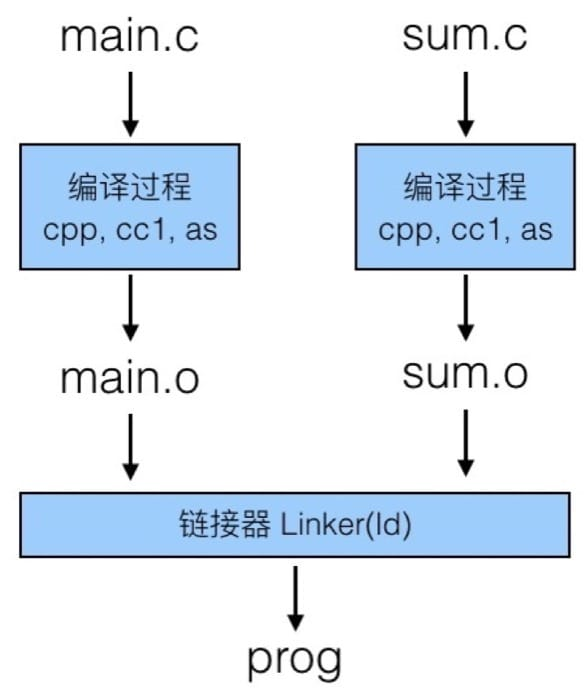
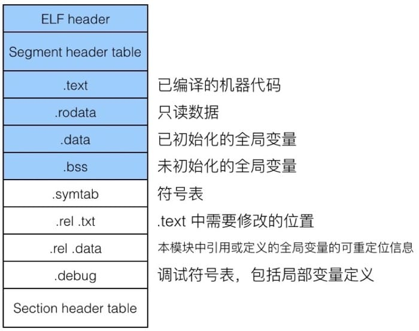
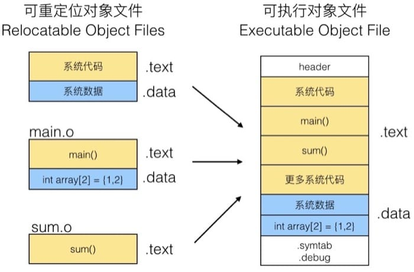
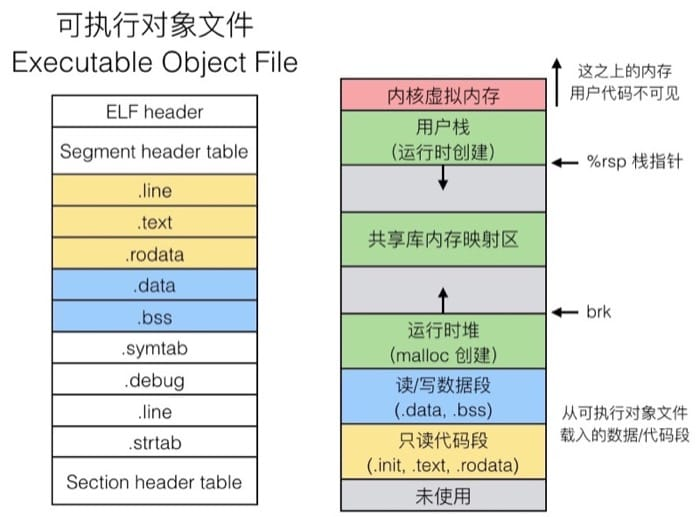
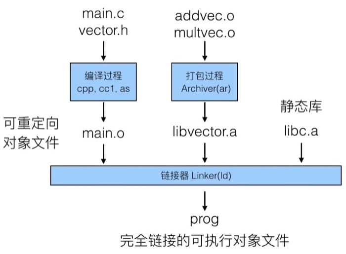

<!--
Created: Mon Aug 26 2019 15:22:40 GMT+0800 (China Standard Time)
Modified: Mon Aug 26 2019 15:22:40 GMT+0800 (China Standard Time)
-->
# 【读薄 CSAPP】肆 链接

[叁 内存与缓存](./201906180Memory-and-cache[SYSTEM].md)

[伍 异常控制流](./201906140Error-Control-flow[SYSTEM].md)

---

不同的代码是如何被拼到一起协同工作的呢? 所谓的静态库, 动态库又是什么? 编译和链接的不同在哪里? 这一讲我们结合一丁点编译原理的内容, 来说说链接那点事儿.

## 学习目标

* 理解从源代码转换到计算机可执行的二进制代码之间需要经过的处理
* 理解编译过程
* 理解链接过程, 尤其是程序的组织部分
* 理解库的使用方式
* 理解 Library Interpostion 的机制及几种不同的类型

使用集成开发环境(IDE)很方便, 但是在『执行』的按钮背后, 其实发生了太多太多的事情. 当然, 作为初学者, 一开始避开过多的复杂专注于学习编写代码无可厚非, 但是该学的永远逃不掉, 不了解自己的代码是如何一步步成为计算机课执行的程序的, 就很难在遇到各种疑难杂症的时候快速定位问题所在. 另外, 无论是编译器还是链接器, 都可以通过不同的参数进行各种定制, 如果不搞清楚, 恐怕只能永远依赖 IDE 了. IDE 很好, 但任何东西都不能过分依赖, 真正合理的应该是庖丁解牛后, 挑选最适合自己的.

## 编译

C 语言代码最终成为机器可执行的程序, 会像流水线上的产品一样接受各项处理:

* 预处理器: 将 C 语言代码(da.c)转化成 da.i 文件(gcc –E), 对应于预处理命令 cpp
* 编译器: C 语言代码(da.c, wang.c)经过编译器的处理(gcc -0g -S)成为汇编代码(da.s, wang.s)
* 汇编器: 汇编代码(da.s, wang.s)经过汇编器的处理(gcc 或 as)成为对象程序(da.o, wang.o)
* 链接器: 对象程序(da.o, wang.o)以及所需静态库(lib.a)经过链接器的处理(gcc 或 ld)最终成为计算机可执行的程序
* 加载器: 将可执行程序加载到内存并进行执行, loader 和 ld-linux.so

编译是指编译器读取源程序(字符流), 对之进行词法和语法的分析, 将高级语言指令转换为功能等效的汇编代码. 源文件的编译过程包含两个主要阶段:

第一个阶段是预处理阶段, 在正式的编译阶段之前进行. 预处理阶段将根据已放置在文件中的预处理指令来修改源文件的内容. 主要是以下几方面的处理:

1. 宏定义指令, 如 #define a b 这种伪指令, 预编译所要做的是将程序中的所有 a 用 b 替换, 但作为字符串常量的 a 则不被替换. 还有 #undef, 则将取消对某个宏的定义, 使以后该串的出现不再被替换
2. 条件编译指令, 如 #ifdef, #ifndef, #else, #elif, #endif等. 这些伪指令的引入使得程序员可以通过定义不同的宏来决定编译程序对哪些代码进行处理. 预编译程序将根据有关的文件, 将那些不必要的代码过滤掉
3. 头文件包含指令, 如 #include "FileName" . 该指令将头文件中的定义统统都加入到它所产生的输出文件中, 以供编译程序对之进行处理
4. 特殊符号, 预编译程序可以识别一些特殊的符号. 例如在源程序中出现的 LINE 标识将被解释为当前行号(十进制数), FILE 则被解释为当前被编译的C源程序的名称. 预编译程序对于在源程序中出现的这些串将用合适的值进行替换

头文件的目的主要是为了使某些定义可以供多个不同的C源程序使用, 这涉及到头文件的定位即搜索路径问题. 头文件搜索规则如下:

1. 所有头文件的搜寻会从 -I 开始
2. 然后找环境变量 C_INCLUDE_PATH, CPLUS_INCLUDE_PATH, OBJC_INCLUDE_PATH 指定的路径
3. 再找默认目录(/usr/include, /usr/local/include, /usr/lib/gcc-lib/i386-linux/2.95.2/include 等等)

第二个阶段编译、优化阶段, 编译程序所要作得工作就是通过词法分析和语法分析, 在确认所有的指令都符合语法规则之后, 将其翻译成等价的中间代码表示或汇编代码.

汇编实际上指汇编器(as)把汇编语言代码翻译成目标机器指令的过程. 目标文件中所存放的也就是与源程序等效的目标的机器语言代码. 目标文件由段组成. 通常一个目标文件中至少有两个段:

* 代码段: 该段中所包含的主要是程序的指令. 该段一般是可读和可执行的, 但一般却不可写
* 数据段: 主要存放程序中要用到的各种全局变量或静态的数据. 一般数据段都是可读, 可写, 可执行的

我们来看一个具体的例子, 假设我们有这么两个代码文件, 其中 main 函数调用了另一个函数 sum:

``` c
// 文件 main.c
int sum(int *a, int n); 

int array[2] = {1, 2}; 

int main()
{
    int val = sum(array, 2);
    return val;
}

// -----------------------------------------
// 文件 sum.c
int sum(int *a, int n)
{
    int i, s = 0;
    for (i = 0; i < n; i++)
        s += a[i];
    
    return s;
}
```

我们用下面的命令来编译执行:

``` bash
linux> gcc -Og -o prog main.c sum.c
linux> ./prog
```

编译器实际上会分别编译不同的源代码, 生成 .o 文件, 具体把这些文件链接在一起的是 Linker 链接器, 整个过程如下图所示:



编译器部分这里不做过多介绍, 以后有机会会专门写文章来说明, 接下来主要说说链接器.

## 链接基本知识

> 为什么要使用链接器?

有如下两个原因.

* 模块化角度考虑. 我们可以把程序分散到不同的小的源代码中, 而不是一个巨大的类中. 这样带来的好处是可以复用常见的功能/库, 比方说 Math library, standard C library.
* 效率角度考虑. 改动代码时只需要重新编译改动的文件, 其他不受影响. 而常用的函数和功能可以封装成库, 提供给程序进行调用(节省空间)

> 链接器做了什么?

主要负责做两件事情

### 第一步: 符号解析 Symbol resolution

我们在代码中会声明变量及函数, 之后会调用变量及函数, 所有的符号声明都会被保存在符号表(symbol table)中, 而符号表会保存在由汇编器生成的 object 文件中(也就是 .o 文件). 符号表实际上是一个结构体数组, 每一个元素包含名称、大小和符号的位置.

在 symbol resolution 阶段, 链接器会给每个符号应用一个唯一的符号定义, 用作寻找对应符号的标志.

### 第二步: 重定位 Relocation

这一步所做的工作是把原先分开的代码和数据片段汇总成一个文件, 会把原先在 .o 文件中的相对位置转换成在可执行程序的绝对位置, 并且据此更新对应的引用符号(才能找到新的位置)

在具体来看这两步做了啥之前, 先要理解下面几个概念.

## 三种对象文件

所谓的对象文件(Object File)实际上是一个统称, 具体来说有以下三种形式:

* 可重定位目标文件 Relocatable object file (.o file)
    - 每个 .o 文件都是由对应的 .c 文件通过编译器和汇编器生成, 包含代码和数据, 可以与其他可重定位目标文件合并创建一个可执行或共享的目标文件
* 可执行目标文件 Executable object file (a.out file)
    - 由链接器生成, 可以直接通过加载器加载到内存中充当进程执行的文件, 包含代码和数据
* 共享目标文件 Shared object file (.so file)
    - 在 windows 中被称为 Dynamic Link Libraries(DLLs), 是类特殊的可重定位目标文件, 可以在链接(静态共享库)时加入目标文件或加载时或运行时(动态共享库)被动态的加载到内存并执行

``` js

```

## 对象文件格式

上面提到的三种对象文件有统一的格式, 即 Executable and Linkable Format(ELF), 因为, 我们把它们统称为 ELF binaries, 具体的文件格式如下



下面分别介绍一下各个部分:

* ELF header
    - 包含 word size, byte ordering, file type (.o, exec, .so), machine type, etc
* Segment header table
    - 包含 page size, virtual addresses memory segments(sections), segment sizes
* .text section
    - 代码部分
* .rodata section
    - 只读数据部分, 例如跳转表
* .data section
    - 初始化的全局变量
* .bss section
    - 未初始化的全局变量
* .symtab section
    - 包含 symbol table, procudure 和 static variable names 以及 section names 和 location
* .rel.txt section
    - .text section 的重定位信息
* .rel.data section
    - .data section 的重定位信息
* .debug section
    - 包含 symbolic debugging (gcc -g) 的信息
* Section header table
    - 每个 section 的大小和偏移量

``` js

```

链接器实际上会处理三种不同的符号, 对应于代码中不同写法的部分:

* 全局符号 Global symbols
    - 在当前模块中定义, 且可以被其他代码引用的符号, 例如非静态 C 函数和非静态全局变量
* 外部符号 External symbols
    - 同样是全局符号, 但是是在其他模块(也就是其他的源代码)中定义的, 但是可以在当前模块中引用
* 本地符号 Local symbols
    - 在当前模块中定义, 只能被当前模块引用的符号, 例如静态函数和静态全局变量
    - 注意, Local linker symbol 并不是 local program variables

``` js

```

## 链接过程

链接器主要是将有关的目标文件彼此相连接生成可加载、可执行的目标文件. 链接器的核心工作就是符号表解析和重定位.

## 第一步 符号解析 Symbol resolution

还是用刚才的代码为例子, 我们从链接器的视角来看看

``` c
// 文件 main.c
int sum(int *a, int n); 

int array[2] = {1, 2}; // 变量 array 在此定义

int main() // 定义了一个全局函数
{
    int val = sum(array, 2);
    // val 是局部变量，链接器并不知道
    // sum 函数是一个全局引用
    // array 变量是一个全局引用
    return val;
}

// -----------------------------------------
// 文件 sum.c
int sum(int *a, int n) // 定义了一个全局函数
{
    int i, s = 0;
    // i 和 s 是局部变量，链接器并不知道
    for (i = 0; i < n; i++)
        s += a[i];
    
    return s;
}
```

我们可以看到, 链接器只知道非静态的全局变量/函数, 而对于局部变量一无所知. 然后我们来看看局部非静态变量和局部静态变量的区别:

* 局部非静态变量会保存在栈中
* 局部静态变量会保存在 .bss 或 .data 中

那如果两个函数中定义了同名的静态变量会怎么样呢? 首先, 编译器会在 .data 部分为每一个静态变量进行定义, 如果遇到同名, 就会在本地的符号表中自动给出唯一的编号, 比如下面例子中的变量 x, 可能在符号表中是 x.1 和 x.2

``` c
int f()
{
    static int x = 0;
    return x;
}

int g()
{
    static int x = 1;
    return x;
}
```

那如果两个文件中定义了同名的全局变量呢? 要想弄清楚会发生什么, 就先要知道, 不同的符号是有强弱之分的:

* 强符号: 函数和初始化的全局变量
* 弱符号: 未初始化的全局变量

我们可以来看看下面的例子

``` c
// 文件 p1.c
int foo = 5; // 强符号, 已初始化
p1() { ... } // 强符号, 函数

// -----------------------------------------
// 文件 p2.c
int foo; // 弱符号, 未初始化
p2() { ... } // 强符号, 函数
```

链接器在处理强弱符号的时候遵守以下规则:

1. 不能出现多个同名的强符号, 不然就会出现链接错误
2. 如果有同名的强符号和弱符号, 选择强符号, 也就意味着弱符号是『无效』d而
3. 如果有多个弱符号, 随便选择一个

我们可以看看下面几个例子:

``` c
// 文件 p1.c
int x; 
p1() { ... } 

// -----------------------------------------
// 文件 p2.c
p1() { ... }
可以看到上面代码中声明了两个同名的函数, 都是强符号, 所以会出现链接错误.

// 文件 p1.c
int x; 
p1() { ... } 

// -----------------------------------------
// 文件 p2.c
int x; 
p2() { ... }
```

上面的两个 x 实际上在执行时会引用同一个未初始化的整型, 并不是两个独立的变量.

``` c
// 文件 p1.c
int x; 
int y; 
p1() { ... } 

// -----------------------------------------
// 文件 p2.c
double x; 
p2() { ... }
```

上面这个例子很有趣, 这里 p1 和 p2 中定义的变量都是弱符号, 我们对 p2 中的 x 进行写入时, 居然可能会影响到 p1 中的 y! 想想为什么? 其实原因很简单, 以为 x 实际上引用的是同一个地址, 而 double 的字节数是 int 的两倍, 所以 y 就『躺枪』了.

``` c
// 文件 p1.c
int x = 7; 
int y = 4; 
p1() { ... } 

// -----------------------------------------
// 文件 p2.c
double x; 
p2() { ... }
```

这个例子是强弱符号间的引用了, p1 中的变量因为初始化的缘故, 是强符号, 所以在 p2 中引用 x 时, 实际上操作的是 p1 中定义的全局变量的值, 而因为 p2 中 x 是 double 类型, 所以一旦进行改动, 实际上就 p1 中 x 和 y 都会受到影响.

从这些例子中, 我们已经能够看出链接中可能会出现的问题, 更可怕的是两个同名的弱结构体引用, 不同的编译器可能有不同的对齐方式, 真正编译运行的时候, 就会出现非常奇怪的行为, 这种 bug 一旦出现, 几乎是很难在短时间内发现并解决的.

因此我们可以得到一条很重要的编程建议:

**如果可能, 尽量避免使用全局变量**

如果一定要用的话, 注意下面几点:

* 使用静态变量
* 定义全局变量的时候初始化
* 注意使用 extern 关键字

### 第二步 重定位 Relocation

重定位的过程比较简单, 大概的过程, 通过下图就可以看得比较清楚, 就是把不同可重定位对象文件拼成可执行对象文件:



我们从汇编代码的角度来看看具体链接器是如何工作的, 还是之前的代码:

``` c
int sum(int *a, int n); 
int array[2] = {1, 2}; 

int main()
{
    int val = sum(array, 2);
    return val;
}
```

我们通过 objdump -r -d main.o 反编译对应的可重定位对象文件, 可以得到如下的汇编代码:

``` bash
0000000000000000 <main>:
    0: 48 83 ec 08      sub   $0x8, %rsp
    4: be 02 00 00 00   mov   $0x2, %esi 
    9: bf 00 00 00 00   mov   $0x0, %edi  # %edi = &array
                a: R_X86_64_32 array      # Relocation entry
    e: e8 00 00 00 00   callq 13 <main+0x13> # sum()
                f: R_X86_64_PC32 sum-0x4  # Relocation entry
   13: 48 83 c4 08      add   $0x8, %rsp
   17: c3               retq
```

这里我们可以看到, 编译器用 relocation entry 来标记不同的调用(注意看对应的代码后面四组数字都是零, 就是留出位置让链接器在链接的时候填上对应的实际内存地址)

在完成链接之后我们得到 prog 这个程序, 同样反编译 objdump -dx prog 可以看到:

``` bash
00000000004004d0 <main>:
    4004d0: 48 83 ec 08      sub   $0x8, %rsp
    4004d4: be 02 00 00 00   mov   $0x2, %esi 
    4004d9: bf 18 10 60 00   mov   $0x0, %edi  # %edi = &array
    4004de: e8 05 00 00 00   callq 4004e8 <sum> # sum()
    4004e3: 48 83 c4 08      add   $0x8, %rsp
    4004e7: c3               retq 
    
00000000004004e8 <sum>:
    4004e8: b8 00 00 00 00   mov   $0x0, %eax
    ...
    ...
    400501: f3 c3            repz retq
```

对应的地址已经被填上去了, 这里注意用的是相对的位置, 比方说 0x4004de 中的 05 00 00 00 的意思实际上是说要在下一句的基础上加上 0x5, 也就是 0x4004e8, 即 sum 函数的开始位置.

具体载入内存的时候, 大概是这样的



需要注意左边的部分地址从上往下(上面地址较小), 右边则是从下往上(下面地址较小), 这也是为什么黄色和蓝色的顺序在两边是不一样的.

## 打包常用程序

基本上每个程序都会用到某些特定的函数, 比如: 数学计算, 输入输出, 内存管理, 字符串操作等等, 我们能用什么方法把它们结合到程序中呢, 有以下两个思路:

* 思路 1: 把所有的函数放到一个源文件中, 程序员每次把这一整个大块头链接到自己的程序中, 这种做法从时间和空间上来说都比较低效
* 思路 2: 不同的函数放到不同的源文件中, 由程序员显式链接所需要的函数, 这种做法效率更高, 但是相当于是给程序员增加负担了

### 静态库 Static Library

比较老式的做法就是所谓的静态库(Static Libraries, .a 表示 archive files)

静态库是一个外部函数与变量的集合体. 静态库的文件内容, 通常包含一堆程序员自定的变量与函数, 其内容不像动态链接库那么复杂, 在编译期间由编译器与连接器将它集成至应用程序内, 并制作成目标文件以及可以独立运作的可执行文件. 而这个可执行文件与编译可执行文件的程序, 都是一种程序的静态创建(static build)

具体过程就是把不同文件的 .o 文件通过 Archiver 打包成为一个 .a 文件. Archiver 支持增量更新, 如果有函数变动, 只需要重新编译改动的部分.

在 C 语言中最常用的是 C 标准库与 C 数学库. C 标准库一般可以通过 libc.a 来进行引用, 大小 4.6 MB, 包含 1496 个对象文件, 主要负责输入输出、内存分配、信号处理、字符串处理、操作数据和实践、生成随机数及整型的数学运算. C 数学库可以通过 libm.a 来引用, 大小 2 MB, 包含 444 个对象文件, 主要是提供浮点数运算的支持(比如三角函数、幂次等等)

我们来看一个具体的例子, 自己编写一个向量运算库 libvector.a, 其中包含两个函数 addvec 和 multvec, 代码为:

``` c
// 文件 main.c
#include <stdio.h>
#include "vector.h"

int x[2] = {1, 2}; 
int y[2] = {3, 4}; 
int z[2]; 

int main()
{
    addvec(x, y, z, 2);
    printf("z = [%d %d]\n", z[0], z[1]);
    return 0;
}

// -----------------------------------------
// 文件 addvec.c
void addvec(int *x, int *y, int *z, int n)
{
    int i;
    for (i = 0; i < n; i++)
        z[i] = x[i] + y[i];
}

// -----------------------------------------
// 文件 multvec.c
void multvec(int *x, int *y, int *z, int n)
{
    int i;
    for (i = 0; i < n; i++)
        z[i] = x[i] * y[i];
}
```

具体过程可见下图:



链接器是如何解析外部引用的呢? 详细的步骤为:

1. 扫描当前命令中的 .o 和 .a 文件
2. 扫描过程中, 维护一个当前未解析引用的列表
3. 扫描到新的 .o 或 .a 文件时, 试图去寻找未解析引用
4. 如果扫描结束时仍旧有为解析的引用, 则报错

因为是按顺序查找, 所以实际上是有引用依赖问题的, 也就是说写编译命令的时候, 顺序是很重要的! 我们看下面这个例子, 这里 libtest.o 中引用了 lmine 库中的 libfun 函数, 仔细比较两个的顺序:

``` bash
unix> gcc -L. libtest.o -lmine
# 上面这句不会出错, 但是下面的会
unix> gcc -L. -lmine libtest.o
libtest.o: In function `main` :
libtest.o(.text+0x4): Undefined reference to `libfun` 
```

第一条命令中, 在编译链接的时候, 如果在 libtest.o 中发现了外部引用, 就会在 -lmine 中查找, 但是如果反过来, 在第二条语句中 libtest.o 后面没有东西, 就会出现找不到引用的错误. 从中我们可以得到一个写编译命令的技巧:

**把静态库都放到后面去**

### 共享库 Shared Library

静态库很方便, 但是如果我们只是想用库中的某一个函数, 却仍然得把所有的内容都链接进去. 一个更现代的方法则是使用共享库, 避免了在文件中静态库的大量重复.

动态链接可以在首次载入的时候执行(load-time linking), 这是 Linux 的标准做法, 会由动态链接器 ld-linux.so 完成, 比方标准 C 库(libc.so) 通常就是动态链接的, 这样所有的程序可以共享同一个库, 而不用分别进行封装.

还是用刚才的例子, 如果我们使用动态链接, 过程如下:

动态链接也可以在程序开始执行的时候完成(run-time linking), 在 Linux 中使用 dlopen() 接口来完成(会使用函数指针), 通常用于分布式软件, 高性能服务器上. 而且共享库也可以在多个进程间共享, 这在后面学习到虚拟内存的时候会介绍.

链接使得我们可以用多个对象文件构造我们的程序. 可以在程序的不同阶段进行(编译、载入、运行期间均可), 理解链接可以帮助我们避免遇到奇怪的错误.

## 案例学习 Library Interpositioning

这是一个非常有意思的技术, 我们可以通过这个技术让程序运行任意我们想要的代码, 比方说我们的程序中使用了 malloc, 我们可以通过 library interpositioning 让程序执行我们自定义的 malloc 而不是标准库中的 malloc.

因为这相当于是某种链接技术, 所以同样可以在不同的时候发生, 如:

* 编译时
* 链接时
* 载入/运行时

这个技术可以应用在

* 安全方面
    - 沙盒机制
    - 加密
* 调试方面
    - 可以找到隐藏比较深的 bug
* 监控和查看性能
    - 统计函数调用的次数
    - 检测内存泄露
    - 生成地址记录

``` js

```

具体的例子可以参考[Tutorial: Function Interposition in Linux](http://jayconrod.com/posts/23/tutorial-function-interposition-in-linux), 这里不再赘述.

总结
这一讲中, 我们从编译阶段入手, 通过具体的例子了解了链接过程中的相关知识和技术. 链接主要包括符号解析和重定向两个步骤, 在链接的基础上, 可以采用静态库或者动态链接的方式引用外部的代码. 最后我们简单介绍了基于链接的 Library Interpositioning 技术.

这一讲可以看做是前半部分的收尾, 之后我们从代码级进入到系统级, 具体看看操作系统是如何完成各项复杂工作的.

