# 【读薄 CSAPP】叁 内存与缓存

我们知道, 速度越快的存储, 价格也就越贵. 计算机作为工程的结晶, 是如何从一条规则出发, 做到『物美价廉』的呢? 这条规则又是什么呢? 这一讲我们从不同的存储讲起, 看看『带着镣铐跳舞』的最高境界. 

## 学习目标

1. 了解存储相关的概念
2. 理解传统机械硬盘的工作机制以及如何通过总线进行数据传输
3. 掌握局部性原理
4. 了解内存的不同层级以及具体的应用方法
5. 掌握缓存的机制, 如何存储、 载入和替换

缓存是一个非常精妙的系统, 利用有限的资源给系统带来了显著的性能提升. 这一讲前半部分主要是存储系统相关的概念介绍, 之后我们会深入研究缓存系统并用实际的例子来学习如何最大程度利用好缓存. 

## 概念学习

### 随机存取存储器

了解存储设备所用的技术以及发展趋势, 对我们理解内存层级背后的原因很有帮助. 

随机存取存储器(RAM, Random-Access Memory) 有两种类型: SRAM(Static RAM) 和 DRAM(Dynamic RAM), SRAM 非常快, 也不需要定期刷新, 通常用在处理器做缓存, 但是比较贵; DRAM 稍慢一点(大概是 SRAM 速度的十分之一), 需要刷新, 通常用作主内存, 相比来说很便宜(是 SRAM 价格的百分之一). 

无论是 DRAM 还是 SRAM, 一旦不通电, 所有的信息都会丢失. 如果想要让数据持久化, 可以考虑 ROM, PROM, EPROM, EEPROM 等介质. 固件程序会存储在 ROM 中(比如 BIOS, 磁盘控制器, 网卡, 图形加速器, 安全子系统等等). 另外一个趋势就是 SSD 固态硬盘, 取消了机械结构, 更稳定速度更快更省电. 

### 传统机械硬盘

虽然现在越来越多电脑已经改为使用固态硬盘, 但是还是有必要了解一下硬盘的组成的. 传统的机械硬盘有许多不同的部件: 

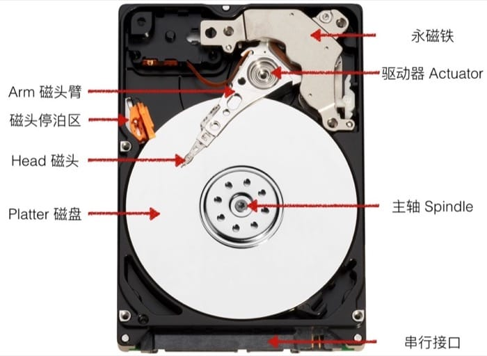

机械硬盘有许多片磁盘(platter)组成, 每一片磁盘有两面; 每一面由一圈圈的磁道(track)组成, 而每个磁道会被分隔成不同的扇区(sector). 这里概念层层递进, 可以结合下图仔细辨析清楚. 


上图是一个磁盘的视图, 多个磁盘组合起来是这样的: 

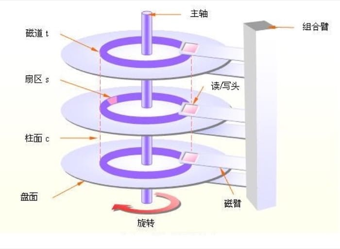

硬盘的容量指的是最大能存储的比特数, 通常用 GB 来做单位. 1 GB 相当于 10 的 9 次方个 Byte. 与硬盘的结构分层类似, 容量取决于下面三个方面: 

1. 记录密度(bits/in): track 中 1 英寸能保存的字节数
2. 磁道密度(tracks/in): 1 英寸直径能保存多少条 track
3. Areal 密度(bits/in 的平方): 上面两个数值的乘积

现在硬盘会把相邻的若干个磁道切分成小块, 每一块叫做记录区(recording zone). 记录区中的每条磁道都包含同样数量的扇区(sector); 但是每个记录区中包含的扇区和磁道的数目是不一样的, 外层的更多, 内层的更少; 正因为如此, 我们计算容量是, 用的是平均的数值. 

容量 Capacity = 每个扇区的字节数(bytes/sector) x 磁道上的平均扇区数(avg sectors/track) x 磁盘一面的磁道数(tracks/surface) x 磁盘的面数(surfaces/platter) x 硬盘包含的磁盘数(platters/disk)

举个例子, 假如一个硬盘有: 

512 bytes/sector

300 sectors/track (平均     )

20000 tracks/surface

2 surfaces/platter

5 platters/disk

总的容量为 = 512 x 300 x 20000 x 2 x 5 = 30, 720, 000, 000 = 30.72 GB

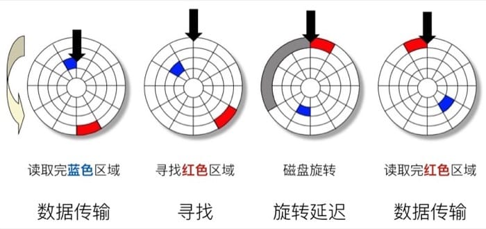

假设我们现在已经从蓝色区域读取完了数据, 接下来需要从红色区域读, 首先需要寻址, 把读取的指针放到红色区域所在的磁道, 然后等待磁盘旋转, 旋转到红色区域之后, 才可以开始真正的数据传输过程. 

总的访问时间 Taccess = 寻址时间 Tavg seek + 旋转时间 Tavg rotation + 传输时间 Tavg transfer

寻址时间 Tavg seek 因为物理规律的限制, 一般是 3-9 ms

旋转延迟 Tavg rotation 取决于硬盘具体的转速, 一般来说是 7200 RPM

传输时间 Tavg tranfer 就是需要读取的扇区数目

举个例子, 假设转速是 7200 RPM, 平均寻址时间 9ms, 平均每个磁道的 sector 数目是 400, 那么我们有: 

Tavg rotation = 1/2 x (60 secs / 7200 RPM) x 1000 ms/sec = 4 ms
Tavg transfer = 60 / 7200 RPM x 1/400 secs/track x 1000 ms/sec = 0.02 ms
Taccess = 9 ms + 4 ms + 0.02 ms
从这里可以看出, 主要决定访问时间的是寻址时间和旋转延迟; 读取一个扇区的第一个比特是非常耗时的, 之后的都几乎可以忽略不计; 硬盘比 SRAM 慢 40, 000 倍, 比 DRAM 慢 2500 倍. 

最后需要知道的就是逻辑分区和实际的物理分区的区别, 为了使用方便, 会用连续的数字来标志所有可用的扇区, 具体的映射工作由磁盘控制器完成. 

### 固态硬盘

接下来介绍一下固态硬盘, 内部结构如下

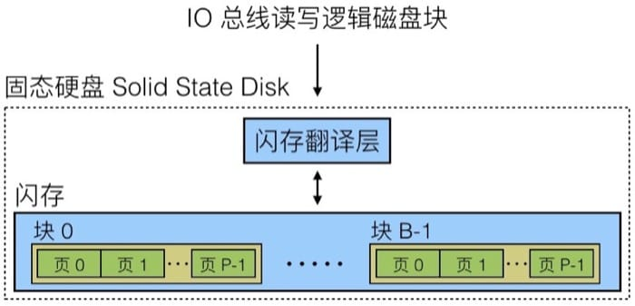

固态硬盘中分成很多的块(Block), 每个块又有很多页(Page), 大约 32-128 个, 每个页可以存放一定数据(大概 4-512KB), 页是进行数据读写的最小单位. 但是有一点需要注意, 对一个页进行写入操作的时候, 需要先把整个块清空(设计限制), 而一个块大概在 100, 000 次写入之后就会报废. 

与传统的机械硬盘相比, 固态硬盘在读写速度上有很大的优势. 但是因为设计本身的约束, 连续访问会比随机访问快, 而且如果需要写入 Page, 那么需要移动其他 Page, 擦除整个 Block, 然后才能写入. 现在固态硬盘的读写速度差距已经没有以前那么大了, 但是仍然有一些差距. 

不过与机械硬盘相比, 固态硬盘存在一个具体的寿命限制, 价格也比较贵, 但是因为速度上的优势, 越来越多设备开始使用固态硬盘. 

### 总线

总线是用来传输地址、 数据和控制信号的一组平行的电线, 通常来说由多个设备共享, 类似于不同城市之间的高速公路, 可以传输各类数据. CPU 通过总线和对应的接口来从不同的设备中获得所需要的数据, 放入寄存器中等待运算, 像下面这样: 

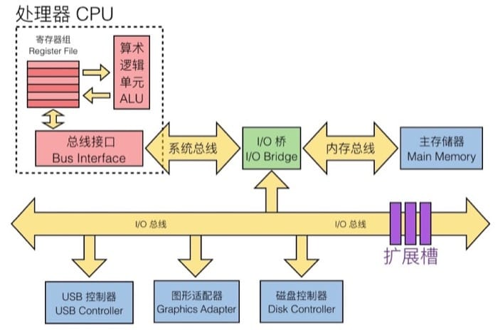

假设 CPU 需要从硬盘中读取一些数据, 会给定指令, 逻辑块编号和目标地址, 并发送给磁盘控制器. 然后磁盘控制器会读取对应的数据, 并通过 DMA(direct memory access)把数据传输到内存中; 传输完成后, 磁盘控制器通过中断的方式通知 CPU, 然后 CPU 完成之后的工作. 

总线上连接的各个设备, 其访问速度有天壤之别, 不同的技术发展速度不同, 更加剧了这个情况

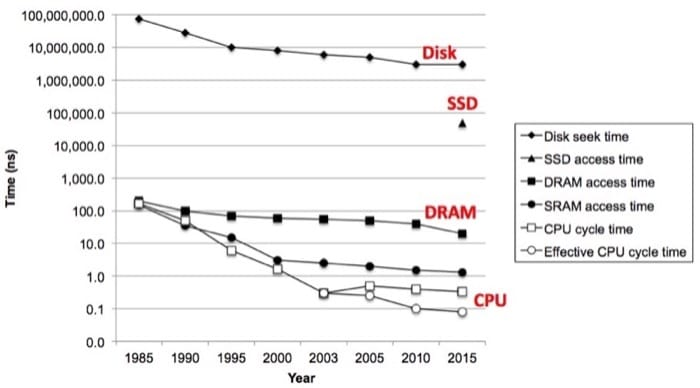

比方说磁盘的读写速度, 30 年大概只提高了一个数量级多一点, 所以固态硬盘的出现, 以下拯救了劳苦大众(提高了两个数量级), DRAM 的发展, 一路从 DDR12345 发展来, 速度大概提高了一个数量级, 不过 SRAM 则是在同一个起点愣是多跑了一个数量级, 总体来说是跟着 CPU 的发展走的. 不过 CPU 的发展在 2003 年也遇到了问题(单个核心基本到极限), 不过多核的出现以及技术优化, 总体来说还是使得执行速度越来越快. 

那么这么大的时间差距, 怎么办呢? 难道根据木桶理论, 都要取决于最慢的那个吗? 不一定! 局部性原理(Locality)可以在一定程度上拯救世界. 

### 局部性原理 Locality

局部性的思路很简单[2]: 

1. 时间局部性(Temporal Locality): 如果一个信息项正在被访问, 那么在近期它很可能还会被再次访问. 程序循环、 堆栈等是产生时间局部性的原因. 
2. 空间局部性(Spatial Locality): 在最近的将来将用到的信息很可能与现在正在使用的信息在空间地址上是临近的
3. 顺序局部性(Order Locality): 在典型程序中, 除转移类指令外, 大部分指令是顺序进行的. 顺序执行和非顺序执行的比例大致是5:1. 此外, 对大型数组访问也是顺序的. 指令的顺序执行、 数组的连续存放等是产生顺序局部性的原因. 

举个例子: 

``` 
sum = 0;
for (i = 0; i < n; i++) {
    sum += a[i];
}
return sum;
```

这里每次循环都会访问 sum 是满足时间局部性的; 数组的访问是连续的, 属于空间局部性. 

根据这个特性, 在写遍历数组的时候(尤其是高维), 尤其要注意按照内存排列顺序来访问, 不然性能会惨不忍睹. 

## 存储体系 Memory Hierarchy

一种介质的速度越快就会越贵, 同时也消耗更多的电量, 所以一般容量比较小. 而 CPU 和内存之间的速度差距越来越大, 所以好的程序都会尽可能利用局部性. 而根据这些特性, 引申出了安排存储的方式, 称为金字塔式存储体系(Memory Hierarch). 

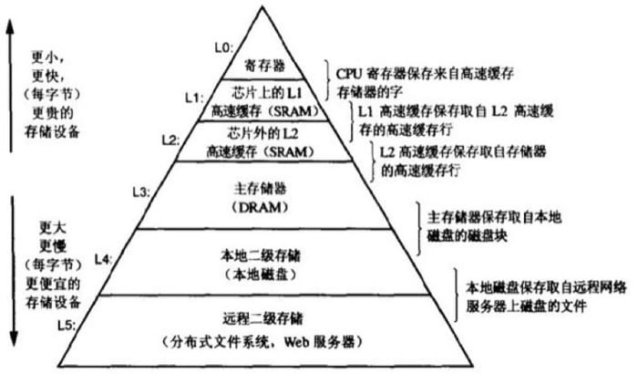

这里就涉及到一个技术: 缓存. 缓存可以看作是把大且缓慢的设备中的数据的一部分拿出来存储到其中的更快的存储设备. 在金字塔式存储体系[3]中, 每一层都可以看作是下一层的缓存. 利用局部性原理, 程序会更倾向于访问第 k 层的数据, 而非第 k+1 层, 这样就减少了访问时间. 

通过下表我们可以了解更多细节: 

| 缓存类型     | 缓存内容     | 缓存位置     | 延迟(时钟周期)     | 管理者        |
|-------------|-------------|-------------|------------------|--------------|
| 寄存器       | 4-8 字节的字 | CPU 内核    | 0                | 编译器        |
| TLB         | 地址翻译     | 芯片 TLB    | 0                | 内存管理单元   |
| L1 缓存     | 64 字节的块  | 芯片 L1 缓存 | 4                | 硬件         |
| L2 缓存     | 64 字节的块  | 芯片 L2 缓存 | 10               | 硬件         |
| 虚拟内存     | 4 KB 的页   | 主存        | 100              | 硬件+操作系统  |
| 缓冲区缓存   | 文件的部分内容 | 主存        | 100              | 操作系统      |
| 磁盘缓存     | 磁盘扇区     | 磁盘控制器   | 100, 000         | 磁盘固件      |
| 网络缓冲区缓存 | 文件的部分内容 | 本地磁盘     | 10, 000, 000     | NFS 客户端    |
| 浏览器缓存   | 网页        | 本地磁盘     | 10, 000, 000     | 网络浏览器    |
| Web 缓存    | 网页        | 远程服务器磁盘 | 1, 000, 000, 000 | Web 代理服务器 |

存储体系的设计, 可以说是利用最便宜的存储的价格, 提供了最快速的存储的性能. 在我看来真的是做到了『又要马儿跑, 又要马儿不吃草』! 在各种限制条件下能够找到如此优美的解决方案, 真可谓『带着镣铐跳舞』的最高境界! 

这里我们举一个具体的例子来感受一下存储体系的设计. 假设我们有一个包含 20 个元素的数组, 而目前在高速缓存中保存着前 10 个元素, 那么在访问数组元素的时候, 如果我们只用到前 5 个, 那么都可以从高速缓存中获取, 这种情况就叫做『缓存命中』, 要比内存的访问快得多. 而如果访问了缓存中没有的元素, 就需要从内存中获取了, 由于高速缓存大小的限制, 还需要对其中的元素进行替换(具体之后会介绍). 

### 缓存未命中的类型

缓存未命中有三种, 这里进行简要介绍

* 强制性失效(Cold/compulsory Miss): CPU 第一次访问相应缓存块, 缓存中肯定没有对应数据, 这是不可避免的
* 冲突失效(Confilict Miss): 在直接相联或组相联的缓存中, 不同的缓存块由于索引相同相互替换, 引起的失效叫做冲突失效
    - 假设这里有 32KB 直接相联的缓存
    - 如果有两个 8KB 的数据需要来回访问, 但是这两个数组都映射到相同的地址, 缓存大小足够存储全部的数据, 但是因为相同地址发生了冲突需要来回替换, 发生的失效则全都是冲突失效(第一次访问失效依旧是强制性失效), 这时缓存并没有存满
* 容量失效(Capacity Miss): 有限的缓存容量导致缓存放不下而被替换, 被替换出去的缓存块再被访问, 引起的失效叫做容量失效
    - 假设这里有 32KB 直接相联的缓存
    - 如果有一个 64KB 的数组需要重复访问, 数组的大小远远大于缓存大小, 没办法全部放入缓存. 第一次访问数组发生的失效全都是强制性失效. 之后再访问数组, 再发生的失效则全都是容量失效, 这时缓存已经存满, 容量不足以存储全部数据

### 深入理解高速缓冲存储器 Cache Memory

高速缓存存储器(Cache Memory)是 CPU 缓存系统甚至是金字塔式存储体系中最有代表性的缓存机制, 前面我们了解了许多概念, 这一节我们具体来看看高速缓存存储器是如何工作的. 

首先要知道的是, 高速缓存存储器是由硬件自动管理的 SRAM 内存, CPU 会首先从这里找数据, 其所处的位置如下(蓝色部分): 

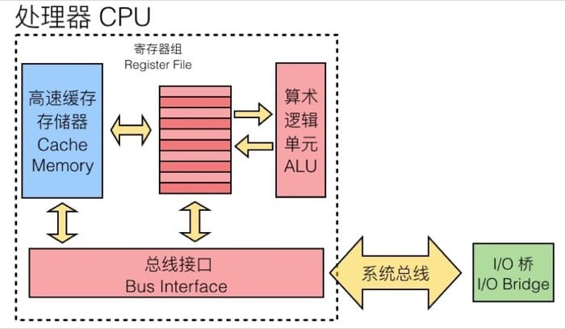

然后我们需要关注高速缓冲存储器的三个关键组成部分(注意区分大小写): 

* S 表示集合(set)数量
* E 表示数据行(line)的数量
* B 表示每个缓存块(block)保存的字节数目

在图上表示出来就是

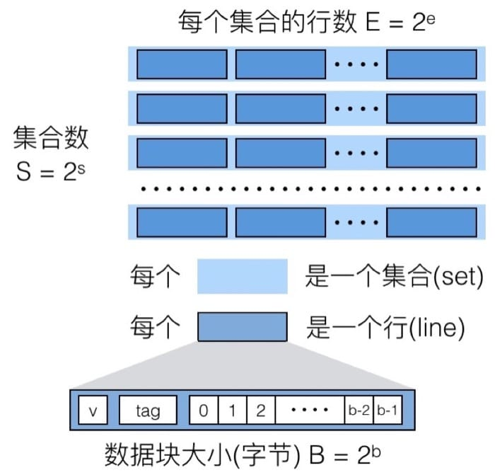

所以缓存中存放数据的空间大小为: 

$$C = S \times E \times B $$

实际上可以理解为三种层级关系, 对应不同的索引, 这样分层的好处在于, 通过层级关系简化搜索需要的时间, 并且和字节的排布也是一一对应的(之后介绍缓存的时候就体现得更加明显). 

当处理器需要访问一个地址时, 会先在高速缓冲存储器中进行查找, 查找过程中我们首先在概念上把这个地址划分成三个部分: 

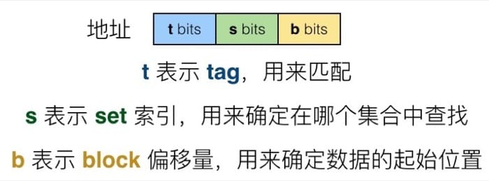

## 读取

具体在从缓存中读取一个地址时, 首先我们通过 set index 确定要在哪个 set 中寻找, 确定后利用 tag 和同一个 set 中的每个 line 进行比对, 找到 tag 相同的那个 line, 最后再根据 block offset 确定要从 line 的哪个位置读起(这里的而 line 和 block 是一个意思). 

当 E=1 时, 也就是每个 set 只有 1 个 line 的时候, 称之为直接映射缓存(Direct Mapped Cache), 如下图所示

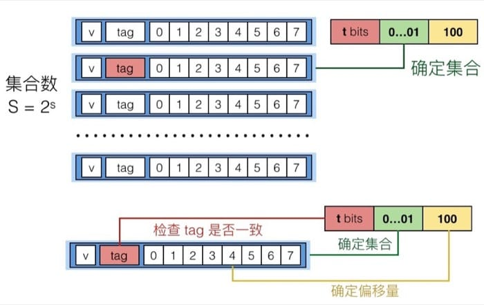

这种情况下, 因为每个 set 对应 1 个 line, 反过来看, 1 个 line 就需要一个 set, 所以 set index 的位数就会较多(和之后的多路映射对比). 具体的检索过程就是先通过 set index 确定哪个 set, 然后看是否 valid, 然后比较那个 set 里唯一 line 的 tag 和地址的 t bits 是否一致, 就可以确定是否缓存命中. 

命中之后根据 block offset 确定偏移量, 因为需要读入一个 int, 所以会读入 4 5 6 7 这四个字节(假设缓存是 8 个字节). 如果 tag 不匹配的话, 这行会被扔掉并放新的数据进来. 

然后我们来看一个具体的例子, 假设我们的寻址空间是 M=16 字节, 也就是 4 位的地址, 对应 B=2, S=4, E=1, 我们按照如下顺序进行数据读取: 

0 00 0, miss
0 00 1, hit
0 11 1, miss
1 00 0, miss
0 00 0, miss
缓存中的具体情况是, 这里 x 表示没有任何内容

``` bash
       v Tag Block
Set 0  1   0    M[0-1]
Set 1  x   x      x
Set 2  x   x      x
Set 3  1   0    M[6-7]
```

缓存的大小如图所示, 对应就是有 4 个 set, 所以需要 2 位的 set index, 所以进行读入的时候, 会根据中间两位来确定在哪个 set 中查找, 其中 8 和 0, 因为中间两位相同, 会产生冲突, 导致连续 miss, 这个问题可以用多路映射来解决. 

当 E 大于 1 时, 也就是每个 set 有 E 个 line 的时候, 称之为 E 路联结缓存. 这里每个 set 有两个 line, 所以就没有那么多 set, 也就是说 set index 可以少一位(集合数量少一倍). 

再简述一下整个过程, 先从 set index 确定那个 set, 然后看 valid 位, 接着利用 t bits 分别和每个 line 的 tag 进行比较, 如果匹配则命中, 那么返回 4 5 位置的数据, 如果不匹配, 就需要替换, 可以随机替换, 也可以用 least recently used(LRU) 来进行替换. 

我们再用刚才的例子来看看是否会增加命中率, 这里假设我们的寻址空间是 M=16 字节, 也就是 4 位的地址, 对应 B=2, S=2, E=2, 我们按照如下顺序进行数据读取: 

0 00 0, miss
0 00 1, hit
0 11 1, miss
1 00 0, miss
0 00 0, hit

缓存中的具体情况是, 这里 x 表示没有任何内容

``` bash
       v   Tag   Block
Set 0  1   00    M[0-1]
Set 0  1   10    M[8-9]
Set 1  1   01    M[6-7]
Set 1  0   x     x
```

可以看到因为每个 set 有 2 个 line, 所以只有 2 个 set, set index 也只需要 1 位了, 这个情况下即使 8 和 0 的 set index 一致, 因为一个 set 可以容纳两个数据, 所以最后一次访问 0, 就不会 miss 了. 

## 写入

在整个存储层级中, 不同的层级可能会存放同一个数据的不同拷贝(如 L1, L2, L3, 主内存, 硬盘). 如果发生写入命中的时候(也就是要写入的地址在缓存中有), 有两种策略: 

1. Write-through: 命中后更新缓存, 同时写入到内存中
2. Write-back: 直到这个缓存需要被置换出去, 才写入到内存中(需要额外的 dirty bit 来表示缓存中的数据是否和内存中相同, 因为可能在其他的时候内存中对应地址的数据已经更新, 那么重复写入就会导致原有数据丢失)

在写入 miss 的时候, 同样有两种方式: 

1. Write-allocate: 载入到缓存中, 并更新缓存(如果之后还需要对其操作, 这个方式就比较好)
2. No-write-allocate: 直接写入到内存中, 不载入到缓存

这四种策略通常的搭配是: 

Write-through + No-write-allocate

Write-back + Write-allocate

其中第一种可以保证绝对的数据一致性, 第二种效率会比较高(通常情况下). 

## 总结

这一讲我们从 RAM 和硬盘讲起, 简单了解了计算机系统中用来存储数据的硬件, 然后主要介绍了高速缓冲存储器(Cache Memory)的结构和工作方式. 

说到底, 缓存就是要尽量利用局部性原理, 这个是一个非常值得探讨的话题, 会在【读厚 CSAPP】IV Cache Lab用具体实例中详细介绍. 

## 参考链接

1. [随机存取存储器](https://zh.wikipedia.org/wiki/%E9%9A%8F%E6%9C%BA%E5%AD%98%E5%8F%96%E5%AD%98%E5%82%A8%E5%99%A8)
2. [局部性原理](https://baike.baidu.com/item/%E5%B1%80%E9%83%A8%E6%80%A7%E5%8E%9F%E7%90%86)
3. [CPU缓存](https://zh.wikipedia.org/wiki/CPU%E7%BC%93%E5%AD%98)

