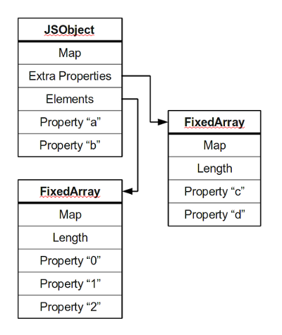

# V8 之旅: 对象表示

在前一篇文章中, 我们观察了V8的简单编译器——Full Compiler. 在我们继续观察Crankshaft之前, 为更好地理解它, 我们首先来看看V8在内存中如何表达对象.

本文来自Jay Conrod的A tour of V8: object representation, 其中的术语、代码请以原文为准.

## 概览

简易的图表或许是了解对象表示的最为快速直观的方法.



所有的对象内存区都会有一个Map指针, 用以描述该对象的结构. 绝大多数对象将其自身的属性存放在一块内存中("a"和"b"); 附加的命名属性通常会存放在一个单独的数组中("c"和"d"); 而数字式的属性则单独存放在另一个地方, 通常是一个连续的数组.

这张图仅仅表示已被优化的JS对象的通常状态, 另有一些状态来处理其他情况. 如果你对此抱有兴趣, 继续读下文吧.

## 属性的怪异属性

V8有它的难处: JavaScript标准中允许开发者以非常灵活的方式定义对象, 因此很难用一种形式来高效地表示对象. 一个对象基本上就是一堆属性的集合: 也就是一群键值对. 你可以以两种方式来访问对象的属性:

	obj.prop
	obj["prop"]

根据标准, 属性的名称永远是字符串. 如果你用不是字符串的东西来作为属性的名称, 那它将会被隐式转换为字符串. 所以一个怪异的情况就是, 如果用数字作为属性名, 则数字也会被转换为字符串(至少根据标准就是这样). 因此, 你可以以小数或者负数来作为下标.

	obj[1]; //
	obj["1"]; // 这些都是同一个属性哦
	obj[1.0]; //

	var o = {
	  toString: function() {
	    return "-1.5";
	  }
	};
	obj[-1.5]; // 这俩也是同一个属性
	obj[o]; // 因为o转换成了字符串

数组在JS中也只是带有神奇length属性的对象. 大多数数组的属性名都是非负整数, 而length的值则来计算于这些属性名中最大的那个加一, 比如:

	var a = new Array();
	a[100] = "foo";
	a.length; // 返回101

除此之外数组和普通的对象没什么区别. 函数也是对象, 只不过它们的length属性返回的是其定义的参数个数.

## 字典模式

译注, 也即哈希表模式

既然JavaScript中的对象就是键值对映射, 为何不直接以哈希表来表示对象呢? 这种方式没什么问题, V8内部实际上也用了这样的方式来表达一些难以用优化形式表达的对象(后文详述). 但访问哈希表中的值要比访问指定偏移的值慢多了.

我们来看看字符串和哈希表在V8中如何工作. 字符串有多种表达方式, 用来表示属性名的是最常见的ASCII码序列——所有字符挨个排列, 每个字符1字节.

```bash
	0:  map (字符串类型)
	4:  length (字符数)
	8:  hash code (惰性计算而来)
	12: characters...
```

译注: 左边是偏移量, 右边是该偏移量起始内存存放的值含义; 从0开始, 除最后一处外每个要素占用4字节, 最后一处则是长度为length的字符

字符串通常不可变, 唯一可能变的是惰性计算而来的哈希值. 用做属性名的字符串被称为符号, 这意味着它必须独有(译注: 原文uniquified, 意思是这个字符串对象不会因为在其他地方也引用了, 导致其它地方可以对这个对象的内部进行修改), 非独有的字符串如果被用作属性名, 都会被单独复制一份出来, 以便不受其它修改的影响.

V8中的哈希表由一个包含键和值的大数组组成. 初始时, 所有的键和值都被初始化为undefined(一个特殊值), 当有键值对插入到哈希表中时, 键的哈希值被计算出来, 其低位被用作数组的下标. 如果数组的该位置已经被占用, 则哈希表尝试(取模过后的)下一个位置, 以此类推. 以下是这一过程的伪代码:

```bash
	insert(table, key, value):
		table = ensureCapacity(table, length(table) + 1)
		code = hash(key)
		n = capacity(table)
		index = code (mod n)
		while getKey(table, index) is not undefined:
			index += 1 (mod n)
		set(table, index, key, value)

	lookup(table, key):
		code = hash(key)
		n = capacity(table)
		index = code (mod n)
		k = getKey(table, index)
		while k is not null or undefined
				and k != key:
			index += 1 (mod n)
			k = getKey(table, index)
		if k == key:
			return getValue(table, index)
		else:
			return undefined
```

由于符号字符串是独有的, 这里的hash code至多计算一次, 计算该值和对比键值通常都很快. 然而这一算法仍然不够简单, 导致于每次访问对象的属性都会慢下来. V8会尽可能地避免这种表达方式.

## 快速的对象内属性

在Lars Bak(V8的缔造团队领导者)2008年的这段视频当中, 他讲述了一种可以在通常情况下更快速访问属性的对象表达方式. 考虑如下的构造函数:

	function Point(x, y) {
	  this.x = x;
	  this.y = y;
	}

像这样的构造函数是最为多见的. 绝大多数时间里, 同一构造函数所产生的对象会拥有以相同顺序赋值的相同属性. 既然这些对象有着如此类似的结构, 我们在内存中就可以以这样相同的结构来布局这些对象.

V8将这种描述对象的方式称为Map. 你可以假想Map为一张填满描述符的表, 每一项都表示一个属性. Map也包含其他信息, 比如对象的大小以及指向构造函数和原型的指针等, 但这里我们主要关注这些描述符. 同样结构的对象, 通常会共享同一个Map. 一个完成初始化的Point实例可能就像这样:

```bash
	Map M2
		object size: 20 (2个属性的空间)
		"x": FIELD at offset 12
		"y": FIELD at offset 16
```

现在你可能会想到, 不是所有的Point实例都有相同的属性. 当Point的实例刚刚在内存中开辟空间时(在构造函数中的代码真正执行前), 它是没有任何属性的, Map M2并不符合它的结构. 另外, 我们也可以在构造函数完成后随时为它增加新的其他属性.

V8处理通过一种特殊的描述符来处理这种情形: Transition. 当增加一个新的属性时, 除非迫不得已, 我们不会创建新的Map, 而是尽可能使用一个现存符合结构的Map. Transition描述符就是用来指向这些Map的.

```bash
	Map M0
		"x": TRANSITION to M1 at offset 12

	this.x = x;

	Map M1
		"x": FIELD at offset 12
		"y": TRANSITION to M2 at offset 16

	this.y = y;

	Map M2
		"x": FIELD at offset 12
		"y": FIELD at offset 16
```

在上面的例子中新的Point实例从没有任何Field的M0开始; 在第一次赋值时, 对象的Map指针指向了M1, 属性x的值存放在了偏移量12的位置; 在第二次赋值时, Map指针指向了M2, 属性y的值放在了偏移量16的位置.

如果在M2的基础上再新增属性呢?

```bash
	Map M2
		"x": FIELD at offset 12
		"y": FIELD at offset 16
		"z": TRANSITION to M3 at offset 20

	this.z = z;

	Map M3
		"x": FIELD at offset 12
		"y": FIELD at offset 16
		"z": FIELD at offset 20
```

如果新增的属性之前没有, 则我们会通过复制M2创建一个新的Map, M3, 然后将一个新的FIELD描述符增加在M3上. 同时我们要在M2上增加一个TRANSITION描述符. 注意, 新增TRANSITION是修改Map为数不多的情况之一, 通常Map是不可变的.

如果对象的属性并不是以相同的顺序出现呢? 比如:

	function Point(x, y, reverse) {
	  if (reverse) {
	    this.x = x;
	    this.y = y;
	  } else {
	    this.y = x;
	    this.x = y;
	  }
	}

在这种情况下, 我们最终会得到一个Transition树, 而不是链. 初始的Map(上面的M0)将会有两个Transition, 具体代码中转向哪个, 会根据x和y的赋值顺序来定. 正因为这样, 不是所有的Point都会有相同的Map了.

这正是事情变糟的地方. V8对于这样的小规模分支情形可以容忍, 但如果你的代码中充斥着以同一个构造函数得出的随机赋值对象, V8就会将其退化到字典模式, 将属性存放在哈希表中. 否则就会有大量的Map涌现.

## 对象内的稀疏追踪

你可能好奇V8如何确定为一个对象保留多少内存. 很明显, 我们不希望每次增加属性都重新开辟内存, 同时也不想为一个小对象预留大片的内存. V8使用一个叫做对象内稀疏追踪(译注, 原文: In-object slack tracking)的办法来确定为构造函数的新实例分配多少内存.

一开始, 构造函数所产生的对象会被分配较多的内存: 足够存放32个快速属性的内存. 一旦该构造函数实例化了足够多次(最后一次看的时候是8次), V8就会选取其中最大的实例, 通过Transition指针遍历该构造函数对应的Map. 新实例分配的内存, 将直接使用遍历得来的最大内存值. 而最开始实例化出来的对象, 也采用了非常精明的方式来缩减内存占用. 当对象初始化时, 对象所得的内存将以接近垃圾回收器可回收内存的形式出现. 由于对象的Map标明了它的内存占用大小, 垃圾回收器不会直接回收这片内存. 直到稀疏追踪的过程完成之后, Map中的内存大小被重新修正, 相应对象的内存占用也就小了. 此时垃圾回收器会回收掉这些已经是可回收的内存, 而原先的对象也无需重新挪动.

现在我估计你的下一个问题是, "如果一个对象在稀疏追踪结束之后又增加了新的属性呢?". 这就要依靠一个单独的数组来存放这些附加的属性. 只要有属性加入, 这个数组随时可以重新分配为更大的数组.

译注: 回忆一下文章开始的那张图吧

## 成员函数与原型

JavaScript没有类, 因此它的成员函数调用与C++及Java不同. JavaScript中的成员函数只是普通的属性. 在下面的例子中, distance只是Point对象的一个属性, 它指向PointDistance函数. JavaScript中的任何函数都可以作为成员函数, 并且通过this来访问其目标对象.

译注: 在C++中, obj.method(param)实际是C代码method(this, param)的语法糖, 因此this指针实际是函数的目标对象, 而不是函数的发起者.

	function Point(x, y) {
	  this.x = x;
	  this.y = y;
	  this.distance = PointDistance;
	}

	function PointDistance(p) {
	  var dx = this.x - p.x;
	  var dy = this.y - p.y;
	  return Math.sqrt(dx * dx, dy * dy);
	}

如果distance像普通的对象内属性一样对待, 那很显然会占用大量的内存空间, 原因是每一个Point实例都会有一个Field来存放这个共同的属性. 对于有大量成员函数的对象更是如此. 我们可以对此改进.

C++解决这个问题的方法是虚表(译注: 原文v-table). 虚表是一个存放各个虚函数指针的数组. 带有虚函数的类的每个实例, 都会有一个指向该类虚表的指针. 当你调用虚函数时, 程序会读取虚表, 并按照虚表中该虚函数的地址跳转执行. 在V8中, 我们已经有了这么一个类似的表, 它就是Map.

为了让Map有类似虚表的功能, 我们需要为其增加一种新的描述符: Constant Function. CF类型的描述符表示该对象有一个已知名称的属性, 该属性不存放在对象中, 而是直接尾随描述符.

	

```bash
	Map M0
		"x": TRANSITION to M1 at offset 12

	this.x = x;

	Map M1
		"x": FIELD at offset 12
		"y": TRANSITION to M2 at offset 16

	this.y = y;

	Map M2
		"x": FIELD at offset 12
		"y": FIELD at offset 16
		"distance": TRANSITION to M3 

	this.distance = PointDistance;

	Map M3
		"x": FIELD at offset 12
		"y": FIELD at offset 16
		"distance": CONSTENT_FUNCTION 
```

注意, 转换到另一个Map只会在描述符的函数与实际函数一致时才会发生. 因此如果程序员对PointDistance重新赋值为另一个值, 则该Transition不再有效, Map也会重新创建. 同时注意, 我们并不像虚表那样仅仅是跳转到虚函数, 而是会生成一个包含函数地址的优化代码, 以便在下次执行时, 一旦发现对象使用的Map是这个Map并要调用该函数, 则直接跳转过去.

JavaScript中还有另一种方法来提供公共属性, 那就是通过构造函数所关联的原型对象. 对于一个构造函数的实例来说, 原型对象所拥有的属性, 它也可以直接使用. 举例来说:

	function Point(x, y) {
	  this.x = x;
	  this.y = y;
	}

	Point.prototype.distance = function(p) {
		var dx = this.x - p.x; 
		var dy = this.y - p.y; 
		return Math.sqrt(dx*dx, dy*dy); 
	}

	...
	var u = new Point(1, 2); 
	var v = new Point(3, 4); 
	var d = u.distance(v); 
这样的代码随处可见, 同时也是实现继承的一种范式, 因为原型还可以有自己的原型.instanceof操作符所针对的就是原型链.

和普通对象一样, V8也会将原型的成员函数以CF描述符来表示. 调用原型的函数会比直接调用对象自己的函数略慢, 因为编译器不仅需要检查目标对象的Map, 同时也要检查原型链上的其他Map. 但这不会产生大的性能问题, 对于开发者来说也不应影响代码书写.

## 数字式属性: Fast Element

至此, 我们已经讨论了普通属性和方法, 并且假设对象总是以相同顺序构造相同的属性. 但这对于数字式的属性(以下标的形式来访问的数组元素)并不成立, 同时任何对象都有可能像数组一样使用, 因此我们需要对数组一样的对象区别对待. 记住, 根据标准, 所有的属性都必须是字符串, 其他类型会先转换为字符串.

我们将属性名为非负整数(0、1、2……)的属性称为Element. V8中, Element的存放和其他属性是分开的. 每个对象都有一个指向Element数组的指针, 对象Map中的Element Field将反映出Element是如何存储的. 注意, Map中并不包含Element的描述符, 但可能包含其它有着不同Element类型的同一种Map的Transition描述符(译注: 换言之, 一个Map只对应一种Element数组, 如果Element数组的类型不同, 会形成一个Transition.). 大多数情况下, 对象都会有Fast Element, 也就是说这些Element以连续数组的形式存放. 有三种不同的Fast Element:

* Fast small integers
* Fast doubles
* Fast values

根据标准, JS中的所有数字都理应以64位浮点数形式出现, 尽管我们平时处理的都是整数. 因此V8尽可能以31位带符号整数来表达数字(最低位总是0, 这有助于垃圾回收器区分数字和指针). 因此含有Fast small integers类型的对象, 其Element类型只会包含这样的数字. 如果需要存储小数、大整数或其他特殊值, 如-0, 则需要将数组提升为Fast doubles. 于是这引入了潜在的昂贵的复制-转换操作, 但通常不会频繁发生. Fast doubles仍然是很快的, 因为所有的数字都是无封箱存储的. 但如果我们要存储的是其他类型, 比如字符串或者对象, 则必须将其提升为普通的Fast Element数组.

JavaScript不提供任何确定存储元素多少的办法. 你可能会说像这样的办法, new Array(100), 但实际上这仅仅针对Array构造函数有用. 如果你将值存在一个不存在的下标上, V8会重新开辟更大的内存, 将原有元素复制到新内存. V8可以处理带空洞的数组, 也就是只有某些下标是存有元素, 而期间的下标都是空的. 其内部会安插特殊的哨兵值, 因此试图访问未赋值的下标, 会得到undefined.

当然, Fast Element也有其限制. 如果你在远远超过当前数组大小的下标赋值, V8会将数组转换为字典模式, 将值以哈希表的形式存储. 这对于稀疏数组来说很有用, 但性能上肯定打了折扣, 无论是从转换这一过程来说, 还是从之后的访问来说. 如果你需要复制整个数组, 不要逆向复制(索引从高到低), 因为这几乎必然触发字典模式.

	// 这会大大降低大数组的性能
	function copy(a) {
	  var b = new Array();
	  for (var i = a.length - 1; i >= 0; i--)
	    b[i] = a[i];
	  return b;
	}

由于普通的属性和数字式属性分开存放, 即使数组退化为字典模式, 也不会影响到其他属性的访问速度(反之亦然).

## 总结

这篇文章中我们观察了V8内部是如何表示对象及其属性的. V8为通用接口提供了针对具体场景可切换的数据存储模型, 这作为VM语言的一项优势, 对于编译型语言来说是难以企及的: 那些语言要么只能小范围优化, 要么则依赖于程序员对对象结构的控制.

在接下来的文章中, 我们要观察V8的优化编译器——Crankshaft, 以及它是如何利用本文中的这些结构优势来生成高效代码的.