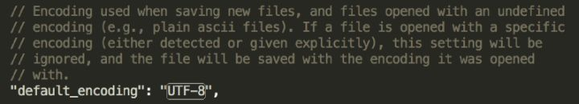

<!--
Created: Mon Aug 26 2019 15:22:52 GMT+0800 (China Standard Time)
Modified: Fri Aug 30 2019 14:39:16 GMT+0800 (China Standard Time)
-->
# Text encoding

我们经常听到纯文本格式和二进制编码, 什么是纯文本, 什么是二进制呢? 以一个例子做说明. 新建一个文件叫hello.txt, 内容为:

``` code
// code
hello, world
```

这个文件有12个字节:

借助Node.js可以看这个文件在硬盘的原始二进制存储是什么, 如下代码:

``` js
let fs = require("fs");
// 读取原始二进制内容
let buffer = fs.readFileSync("hello.txt");
console.log(buffer);
```

运行后控制台输出12个字节的二进制内容(以十六进制显示):

``` bash
# bash
<Buffer 68 65 6c 6c 6f 2c 20 77 6f 72 6c 64>
```

参考ASCII表, 我们发现这些数字刚好是英文对应的ASCII编码, 如下图所示:


如果这个文本文件以utf-8读取的方式:

``` js
let fs = require("fs");
let text = fs.readFileSync("hello.txt", "utf-8");
console.log(text);
```

输出的就是文本:

``` bash
# bash
hello world!
```

这里看到了两种截然不同的输出结果, 但实际上不管是纯文本文件还是二进制文件, 硬盘或者内存里存储的都是0101, 就看你如何解读它, 或者说怎么解码.(只不过我们通常说的纯文本是指那种能够解码成可读文本的格式, 二进制文件格式指那种无法用UTF-8等文本解码的文件如图片.)

如下图所示:


如果认为是UTF-8的话, 一个编码可以对应一个文字. 文字的字形又是怎么来的呢? 它是在字体文件里面, 以svg矢量格式存储着每个字符的形状. 究竟什么是UTF/UTF-8编码呢?

## UTF编码

1个字节最多只表示0 ~ (2^8 – 1)共256个字符, ASCII使用7位表示128个字符, 能够满足现代英语的要求, 对于特殊符号, 亚洲语言, Emoj又应该如何表示? 我们按上面的方法, 查看以下包含中文和Emoji字符的文件存储的是什么:

we 发 财 ?
如下图所示:


其中20是空格的编码, 可以看到一个英文还是1个字节, 一个中文用了3个字节, 而一个Emoj用了4个字节. 它怎么知道每次应该读取多少个字节呢? 如下图所示:


如果一个字节是0开头, 表示这个字节就表示一个字符, 如果是3个1开头表示这个字符要占3个字节, 有多少个1就表示当前字符占用了多少个字节. 这个就是UTF-8的存储特点, UTF规定了每个字符的编号, 而UTF-8定义了字符应该怎么存储. 从unicode官网可以查到, "我"的UTF编码是6211, 如下图所示:


6211怎么变成utf-8编码呢? 因为6211落在下面这个范围:

``` bash
# bash
U+ 0800 ~ U+ FFFF: 1110XXXX 10XXXXXX 10XXXXXX
```

所以是这么转的:


"我"的utf-8就是E6 88 91, 可以对比encodeURIComponent的结果:


可以说utf-8让utf得到了实现, utf-8是当前互联网上使用最广的文本编码方式. 除了utf-8还有utf-16, 它们和utf的转换关系如下所示:

``` bash
# bash
UTF-8 
U+ 0000 ~ U+ 007F: 0XXXXXXX
U+ 0080 ~ U+ 07FF: 110XXXXX 10XXXXXX 
U+ 0800 ~ U+ FFFF: 1110XXXX 10XXXXXX 10XXXXXX 
U+10000 ~ U+10FFFF: 11110XXX 10XXXXXX 10XXXXXX 10XXXXXX

UTF-16 
U+0000 - U+FFFF         xxxxxxxx xxxxxxxx
U+10000 - U+10FFFF   110110xx xxxxxxxx 110111xx xxxxxxxx
```

utf-8的优点在于一个英文只要一个字节, 但是一个中文却是3个字节, utf-16的优点在于编码长度固定, 一个中文只要两2个字节, 但是一个英文也要两个字节. 所以对于英文网页utf-8编码更加有利, 而对于中文网页使用utf-16应该更加有利. 因为绝大部分的中文都是落在U+0000到U+FFFF. 而对于Emoj这种不太常用排在后面的符号, 不管是utf-8还是utf-16都需要4个字节. 同时utf-32都是固定4个字节.

完整的UTF编码可以在官网查到, 这里列一些符号及其编码的范围, 如下图所示:


中文汉字是从4E00到9FFF, 大约有两万个. FXXXX和10XXXX的编码是用于自定义的, 如可以用于图标字体, 但是图标字体通常没有使用这个范围, 而是用更简短的编码, 这些编码刚好映射到其它正常字符集如繁体字, 这样就导致图标字体还没加载好之前系统会使用默认的字体, 页面就会先显示繁体字然后再恢复成图标. 这种问题在安卓手机会出现.

我们可以直接在html上使用UTF编码, 如:


那么网页上将会显示:


这个也叫html实体(entity), 通常用于特殊符号的转义或者图标字体.

然后我们再讨论下乱码.

乱码
用文本编辑器打开一个二进制文件, 例如打开一个图片文件:


很多文本编辑器默认是使用utf-8编码, 如submlime:



每个编码如果对应一个符号就显示出来, 但是这些符号连起来看起来比较乱, 所以就"乱码"了.

这里举一个实际的乱码问题, windows的压缩包, 在mac解压文件名通常会乱码, 如下图所示, 这是为什么呢?


windows的默认编码方式是ANSI, 使用windows自带的文本编辑器可以保存以下几种编码:


ANSI根据locale, 简体中文是使用GBK. 什么是GBK呢? GBK是中文的地方性编码, 如"我"的GBK编码是CED2, 最开始的中文编码标准是GB2312, 收录了6000多个常用汉字, 后来又出了GBK, 把繁体字收进去了, 再后来又出了GB18030把少数民族的语言收录了, 各种编码关系如下图所示:


但是Mac的软件一般是使用utf-8, 中文应该是3个字节, 但是现在只有2个字节, 还对不上, 所以解压的时候就变成了其它的符号, 看起来乱码了. Mac可以装一个叫the unarchive的软件, 它有算法自动检测字符编码:


用它解压的文件名就没有问题. 另外, 很多代码编辑器一般默认是使用utf-8, 在windows自带的文本编辑器保存的txt在这种编辑器打开将会乱码:


当选择了正确的编码方式后显示就正常了

关于文字编码还有一个经常会遇到的问题, 那就是回车与换行.

### 字符串长度

Java和JS的字符串都是使用UTF-16编码, 因为它有长度比较固定的优势, 不像UTF-8字节数可能从1变到4. 如下图所示:


英文和中文长度都是1, 而Emoj的长度是2, 因为长度单位是2个字节作为1, Emoj的需要4个字节, 因此长度是2.

可以使用charCodeAt返回当前字符的utf编码:


如果是要检测中文的话可以使用正则表达式, 看当前符号是否落在中文编码的范围内:


在Mysql里面, 如果一个字段的类型为VARCHAR(10)的话, 那么它最多可以存储10个英文或者10个中文, 如果这个字段使用的是默认的utf-8编码, 那么它需要占10 * 3 = 30个字节, 如果使用了GBK编码, 那么它需要使用10 * 2 = 20个字节.

### meta charset标签

我们通常会给页面head标签加一个charset的meta, 指明当前页面的编码方式:

``` html
<!-- html -->
<meta charset="utf-8">
```

在html4里面是这么写的:

``` html
<!-- html -->
<meta http-equiv="Content-Type" content="text/html; charset=utf-8" />
```

这两个作用一样, 只是后者已经过时. 这个编码究竟有什么用呢?

以下以code.html作为研究:

``` html
<!-- html -->
<!DOCType html>
<html>

<head>
    <meta charset="utf-8">
</head>

<body>
    你好world
</body>

</html>
```

然后我们用Node.js写一个最简单的server:

``` bash
# bash
let http = require("http");
let fs = require("fs");

http.createServer((req, res) => {
    let content = fs.readFileSync("./code.html", "utf-8");
    console.log(req.url);
    res.end(content);
}).listen("8125", err => {
    if (err) {
        console.log(err);
    } else {
        console.log("Server start, listening on http://localhost:8125");
    }
});
```

运行, 然后访问localhost:8125, 页面正常显示

现在我把charset改成gbk:

``` bash
# bash
<meta charset="gbk">
```

然后重新刷新页面, 就不正常了:

但是如果我在Node.js的server里面设置Content-Type的响应头的charset为utf-8的话:

``` js
res.setHeader("Content-Type", "text/html; charset=utf-8");
```

从浏览器控制台可以看到这个响应头:

不管meta标签里面设置的是什么编码, 页面都能正常显示.

所以根据我们的观察meta标签只有在http的响应头里没有设置charset的时候才会起作用.

本篇讨论了utf/utf-8/utf-16的关系, utf是国际标准, 规定了每个字符的编码, 而utf-8/utf-16决定了utf该如何存储与读取, utf-8的优点是对于英文比较有利, 比较节省空间, utf-16对于中文比较有利. 但是如果西方国家使用utf-8, 然后东方国家使用utf-16, 那么互联网可能就乱了, 所以从统一标准的角度我们还是使用utf-8. 还讨论了GBK编码和乱码的问题, 如果一个字符存的时候是用的一种编码, 但是读的时候却用的另一种编码, 那就会对不上原先的字符, 就会出现乱码的情况. 另外, 由于utf-16编码长度比较固定, 所以JS和Java使用了utf-16做为它们在内存里字符串的编码. 根据实验, meta的charset标签在没有设置响应头的charset时可以起作用.

总之字符编码是一个很大的话题, 本篇主要讨论了和web关系比较大的部分, 还列了平时会遇到的几个问题. 相信看完本文, 你对文字编码应该有了一个比较好的理解.

