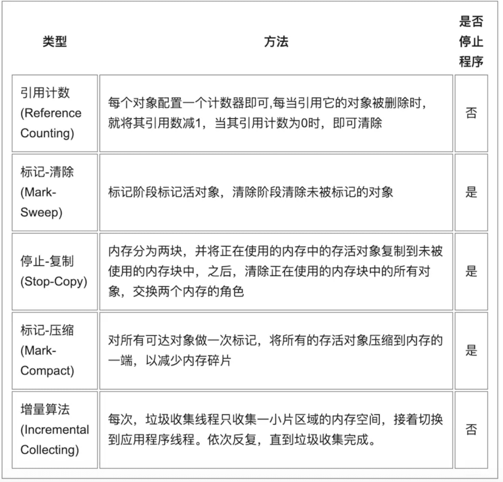
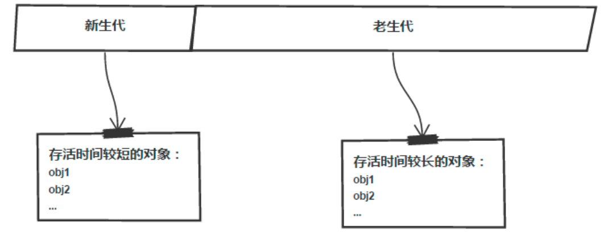
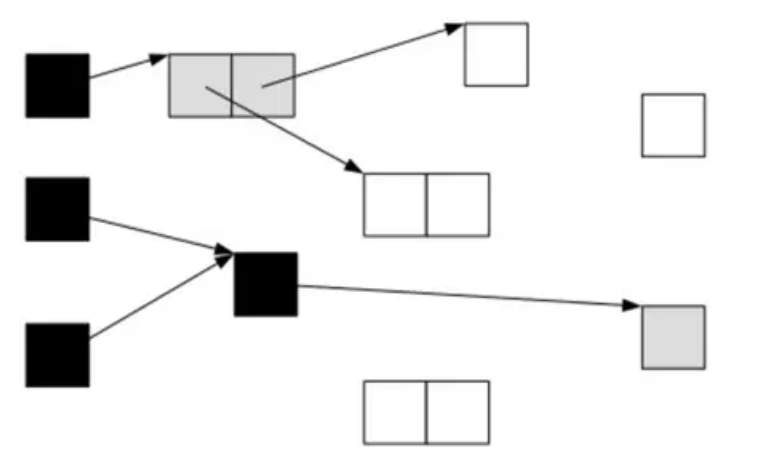
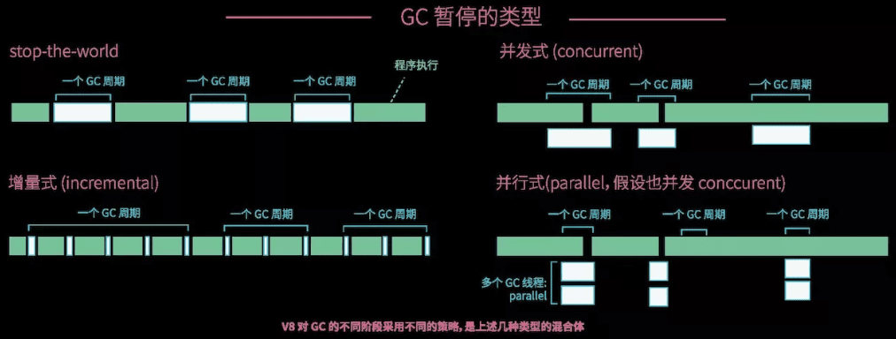

# Garbage Collection

## 什么是垃圾回收?

曾几何时, 内存管理是程序员开发应用的一大难题. 传统的系统级编程语言(主要指C/C++)中, 程序员必须对内存小心的进行管理操作, 控制内存的申请及释放. 稍有不慎, 就可能产生内存泄露问题, 这种问题不易发现并且难以定位, 一直成为困扰开发者的噩梦. 如何解决这个头疼的问题呢? 过去一般采用两种办法:

* 内存泄露检测工具. 这种工具的原理一般是静态代码扫描, 通过扫描程序检测可能出现内存泄露的代码段. 然而检测工具难免有疏漏和不足, 只能起到辅助作用.
* 智能指针. 这是 c++ 中引入的自动内存管理方法, 通过拥有自动内存管理功能的指针对象来引用对象, 是程序员不用太关注内存的释放, 而达到内存自动释放的目的. 这种方法是采用最广泛的做法, 但是对程序员有一定的学习成本(并非语言层面的原生支持), 而且一旦有忘记使用的场景依然无法避免内存泄露.

为了解决这个问题, 后来开发出来的几乎所有新语言(java, python, php等等)都引入了语言层面的自动内存管理 – 也就是语言的使用者只用关注内存的申请而不必关心内存的释放, 内存释放由虚拟机(virtual machine)或运行时(runtime)来自动进行管理. 而这种对不再使用的内存资源进行自动回收的行为就被称为垃圾回收.

## 常见的垃圾回收方法

### 引用计数(reference counting)

这是最简单的一种垃圾回收算法, 和之前提到的智能指针异曲同工. 对每个对象维护一个引用计数, 当引用该对象的对象被销毁或更新时被引用对象的引用计数自动减一, 当被引用对象被创建或被赋值给其他对象时引用计数自动加一. 当引用计数为0时则立即回收对象.

这种方法的优点是实现简单, 并且内存的回收很及时. 这种算法在内存比较紧张和实时性比较高的系统中使用的比较广泛, 如ios cocoa框架, php, python等. 简单引用计数算法也有明显的缺点:

* 频繁更新引用计数降低了性能. 一种简单的解决方法就是编译器将相邻的引用计数更新操作合并到一次更新; 还有一种方法是针对频繁发生的临时变量引用不进行计数, 而是在引用达到0时通过扫描堆栈确认是否还有临时对象引用而决定是否释放. 等等还有很多其他方法.
* 循环引用问题. 当对象间发生循环引用时引用链中的对象都无法得到释放. 最明显的解决办法是避免产生循环引用, 如cocoa引入了strong指针和weak指针两种指针类型. 或者系统检测循环引用并主动打破循环链. 当然这也增加了垃圾回收的复杂度.

### 标记-清除(mark and sweep)

该方法分为两步, 标记从根变量开始迭代得遍历所有被引用的对象, 对能够通过应用遍历访问到的对象都进行标记为"被引用"; 标记完成后进行清除操作, 对没有标记过的内存进行回收(回收同时可能伴有碎片整理操作). 这种方法解决了引用计数的不足, 但是也有比较明显的问题: 每次启动垃圾回收都会暂停当前所有的正常代码执行, 回收是系统响应能力大大降低! 当然后续也出现了很多mark&sweep算法的变种(如三色标记法)优化了这个问题.

### 分代收集(generation)

经过大量实际观察得知, 在面向对象编程语言中, 绝大多数对象的生命周期都非常短. 分代收集的基本思想是, 将堆划分为两个或多个称为 代(generation)的空间. 新创建的对象存放在称为 新生代(young generation)中(一般来说, 新生代的大小会比 老年代小很多), 随着垃圾回收的重复执行, 生命周期较长的对象会被 提升(promotion)到老年代中. 因此, 新生代垃圾回收和老年代垃圾回收两种不同的垃圾回收方式应运而生, 分别用于对各自空间中的对象执行垃圾回收. 新生代垃圾回收的速度非常快, 比老年代快几个数量级, 即使新生代垃圾回收的频率更高, 执行效率也仍然比老年代垃圾回收强, 这是因为大多数对象的生命周期都很短, 根本无需提升到老年代.

## Golang GC 垃圾回收机制

go语言垃圾回收总体采用的是经典的mark and sweep算法.

## js 的垃圾回收

下面这段话引自《JavaScript权威指南(第四版)》

由于字符串、对象和数组没有固定大小, 所有当他们的大小已知时, 才能对他们进行动态的存储分配. JavaScript程序每次创建字符串、数组或对象时, 解释器都必须分配内存来存储那个实体. 只要像这样动态地分配了内存, 最终都要释放这些内存以便他们能够被再用, 否则, JavaScript的解释器将会消耗完系统中所有可用的内存, 造成系统崩溃.

> 如果使用不当则会造成[内存泄漏](./201903060memory-leak[JS].md)

为什么会无法回收呢? 要从js的回收机制方法说起

### 标记清除

标记清楚并没有什么问题

### 引用计数

所谓"引用计数"是指语言引擎有一张"引用表", 保存了内存里面所有的资源(通常是各种值)的引用次数. 如果一个值的引用次数是0, 就表示这个值不再用到了, 因此可以将这块内存释放.

但是引用计数有个最大的问题: 循环引用

例如, 

``` js
function func() {
  let obj1 = {};
  let obj2 = {};
  obj1.a = obj2; // obj1 引用 obj2
  obj2.a = obj1; // obj2 引用 obj1
}
```

可以手动释放:

``` js
obj1 = null;
obj2 = null;
```

## node 垃圾回收

### node 内存分配

Node程序运行中, 此进程占用的所有内存称为常驻内存(Resident Set).

常驻内存由以下部分组成:

* 代码区(Code Segment): 存放即将执行的代码片段
* 栈(Stack): 存放局部变量
* 堆(Heap): 存放对象、闭包上下文
* 堆外内存: 不通过V8分配, 也不受V8管理. Buffer对象的数据就存放于此.

除堆外内存, 其余部分均由V8管理.


栈(Stack)的分配与回收非常直接, 当程序离开某作用域后, 其栈指针下移(回退), 整个作用域的局部变量都会出栈, 内存收回.

最复杂的部分是堆(Heap)的管理, V8使用垃圾回收机制进行堆的内存管理.

通过process.memoryUsage()可以查看此Node进程的内存使用状况:

``` js
{
  rss: 2999999,
  heapTotal: 20300001,
  heapUsed: 12300000
}
```

rss是Resident Set Size的缩写, 为常驻内存的总大小, heapTotal是V8为堆分配的总大小, heapUsed是已使用的堆大小. 可以看到, rss是大于heapTotal的, 因为rss包括且不限于堆.

下面说垃圾回收过程


垃圾回收机制有多种, 但最常用的就是以下几种:



### 分代回收

在V8中所有的JavaScript对象都是通过堆来分配的. 为了提高垃圾回收的效率, V8将堆分为新生代和老生代两个部分, 其中新生代为存活时间较短的对象(需要经常进行垃圾回收), 而老生代为存活时间较长的对象(垃圾回收的频率较低), 如图



#### 新生代

新生代中的对象主要通过 Scavenge 算法进行垃圾回收. 在 Scavenge  的具体实现中, 主要采用了 Cheney 算法.

> Cheney 算法是一种采用复制的方式实现的垃圾回收算法. 它将堆内存一分为二, 每一部分空间成为 semispace. 在这两个 semispace 空间中, 只有一个处于使用中, 另一个处于闲置中. 处于使用中的 semispace 空间成为 From 空间, 处于闲置状态的空间成为 To 空间. 当我们分配对象时, 先是在 From 空间中进行分配. 当开始进行垃圾回收时, 会检查 From 空间中的存活对象, 这些存活对象将被复制到 To 空间中, 而非存活对象占用的空间将被释放. 完成复制后, From 空间和 To 空间的角色发生对换.

Scavenge 的缺点是只能使用堆内存的一半, 但 Scavenge 由于只复制存活的对象, 并且对于生命周期短的场景存活对象只占少部分, 所以它在时间效率上表现优异. Scavenge 是典型的牺牲空间换取时间的算法, 无法大规模地应用到所有的垃圾回收中, 但非常适合应用在新生代中.


##### 对象是如何释放的呢?

有个叫可达性分析算法的概念, 即通过一系列的称为"GC ROOT"的对象作为起始点. 从这些节点开始向下搜索. 搜索走过的路径称为引用链. 当一个对象到GC ROOT没有任何引用链时, 则证明此对象是不可用的. 当然在虚拟机判断要被释放的对象里面, 即使在可达性分析算法中不可达的对象, 也并非是立即释放的. 如果对象在进行可达性分析后发现没有与GC ROOTS相连接的引用链. 将会对它进行一次标记, 并进行刷选. 它会放进一个队列中依次进行回收. 如果这时又有对象引用到它, 它就不会被回收.

##### 晋升

对象从新生代中移动到老生代中的过程称为晋升.
From 空间中的存活对象在复制到 To 空间之前需要进行检查, 在一定条件下, 需要将存活周期长的对象移动到老生代中, 也就是完成对象的晋升.
晋升条件主要有两个:

* 对象是否经历过一次 Scavenge 回收, 是的话, 则移动到老生代
* To 空间已经使用超过 25%, To 空间对象移动到老生代

设置 25% 这个限制值得原因是当这次 Scavenge 回收完成后, 这个 To 空间将变成 From 空间, 接下来的内存分配将在这个空间中进行, 如果占比过高, 会影响后续的内存分配.

#### 写屏障

上面有一个细节被忽略了: 如果新生区中某个对象, 只有一个指向它的指针, 而这个指针恰好是在老生区的对象当中, 我们如何才能知道新生区中那个对象是活跃的呢? 显然我们并不希望将老生区再遍历一次, 因为老生区中的对象很多, 这样做一次消耗太大.
为了解决这个问题, 实际上在写缓冲区中有一个列表(我们称之为CrossRefList), 列表中记录了所有老生区对象指向新生区的情况. 新对象诞生的时候, 并不会有指向它的指针, 而当有老生区中的对象出现指向新生区对象的指针时, 我们便记录下来这样的跨区指向. 由于这种记录行为总是发生在写操作时, 它被称为写屏障——因为每个写操作都要经历这样一关.


#### 老生代

老生代的内存空间较大且存活对象较多, 因此其垃圾回收算法也就没有新生代那么简单了. 为此V8使用了标记-清除算法 (Mark-Sweep)进行垃圾回收, 并使用标记-压缩算法 (Mark-Compact)整理内存碎片, 提高内存的利用率. 老生代的垃圾回收算法步骤如下:

1. 对老生代进行第一遍扫描, 标记存活的对象
2. 对老生代进行第二次扫描, 清除未被标记的对象
3. 将存活对象往内存的一端移动
4. 清除掉存活对象边界外的内存

##### Mark-Sweep

Mark-Sweep 是标记清除的意思, 它分为两个阶段, 标记和清理. Mark-Sweep 在标记阶段遍历堆中的所有对象, 并标记活着的对象, 在随后的清除阶段中, 只清除未被标记的对象.


###### 算法机制

在标记阶段, 所有堆上的活跃对象都会被标记. 每个页(注意, V8的内存页是1MB的连续内存块, 与虚拟内存页不同)都会包含一个用来标记的位图, 位图中的每一位对应页中的一字. 这个标记非常有必要, 因为指针可能会在任何字对齐的地方出现. 显然, 这样的位图要占据一定的空间(32位系统上占据3.1%, 64位系统上占据1.6%), 但所有的内存管理机制都需要这样占用, 因此这种做法并不过分. 除此之外, 另有2位来表示标记对象的状态. 由于对象至少有2字长, 因此这些位不会重叠.

状态一共有三种: 如果一个对象的状态为白, 那么它尚未被垃圾回收器发现; 如果一个对象的状态为灰, 那么它已被垃圾回收器发现, 但它的邻接对象仍未全部处理完毕; 如果一个对象的状态为黑, 则它不仅被垃圾回收器发现, 而且其所有邻接对象也都处理完毕.

如果将堆中的对象看作由指针相互联系的有向图, 标记算法的核心实际是深度优先搜索. 在标记的初期, 位图是空的, 所有对象也都是白的. 从根可达的对象会被染色为灰色, 并被放入标记用的一个单独分配的双端队列. 标记阶段的每次循环, GC会将一个对象从双端队列中取出, 染色为黑, 然后将它的邻接对象染色为灰, 并把邻接对象放入双端队列. 这一过程在双端队列为空且所有对象都变黑时结束.

特别大的对象, 如长数组, 可能会在处理时分片, 以防溢出双端队列. 如果双端队列溢出了, 则对象仍然会被染为灰色, 但不会再被放入队列(这样他们的邻接对象就没有机会再染色了). 因此当双端队列为空时, GC仍然需要扫描一次, 确保所有的灰对象都成为了黑对象. 对于未被染黑的灰对象, GC会将其再次放入队列, 再度处理.

标记算法结束时, 所有的活跃对象都被染为了黑色, 而所有的死对象则仍是白的. 这一结果正是清理和紧缩两个阶段所期望的.

类似三色标记法大致如图:

第一步


第二步



第三步


清理阶段, 清理算法扫描连续存放的死对象, 将其变为空闲空间, 并将其添加到空闲内存链表中. 每一页都包含数个空闲内存链表, 其分别代表小内存区(<256字)、中内存区(<2048字)、大内存区(<16384字)和超大内存区(其它更大的内存).
清理算法非常简单, 只需遍历页的位图, 搜索连续的白对象. 空闲内存链表大量被scavenge算法用于分配存活下来的活跃对象, 但也被紧缩算法用于移动对象. 有些类型的对象只能被分配在老生区, 因此空闲内存链表也被它们使用.

##### Mark-Compact

Mark-Sweep 最大的问题是在进行一次标记清除回收后, 内存空间会出现不连续的状态. 这种内存碎片会对后续的内存分配造成问题, 因为很可能出现需要分配一个大对象的情况, 这时所有的碎片空间都无法完成此次分配, 就会提前触发垃圾回收, 而这次回收是不必要的.
为了解决 Mark-Sweep 的内存碎片问题, Mark-Compact被提出来. Mark-Compact是标记整理的意思, 是在 Mark-Sweep的基础上演进而来的. 它们的差别在于对象在标记为死亡后, 在整理过程中, 将活着的对象往一端移动, 移动完成后, 直接清理掉边界外的内存.


###### 算法机制

紧缩算法会尝试将对象从碎片页(包含大量小空闲内存的页)中迁移整合在一起, 来释放内存. 这些对象会被迁移到另外的页上, 因此也可能会新分配一些页. 而迁出后的碎片页就可以返还给操作系统了.
迁移整合的过程非常复杂, 大概过程是这样的. 对目标碎片页中的每个活跃对象, 在空闲内存链表中分配一块其它页的区域, 将该对象复制至新页, 并在碎片页中的该对象上写上转发地址. 迁出过程中, 对象中的旧地址会被记录下来, 这样在迁出结束后V8会遍历它所记录的地址, 将其更新为新的地址. 由于标记过程中也记录了不同页之间的指针, 此时也会更新这些指针的指向. 注意, 如果一个页非常"活跃", 比如其中有过多需要记录的指针, 则地址记录会跳过它, 等到下一轮垃圾回收再进行处理.

### 全停顿

下表为3种主要垃圾回收算法的简单比较


在 Mark-Sweep 和 Mark-Compact 之间, 由于 Mark-Compact 需要移动对象, 所以它的执行速度不可能很快, 所以在取舍上, V8 主要使用 Mark-Sweep, 在空间不足以从新生代中晋升过来的对象进行分配时才使用 Mark-Compact . 为了避免出现 JavaScript应用逻辑与垃圾回收器看到的不一致的情况, 垃圾回收的3种算法都需要将应用逻辑暂停下来, 这种行为称为"全停顿" (stop-the-world).

由于新生代配置的空间较小, 存活对象较少, 全停顿对新生代影响不大. 但老生代通常配置的空间较大, 且存活对象较多, 全堆垃圾回收(full垃圾回收)的标记、清除、整理等动作造成的停顿就会比较可怕.

### 增量标记与惰性清理

#### 增量标记

为了降低全堆垃圾回收带来的停顿时间, V8先从标记阶段入手, 将原本要一口气停顿完成的动作改成增量标记(Incremental Marking), 也就是拆分为许多小"步进", 每做完一"步进"就让JavaScript应用逻辑执行一小会儿, 垃圾回收和应用逻辑交替执行直到标记阶段完成.

增量标记允许堆的标记发生在几次5-10毫秒(移动设备)的小停顿中. 增量标记在堆的大小达到一定的阈值时启用, 启用之后每当一定量的内存分配后, 脚本的执行就会停顿并进行一次增量标记. 就像普通的标记一样, 增量标记也是一个深度优先搜索, 并同样采用白灰黑机制来分类对象.

但增量标记和普通标记不同的是, 对象的图谱关系可能发生变化! 我们需要特别注意的是, 那些从黑对象指向白对象的新指针. 回忆一下, 黑对象表示其已完全被垃圾回收器扫描, 并不会再进行二次扫描. 因此如果有"黑→白"这样的指针出现, 我们就有可能将那个白对象漏掉, 错当死对象处理掉.(标记过程结束后剩余的白对象都被认为是死对象.)于是我们不得不再度启用写屏障. 现在写屏障不仅记录"老→新"指针, 同时还要记录"黑→白"指针. 一旦发现这样的指针, 黑对象会被重新染色为灰对象, 重新放回到双端队列中. 当算法将该对象取出时, 其包含的指针会被重新扫描, 这样活跃的白对象就不会漏掉.

#### 惰性清理

增量标记完成后, 惰性清理就开始了. 所有的对象已被处理, 因此非死即活, 堆上多少空间可以变为空闲已经成为定局. 此时我们可以不急着释放那些空间, 而将清理的过程延迟一下也并无大碍. 因此无需一次清理所有的页, 垃圾回收器会视需要逐一进行清理, 直到所有的页都清理完毕. 这时增量标记又蓄势待发了.

在两段的GC程序之间, 引用关系可能发生了变化. 所以, 这种GC算法也要写屏障, 来记录引用关系的变化. 虽然这种方式控制了中断最高时间, 但是由于中断次数增加, GC总时间是增加的.


#### 并发标记

并发式 GC(concurrent), 即在垃圾回收的同时不需要停止程序的运行, 两者可以同时进行, 只有在个别时候需要短暂停下来让垃圾回收器做一些特殊的操作. 但是这种方式也要面对增量回收的问题, 所以也要进行写屏障操作.

一般能在垃圾回收的过程中修改对象的存在, 不管是垃圾回收器本身还是运行时, 或者是正在执行的程序, 都统称为 mutator(翻译不详).

增量标记和并发标记对程序执行更宽松的GC, 都需要运行时从整体设计上保证mutator不会在垃圾回收的过程中与垃圾回收器同时修改对象, 造成无法预料的后果. 比如清洁阿姨打扫一个房间的时候可以把房间的门先关上, 这样熊孩子就进不来了, 但熊孩子们依然可以在屋子里的其他地方活动. 在程序运行的同时进行垃圾回收虽然可能导致垃圾回收的周期变长(即降低了垃圾回收单位时间内的吞吐量), 但是可以降低每次暂停的时间, 进而提高程序的响应效率.

然而这种方式也并未做到完全不暂停原程序的运行, 在某些特定的GC阶段还是要暂停原程序.



### 准确式 GC (Accurate GC)

虽然 ECMA 中没有规定整数类型, Number 都是 IEEE 浮点数, 但是由于在 CPU 上浮点数相关的操作通常比整型操作要慢, 大多数的 Javascript 引擎都在底层实现中引入了整型, 用于提升for循环和数组索引等场景的性能, 并配以一定的技巧来将指针和整数(可能还有浮点数)"压缩"到同一种数据结构中节省空间.

在 V8 中, 对象都按照 4 字节(32 位机器)或者 8 字节(64 位机器)对齐, 因此对象的地址都能被 4 或者 8 整除, 这意味着地址的二进制表示最后 2 位或者 3 位都会是 0, 也就是说所有指针的这几位是可以空出来使用的. 如果将另一种类型的数据的最后一位也保留出来另作他用, 就可以通过判断最后一位是 0 还是 1, 来直接分辨两种类型. 那么, 这另一种类型的数据就可以直接塞在前面几位, 而不需要沿着一个指针去读取它的实际内容. 在 V8 的语境内这种结构叫做小整数(SMI, small integer), 这是语言实现中历史悠久的常用技巧 tagging 的一种. V8 预留所有的字(word, 32位机器是 4 字节, 64 位机器是8字节)的最后一位用于标记(tag)这个字中的内容的类型, 1 表示指针, 0 表示整数, 这样给定一个内存中的字, 它能通过查看最后一位快速地判断它包含的指针还是整数, 并且可以将整数直接存储在字中, 无需先通过一个指针间接引用过来, 节省空间.

由于 V8 能够通过查看字的最后一位, 快速地分辨指针和整数, 在GC的时候, V8能够跳过所有的整数, 更快地沿着指针扫描堆中的对象. 由于在 GC 的过程中, V8 能够准确地分辨它所遍历到的每一块内存的内容属于什么类型, 因此V8的垃圾回收器是准确式的. 与此相对的是保守式 GC, 即垃圾回收器因为某些设计导致无法确定内存中内容的类型, 只能保守地先假设它们都是指针然后再加以验证, 以免误回收不该回收的内存, 因此可能误将数据当作指针, 进而误以为一些对象仍然被引用, 无法回收而浪费内存. 同时因为保守式的垃圾回收器没有十足的把握区分指针和数据, 也就不能确保自己能安全地修改指针, 无法使用那些需要移动对象, 更新指针的算法.

准确式的 GC 避免了保守式 GC 带来的弊端, 能够尽早无遗漏地回收内存, 并且能够在GC过程中移动对象以缓解内存碎片问题.

