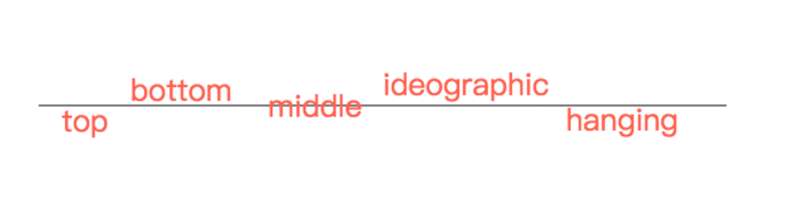

<!--
Created: Mon Aug 26 2019 15:23:01 GMT+0800 (China Standard Time)
Modified: Mon Aug 26 2019 15:23:01 GMT+0800 (China Standard Time)
-->
# canvas 文字

``` js
var oText = document.getElementById("text");
var oContext = oText.getContext("2d");
var x = oText.width / 2;
var y = oText.height / 2;

//绘制一条基准线
oContext.strokeStyle = "black";
oContext.moveTo(0, y);
oContext.lineTo(x * 2, y);
oContext.stroke();

oContext.font = "20pt Microsoft JhengHei"; //设置文本大小 + 字体
oContext.fillStyle = "tomato"; //设置文本颜色

//设置文本基线 alphabetic|top|hanging|middle|ideographic|bottom
oContext.textBaseline = "top";
oContext.fillText("top", x - 280, y);

oContext.textBaseline = "bottom";
oContext.fillText("bottom", x - 220, y);

oContext.textBaseline = "middle";
oContext.fillText("middle", x - 100, y);

oContext.textBaseline = "ideographic";
oContext.fillText("ideographic", x, y);

oContext.textBaseline = "hanging";
oContext.fillText("hanging", x + 160, y);
```



