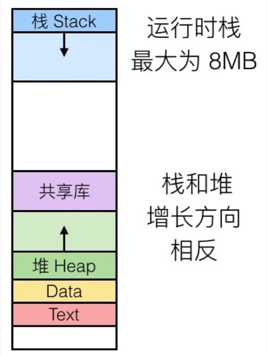

<!--
Created: Wed Sep 11 2019 15:39:34 GMT+0800 (China Standard Time)
Modified: Thu Sep 12 2019 17:14:10 GMT+0800 (China Standard Time)
-->
# 【读薄 CSAPP】贰 机器指令与程序优化

[叁 内存与缓存](./201906180Memory-and-cache[SYSTEM].md)

---

计算机能读懂的只有零和一, 而我们用汇编去和计算机『感同身受』. 接近硬件底层, 很多代码中再平常不过的概念, 具体实现起来则并没有看起来那么『理所当然』. 这一讲我们会了解程序到底是如何执行的, 在知其所以然后, 自然可以发现高效代码的秘密.

## 基础知识

### 从 8086 到 Core i7

1978 年, Intel 发布了第一款 x86 指令集的微处理器——Intel 8086[1], 以此拉开了 Intel x86 系列发展的序幕.8086 是 16 位微处理器, 主要为 IBM PC 和 DOS 设计, 有 1MB 的地址空间. 八年后的 1985, 第一个 32 位 Intel 处理器(IA32) 386 诞生.2004 年, 奔腾(Pentium) 4E 成为了第一个 64 位处理器(x86-64). 后来随着摩尔定律在单个核心上达到极限, 2006 年 Core 2 成为了第一个多核 Intel 处理器.

多核心的处理器大概长这样:


随着时代和科技的发展, 处理器除了支持最基本的运算指令集外, 还增加了支持多媒体操作处理和更高效执行条件操作的指令, 这部分内容涉及到分支预测[2](又是一个很有意思但是没时间写的话题), 因为篇幅关系不再赘述, 简单来说就是研究人员为了让处理器效率提升采用了各种各样的方法, 可能只是为了 1% 的提升.

除了增加处理器本身的功能外, 另外的趋势是集成, 比如说 2015 年的 Core i7 Broadwell, 可以从下图看到处理器芯片中加入了原来主板才有的许多部件, 如 PCIe, SATA, DDR3 等等.


顺带说一下千年老二 AMD, 主打性价比, 研发的 Opteron 系列是 Pentium 4 的强劲对手, 并且开发了自己的 64 位拓展 x86-64.

Intel 在 64 位处理器的发展并不算顺风顺水, 2001 年本打算使用全新的架构快速从 IA32 转换到 IA64, 但是糟糕的性能反倒给了 AMD 机会. 后者在 2003 年发布的 x86-64(现在叫 AMD64) 架构明显更厉害, 搞得 Intel 疲于应战, 最后在 2004 年搞出来一个叫 EM64T 的东西, 其实几乎和 AMD64 一样. 现在除了某些低端的处理器, 几乎都支持 x86-64, 也是这一讲主要介绍的内容.

### 从 C 到机器代码

机器代码就是处理器能够直接执行的字节层面上的程序, 但是对于人类来说基本上是不可读的, 所以把字节按照具体含义进行『翻译』, 就成了人类可读的汇编代码. 注意这里的用词是『翻译』而不是『编译』, 可以认为汇编代码就是机器代码的可读形式.

机器代码和 C 代码应用两套完全不同的逻辑, 机器代码是纯粹从『执行』的方式来进行思考的, 而 C 的话则因为较多的抽象有了『程序设计』这个概念. 相信读完这一节之后, 你就会意识到为什么 C 语言的出现, 可以称得上计算机学科的『第二次工业革命』.

一门新语言绝非只是一套语法规则, 而是一系列配套的工具加上语法规则. C 语言代码最终成为机器可执行的程序, 会像流水线上的产品一样接受各项处理:

* C 语言代码(da.c, wang.c)经过编译器的处理(gcc -0g -S)成为汇编代码(da.s, wang.s)
* 汇编代码(da.s, wang.s)经过汇编器的处理(gcc 或 as)成为对象程序(da.o, wang.o)
* 对象程序(da.o, wang.o)以及所需静态库(lib.a)经过链接器的处理(gcc 或 ld)最终成为计算机可执行的程序

我们直接来看一段代码及其经过编译生成的汇编代码, 可能会有些难以理解, 这是正常的, 因为还没有介绍处理器具体执行指令的机制. 这里我们先有一个感性的认识即可.

``` c
/* c */
// 代码文件: sum.c
long plus(long x, long y);

void sumstore(long x, long y, long *dest)
{
    long t = plus(x, y);
    *dest = t;
}
```

对应的汇编代码

``` bash

# bash

sumstore:
    pushq   %rbx
    movq    %rbx, %rbx
    call    plus
    movq    %rax, (%rbx)
    popq    %rbx
    ret
```

比较一下我们就发现, C 语言代码被处理成了有统一格式的汇编代码, 在汇编代码中, 第一个字符串叫做操作符, 后面可能跟着 1/2/3 个以逗号分隔的操作数, 为什么是以这样的形式呢? 这就要从处理器的运算方式讲起了, 先来看看处理器是如何配合内存进行计算的:


* 程序计数器(PC, Program counter) - 存着下一条指令的地址, 在 x86-64 中称为 RIP
* 寄存器(Register) - 用来存储数据以便操作
* 条件代码(Codition codes) - 通常保存最近的算术或逻辑操作的信息, 用来做条件跳转

这里需要注意, 处理器能够执行的操作其实是非常有限的, 简单来说只有三种: 存取数据, 计算和传输控制. 存取数据是在内存和寄存器之间传输数据, 进行计算则是对寄存器或者内存中的数据执行算术运算, 传输控制主要指非条件跳转和条件分支. 这也就是为什么汇编代码有固定的 指令 操作数1 (, 操作数2 , 操作数3) 这样的形式了.

我们拿前面程序中的两条指令来具体说明一下从 C 到汇编再到机器代码的变化:

``` c
/* c */
// C 代码
*dest = t;

// 对应的汇编代码
movq    %rax, (%rbx)

// 对应的对象代码
0x40059e:   46 89 03
```

C 代码的意思很简单, 就是把值 t 存储到指针 dest 指向的内存中. 对应到汇编代码, 就是把 8字节(也就是四个字, Quad words)移动到内存中(这也就是为什叫做 movq).t 的值保存在寄存器 %rax 中, dest 指向的地址保存在 %rbx 中, 而 *dest 是取地址操作, 对应于在内存中找到对应的值, 也就是 M[%rbx], 在汇编代码中用小括号表示取地址, 即 (%rbx). 最后转换成 3 个字节的指令, 并保存在 0x40059e 这个地址中.

### 汇编入门

前面我们简要了解了一下程序执行的基本过程, 也对汇编有了一点点认识, 这一节我们从寄存器的相关知识讲起, 介绍汇编的基本知识. 这部分内容虽然在实际编程中几乎用不到, 但是对于后面内容的理解非常重要.

x86-64 架构中的整型寄存器如下图所示(暂时不考虑浮点数的部分)


仔细看看寄存器的分布, 我们可以发现有不同的颜色以及不同的寄存器名称, 黄色部分是 16 位寄存器, 也就是 16 位处理器 8086 的设计, 然后绿色部分是 32 位寄存器(这里我是按照比例画的), 给 32 位处理器使用, 而蓝色部分是为 64 位处理器设计的. 这样的设计保证了令人震惊的向下兼容性, 几十年前的 x86 代码现在仍然可以运行!

前六个寄存器(%rax, %rbx, %rcx, %rdx, %rsi, %rdi)称为通用寄存器, 有其『特定』的用途:

* %rax(%eax) 用于做累加
* %rcx(%ecx) 用于计数
* %rdx(%edx) 用于保存数据
* %rbx(%ebx) 用于做内存查找的基础地址
* %rsi(%esi) 用于保存源索引值
* %rdi(%edi) 用于保存目标索引值

而 %rsp(%esp) 和 %rbp(%ebp) 则是作为栈指针和基指针来使用的. 下面我们通过 movq 这个指令来了解操作数的三种基本类型: 立即数(Imm), 寄存器值(Reg)和内存值(Mem).

对于 movq 指令来说, 需要源操作数和目标操作数, 源操作数可以是立即数, 寄存器值或内存值的任意一种, 但目标操作数只能是寄存器值或内存值. 指令的具体格式可以这样写 movq [Imm|Reg|Mem], [Reg|Mem], 第一个是源操作数, 第二个是目标操作数, 例如:

* movq Imm, Reg -> mov $0x5, %rax -> temp = 0x5; 
* movq Imm, Mem -> mov $0x5, (%rax) -> *p = 0x5; 
* movq Reg, Reg -> mov %rax, %rdx -> temp2 = temp1; 
* movq Reg, Mem -> mov %rax, (%rdx) -> *p = temp; 
* movq Mem, Reg -> mov (%rax), %rdx -> temp = *p; 

这里有一种情况是不存在的, 没有 movq Mem, Mem 这个方式, 也就是说, 我们没有办法用一条指令完成内存间的数据交换.

上面的例子中有些操作数是带括号的, 括号的意思就是寻址, 这也分两种情况:

* 普通模式, (R), 相当于 Mem[Reg[R]], 也就是说寄存器 R 指定内存地址, 类似于 C 语言中的指针, 语法为:movq (%rcx), %rax 也就是说以 %rcx 寄存器中存储的地址去内存里找对应的数据, 存到寄存器 %rax 中
* 移位模式, D(R), 相当于 Mem[Reg[R]+D], 寄存器 R 给出起始的内存地址, 然后 D 是偏移量, 语法为:movq 8(%rbp), %rdx 也就是说以 %rbp 寄存器中存储的地址再加上 8 个偏移量去内存里找对应的数据, 存到寄存器 %rdx 中

因为寻址这个内容比较重要, 所以多说两句, 不然之后接触指针会比较吃力. 对于寻址来说, 比较通用的格式是 D(Rb, Ri, S) -> Mem[Reg[Rb]+S*Reg[Ri]+D], 其中:

* D - 常数偏移量
* Rb - 基寄存器
* Ri - 索引寄存器, 不能是 %rsp
* S - 系数

除此之外, 还有如下三种特殊情况

* (Rb, Ri) -> Mem[Reg[Rb]+Reg[Ri]]
* D(Rb, Ri) -> Mem[Reg[Rb]+Reg[Ri]+D]
* (Rb, Ri, S) -> Mem[Reg[Rb]+S*Reg[Ri]]

我们通过具体的例子来巩固一下, 这里假设 %rdx 中的存着 0xf000, %rcx 中存着 0x0100, 那么

* 0x8(%rdx) = 0xf000 + 0x8 = 0xf008
* (%rdx, %rcx) = 0xf000 + 0x100 = 0xf100
* (%rdx, %rcx, 4) = 0xf000 + 4*0x100 = 0xf400
* 0x80(, %rdx, 2) = 2*0xf000 + 0x80 = 0x1e080

了解了寻址之后, 我们来看看运算指令, 这里以 leaq 指令为例子. 具体格式为 leaq Src, Dst, 其中 Src 是地址的表达式, 然后把计算的值存入 Dst 指定的寄存器, 也就是说, 无须内存引用就可以计算, 类似于 p = &x[i]; . 我们来看一个具体的例子, 假设一个 C 函数是:

``` c
/* c */
long m12(long x)
{
    return x * 12;
}
```

对应的汇编代码为:

``` bash

# bash

leaq (%rdi, %rdi, 2), %rax 

# t <- x+x*2

salq $2, %rax              

# return t << 2

```

可以看到是直接对 %rdi 寄存器中存的数据(地址)进行运算, 然后赋值给 %rax. 最后给出一些常见的算术运算指令, 注意参数的顺序, 而且对于有符号和无符号数都是一样的, 更多的信息可以参考 Intel 官方文档[3].

需要两个操作数的指令

``` bash
# bash
addq Src, Dest -> Dest = Dest + Src
subq Src, Dest -> Dest = Dest - Src
imulq Src, Dest -> Dest = Dest * Src
salq Src, Dest -> Dest = Dest << Src
sarq Src, Dest -> Dest = Dest >> Src
shrq Src, Dest -> Dest = Dest >> Src
xorq Src, Dest -> Dest = Dest ^ Src
andq Src, Dest -> Dest = Dest & Src
orq Src, Dest -> Dest = Dest | Src
```

需要一个操作数的指令

``` bash

# bash

incq Dest -> Dest = Dest + 1
decq Dest -> Dest = Dest - 1
negq Dest -> Dest = -Dest
notq Dest -> Dest = ~Dest
```

### 流程控制

我们先来回顾一下 x86-64 处理器中不同的寄存器, 这一部分很重要, 务必要弄明白


首先要理解的是, 寄存器中存储着当前正在执行的程序的相关信息:

* 临时数据存放在 (%rax, …)
* 运行时栈的地址存储在 (%rsp) 中
* 目前的代码控制点存储在 (%rip, …) 中
* 目前测试的状态放在 CF, ZF, SF, OF 中

### 条件代码与跳转

最后的四个标识位(CF, ZF, SF, OF)就是用来辅助程序的流程控制的, 意思是:

* CF: Carry Flag (针对无符号数)
* ZF: Zero Flag
* SF: Sign Flag (针对有符号数)
* OF: Overflow Flag (针对有符号数)

可以看到以上这四个标识位, 表示四种不同的状态, 举个例子, 假如我们有一条诸如 t = a + b 的语句, 汇编之后假设用的是 addq Src, Dest, 那么根据这个操作结果的不同, 会相应设置上面提到的四个标识位, 而因为这个是执行类似操作时顺带尽心设置的, 称为隐式设置, 例如:

* 如果两个数相加, 在最高位还需要进位(也就是溢出了), 那么 CF 标识位就会被设置
* 如果 t 等于 0, 那么 ZF 标识位会被设置
* 如果 t 小于 0, 那么 SF 标识位会被设置
* 如果 2's complement 溢出, 那么 OF 标识位会被设置为 1(溢出的情况是 (a>0 && b > 0 && t <0) || (a<0 && b<0 && t>=0))

这就发现了, 其实这四个条件代码, 是用来标记上一条命令的结果的各种可能的, 是自动会进行设置的. 注意, 使用 leaq 指令的话不会进行设置.

除了隐形设置, 还可以显式进行设置, 具体的方法是使用 cmpq 指令, 这里的 q 指的是 64 位的地址. 具体来说 cmpq Src2(b), Src1(a) 等同于计算 a-b(注意 a b 顺序是颠倒的), 然后利用 a-b 的结果来对应进行条件代码的设置:

* 如果在最高位还需要进位(也就是溢出了), 那么 CF 标识位就会被设置
* a 和 b 相等时, 也就是 a-b 等于零时, ZF 标识位会被设置
* 如果 a < b, 也就是 (a-b)<0 时, 那么 SF 标识位会被设置
* 如果 2's complement 溢出, 那么 OF 标识位会被设置(溢出的情况是 (a>0 && b > 0 && t <0) || (a<0 && b<0 && t>=0))

另一种进行显式设置的方法是使用 testq 指令, 具体来说 testq Src2(b), Src1(a) 等同于计算 a&b(注意 a b 顺序是颠倒的), 然后利用 a-b 的结果来对应进行条件代码的设置, 通常来说会把其中一个操作数作为 mask:

* 当 a&b == 0 时, ZF 标识位会被设置
* 当 a&b < 0 时, SF 标识位会被设置

有了这四个条件码, 就可以通过不同的组合方式, 来产生不同的条件判断.

介绍完了条件代码, 就可以来看看具体的跳转了, 跳转实际上就是根据条件代码的不同来进行不同的操作. 我们先来看一个比较原始的例子(编译器没有进行优化):

``` c
/* c */
long absdiff(long x, long y)
{
    long result;
    if (x > y)
        result = x-y;
    else
        result = y-x;
    return result;
}
```

对应的汇编代码如下, 这里 %rdi 中保存了参数 x, %rsi 中保存了参数 y, 而 %rax 一般用来存储返回值:

``` bash

# bash

absdiff:
    cmpq    %rsi, %rdi
    jle     .L4
    movq    %rdi, %rax
    subq    %rsi, %rax
    ret
.L4:    

# x <= y

    movq    %rsi, %rax
    subq    %rdi, %rax
    ret
```

这里我们是要给出两个数的绝对值的差, 所以需要判断谁大谁小. 考虑到汇编不算特别直观, 这里我们用 goto 语句重写一次, 基本上就和汇编出来的代码逻辑类似了, 方便之后的讲解:

``` c
/* c */
long absdiff_goto(long x, long y)
{
    long result;
    int ntest = x <= y;
    if (ntest) goto Else;
    result = x-y;
    goto Done;
Else:
    result = y-x;
Done:
    return result;
}
```

我们再看另一种条件语句要如何翻译, 比如 val = Test ? Then_Expr : Else_Expr; , 重写上面的函数就是:val = x>y ? x-y : y-x; 

转换成 goto 形式就是:

``` c
/* c */
	ntest = !Test;
	if (ntest) goto Else;
	value = Then_Expr;
	goto Done;
Else:
	val = Else_Expr;
Done:
	...
```

但是实际上汇编出来的代码, 并不是这样的, 会采用另一种方法来加速分支语句的执行. 现在我们先来说一说, 为什么分支语句会对性能造成很大的影响.

我们知道现在的 CPU 都是依靠流水线工作的, 比方说执行一系列操作需要 ABCDE 五个步骤, 那么在执行 A 的时候, 实际上执行 B 所需的数据会在执行 A 的同时加载到寄存器中, 这样运算器执行外 A, 就可以立刻执行 B 而无须等待数据载入. 如果程序一直是顺序的, 那么这个过程就可以一直进行下去, 效率会很高. 但是一旦遇到分支, 那么可能执行完 A 下一步要执行的是 C, 但是载入的数据是 B, 这时候就要把流水线清空(因为后面载入的东西都错了), 然后重新载入 C 所需要的数据, 这就带来了很大的性能影响. 为此人们常常用『分支预测』这一技术来解决(分支预测是另一个话题这里不展开), 但是对于这类只需要判断一次的条件语句来说, 其实有更好的方法.

处理器有一条指令支持 if(Test) Dest <- Src 的操作, 也就是说可以不用跳转, 利用条件代码来进行赋值, 于是编译器在可能的时候会把上面的 goto 程序改成如下:

``` c
/* c */
result = Then_Expr;
eval = Else_Expr;
nt = !Test;
if (nt) result = eval;
return result;
```

具体的做法是: 反正一共就两个分支, 我都算出行不行, 然后利用上面的条件指令来进行赋值, 这样就完美避免了因为分支可能带来的性能问题(需要清空流水线), 像下面这样, 同样 %rdi 中保存了参数 x, %rsi 中保存了参数 y, 而 %rax 一般用来存储返回值:

``` c
/* c */
absdiff:
    movq    %rdi, %rax  
    
    
    
    
    
    
    
    
    
    
    
    
    
    
    
    
    
    
    
    
    
    
    
# x

    subq    %rsi, %rax  
    
    
    
    
    
    
    
    
    
    
    
    
    
    
    
    
    
    
    
    
    
    
    
# result = x-y

    movq    %rsi, %rdx
    subq    %rdi, %rdx  
    
    
    
    
    
    
    
    
    
    
    
    
    
    
    
    
    
    
    
    
    
    
    
# eval = y-x

    cmpq    %rsi, %rdi  
    
    
    
    
    
    
    
    
    
    
    
    
    
    
    
    
    
    
    
    
    
    
    
# x:y

    cmovle  %rdx, %rax  
    
    
    
    
    
    
    
    
    
    
    
    
    
    
    
    
    
    
    
    
    
    
    
# if <=, result = eval

    ret
```

这个方法好是好, 但是也有一些情况并不适用于:

因为会把两个分支的运算都提前算出来, 如果这两个值都需要大量计算的话, 就得不偿失了, 所以需要分支中的计算尽量简单.
另外在涉及指针操作的时候, 如 val = p ? *p : 0; , 因为两个分支都会被计算, 所以可能导致奇怪问题出现
最后一种就是如果分支中的计算是有副作用的, 那么就不能这样弄 val = x > 0 ? x*= 7 : x+= 3; , 这种情况下, 因为都计算了, 那么 x 的值肯定就不是我们想要的了.

### 循环

先来看看并不那么常用的 Do-While 语句以及对应使用 goto 语句进行跳转的版本:

``` c
/* c */

// Do While 的 C 语言代码
long pcount_do(unsigned long x)
{
    long result = 0;
    do {
        result += x & 0x1;
        x >>= 1;
    } while (x);
    return result;
}
// Goto 版本
long pcount_goto(unsigned long x)
{
    long result = 0;
loop:
    result += x & 0x1;
    x >>= 1;
    if (x) goto loop;
    return result;
}
```

这个函数计算参数 x 中有多少位是 1, 翻译成汇编如下:

``` bash

# bash

    movl    $0, %eax    
    
    
    
    
    
    
    
    
    
    
    
    
    
    
    
    
    
    
    
    
    
    
    
# result = 0

.L2:                    

# loop:

    movq    %rdi, %rdx
    andl    $1, %edx    
    
    
    
    
    
    
    
    
    
    
    
    
    
    
    
    
    
    
    
    
    
    
    
# t = x & 0x1

    addq    %rdx, %rax  
    
    
    
    
    
    
    
    
    
    
    
    
    
    
    
    
    
    
    
    
    
    
    
# result += t

    shrq    %rdi        
    
    
    
    
    
    
    
    
    
    
    
    
    
    
    
    
    
    
    
    
    
    
    
# x >>= 1

    jne     .L2         
    
    
    
    
    
    
    
    
    
    
    
    
    
    
    
    
    
    
    
    
    
    
    
# if (x) goto loop

    rep; ret
```

其中 %rdi 中存储的是参数 x, %rax 存储的是返回值. 换成更通用的形式如下:

``` c
/* c */
// C Code
do
	Body
	while (Test);
    
// Goto Version
loop:
	Body
	if (Test)
		goto loop
而对于 While 语句的转换，会直接跳到中间，如：

// C While version
while (Test)
	Body
    
// Goto Version
	goto test;
loop:
	Body
test:
	if (Test)
		goto loop;
done:
```

如果在编译器中开启 -O1 优化, 那么会把 While 先翻译成 Do-While, 然后再转换成对应的 Goto 版本, 因为 Do-While 语句执行起来更快, 更符合 CPU 的运算模型.

接着来看看最常用的 For 循环, 也可以一步一步转换成 While 的形式, 如下

``` c
/* c */
// For
for (Init; Test; Update)
	Body
	
// While Version
Init;
while (Test) {
	Body
	Update;
}
```

### Switch 语句

最后我们来看看最复杂的 switch 语句, 这种类型的语句一次判断会有多种可能的跳转路径(知道 CPU 的分支预测会多抓狂吗). 这里用一个具体的例子来进行讲解:

``` c
/* c */
long switch_eg (long x, long y, long z){
	long w = 1;
	switch (x) {
		case 1:
			w = y*z;
			break;
		case 2:
			w = y/z;
			// fall through
		case 3:
			w += z;
			break;
		case 5:
		case 6:
			w -= z;
			break;
		default:
			w = 2;
	}
	return w;
}
```

这个例子中包含了大部分比较特殊的情况:

共享的条件:5 和 6

fall through:2 也会执行 3 的部分(这个要小心, 一般来说不这么搞, 如果确定要用, 务必写上注释)

缺失的条件:4

具体怎么办呢? 简单来说, 使用跳转表(你会发现表的解决方式在很多地方都有用: 虚函数, 继承甚至动态规划), 可能会类似如下汇编代码, 这里 %rdi 是参数 x, %rsi 是参数 y, %rdx 是参数 z, %rax 是返回值

``` bash

# bash

switch_eg:
    movq    %rdx, %rcx
    cmpq    $6, %rdi    
    
    
    
    
    
    
    
    
    
    
    
    
    
    
    
    
    
    
    
    
    
    
    
# x:6

    ja      .L8
    jmp     *.L4(, %rdi, 8)
```

跳转表为

``` bash
.section    .rodata
    .align 8
.L4:
    .quad   .L8 
    
    
    
    
    
    
    
    
    
    
    
    
    
    
    
    
    
    
    
    
    
    
    
# x = 0

    .quad   .L3 
    
    
    
    
    
    
    
    
    
    
    
    
    
    
    
    
    
    
    
    
    
    
    
# x = 1

    .quad   .L5 
    
    
    
    
    
    
    
    
    
    
    
    
    
    
    
    
    
    
    
    
    
    
    
# x = 2

    .quad   .L9 
    
    
    
    
    
    
    
    
    
    
    
    
    
    
    
    
    
    
    
    
    
    
    
# x = 3

    .quad   .L8 
    
    
    
    
    
    
    
    
    
    
    
    
    
    
    
    
    
    
    
    
    
    
    
# x = 4

    .quad   .L7 
    
    
    
    
    
    
    
    
    
    
    
    
    
    
    
    
    
    
    
    
    
    
    
# x = 5

    .quad   .L7 
    
    
    
    
    
    
    
    
    
    
    
    
    
    
    
    
    
    
    
    
    
    
    
# x = 6

# bash

```

这里需要注意, 我们先跟 6 进行比较(因为 6 是最大的), 然后利用 ja 指令进行跳转, 为什么, 因为如果是负数的话, ja 是处理无符号数的, 所以负数情况肯定大于 6, 于是直接利用 ja 跳转到 default 的分支.

然后下一句 jmp *. L4(, %rdi, 8) 
# goto *JTab[x], 是一个间接跳转, 通过看上面的跳转列表来进行跳转.

比如说, 直接跳转 jmp . L8, 就直接跳到 . L8 所在的标签, 也就是 x = 0

如果是 jmp *. L4(, %rdi, 8) 那么就先找到 . L4 然后往后找 8 个字节(或 8 的倍数), 于是就是 0~6 的范围.

通过上面的例子, 我们可以大概了解处理 switch 语句的方式: 大的 switch 语句会用跳转表, 具体跳转时可能会用到决策树(if-elseif-elseif-else)

## 过程调用

上一节中我们学习了机器是如何利用跳转实现流程控制的, 这一节我们来看一个更加复杂的机制: 过程调用(也就是调用函数)具体在 CPU 和内存中是怎么实现的. 理解之后, 对于递归会有更加清晰的认识.

在过程调用中主要涉及三个重要的方面:

1. 传递控制: 包括如何开始执行过程代码, 以及如何返回到开始的地方
2. 传递数据: 包括过程需要的参数以及过程的返回值
3. 内存管理: 如何在过程执行的时候分配内存, 以及在返回之后释放内存

以上这三点, 都是凭借机器指令实现的

### 栈结构

在 x86-64 中, 所谓的栈, 实际上一块内存区域, 这个区域的数据进出满足先进后出的原则. 越新入栈的数据, 地址越低, 所以栈顶的地址是最小的. 下图中箭头所指的就是寄存器 %rsp 的值, 这个寄存器是栈指针, 用来记录栈顶的位置.


我们假设一开始 %rsp 为红色, 对于 push 操作, 对应的是 pushq Src 指令, 具体会完成下面三个步骤:

从地址 Src 中取出操作数
把 %rsp 中的地址减去 8(也就是到下一个位置)
把操作数写入到 %rsp 的新地址中
这个时候 %rsp 就对应蓝色.

重来一次, 假设一开始 %rsp 为红色, 对于 pop 操作, 对应的是 popq Dest 指令, 具体会完成下面三个步骤:

从 %rsp 中存储的地址中读入数据
把 %rsp 中的地址增加 8(回到上一个位置)
把刚才取出来的值放到 Dest 中(这里必须是一个寄存器)
这时候 %rsp 就对应黄色.

### 调用方式

了解了栈的结构之后, 我们先通过一个函数调用的例子来具体探索一下过程调用中的一些细节.

``` c
/* c */
// multstore 函数
void multstore (long x, long, y, long *dest)
{
    long t = mult2(x, y);
    *dest = t;
}

// mult2 函数
long mult2(long a, long b)
{
    long s = a * b;
    return s;
}
```

对应的汇编代码为:

``` bash

# bash

0000000000400540 <multstore>:
    
    
    
    
    
    
    
    
    
    
    
    
    
    
    
    
    
    
    
    
    
    
    
    
# x 在 %rdi 中，y 在 %rsi 中，dest 在 %rdx 中

    400540: push    %rbx            
    
    
    
    
    
    
    
    
    
    
    
    
    
    
    
    
    
    
    
    
    
    
    
# 通过压栈保存 %rbx

    400541: mov     %rdx, %rbx      
    
    
    
    
    
    
    
    
    
    
    
    
    
    
    
    
    
    
    
    
    
    
    
# 保存 dest

    400544: callq   400550 <mult2>  
    
    
    
    
    
    
    
    
    
    
    
    
    
    
    
    
    
    
    
    
    
    
    
# 调用 mult2(x, y)

    
    
    
    
    
    
    
    
    
    
    
    
    
    
    
    
    
    
    
    
    
    
    
    
# t 在 %rax 中

    400549: mov     %rax, (%rbx)    
    
    
    
    
    
    
    
    
    
    
    
    
    
    
    
    
    
    
    
    
    
    
    
# 结果保存到 dest 中

    40054c: pop     %rbx            
    
    
    
    
    
    
    
    
    
    
    
    
    
    
    
    
    
    
    
    
    
    
    
# 通过出栈恢复原来的 %rbx

    40054d: retq                    
    
    
    
    
    
    
    
    
    
    
    
    
    
    
    
    
    
    
    
    
    
    
    
# 返回

    
0000000000400550 <mult2>:
    
    
    
    
    
    
    
    
    
    
    
    
    
    
    
    
    
    
    
    
    
    
    
    
# a 在 %rdi 中，b 在 %rsi 中

    400550: mov     %rdi, %rax      
    
    
    
    
    
    
    
    
    
    
    
    
    
    
    
    
    
    
    
    
    
    
    
# 得到 a 的值

    400553: imul    %rsi, %rax      
    
    
    
    
    
    
    
    
    
    
    
    
    
    
    
    
    
    
    
    
    
    
    
# a * b

    
    
    
    
    
    
    
    
    
    
    
    
    
    
    
    
    
    
    
    
    
    
    
    
# s 在 %rax 中

    400557: retq                    
    
    
    
    
    
    
    
    
    
    
    
    
    
    
    
    
    
    
    
    
    
    
    
# 返回

```

可以看到, 过程调用是利用栈来进行的, 通过 call label 来进行调用(先把返回地址入栈, 然后跳转到对应的 label), 返回的地址, 将是下一条指令的地址, 通过 ret 来进行返回(把地址从栈中弹出, 然后跳转到对应地址)

我们『单步调试』来看看具体调用的过程


1. 在执行到 400544 那一行的时候 %rsp 指向栈顶(存储着栈顶的地址), %rip 指向当前要执行的指令(也就是 400544)
2. 在上一步操作完成之后, 因为跳转的关系, %rip 指向 mult2 函数开始的地方(也就是 400550), 之前的压栈操作也使得栈顶改变(返回值的位置), 于是 %rsp 对应进行改变
3. 接着执行到了 retq 那句, 这个时候要做的就是从栈中取出栈顶位置(这样就可以从跳转处继续了), 然后对寄存器做对应的修改
4. 最后恢复到原来的 multstore 函数中继续执行

我们可以发现, 函数调用中会利用 %rax 来保存过程调用的返回值, 以便程序继续运行的. 这就是基本的过程调用的控制流程.

那么过程调用的参数会放在哪里呢? 如果参数没有超过六个, 那么会放在:%rdi, %rsi, %rdx, %rcx, %r8, %r9 中. 如果超过了, 会另外放在一个栈中. 而返回值会放在 %rax 中.

既然是利用栈来进行函数调用, 自然而然就可以推广到递归的情况, 而对于每个过程调用来说, 都会在栈中分配一个帧 Frames. 每一帧里需要包含:

* 返回信息
* 本地存储(如果需要)
* 临时空间(如果需要)

整一帧会在过程调用的时候进行空间分配, 然后在返回时进行回收, 在 x86-64/Linux 中, 栈帧的结构是固定的, 当前的要执行的栈中包括:

* Argument Build: 需要使用的参数
* 如果不能保存在寄存器中, 会把一些本地变量放在这里
* 已保存的寄存器上下文
* 老的栈帧的指针(可选)

而调用者的栈帧则包括:

* 返回地址(因为 call 指令被压入栈的)
* 调用所需的参数

具体如下图所示:


#### 递归

有了前面的的基础, 要理解递归就简单很多了, 直接上例子

``` c
/* c */
long pcount_r(unsigned long x) {
	if (x == 0)
		return 0;
	else
		return (x & 1) + pcount_r(x >> 1);
}
```

对应的汇编代码为:

``` bash

# bash

pcount_r:
    mov     $0, %eax
    testq   %rdi, %rdi
    je      .L6
    push    %rbx
    movq    %rdi, %rbx
    andl    $1, %ebx
    shrq    %rdi
    call    pcount_r
    addq    %rbx, %rax
    popq    %rbx
.L6:
    rep; ret
```

实际执行的过程中, 会不停进行压栈, 直到最后返回, 所以递归本身就是一个隐式的栈实现, 但是系统一般对于栈的深度有限制(每次一都需要保存当前栈帧的各种数据), 所以一般来说会把递归转换成显式栈来进行处理以防溢出.

## 数据存储

上一节我们了解了过程调用是如何用机器代码实现的, 这一节我们来看看基本的数据是如何存储在计算机中.

第一讲中我们已经学到, 不同的数据类型所需要的字节数是不同的, 我们先来回顾一下这个表格:

数据类型	32 位	64 位	x86-64
char	1	1	1
short	2	2	2
int	4	4	4
long	4	8	8
float	4	4	4
double	8	8	8
long double	-	-	10/16
指针	4	8	8
我们举几个具体的例子就一目了然了:


既然是连续的地址空间, 就有很多不同的访问方式, 比方对于 int val[5] 来说

引用方式	类型	值
val[4]	int	5
val	int *	x
val+1	int *	x+4
&val[2]	int *	x+8
val[5]	int	?? 越界
*(val+1)	int	2
val+i	int *	x + 4i

## 多维数组

对于多维的数组, 基本形式是 T A[R][C], R 是行, C 是列, 如果类型 T 占 K 个字节的话, 那么数组所需要的内存是 R*C*K 字节. 具体在内存里的排列方式如下:


具体访问的方式如下:

``` c
/* c */
int get_a_digit(int index, int dig)
{
    return A[index][dig];
}
```

对应的汇编代码为, 这里假设 C = 5

``` bash

# bash

leaq    (%rdi, %rdi, 4), %rax   

# 5 * index

addl    %rax, %rsi              

# 5 * index + dig

movl    A(, %rsi, 4), %eax      

# M[A + 4*(5*index+dig)]

```

还有另外一种组合数组的方式, 不是连续分配, 而是存储每个数组的起始地址. 与之前连续分配唯一不同之处在于计算元素位置时候不同行对应不连续的起始地址(可能分散在内存的不同部分). 这两种方式在 C 语言中看起来差不多, 但对应的汇编代码则完全不同.

### 结构体

结构体是 C 语言中非常常用的一种机制, 具体在内存中是如何存放的呢? 我们通过具体的例子来进行学习. 比如我们有这样一个结构体:

``` c
/* c */
struct rec 
{
    int a[4];
    size_t i;       
    struct rect *next;
};
```

那么在内存中的排列是


如果我们换一下结构体元素的排列顺序, 可能就会出现和我们预想不一样的结果, 比如

struct S1
{

``` js
char c;
int i[2];
double v;
```

} *p; 
因为需要对齐的缘故, 所以具体的排列是这样的:


具体对齐的原则是, 如果数据类型需要 K 个字节, 那么地址都必须是 K 的倍数, 比方说这里 int 数组 i 需要是 4 的倍数, 而 v 则需要是 8 的倍数.

感谢网友『光河』的补充: 文中讲"具体对齐的原则是, 如果数据类型需要 K 个字节, 那么地址都必须是 K 的倍数"——这只是windows的原则, 而Linux中的对齐策略是"2字节数据类型的地址必须为2的倍数, 较大的数据类型(int, double, float)的地址必须是4的倍数"

为什么要这样呢, 因为内存访问通常来说是 4 或者 8 个字节位单位的, 不对齐的话访问起来效率不高. 具体来看的话, 是这样:

* 1 字节:char, …
  + 没有地址的限制
* 2 字节:short, …
  + 地址最低的 1 比特必须是 0
* 4 字节:int, float, …
  + 地址最低的 2 比特必须是 00
* 8 字节:double, long, char *, …
  + 地址最低的 3 比特必须是 000
* 16 字节:long double (GCC on Linux)
  + 地址最低的 4 比特必须是 0000

对于一个结构体来说, 所占据的内存空间必须是最大的类型所需字节的倍数, 所以可能需要占据更多的空间, 比如:

``` c
/* c */
struct S2 {
	double v;
	int i[2];
	char c;
} *p;
```


根据这种特点, 在设计结构体的时候可以采用一些技巧. 例如, 要把大的数据类型放到前面, 加入我们有两个结构体:

``` c
/* c */
struct S4 {
	char c;
	int i;
	char d;
} *p;

struct S5 {
	int i;
	char c;
	char d;
} *p;
```

对应的排列是:


这样我们就通过不同的排列, 节约了 4 个字节空间, 如果这个结构体要被复制很多次, 这也是很可观的内存优化.

## 缓冲区溢出

这一节是机器代码的最后一部分, 主要说说由缓冲区溢出引起的攻防大战. 我们先来看看程序在内存中是如何组织的(x86-64 Linux)



最上面是运行时栈, 有 8MB 的大小限制, 一般用来保存局部变量. 然后是堆, 动态的内存分配会在这里处理, 例如 malloc(), calloc(), new() 等. 然后是数据, 指的是静态分配的数据, 比如说全局变量, 静态变量, 常量字符串. 最后是共享库等可执行的机器指令, 这一部分是只读的.

可以见到, 栈在最上面, 也就是说, 栈再往上就是另一个程序的内存范围了, 这种时候我们就可以通过这种方式修改内存的其他部分了.

举个例子

``` c
/* c */
typedef struct 
{
    int a[2];
    double d;
} struct_t;

double fun(int i)
{
    volatile struct_t s;
    s.d = 3.14;
    s.a[i] = 1073741824; // 可能会越界
    return s.d;
}
```

不同的 i 可能的执行结果是:

* fun(0) -> 3.14
* fun(1) -> 3.14
* fun(2) -> 3.1399998664856
* fun(3) -> 2.00000061035156
* fun(4) -> 3.14
* fun(6) -> Segmentation fault

之所以会产生这种错误, 是因为访问内存的时候跨过了数组本身的界限修改了 d 的值. 你没看错, 这是个大问题! 如果不检查输入字符串的长度, 就很容易出现这种问题, 尤其是针对在栈上有界限的字符数组.

在 Unix 中, gets() 函数的实现是这样的:

``` c
/* c */
// 从 stdin 中获取输入
char *gets(char *dest)
{
    int c = getchar();
    char *p = dest;
    while (c != EOF && c != '\n')
    {
        *p++ = c;
        c = getchar();
    }
    *p = '\0';
    return dest;
}
```

可以看到并没有去检测最多能读入多少字符(于是很容易出问题), 类似的情况还在 strcpy, strcat, scanf, fscanf, sscanf 中出现. 比如说

``` c
/* c */
void echo() {
	char buf[4]; // 太小
	gets(buf);
	puts(buf);
}

void call_echo() {
	echo();
}
```

我们来测试一下这个函数, 可能的结果是:

``` bash

# bash

unix> ./echodemo
 Input: 012345678901234567890123
Output: 012345678901234567890123

unix> ./echodemo
 Input: 0123456789012345678901234
Segmentation Fault
```

为什么明明在 echo() 中声明 buf 为 4 个 char, 居然一开始输入这么多都没问题? 我们到汇编代码里去看看:

``` bash

# bash

00000000004006cf <echo>:
    4006cf: 48 83 ec 18         sub   $0x18, %rsp
    4006d3: 48 89 e7            mov   %rsp, %rdi
    4006d6: e8 a5 ff ff ff      callq 400680 <gets>
    4006db: 48 89 e7            mov   %rsp, %rdi
    4006de: e8 3d fe ff ff      callq 400520 <puts@plt>
    4006e3: 48 83 c4 18         add   $0x18, %rsp
    4006e7: c3                  retq
    
    
    
    
    
    
    
    
    
    
    
    
    
    
    
    
    
    
    
    
    
    
    
# call_echo 部分

    4006e8: 48 83 ec 08         sub   $0x8, %rsp
    4006ec: b8 00 00 00 00      mov   $0x0, %eax
    4006f1: e8 d9 ff ff ff      callq 4006cf <echo>
    4006f6: 48 83 c4 08         add   $0x8, %rsp
    4006fa: c3                  retq
```

我们看 4006cf 这一行, 可以发现实际上给 %rsp 分配了 0x18 的空间, 所以可以容纳不止 4 个 char.

在调用 gets 函数之前(第 4006d6 行), 内存中栈帧示意图为:


结合上面代码可以看到, call_echo 栈帧中保存着调用之前执行指令的地址 4006f6, 用于返回之后继续执行. 我们输入字符串 01234567890123456789012 之后, 栈帧中缓冲区被填充, 如下:


虽然缓冲区溢出了, 但是并没有损害当前的状态, 程序还是可以继续运行(也就是没有出现段错误), 但是如果再多一点的话, 也就是输入 0123456789012345678901234, 内存中的情况是这样的:


就把返回地址给覆盖掉了, 当 echo 执行完成要回到 call_echo 函数时, 就跳转到 0x400034 这个内容未知的地址中了. 也就是说, 通过缓冲区溢出, 我们可以在程序返回时跳转到任何我们想要跳转到的地方! 攻击者可以利用这种方式来执行恶意代码!

那么我们现在来看看, 怎么处理缓冲区溢出攻击, 有几种方式:

* 好好写代码, 尽量不让缓冲区异常
* 程序容易出问题, 那么提供系统层级的保护
* 编译器也可以来个认证(stack canaries)

第一种, 避免缓冲区溢出, 我们用更安全的方法, 如:fgets, strncpy 等等.

第二种, 栈的位置不确定, 让缓冲区溢出没办法影响到, 并且每次位置都不一样, 就不怕被暴力破解. 并且也可以把一段内存标记为只读, 那么就避免因为缓冲区溢出而导致的重写.

第三种, 使用认证机制(Stack Canaries). 简单来说, 就是在超出缓冲区的位置加一个特殊的值, 如果发现这个值变化了, 那么就知道出问题了.

但是, 除了缓冲区溢出, 还有另一种攻击的方式, 称为返回导向编程[4]. 可以利用修改已有的代码, 来绕过系统和编译器的保护机制, 攻击者控制堆栈调用以劫持程序控制流并执行针对性的机器语言指令序列(称为Gadgets). 每一段 gadget 通常结束于 return 指令, 并位于共享库代码中的子程序. 系列调用这些代码, 攻击者可以在拥有更简单攻击防范的程序内执行任意操作.

具体利用缓冲区进行攻击的例子, 会在【读厚 CSAPP】III Attack Lab 中进行讲解, 这里不再赘述.

### 程序优化

前面了解了许多机器代码以及程序执行机制的相关知识, 这一节我们来学习如何利用这些性质来优化代码.

* 用好编译器的不同参数设定
* 写对编译器友好的代码, 尤其是过程调用和内存引用, 时刻注意内层循环
* 根据机器来优化代码, 包括利用指令级并行, 避免不可以预测的分支以及有效利用缓存

## 通用技巧

即使是常数项系数的操作, 同样可能影响性能. 性能的优化是一个多层级的过程: 算法, 数据表示, 过程和循环, 都是需要考虑的层次. 于是, 这就要求我们需要对系统有一定的了解, 例如:

* 程序是如何编译和执行的
* 现代处理器和内存是如何工作的
* 如何衡量程序的性能以及找出瓶颈
* 如何保持代码模块化的前提下, 提高程序性能

最根源的优化是对编译器的优化, 比方说再寄存器分配, 代码排序和选择, 死代码消除, 效率提升等方面, 都可以由编译器做一定的辅助工作.

但是因为这毕竟是一个自动的过程, 而代码本身可以非常多样, 在不能改变程序行为的前提下, 很多时候编译器的优化策略是趋于保守的. 并且大部分用来优化的信息来自于过程和静态信息, 很难充分进行动态优化.

接下来会介绍一些我们自己需要注意的地方, 而不是依赖处理器或者编译器来解决.

### 代码移动

如果一个表达式总是得到同样的结果, 最好把它移动到循环外面, 这样只需要计算一次. 编译器有时候可以自动完成, 比如说使用 -O1 优化. 一个例子:

``` c
/* c */
void set_row(double *a, double *b, long i, long n){
    long j;
    for (j = 0; j < n; j++){
        a[n*i + j] = b[j];
    }
}
```

这里 n*i 是重复被计算的, 可以放到循环外面

``` c
/* c */
long j;
int ni = n * i;
for (j = 0; j < n; j++){
    a[ni + j] = b[j];
}
```

### 减少计算强度

用更简单的表达式来完成用时较久的操作, 例如 16*x 就可以用 x << 4 代替, 一个比较明显的例子是, 可以把乘积转化位一系列的加法, 如下:

``` c
/* c */
for (i = 0; i < n; i++){
    int ni = n * i;
    for (j = 0; j < n; j++)
        a[ni + j] = b[j];
}
```

可以把 n*i 用加法代替, 比如:

``` c
/* c */
int ni = 0;
for (i = 0; i < n; i++){
    for (j = 0; j < n; j++)
        a[ni + j] = b[j];
    ni += n;
}
```

### 公共子表达式

可以重用部分表达式的计算结果, 例如:

``` c
/* c */
/* Sum neighbors of i, j */
up =    val[(i-1)*n + j  ];
down =  val[(i+1)*n + j  ];
left =  val[i*n     + j-1];
right = val[i*n     + j+1];
sum = up + down + left + right;
```

可以优化为

``` c
/* c */
long inj = i*n + j;
up =    val[inj - n];
down =  val[inj + n];
left =  val[inj - 1];
right = val[inj + 1];
sum = up + down + left + right;
```

虽然说, 现代处理器对乘法也有很好的优化, 但是既然可以从 3 次乘法运算减少到只需要 1 次, 为什么不这样做呢? 蚂蚁再小也是肉嘛.

### 小心过程调用

我们先来看一段代码, 找找有什么问题:

``` c
/* c */
void lower1(char *s){
    size_t i;
    for (i = 0; i < strlen(s); i++)
        if (s[i] >= 'A' && s[i] <= 'Z')
            s[i] -= ('A' - 'a');
}
```

问题在于, 在字符串长度增加的时候, 时间复杂度是二次方的! 每次循环中都会调用一次 strlen(s), 而这个函数本身需要通过遍历字符串来取得长度, 因此时间复杂度就成了二次方.

可以怎么优化呢? 简单, 那么只计算一次就好了:

``` c
/* c */
void lower2(char *s){
    size_t i;
    size_t len = strlen(s);
    for (i = 0; i < len; i++)
        if (s[i] >= 'A' && s[i] <= 'Z')
            s[i] -= ('A' - 'a');
}
```

为什么编译器不能自动把这个过程调用给移到外面去呢?

前面说过, 编译器的策略必须是保守的, 因为过程调用之后所发生的事情是不可控的, 所以不能直接改变代码逻辑, 比方说, 假如 strlen 这个函数改变了字符串 s 的长度, 那么每次都需要重新计算. 如果移出去的话, 就会导致问题.

所以很多时候只能靠程序员自己进行代码优化.

### 注意内存问题

接下来我们看另一段代码及其汇编代码

``` c
/* c */
// 把 nxn 的矩阵 a 的每一行加起来，存到向量 b 中
void sum_rows1(double *a, double *b, long n)
{
    long i, j;
    for (i = 0; i < n; i++)
    {
        b[i] = 0;
        for (j = 0; j < n; j++)
            b[i] += a[i*n + j];
    }
}
```

对应的汇编代码为

``` bash

# bash

# sum_rows1 的内循环

.L4:
    movsd   (%rsi, %rax, 8), %xmm0  
    
    
    
    
    
    
    
    
    
    
    
    
    
    
    
    
    
    
    
    
    
    
    
# 浮点数载入

    addsd   (%rdi), %xmm0           
    
    
    
    
    
    
    
    
    
    
    
    
    
    
    
    
    
    
    
    
    
    
    
# 浮点数加

    movsd   %xmm0, (%rsi, %rax, 8)  
    
    
    
    
    
    
    
    
    
    
    
    
    
    
    
    
    
    
    
    
    
    
    
# 浮点数保存

    addq    $8, %rdi
    cmpq    %rcx, %rdi
    jne     .L4
```

可以看到在汇编中, 每次都会把 b[i] 存进去再读出来, 为什么编译器会有这么奇怪的做法呢? 因为有可能这里的 a 和 b 指向的是同一块内存地址, 那么每次更新, 都会使得值发生变化. 但是中间过程是什么, 实际上是没有必要存储起来的, 所以我们引入一个临时变量, 这样就可以消除内存引用的问题.

``` c
/* c */
// 把 nxn 的矩阵 a 的每一行加起来，存到向量 b 中
void sum_rows2(double *a, double *b, long n)
{
    long i, j;
    for (i = 0; i < n; i++)
    {
        double val = 0;
        for (j = 0; j < n; j++)
            val += a[i*n + j];
        b[i] = val;
    }
}
```

对应的汇编代码为

``` bash

# bash

# sum_rows2 内循环

.L10:
    addsd   (%rdi), %xmm0   
    
    
    
    
    
    
    
    
    
    
    
    
    
    
    
    
    
    
    
    
    
    
    
# 浮点数载入 + 加法

    addq    $9, %rdi
    cmpq    %rax, %rdi
    jne     .L10
```

可以看到, 加入了临时变量后, 解决了奇怪的内存问题, 生成的汇编代码干净了许多.

### 处理条件分支

这个问题, 如果不是对处理器执行指令的机制有一定了解的话, 可能会难以理解.

现代处理器普遍采用超标量设计, 也就是基于流水线来进行指令的处理, 也就是说, 当执行当前指令时, 接下来要执行的几条指令已经进入流水线的处理流程了.

这个很重要, 对于顺序执行来说, 不会有任何问题, 但是对于条件分支来说, 在跳转指令时可能会改变程序的走向, 也就是说, 之前载入的指令可能是无效的. 这个时候就只能清空流水线, 然后重新进行载入. 为了减少清空流水线所带来的性能损失, 处理器内部会采用称为『分支预测』的技术.

比方说在一个循环中, 根据预测, 可能除了最后一次跳出循环的时候会判断错误之外, 其他都是没有问题的. 这就可以接受, 但是如果处理器不停判断错误的话(比方说代码逻辑写得很奇怪), 性能就会得到极大的拖累.

分支问题有些时候会成为最主要的影响性能的因素, 但有的时候其实很难避免.

## 总结

这一讲的内容比较多, 我们从 CPU 架构入手, 了解了处理器如何执行指令, 继而通过学习汇编, 对寻址和计算有了基本的认识. 然后详细说明了汇编代码中的流程控制和过程调用. 接着通过了解数据在内存中的存储方式, 介绍了缓冲区溢出相关的内容. 最后综合所有内容, 对具体代码的编写, 给出了一些优化建议.

部分内容需要细致阅读几次才能完全理解, 如果仍然不理解也不用过于担心, 在『读厚』部分我会通过具体的例子来详细说明这部分的内容.

