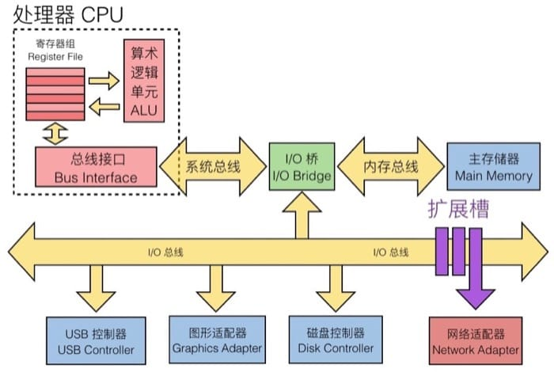
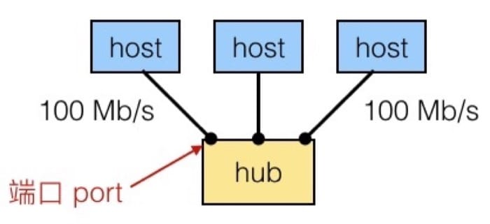
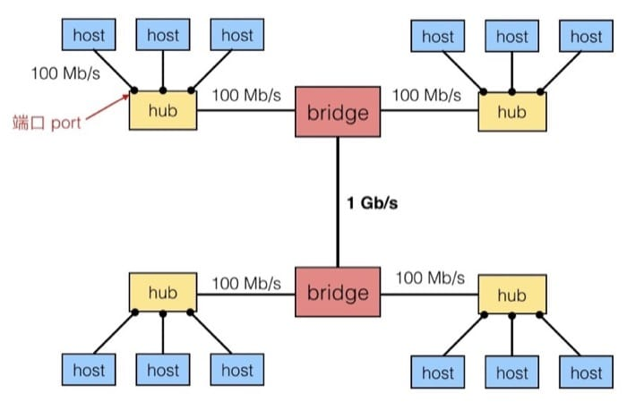
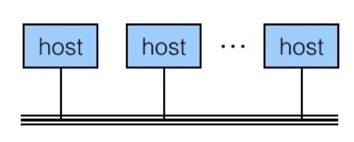
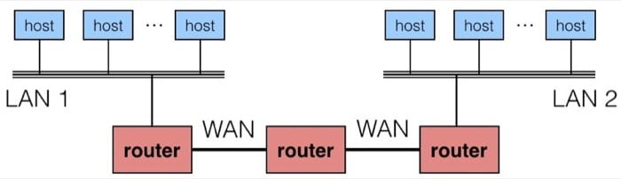
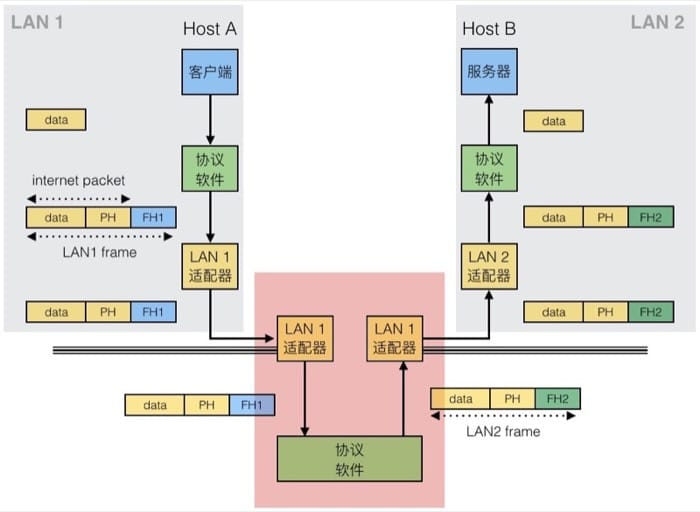

<!--
Created: Thu Sep 12 2019 16:42:03 GMT+0800 (China Standard Time)
Modified: Fri Sep 13 2019 16:36:11 GMT+0800 (China Standard Time)
-->
# 【读薄 CSAPP】捌 网络编程

[【读薄 CSAPP】柒 虚拟内存与动态内存分配](./201909080Virtual-memory-and-dynamic-memory-allocation[SYSTEM].md)

[【读薄 CSAPP】玖 并行与同步](./201909100Parallelism-and-synchronization[SYSTEM].md)

---
在这个网络成为『必需品』的时代, 让我们从最原始的 Socket(套接字)开始, 来看看程序是如何通过网络进行『沟通』的. 更有意思的是, 这一讲我们会介绍如何通过 C 语言从零开始实现自己的服务器程序.

## 网络架构

计算机网络的知识可谓是非常『保值』的, 因为这么多基础设备还在运行着, 基本机制在短时间内很难改变, 关于网络的相关的讲解还有参考链接[1][2], 我觉得也非常不错, 大家感兴趣可以看看.

客户端-服务器模型是网络应用最广泛使用的模型, 客户端进程发送请求给服务器进程, 服务器进程获取所需资源并响应客户端进程的请求, 客户端进程收到响应后展示给用户. 网络相关的处理, 都是通过网络适配器来完成的, 具体在硬件上为(右下角):



根据网络的应用范围和架构层级, 可以分成三个部分:

* SAN - System Area Network
  + Switched Ethernet, Quadrics QSW, …
* LAN - Local Area Network
  + Ethernet, ..
* WAN - Wide Area Network
  + High speed point-to-point phone lines

### 最底层 - Ethernet Segment

由若干主机(hosts)通过交换机(hub)连接, 通常范围是房间或一层楼, 如下图所示:



每个 Ethernet 适配器有一个唯一的 48 位的地址(也就是 MAC 地址), 例如 00:16:ea:e3:54:e6
不同主机间发送的数据称为帧(frame)
Hub 会把每个端口发来的所有数据复制到其他的端口
所有的主机都可以看到所有的数据(注意安全问题)

### 下一层 - Bridged Ethernet Segment

通常范围是一层楼, 通过不同的 bridge 来连接不同的 ethernet segment. Bridge 知道从某端口出发可达的主机, 并有选择的在端口间复制数据.



为了从概念上简化, 我们可以认为, 所有的 hub, bridge 可以抽象为一条线, 如下图所示:



### 下一层 - internets

不同的(也许不兼容)的 LAN 可以通过 router 来进行物理上的连接, 这样连接起来的网络称为 internet(注意是小写, 大写的 Internet 可以认为是最著名的 internet)



internet 的逻辑结构为:

* Ad hoc interconnection of networks
  + 没有特定的拓扑结构
  + 不同的 router 和 link 差异可能很大
* 通过在不同的网络间跳转来传递 packet
  + Router 是不同网络间的连接
  + 不同的 packet 可能会走不同的路线

## 网络协议

在不同的 LAN 和 WAN 中传输数据, 就要守规矩, 这个规矩就是协议. 协议负责做的事情有:

* 提供 naming scheme
  + 定义 host address 格式
  + 每个主机和路由器都至少有一个独立的 internet 地址
* 提供 delivery mechanism
  + 定义了标准的传输单元 - packet
  + Packet 包含 header 和 payload
    - header 包括 packet size, source 和 destination address
    - payload 包括需要传输的数据

在这样的协议下, 具体的数据传输如下图所示, 这里 PH = Internet packet header, FH = LAN frame header(具体名词解释可见参考文末参考资料):



Internet 是 internet 最为著名的例子. 主要基于 TCP/IP 协议族:

* IP (Internet Protocal)
  + Provides basic naming scheme and unreliable delivery capability of packets (datagrams) from host-to-host
* UDP (Unreliable Datagram Protocol)
  + Uses IP to provide unreliable datagram delivery from process-to-process
* TCP (Transmission Control Protocol)
  + Uses IP to provide reliable byte streams from process-to-process over connections

Accessed via a mix of Unix file I/O and functions from sockets interface.(很多东西不是很好翻译, 用原文比较准确)

* 主机有 32 位的 IP 地址 - 23.235.46.133
  + IPv4 - 32 位地址, IPv6 - 128 位地址
* IP 地址被映射到域名 - 23.235.46.133 映射到 www.wdxtub.com
* 不同主机之间的进程, 可以通过 connection 来交换数据

### IP 地址

我们会用一个叫做 IP address struct 的东西来存储, 并且 IP 地址是以 network byte order(也就是大端)来进行存储的

``` c
/* c */

// Internet address structure
struct in_addr {
    uint32_t s_addr;    // network byte order (big-endian)
}
```

为了方便读, 一般用下面的形式来进行表示:

IP 地址: `0x8002C2F2 = 128.2.194.242` 

具体的转换可以使用 getaddrinfo 和 getnameinfo 函数

### Internet 域名

这里主要需要了解的就是 Domain Naming System(DNS) 的概念, 用来做 IP 地址到域名的映射. 具体可以用 nslookup 命令来查看, 下面是一些例子

``` bash
# bash
$ hostname
wdxtub.local

$ nslookup www.wdxtub.com
Server:		8.8.8.8
Address:	8.8.8.8#53
Non-authoritative answer:
www.wdxtub.com	canonical name = wdxtub.github.io.
wdxtub.github.io	canonical name = github.map.fastly.net.
Name:	github.map.fastly.net
Address: 23.235.39.133

$ nslookup www.twitter.com
Server:		8.8.8.8
Address:	8.8.8.8#53

Non-authoritative answer:
www.twitter.com	canonical name = twitter.com.
Name:	twitter.com
Address: 199.16.156.6
Name:	twitter.com
Address: 199.16.156.198
Name:	twitter.com
Address: 199.16.156.230
Name:	twitter.com
Address: 199.16.156.70
```

### Internet 连接

客户端和服务器通过连接(connection)来发送字节流, 特点是:

* 点对点: 连接一对进程
* 全双工: 数据同时可以在两个方向流动
* 可靠: 字节的发送的顺序和收到的一致

Socket 则可以认为是 connection 的 endpoint, socket 地址是一个 IPaddress:port 对.

Port(端口)是一个 16 位的整数, 用来标识不同的进程, 利用不同的端口来连接不同的服务:

* Ephemeral port: Assigned automatically by client kernel when client makes a connection request
* Well-known port: Associated with some service provided by a server(在 linux 系统上可以在 /etc/services 中查看具体的信息)
  + echo server: 7/echo
  + ssh server: 22/ssh
  + email server: 25/smtp
  + web servers: 80/http

### Socket 接口

一系列系统级的函数, 和 Unix I/O 配合构造网络应用(在所有的现代操作系统上都可用).

对于 kernel 来说, socket 是 endpoint of communication; 对于应用程序来说, socket 是 file descriptor, 用来读写(回忆一下, STDIN 和 STDOUT 也是 file descriptor). 客户端和服务器通过读写对应的 socket descriptor 来进行.

具体连接的过程可以参考下图, 注意, 这一讲不做过多细节探讨, 相信相关信息请参考书本对应内容.


## 简单服务器实现

### 架构总览
写服务器, 最重要的就是理清思路, 上节课我们介绍了诸多概念, 尤其是最后提到的 getaddrinfo 和 getnameinfo, 都是我们在搭建过程中必不可少的工具. 参考上面的流程图, 整个的工作流程有 5 步:

* 开启服务器(open_listenfd 函数, 做好接收请求的准备)
  + getaddrinfo: 设置服务器的相关信息, 具体可以参见 图1&2
  + socket: 创建 socket descriptor, 也就是之后用来读写的 file descriptor
    - int socket(int domain, int type, int protocol)
    - 例如 int clientfd = socket(AF_INET, SOCK_STREAM, 0);
    - AF_INET 表示在使用 32 位 IPv4 地址
    - SOCK_STREAM 表示这个 socket 将是 connection 的 endpoint
    - 前面这种写法是协议相关的，建议使用 getaddrinfo 生成的参数来进行配置，这样就是协议无关的了
  + bind: 请求 kernel 把 socket address 和 socket descriptor 绑定
    - int bind(int sockfd, SA *addr, socklen_t addrlen);
    - The process can read bytes that arrive on the connection whose endpoint is addr by reading from descriptor sockfd
    - Similarly, writes to sockfd are transferred along connection whose endpoint is addr
    - 最好是用 getaddrinfo 生成的参数作为 addr 和 addrlen
  + listen: 默认来说, 我们从 socket 函数中得到的 descriptor 默认是 active socket(也就是客户端的连接), 调用 listen 函数告诉 kernel 这个 socket 是被服务器使用的
    - int listen(int sockfd, int backlog);
    - 把 sockfd 从 active socket 转换成 listening socket，用来接收客户端的请求
    - backlog 的数值表示 kernel 在接收多少个请求之后（队列缓存起来）开始拒绝请求
  + [*]accept: 调用 accept 函数, 开始等待客户端请求
    - int accept(int listenfd, SA *addr, int *addrlen);
    - 等待绑定到 listenfd 的连接接收到请求，然后把客户端的 socket address 写入到 addr，大小写入到 addrlen
    - 返回一个 connected descriptor 用来进行信息传输（类似 Unix I/O）
    - 具体的过程可以参考 图3
* 开启客户端(open_clientfd 函数, 设定访问地址, 尝试连接)
  + getaddrinfo: 设置客户端的相关信息, 具体可以参见 图1&2
  + socket: 创建 socket descriptor, 也就是之后用来读写的 file descriptor
  + connect: 客户端调用 connect 来建立和服务器的连接
    - int connect(int clientfd, SA *addr, socklen_t addrlen);
    - 尝试与在 socker address addr 的服务器建立连接
    - 如果成功 clientfd 可以进行读写
    - connection 由 socket 对描述 (x:y, addr.sin_addr:addr.sin_port)
    - x 是客户端地址，y 是客户端临时端口，后面的两个是服务器的地址和端口
    - 最好是用 getaddrinfo 生成的参数作为 addr 和 addrlen
* 交换数据(主要是一个流程循环, 客户端向服务器写入, 就是发送请求; 服务器向客户端写入, 就是发送响应)
  + [Client]rio_writen: 写入数据, 相当于向服务器发送请求
  + [Client]rio_readlineb: 读取数据, 相当于从服务器接收响应
  + [Server]rio_readlineb: 读取数据, 相当于从客户端接收请求
  + [Server]rio_writen: 写入数据, 相当于向客户端发送响应
* 关闭客户端(主要是 close)
  + [Client]close: 关闭连接
* 断开客户端(服务接收到客户端发来的 EOF 消息之后, 断开已有的和客户端的连接)
    - [Server]rio_readlineb: 收到客户端发来的关闭连接请求
    - [Server]close: 关闭与客户端的连接

### Client open_clientfd

用来建立和服务器的连接, 协议无关

``` c
/* c */
int open_clientfd(char *hostname, char *port) {
    int clientfd;
    struct addrinfo hints, *listp, *p;
    
    // Get a list of potential server address
    memset(&hints, 0, sizeof(struct addrinfo));
    hints.ai_socktype = SOCK_STREAM; // Open a connection
    hints.ai_flags = AI_NUMERICSERV; // using numeric port arguments
    hints.ai_flags |= AI_ADDRCONFIG; // Recommended for connections
    getaddrinfo(hostname, port, &hints, &listp);
    
    // Walk the list for one that we can successfully connect to
    // 如果全部都失败，才最终返回失败（可能有多个地址）
    for (p = listp; p; p = p->ai_next) {
        // Create a socket descriptor
        // 这里使用从 getaddrinfo 中得到的参数，实现协议无关
        if ((clientfd = socket(p->ai_family, p->ai_socktype,
                               p->ai_protocol)) < 0)
            continue; // Socket failed, try the next
        
        // Connect to the server
        // 这里使用从 getaddrinfo 中得到的参数，实现协议无关
        if (connect(clientfd, p->ai_addr, p->ai_addrlen) != -1)
            break; // Success
        
        close(clientfd); // Connect failed, try another
    }
    
    // Clean up
    freeaddrinfo(listp);
    if (!p) // All connections failed
        return -1;
    else // The last connect succeeded
        return clientfd;
}
```

### Server open_listenfd

创建 listening descriptor, 用来接收来自客户端的请求, 协议无关

``` c
/* c */
int open_listenfd(char *port){
    struct addrinfo hints, *listp, *p;
    int listenfd, optval=1;
    
    // Get a list of potential server addresses
    memset(&hints, 0, sizeof(struct addrinfo));
    hints.ai_socktype = SOCK_STREAM; // Accept connection
    hints.ai_flags = AI_PASSIVE | AI_ADDRCONFIG; // on any IP address
    hints.ai_flags |= AI_NUMERICSERV; // using port number
    // 因为服务器不需要连接，所以原来填写地址的地方直接是 NULL
    getaddrinfo(NULL, port, &hints, &listp); 
    
    // Walk the list for one that we can successfully connect to
    // 如果全部都失败，才最终返回失败（可能有多个地址）
    for (p = listp; p; p = p->ai_next) {
        // Create a socket descriptor
        // 这里使用从 getaddrinfo 中得到的参数，实现协议无关
        if ((listenfd = socket(p->ai_family, p->ai_socktype,
                               p->ai_protocol)) < 0)
            continue; // Socket failed, try the next
        
        // Eliminates "Address already in use" error from bind
        setsockopt(listenfd, SOL_SOCKET, SO_REUSEADDR), 
                    (const void *)&optval, sizeof(int));
        
        // Bind the descriptor to the address
        if (bind(listenfd, p->ai_addr, p->ai_addrlen) == 0)
            break; // Success
        
        close(listenfd); // Bind failed, try another
    }
    
    // Clean up
    freeaddrinfo(listp);
    if (!p) // No address worked
        return -1;
    
    // Make it a listening socket ready to accept connection requests
    if (listen(listenfd, LISTENQ) < 0) {
        close(listenfd);
        return -1;
    }
    return listenfd;
}
```

## 简单的 socket 服务器实例

### 客户端 Echo Client
这个客户端做的事情很简单, 就是把一段用户输入的文字发送到服务器, 然后再把从服务器接收到的内容显示到输出中, 具体可以参见注释

``` c
/* c */
// echoclient.c
#include "csapp.h"

int main (int argc, char **argv) {
    int clientfd;
    char *host, *port, buf[MAXLINE];
    rio_t rio;
    
    host = argv[1];
    port = argv[2];
    
    // 建立连接（前面已经详细介绍）
    clientfd = Open_clientfd(host, port);
    Rio_readinitb(&rio, clientfd);
    
    while (Fgets(buf, MAXLINE, stdin) != NULL) {
        // 写入，也就是向服务器发送信息
        Rio_writen(clientfd, buf, strlen(buf));
        // 读取，也就是从服务器接收信息
        Rio_readlineb(&rio, buf, MAXLINE);
        // 把从服务器接收的信息显示在输出中
        Fputs(buf, stdout);
    }
    Close(clientfd);
    exit(0);
}
```

### 服务器 Iterative Echo Server

服务器做的工作也很简单, 接收到从客户端发送的信息, 然后返回一个一模一样的. 具体参加注释.

``` c
/* c */
// echoserveri.c
#include "csapp.h"
void echo(int connfd);

int main(int argc, char **argv){
    int listenfd, connfd;
    socklen_t clientlen;
    struct sockaddr_storage clientaddr; // Enough room for any addr
    char client_hostname[MAXLINE], client_port[MAXLINE];
    
    // 开启监听端口，注意只开这么一次
    listenfd = Open_listenfd(argv[1]);
    while (1) {
        // 需要具体的大小
        clientlen = sizeof(struct sockaddr_storage); // Important!
        // 等待连接
        connfd = Accept(listenfd, (SA *)&clientaddr, &clientlen);
        // 获取客户端相关信息
        Getnameinfo((SA *) &clientaddr, clientlen, client_hostname,
                     MAXLINE, client_port, MAXLINE, 0);
        printf("Connected to (%s, %s)\n", client_hostname, client_port);
        // 服务器具体完成的工作
        echo(coonfd);
        Close(connfd);
    }
    exit(0);
}

void echo(int connfd) {
    size_t n;
    char buf[MAXLINE];
    rio_t rio;
    
    // 读取从客户端传输过来的数据
    Rio_readinitb(&rio, connfd);
    while((n = Rio_readlineb(&rio, buf, MAXLINE)) != 0) {
        printf("server received %d bytes\n", (int)n);
        // 把从 client 接收到的信息再写回去
        Rio_writen(connfd, buf, n);
    }
}
```

## 总结

这一讲中, 我们了解了网络的基本架构以及常见的网络协议, 并通过编写 web 服务器掌握了基本的网络相关编程技巧.

因为是用 C 语言来写, 实现起来比较繁琐, 但是对于理解整个网络的工作机制是非常有好处的, 相信之后在用更高级语言来操作网络的时候, 能够更加得心应手, 毕竟知其所以然了嘛.

