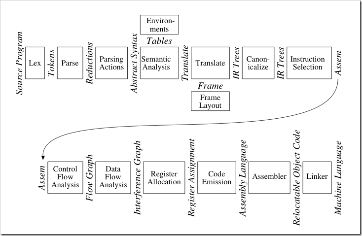
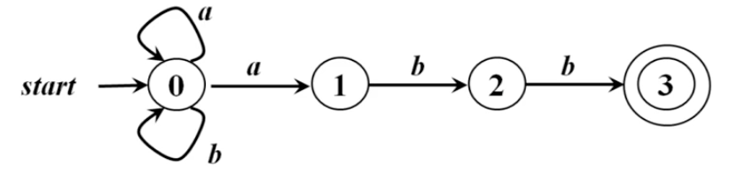
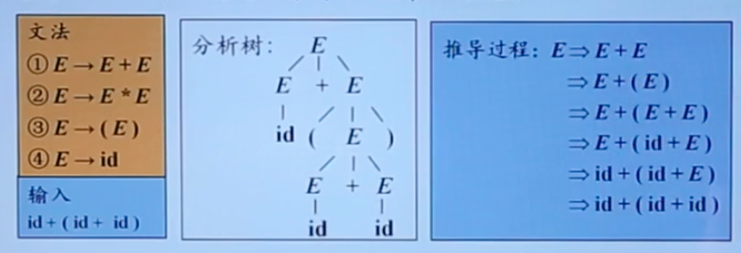

<!--
Created: Tue Apr 14 2020 19:12:17 GMT+0800 (China Standard Time)
Modified: Wed Jul 08 2020 14:35:20 GMT+0800 (China Standard Time)
-->

# 编译原理起始

## 编译器的组成

编译器划分为了很多个功能模块.



| 编译器的阶段 | 产生的结果                 | 用途                               |
|------------|---------------------------|------------------------------------|
| 词法分析    | 单词流                     | 语法高亮                            |
| 语法分析    | 抽象语法树                 | 语法高亮; 代码格式化; 代码折叠         |
| 语义分析    | 带类型信息和符号表的抽象语法树 | 重命名; 重构; 代码自动生成; 代码自动改写 |
| 数据流分析  | 控制流图、冲突图             | 编辑后继续运行(Edit and Continue)    |

上述编译器的各个阶段还可以根据其用途分成两个大阶段: 词法分析、语法分析和语义分析重点在处理编程语言的符号系统上, 统称为编译器的前端(front-end), 而中间代码生成、规范化、指令选择、控制流分析、数据流分析、寄存器分配、指令流出、汇编、连结等着重处理代码计算逻辑的阶段统称为编译的后端(back-end). 应该说现代编译器研究的工作重点是编译器的后端, 因为前端的技术已经相对非常成熟. 但是前端的技术对我们日常开发来讲可能更有机会用到, 而且通常更具趣味. 所以我也会花较多时间在前端技术上. 当大家完成一种编译器的前端后, 有几种实现后端的选择:

1. 使用CLR或Java虚拟机作为后端. 因为这些大型虚拟机的抽象程度极高, 这种方法是最容易的. 非常适合动态语言和脚本.
2. 采用可靠的开源或商业后端框架. 比如著名的LLVM(http://llvm.org/). 这样可以直接利用LLVM的性能优化成果, 以及跨平台等特性.
3. 自己实现后端. 要做的事情比较多, 但更有助于理解翻译和优化代码的技术.
4. 解释执行. 不解释... 

## 理解词法分析

词法分析是将代码从字符流, 切换成一个个的 `token` , 例如 

``` C
/* C */
char a = "hello" // 判断为char a "hello"
a.length >= 9 // 判断到>的时候会再读取一位,像>=这种,就会退回一位,将>=一起识别
// 最后判断为 a . length >= 9
```

## 词法分析的方式

主要有两种

### 手动词法分析

手动判断流程, 优势在于可以针对语言做优化, 劣势在于开发复杂.

### 自动词法分析

只要声明判断的依据之类, 由工具生成词法分析器.

## 关键字

除了 `token` 以外, 还需要注意一点就是关键字的识别, 例如 `if` , `else` .

事实上也分为两种方法

### 一种是在手动判断流程的基础上, 再多一个判断关键字

### 另一种是在词法分析完了以后对关键字匹配

## 文法分析

首先理解文法

$$G = \left\{S, V_N, V_T, p\right\}$$

文法G定义为一个四元组($V_N$, $V_T$, P, S), 其中, $V_N$, 为非终结符集合, $V_T$终结符集合; P是产生式结合; S称为识别符或开始符号, 也是一个非终结符, 至少要在一条产生式的左边出现.ε是空串

产生式的形式是$α \to β$, α称为产生式左部, β称为产生式右部, $α \in V_N$, $β\in(V_N \cup V_T)$, $α \notin ε$

举个例子, 例如在数学运算中, num代表数字, E代表Expression(表达式)

终结符应当是$\{num, + , *, (, )\}$, 非终结符是$\{E\}$, 而开始符号应当是 E, 

P是 $E \to E$, $E \to E+E$, $E \to E*E$, $E \to (E)$, $E \to num$, 

按照这个文法, 我们尝试解释 `1+2*(3+4)` , 就比较清晰了.

## 文法分类

### 0型文法

$$α \to β$$

叫做无限制文法. 或者短语结构文法

$\forallα \to β \in P$ , α 中至少包含一个非终结符

### 1型文法

$$α \to β$$

叫做上下文有关文法(Content-Sensitive Grammar), 缩写CSG

$\forallα \to β \in P$ , 且α中的符号数小于等于β中的符号数

例如$a_1Aa_2 \to a_1βa_2$, 一般与上下文有关, 替换需要依赖上下文

### 2型文法

叫做上下文无关文法(Content-Free Grammar), 缩写CFG

$\forallα \to β \in P$ , 且α必须为非终结符, 

例如 $A \to β$, 一般与上下文无关

### 3型文法

叫做正则文法(Regular Grammar), 缩写RG

分为两种

1. 右线性文法,例如$A \to \omega B$或者$A \to \omega$

2. 左线性文法,例如$A \to B \omega$或者$A \to \omega$

产生式的右部最多只有一个非终结符

### 总结

从0到1, 限制愈来越多

## 有穷自动机 (Finite Automata)

有穷自动机是由读头, 输入带和有穷控制器组成

1. 输入带, 记录输入符号串.
2. 读头, 从左向右挨个读取输入符号,不能修改,也无法往返移动.
3. 有穷控制器, 具有有限个状态,根据当前状态和当前输入符号转入下个状态



由一个有穷自动机M接收的所有串构成的集合, 称为该FA定义的语言, 计作L(M)

### 最长子缀匹配原则

## 确定的有穷自动机(DFA)

deterministic finite automata

根据任意一个正则表达式或者正则文法, 可以构造等价的NFA , NFA可以等价构造DFA

DFA是更容易被构造成代码, 

``` C
/* C */
s = s0
c = nextChar()

while (c != eof) {
    s = move (s, c)
    c = nextChar()
}
// F 终态的集合
if (s 在 F 中) return "yes"
else "no"
```

## 根据正则表达式, 构造NFA

正则表达式的三种链接形式

1. 串联 reg = ab
2. 并联 reg = a|b
3. 克林闭包 reg = a*b

## 自顶向下的分析方式



1. 最左推导

总是选择一个句型里的最左非终结符进行替换,自顶向下采用最左推导的方式

2. 最右推导

总是选择一个句型里的最右非终结符进行替换
