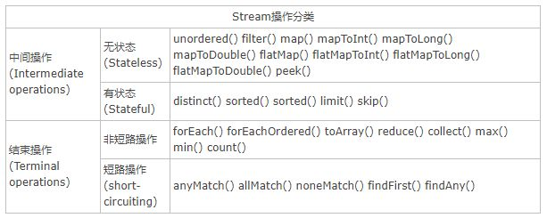

<!--
Created: Mon Oct 21 2019 13:26:35 GMT+0800 (China Standard Time)
Modified: Mon Oct 21 2019 13:30:53 GMT+0800 (China Standard Time)
-->

# 流

Stream中的操作可以分为两大类: 中间操作与结束操作, 中间操作只是对操作进行了记录, 只有结束操作才会触发实际的计算(即惰性求值), 这也是Stream在迭代大集合时高效的原因之一. 中间操作又可以分为无状态(Stateless)操作与有状态(Stateful)操作, 前者是指元素的处理不受之前元素的影响; 后者是指该操作只有拿到所有元素之后才能继续下去. 结束操作又可以分为短路与非短路操作, 这个应该很好理解, 前者是指遇到某些符合条件的元素就可以得到最终结果; 而后者是指必须处理所有元素才能得到最终结果.

## 实现

我们大致能够想到, 应该采用某种方式记录用户每一步的操作, 当用户调用结束操作时将之前记录的操作叠加到一起在一次迭代中全部执行掉. 沿着这个思路, 有几个问题需要解决:

1. 用户的操作如何记录？
2. 操作如何叠加？
3. 叠加之后的操作如何执行？
4. 执行后的结果（如果有）在哪里？

### 操作如何记录

注意这里使用的是"操作(operation)"一词, 指的是"Stream中间操作"的操作, 很多Stream操作会需要一个回调函数(Lambda表达式), 因此一个完整的操作是<数据来源, 操作, 回调函数>构成的三元组. Stream中使用Stage的概念来描述一个完整的操作, 并用某种实例化后的PipelineHelper来代表Stage, 将具有先后顺序的各个Stage连到一起, 就构成了整个流水线. 跟Stream相关类和接口的继承关系图示.

还有 `IntPipeline` , `LongPipeline` , `DoublePipeline` 没在图中画出, 这三个类专门为三种基本类型(不是包装类型)而定制的, 跟ReferencePipeline是并列关系. 图中Head用于表示第一个Stage, 即调用调用诸如Collection.stream()方法产生的Stage, 很显然这个Stage里不包含任何操作; StatelessOp和StatefulOp分别表示无状态和有状态的Stage, 对应于无状态和有状态的中间操作.

Stream流水线组织结构示意图如下:

图中通过Collection.stream()方法得到Head也就是stage0, 紧接着调用一系列的中间操作, 不断产生新的Stream. 这些Stream对象以双向链表的形式组织在一起, 构成整个流水线, 由于每个Stage都记录了前一个Stage和本次的操作以及回调函数, 依靠这种结构就能建立起对数据源的所有操作. 这就是Stream记录操作的方式.

### 操作如何叠加

以上只是解决了操作记录的问题, 要想让流水线起到应有的作用我们需要一种将所有操作叠加到一起的方案. 你可能会觉得这很简单, 只需要从流水线的head开始依次执行每一步的操作(包括回调函数)就行了. 这听起来似乎是可行的, 但是你忽略了前面的Stage并不知道后面Stage到底执行了哪种操作, 以及回调函数是哪种形式. 换句话说, 只有当前Stage本身才知道该如何执行自己包含的动作. 这就需要有某种协议来协调相邻Stage之间的调用关系.

这种协议由Sink接口完成, Sink接口包含的方法如下表所示:

| 方法名                           | 作用                                                                                                                                   |
|---------------------------------|----------------------------------------------------------------------------------------------------------------------------------------|
| void begin(long size)           | 开始遍历元素之前调用该方法, 通知Sink做好准备.                                                                                                |
| void end()                      | 所有元素遍历完成之后调用, 通知Sink没有更多的元素了.                                                                                           |
| boolean cancellationRequested() | 是否可以结束操作, 可以让短路操作尽早结束.                                                                                                    |
| void accept(T t)                | 遍历元素时调用, 接受一个待处理元素, 并对元素进行处理. Stage把自己包含的操作和回调方法封装到该方法里, 前一个Stage只需要调用当前Stage.accept(T t)方法就行了. |

sorted() 和 limit() 的返回值和也都是 Stream 的实现类, 并且都接收了this . 不同的是 sorted() 返回的是 ReferencePipeline. StatefulOp 的子类 SortedOps. OfRef 的实例.limit() 返回的 ReferencePipeline. StatefulOp 的实例.

现在可以粗略地看到, 这些中间操作(不管是无状态的 filter(), 还是有状态的sorted() 和 limit() 都只是返回了一个包含上一节点引用的中间节点. 有点像 HashMap 中的反向单向链表. 就这样把一个个中间操作拼接到了控制数据流入的 Head 后面, 但是并没有开始做任何数据处理的动作.

这也就是 Stream 延时执行的特性原因之所在.

参见附录I会发现 StatelessOp 和StatefulOp 初始化的时候还会将当前节点的引用传递给上一个节点.

previousStage.nextStage = this; 

所以各个节点组成了一个双向链表的结构.

