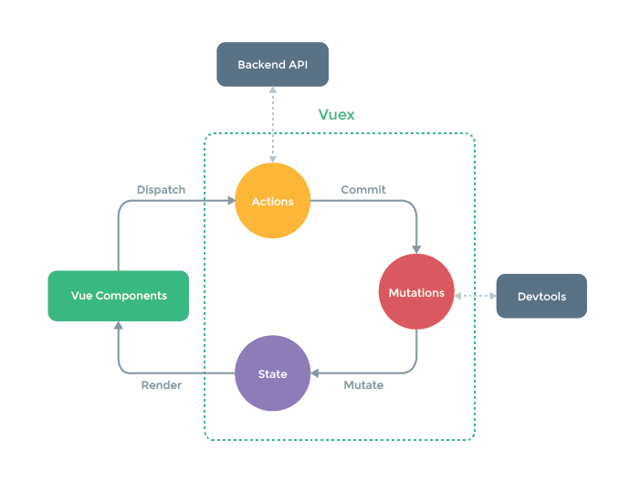

<!--
Created: Tue Mar 03 2020 10:30:56 GMT+0800 (China Standard Time)
Modified: Tue Mar 03 2020 16:28:41 GMT+0800 (China Standard Time)
-->

# Vuex 源码分析



Vuex版本

``` JS
// JavaScript
"version": "3.1.2"
```

Vuex的应用场景是在组件杂多, 数据流通复杂的系统. 将数据和组件抽离, 放置到全局的Store中统一管理.

它依赖于Vue的响应式机制, 所以也是通过创建 `Vue` 对象来实现双向绑定.

## Vuex install

``` JS
// JavaScript
Vue.use(Vuex)
```

这样在Vue中调用Vuex, `use` 会调用插件暴露的 `install` 方法

``` JS
// JavaScript
// /src/store.js
export function install(_Vue) {
  if (Vue && _Vue === Vue) {
    if (process.env.NODE_ENV !== 'production') {
      console.error(
        '[vuex] already installed. Vue.use(Vuex) should be called only once.'
      )
    }
    return
  }
  // 防止重复安装
  Vue = _Vue
  // 调用vueInit
  applyMixin(Vue)
}
```

## applyMixin

再看看 `applyMixin` 

``` JS
// JavaScript
// /src/mixin.js

export default function(Vue) {
  const version = Number(Vue.version.split('.')[0])
  // Vue2.0以后提供了mixin混入hook的方法,在beforeCreate里执行vueInit
  if (version >= 2) {
    Vue.mixin({
      beforeCreate: vuexInit
    })
  } else {
    // override init and inject vuex init procedure
    // for 1.x backwards compatibility.
    const _init = Vue.prototype._init
    // 在1.0里把options里的init合并了vueInit方法
    Vue.prototype._init = function(options = {}) {
      options.init = options.init ? [vuexInit].concat(options.init) :
        vuexInit
      _init.call(this, options)
    }
  }

  /**
   * Vuex init hook, injected into each instances init hooks list.
   */

  function vuexInit() {
    // this指向的是Vue
    const options = this.$options
    // store injection
    if (options.store) {
      this.$store = typeof options.store === 'function' ?
        options.store() :
        options.store
      // 尝试获取父组件,目的是为了统一$store
    } else if (options.parent && options.parent.$store) {
      this.$store = options.parent.$store
    }
  }
}
```

## Store

下面再看 `Store` 

``` JS
// JavaScript
// /src/store.js

export class Store {
  constructor(options = {}) {
    // Auto install if it is not done yet and `window` has `Vue` .
    // To allow users to avoid auto-installation in some cases,
    // this code should be placed here. See #731
    if (!Vue && typeof window !== 'undefined' && window.Vue) {
      install(window.Vue)
    }

    if (process.env.NODE_ENV !== 'production') {
      assert(Vue, `must call Vue.use(Vuex) before creating a store instance.` )
      assert(typeof Promise !== 'undefined', `vuex requires a Promise polyfill in this browser.` )
      assert(this instanceof Store, `store must be called with the new operator.` )
    }

    const {
      plugins = [],
        strict = false
    } = options

    // store internal state
    // 严格模式下,使用非mutation的方式改变state都会报错,这个是记录的
    this._committing = false
    // 创建action和其订阅者
    this._actions = Object.create(null)
    this._actionSubscribers = []
    this._mutations = Object.create(null)
    this._wrappedGetters = Object.create(null)
    this._modules = new ModuleCollection(options)
    // 这个是在模块化store的时候用来根据namespace存放
    this._modulesNamespaceMap = Object.create(null)
    this._subscribers = []
    // 创建一个watch的Vue实例
    this._watcherVM = new Vue()
    this._makeLocalGettersCache = Object.create(null)

    // bind commit and dispatch to self
    const store = this
    const {
      dispatch,
      commit
    } = this
    // 重写 dispatch 和 commit 的指向为store,而不是组件的vm
    this.dispatch = function boundDispatch(type, payload) {
      return dispatch.call(store, type, payload)
    }
    this.commit = function boundCommit(type, payload, options) {
      return commit.call(store, type, payload, options)
    }

    // strict mode
    this.strict = strict

    const state = this._modules.root.state

    // init root module.
    // this also recursively registers all sub-modules
    // and collects all module getters inside this._wrappedGetters
    // 初始化module,且递归注册子module
    installModule(this, state, [], this._modules.root)

    // initialize the store vm, which is responsible for the reactivity
    // (also registers _wrappedGetters as computed properties)
    resetSto reVM(this, state)

    // apply plugins
    plugins.forEach(plugin => plugin(this))

    // devtools 调试插件
    const useDevtools = options.devtools !== undefined ? options.devtools : Vue.config.devtools
    if (useDevtools) {
      devtoolPlugin(this)
    }
  }

  get state() {
    return this._vm._data.$state
  }

  set state(v) {
    if (process.env.NODE_ENV !== 'production') {
      assert(false, `use store.replaceState() to explicit replace store state.` )
    }
  }

  // mutation的commmit方法
  commit(_type, _payload, _options) {
    // check object-style commit
    const {
      type,
      payload,
      options
    } = unifyObjectStyle(_type, _payload, _options)

    const mutation = {
      type,
      payload
    }
    // 根据type拿到_mutation里对应的方法
    const entry = this._mutations[type]
    if (!entry) {
      if (process.env.NODE_ENV !== 'production') {
        console.error( `[vuex] unknown mutation type: ${type}` )
      }
      return
    }
    // 这里_withCommit 是判断严格模式
    // 依次执行mutation里的方法
    this._withCommit(() => {
      entry.forEach(function commitIterator(handler) {
        handler(payload)
      })
    })

    // 通知订阅者
    // 这里创建一个副本是为了防止订阅者同步地退订了,那么副本可以防止迭代器无效.
    this._subscribers
      .slice() // shallow copy to prevent iterator invalidation if subscriber synchronously calls unsubscribe
      .forEach(sub => sub(mutation, this.state))

    if (
      process.env.NODE_ENV !== 'production' &&
      options && options.silent
    ) {
      console.warn(
`[vuex] mutation type: ${type}. Silent option has been removed. ` +
        'Use the filter functionality in the vue-devtools'
      )
    }
  }

  dispatch(_type, _payload) {
    // check object-style dispatch
    const {
      type,
      payload
    } = unifyObjectStyle(_type, _payload)

    const action = {
      type,
      payload
    }
    // 一样取出action
    const entry = this._actions[type]
    if (!entry) {
      if (process.env.NODE_ENV !== 'production') {
        console.error( `[vuex] unknown action type: ${type}` )
      }
      return
    }
    // 这里也是为了解决订阅者取消订阅以后,迭代器就空了问题,
    // 先拷贝一个副本,筛选出被取消订阅的,然后重新绑定到action上
    try {
      this._actionSubscribers
        .slice() // shallow copy to prevent iterator invalidation if subscriber synchronously calls unsubscribe
        .filter(sub => sub.before)
        .forEach(sub => sub.before(action, this.state))
    } catch (e) {
      if (process.env.NODE_ENV !== 'production') {
        console.warn( `[vuex] error in before action subscribers: ` )
        console.error(e)
      }
    }

    // 生成promise
    const result = entry.length > 1 ?
      Promise.all(entry.map(handler => handler(payload))) :
      entry[0](payload)

    return result.then(res => {
      try {
        // 依次调用action
        this._actionSubscribers
          .filter(sub => sub.after)
          .forEach(sub => sub.after(action, this.state))
      } catch (e) {
        if (process.env.NODE_ENV !== 'production') {
          console.warn( `[vuex] error in after action subscribers: ` )
          console.error(e)
        }
      }
      return res
    })
  }

  subscribe(fn) {
    return genericSubscribe(fn, this._subscribers)
  }

  subscribeAction(fn) {
    // 这里定义了subs.before
    const subs = typeof fn === 'function' ? {
      before: fn
    } : fn
    return genericSubscribe(subs, this._actionSubscribers)
  }

  watch(getter, cb, options) {
    if (process.env.NODE_ENV !== 'production') {
      assert(typeof getter === 'function', `store.watch only accepts a function.` )
    }
    // 这个使用了Vue里的_watcherVM实例
    return this._watcherVM.$watch(() => getter(this.state, this.getters), cb, options)
  }

  replaceState(state) {
    this._withCommit(() => {
      this._vm._data.$state = state
    })
  }

  registerModule(path, rawModule, options = {}) {
    if (typeof path === 'string') path = [path]

    if (process.env.NODE_ENV !== 'production') {
      assert(Array.isArray(path), `module path must be a string or an Array.` )
      assert(path.length > 0, 'cannot register the root module by using registerModule.')
    }

    this._modules.register(path, rawModule)
    installModule(this, this.state, path, this._modules.get(path), options.preserveState)
    // reset store to update getters...
    resetStoreVM(this, this.state)
  }

  unregisterModule(path) {
    if (typeof path === 'string') path = [path]

    if (process.env.NODE_ENV !== 'production') {
      assert(Array.isArray(path), `module path must be a string or an Array.` )
    }

    this._modules.unregister(path)
    this._withCommit(() => {
      const parentState = getNestedState(this.state, path.slice(0, -1))
      Vue.delete(parentState, path[path.length - 1])
    })
    resetStore(this)
  }

  hotUpdate(newOptions) {
    this._modules.update(newOptions)
    resetStore(this, true)
  }

  _withCommit(fn) {
    const committing = this._committing
    this._committing = true
    fn()
    this._committing = committing
  }
}
```

依次分析函数

### installModule

``` JS
// JavaScript
// /src/store.js

function installModule(store, rootState, path, module, hot) {
  const isRoot = !path.length
  const namespace = store._modules.getNamespace(path)

  // register in namespace map
  if (module.namespaced) {
    if (store._modulesNamespaceMap[namespace] && process.env.NODE_ENV !== 'production') {
      console.error( `[vuex] duplicate namespace ${namespace} for the namespaced module ${path.join('/')}` )
    }
    store._modulesNamespaceMap[namespace] = module
  }

  // set state
  if (!isRoot && !hot) {
    const parentState = getNestedState(rootState, path.slice(0, -1))
    const moduleName = path[path.length - 1]
    store._withCommit(() => {
      if (process.env.NODE_ENV !== 'production') {
        if (moduleName in parentState) {
          console.warn(
`[vuex] state field "${moduleName}" was overridden by a module with the same name at "${path.join('.')}"` 
          )
        }
      }
      // Vue.set 将子模块设置为响应式
      Vue.set(parentState, moduleName, module.state)
    })
  }

  const local = module.context = makeLocalContext(store, namespace, path)

  module.forEachMutation((mutation, key) => {
    const namespacedType = namespace + key
    registerMutation(store, namespacedType, mutation, local)
  })

  module.forEachAction((action, key) => {
    const type = action.root ? key : namespace + key
    const handler = action.handler || action
    registerAction(store, type, handler, local)
  })

  module.forEachGetter((getter, key) => {
    const namespacedType = namespace + key
    registerGetter(store, namespacedType, getter, local)
  })

  module.forEachChild((child, key) => {
    installModule(store, rootState, path.concat(key), child, hot)
  })
}
```

它将每一个module都注册了mutation, action, getter, 并且递归地注册子module

## 

``` JS
// JavaScript
// /src/store.js

function resetStoreVM(store, state, hot) {
  const oldVm = store._vm

  // bind store public getters
  store.getters = {}
  // reset local getters cache
  store._makeLocalGettersCache = Object.create(null)
  const wrappedGetters = store._wrappedGetters
  const computed = {}
  forEachValue(wrappedGetters, (fn, key) => {
    // use computed to leverage its lazy-caching mechanism
    // direct inline function use will lead to closure preserving oldVm.
    // using partial to return function with only arguments preserved in closure environment.
    computed[key] = partial(fn, store)
    // 这里使用defineProperty将每个store里的getters都绑定上get,就可以成功的在store._vm里获取到了
    Object.defineProperty(store.getters, key, {
      get: () => store._vm[key],
      enumerable: true // for local getters
    })
  })

  // use a Vue instance to store the state tree
  // suppress warnings just in case the user has added
  // some funky global mixins
  const silent = Vue.config.silent
  Vue.config.silent = true
  // 这里将store._vm 赋值为Vue对象
  store._vm = new Vue({
    data: {
      $state: state
    },
    computed
  })
  Vue.config.silent = silent

  // enable strict mode for new vm
  if (store.strict) {
    enableStrictMode(store)
  }
  // 销毁旧的_vm值
  if (oldVm) {
    if (hot) {
      // dispatch changes in all subscribed watchers
      // to force getter re-evaluation for hot reloading.
      store._withCommit(() => {
        oldVm._data.$state = null
      })
    }
    Vue.nextTick(() => oldVm.$destroy())
  }
}
```

### genericSubscribe

这是订阅者函数, 暴露一个让外部订阅的方法, 并且返回了一个从subs中注销这个订阅的方法. 这样的话, 外部可以有效地知道store里的值通过 `mutation` 改变

``` JS
// JavaScript

function genericSubscribe(fn, subs) {
  if (subs.indexOf(fn) < 0) {
    subs.push(fn)
  }
  return () => {
    const i = subs.indexOf(fn)
    if (i > -1) {
      subs.splice(i, 1)
    }
  }
}
```

## 时空穿梭

依赖 plugins里的代码

``` JS
// JavaScript
plugins.concat(devtoolPlugin).forEach(plugin => plugin(this))
```

devtoolPlugin提供的功能有3个:

``` JS
// JavaScript
// 1. 触发Vuex组件初始化的hook
devtoolHook.emit('vuex:init', store)

// 2. 提供“时空穿梭”功能，即state操作的前进和倒退
devtoolHook.on('vuex:travel-to-state', targetState => {
  store.replaceState(targetState)
})

// 3. mutation被执行时，触发hook，并提供被触发的mutation函数和当前的state状态
store.subscribe((mutation, state) => {
      devtoolHook.emit('vuex:mutation', mutation, state)
```

