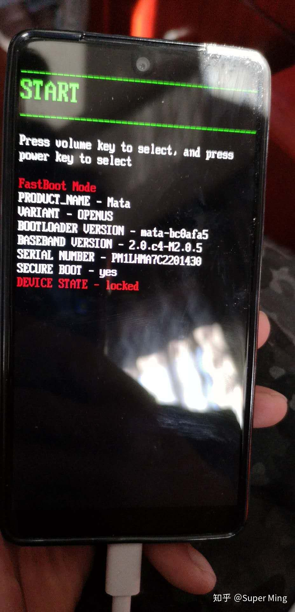
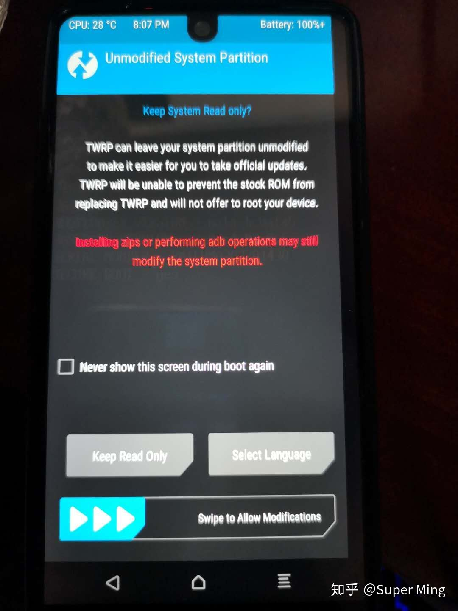

<!--
Created: Mon Mar 02 2020 14:19:24 GMT+0800 (China Standard Time)
Modified: Mon Mar 02 2020 14:30:34 GMT+0800 (China Standard Time)
-->

# 如何刷机

当安卓手机系统出现问题以后, 我们一般通过刷机来解决这个问题, 一般来说主要是通过线刷, 

## 线刷

一般需要厂商提供的fastboot包.

例如安卓手机的Fastboot模式. 在安卓手机中fastboot是一种比recovery更底层的刷机模式. 简单来说, 就是使用USB数据线, 连接电脑的一种刷机模式. 这种刷机方式, 我们又通常称为"线刷"刷机.

还有一种更底层的叫做9008, 9008是download模式. 是最底层的联机模式, 机器rec, fb都被篡改或清除时, 唯一能进入还不会被摧毁的就是download模式. 联机后驱动会显示9008或9007或900e等. 所以大家都叫9008深度刷机.

可以理解为最底层的联机方法, 除了链接电脑机器任何跟刷写系统无关的功能全部关闭不运行.(有一点windows的安全模式的感觉)

download模式下, 刷机无法保护用户资料. 可以理解为彻底删除手机系统后刷入新系统.

## 卡刷

一般来说就是厂商提供的otg包.

线刷对应的就是卡刷.
　　
就是利用recovery的从SD卡中更新系统的这个功能, 前提是如果你想刷recovery, 你的系统必须要带FASTBOOT才能刷RE.
　　
RE全称叫recovery  分为CMW和TWRP两种recovery

　　
以前刷机的时候大家应该使用过音量上下键操作刷机的界面, 那就是CMW的版本.
　　
TWRP就是可以触摸的版本, 且功能更为强大, 可以用来装模块, 刷root等
　　

