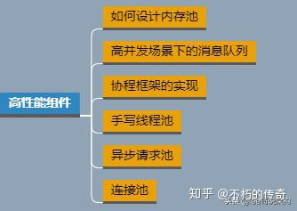
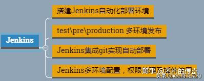
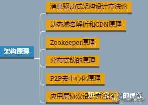

<!--
Created: Thu Oct 10 2020 14:13:24 GMT+0800 (China Standard Time)
Modified: Thu Nov 12 2020 14:33:43 GMT+0800 (China Standard Time)
-->

# 后端学习

## 源码

Nginx源码 Redis源码 ZeroMQ源码

## 中间件开发

## 集群

MySQL集群、Redis集群、FastDFS集群、K8S集群、Nginx集群、MongoDB集群、Zookeeper集群

## linux系统

### 环境编程

### 系统维护

### 内核编程

## 音视频技术

## 性能与测试

包括理解性能优化、MySQL调优、测试理论、Linux调优、GCC调优

## 运维统计

Jenkins、虚拟化、Docker

## 分布式架构技术

架构实战、架构中间件、架构策略、架构原理

