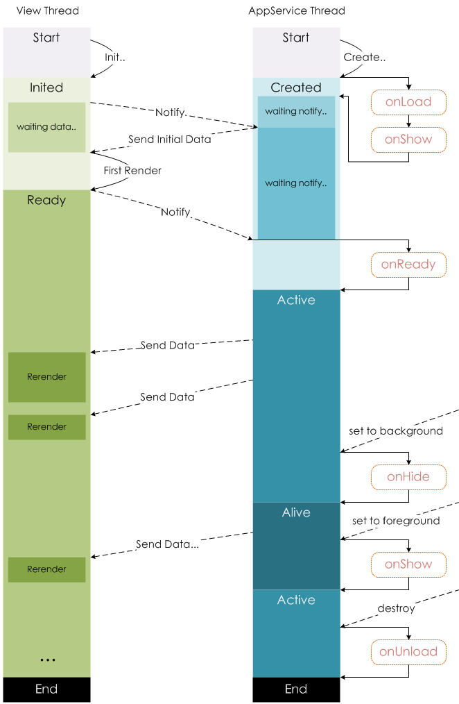
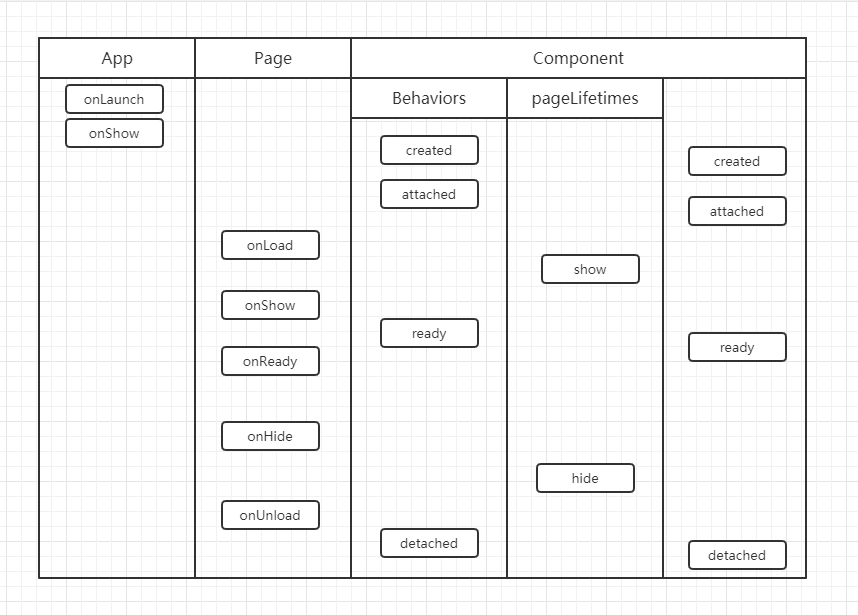
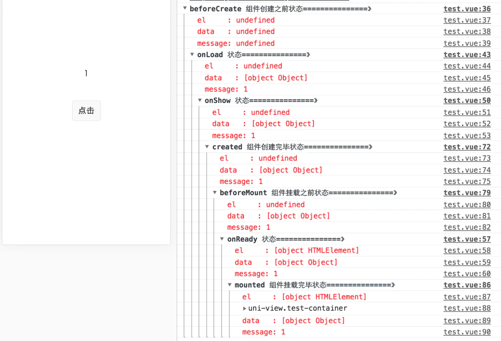
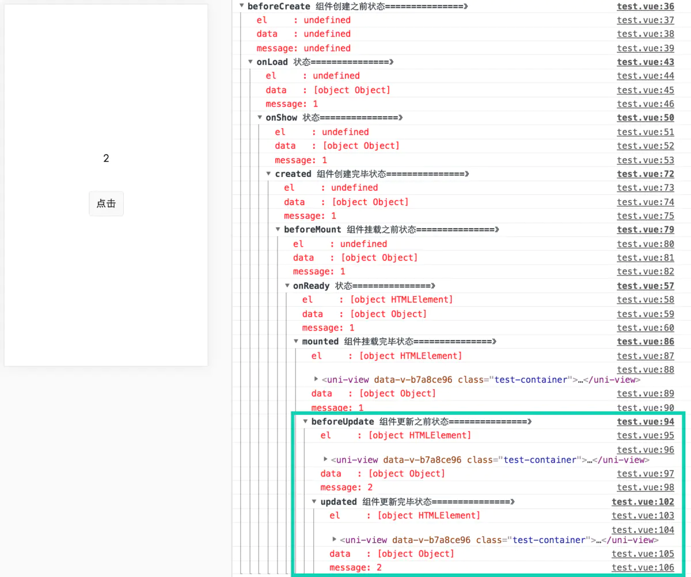

<!--
Created: Tue Feb 02 2021 19:21:30 GMT+0800 (China Standard Time)
Modified: Wed Feb 03 2021 17:47:06 GMT+0800 (China Standard Time)
-->

# vue 里的生命周期

## vue里

### 组件内data是在beforeCreate和created之间执行

### 父子组件生命周期执行顺序: 

父组件创建完成后会等待子组件挂载完成才会挂载到页面上, 所以父子组件生命周期执行顺序为:
beforeCreate(父) -> created(父) -> beforeMount(父) -> beforeCreate(子) -> created(子) -> beforeMount(子) -> mounted(子) -> mounted(父)

### data执行组件先于mixin

数据对象在内部会进行递归合并, 并在发生冲突时以组件数据优先.

### 生命周期执行mixin先于组件

同名钩子函数将合并为一个数组, 因此都将被调用. 另外, 混入对象的钩子将在组件自身钩子之前调用.

### 若组件和mixin的methods重名, 则取组件的methods.(从13、14、15、16可以看出)

值为对象的选项, 例如 methods、components 和 directives, 将被合并为同一个对象. 两个对象键名冲突时, 取组件对象的键值对.

## 小程序父子组件

再次开始之前先问几个问题:

你是否知道Page生命周期 与 pagelifetimes 生命周期执行顺序?

你是否知道behaviors中的生命周期与组件生命周期执行顺序?

你是否知道Page生命周期 与 组件pagelifetimes生命周期执行顺序?

要回答上面的问题, 首先我们看看小程序生命周期有哪些:

App

onLaunch
onShow
onHide
Page

onLoad
onShow
onReady
onHide
onUnload
Component

created
attached
ready
moved
detached
想一下加载一个页面(包含组件)的加载顺序, 按照直觉小程序加载顺序应该是这样的加载顺序(以下列子中Component都是同步组件):

App(onLaunch) -> Page(onLoad) -> Component(created)

但其实并不然, 小程序的加载顺序是这样的:

首先执行 App.onLaunch -> App.onShow
其次执行 Component.created -> Component.attached
再执行 Page.onLoad -> Page.onShow
最后 执行 Component.ready -> Page.onReady
其实也不难理解微信这么设计背后的逻辑, 我们先看下官方的的生命周期:



可以看到, 在页面onLoad之前会有页面create阶段, 这其中就包含了组件的初始化, 等组件初始化完成之后, 才会执行页面的onLoad, 之后页面ready事件也是在组件ready之后才触发的.

下面我们来看看 Behavior, Behavior 与 Vue中的 mixin 类似, 猜想下其中的执行顺序:

Behavior.created => Component.created

测试下来和预期相符, 其实在Vue的文档中有一段这样的描述:

另外, 混入对象的钩子将在组件自身钩子之前调用.

这样的设计和主流设计保持一致. 接下来我们看看 pageLifetimes, 有show和hide生命周期对应页面的展示与隐藏, 预期的执行顺序:

pageLifetime.show => Page.onShow

测试下来也和预期相符, 那么我们可以推断出如下的结论:

当页面中包含组件时, 组件的生命周期(包括pageLifetimes)总是优先于页面, Behaviors生命周期优先于组件的生命周期. 但其实有个例外: 页面退出堆栈, 当页面unload时会执行如下顺序:

Page.onUnload => Component.detached

看了以上的分析你应该知道了答案, 最后做个总结(demo):



## uni 的生命周期

uni里存在mixin的时候, `App.vue` , `Parent.vue` , `Son.vue`

1. mixin 先于 组件对应方法执行,但存在冲突时,优先以组件为准

2. beforeCreate => onLoad => created

``` HTML
<!-- HTML -->
<template>
  <view ref="ref" class="test-container">
    <text>{{message}}</text>
    <button @click="addMsg">点击</button>
  </view>
</template>

<script>
  import {
    mapState,
    mapMutations
  } from 'vuex';
  var key = 0;
  export default {

    data() {
      return {
        message: 1
      }
    },

    computed: {

    },

    methods: {

      addMsg() {
        this.message++
      }

    },

    beforeCreate() {
      console.group('beforeCreate 组件创建之前状态===============》');
      console.log("%c%s", "color:red", "el     : " + this.$el);
      console.log("%c%s", "color:red", "data   : " + this.$data);
      console.log("%c%s", "color:red", "message: " + this.message)
    },

    onLoad() {
      console.group('onLoad 状态===============》');
      console.log("%c%s", "color:red", "el     : " + this.$el);
      console.log("%c%s", "color:red", "data   : " + this.$data);
      console.log("%c%s", "color:red", "message: " + this.message)
    },

    onShow() {
      console.group('onShow 状态===============》');
      console.log("%c%s", "color:red", "el     : " + this.$el);
      console.log("%c%s", "color:red", "data   : " + this.$data);
      console.log("%c%s", "color:red", "message: " + this.message)
    },

    onReady() {
      console.group('onReady 状态===============》');
      console.log("%c%s", "color:red", "el     : " + this.$el);
      console.log("%c%s", "color:red", "data   : " + this.$data);
      console.log("%c%s", "color:red", "message: " + this.message)
    },

    onUnload() {
      console.group('onUnload 状态===============》');
      console.log("%c%s", "color:red", "el     : " + this.$el);
      console.log("%c%s", "color:red", "data   : " + this.$data);
      console.log("%c%s", "color:red", "message: " + this.message)
    },

    created() {
      console.group('created 组件创建完毕状态===============》');
      console.log("%c%s", "color:red", "el     : " + this.$el);
      console.log("%c%s", "color:red", "data   : " + this.$data);
      console.log("%c%s", "color:red", "message: " + this.message);
    },

    beforeMount() {
      console.group('beforeMount 组件挂载之前状态===============》');
      console.log("%c%s", "color:red", "el     : " + (this.$el));
      console.log("%c%s", "color:red", "data   : " + this.$data);
      console.log("%c%s", "color:red", "message: " + this.message);
    },

    mounted() {
      console.group('mounted 组件挂载完毕状态===============》');
      console.log("%c%s", "color:red", "el     : " + this.$el);
      console.log(this.$el);
      console.log("%c%s", "color:red", "data   : " + this.$data);
      console.log("%c%s", "color:red", "message: " + this.message);
    },

    beforeUpdate() {
      console.group('beforeUpdate 组件更新之前状态===============》');
      console.log("%c%s", "color:red", "el     : " + this.$el);
      console.log(this.$el);
      console.log("%c%s", "color:red", "data   : " + this.$data);
      console.log("%c%s", "color:red", "message: " + this.message);
    },

    updated() {
      console.group('updated 组件更新完毕状态===============》');
      console.log("%c%s", "color:red", "el     : " + this.$el);
      console.log(this.$el);
      console.log("%c%s", "color:red", "data   : " + this.$data);
      console.log("%c%s", "color:red", "message: " + this.message);
    },

    beforeDestroy() {
      console.group('beforeDestroy 组件销毁之前状态===============》');
      console.log("%c%s", "color:red", "el     : " + this.$el);
      console.log(this.$el);
      console.log("%c%s", "color:red", "data   : " + this.$data);
      console.log("%c%s", "color:red", "message: " + this.message);
    },

    destroyed() {
      console.group('destroyed 组件销毁完毕状态===============》');
      console.log("%c%s", "color:red", "el     : " + this.$el);
      console.log(this.$el);
      console.log("%c%s", "color:red", "data   : " + this.$data);
      console.log("%c%s", "color:red", "message: " + this.message)
    }

  }
</script>

<style lang="scss">
  .test-container {
    width: 100%;
    height: 100vh;
    display: flex;
    flex-direction: column;
    justify-content: center;
    align-items: center;
    box-sizing: border-box;
    padding: 0upx 40upx;

    button {
      margin-top: 100upx;
    }
  }
</style>
```







### 总结
Page页面生命周期函数执行顺序

beforeCreate => onLoad => onShow => created => beforeMount => onReady => mounted

刷新数据后

beforeUpdate => updated